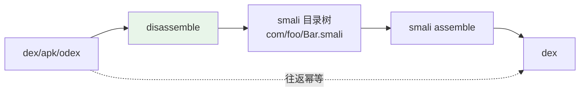
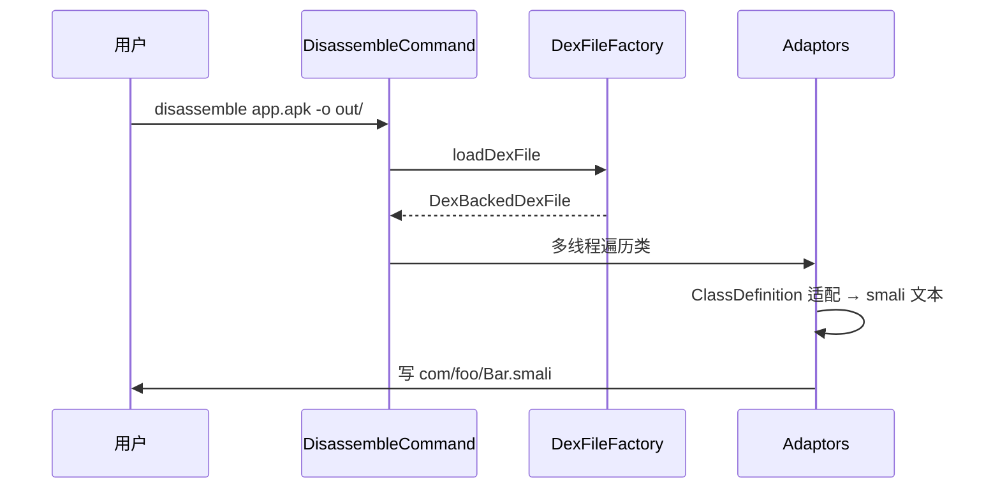

# 🔄 DisassembleCommand — dex→smali 反汇编

`baksmali disassemble` 是核心转换命令，把 dex/apk/odex 反汇编为 smali 文本目录树。源码：`baksmali/src/main/java/org/jf/baksmali/DisassembleCommand.java`。

## 定位



与 `smali assemble` 互为逆操作，构成 100% 无损往返。

## 参数

继承 `DexInputCommand`（input file）。本命令特有：

| 参数 | 简写 | 说明 |
|------|------|------|
| `--output` | `-o` | 输出目录 |
| `--jobs` | `-j` | 并行线程数 |
| `--debug-info` | `--di` | 是否输出调试信息（arity 1） |
| `--code-offsets` | `--offsets/--off` | 注释指令字节偏移 |
| `--use-locals` | `-l` | 使用局部变量名 |
| `--register-info` | `-r` | 寄存器信息详尽度 |
| `--sequential-labels` | `--seq/--sl` | 顺序标号（非 `.label` 名） |
| `--parameter-registers` | `--preg/--pr` | 显示参数寄存器（arity 1） |
| `--accessor-comments` | `--ac` | 合成访问器注释（arity 1） |
| `--resolve-resources` | `--rr` | 解析资源引用（arity 2） |
| `--implicit-references` | `--implicit/--ir` | 隐式引用 |
| `--normalize-virtual-methods` | `--norm/--nvm` | 规范化虚方法顺序 |
| `--allow-odex-opcodes` | — | 允许 odex 操作码 |
| `--classes` | — | 只反汇编指定类 |

通用（来自父类/委托）：input file、`--api-level`、`--boot-class-path` 等。

## 用法

```bash
# 全量反汇编到目录
java -jar baksmali.jar disassemble app.apk -o out/

# 带代码偏移注释 + 顺序标号（便于阅读）
java -jar baksmali.jar disassemble app.apk -o out/ --code-offsets --sequential-labels

# 只反汇编指定类
java -jar baksmali.jar disassemble app.apk -o out/ --classes "Lcom/foo/Bar;"

# odex 需类路径做 deodex
java -jar baksmali.jar disassemble app.odex -b framework.jar -o out/
```

## 主流程



多线程（`--jobs`）按类并行反汇编，输出文件由 `ClassFileNameHandler` 决定路径。

## 输出示例

```smali
.class public Lcom/example/HelloWorld;
.super Ljava/lang/Object;

.method public constructor <init>()V
    .registers 1
    invoke-direct {p0}, Ljava/lang/Object;-><init>()V
    return-void
.end method
```

## 延伸阅读

- [Adaptors 适配器](../adaptors.md) — 反汇编输出产生者
- [baksmali list 命令](./list.md) — 不反汇编只列举
- [baksmali dump 命令](./dump.md) — 十六进制转储
- [dex-disassemble skill](../../../skills/dex-disassemble.md)
- [反汇编↔汇编往返](../../../guide/roundtrip.md)
