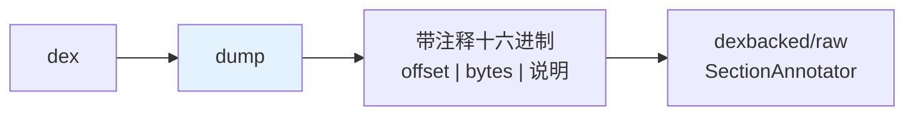
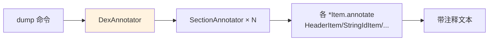

# 📄 DumpCommand — 带注释十六进制转储

`baksmali dump` 把 dex 文件各 section 以带注释的十六进制形式打印，是理解 dex 二进制结构的最直接工具。源码：`baksmali/src/main/java/org/jf/baksmali/DumpCommand.java`。

## 定位



与 `disassemble`（转 smali 文本）不同，`dump` 贴近二进制，逐 section 标注每个字段的含义与值。

## 参数

继承 `DexInputCommand`（input file）。本命令较简单，主要：

| 参数 | 说明 |
|------|------|
| input file | dex/apk/odex（位置参数） |
| `-h/--help` | 帮助 |

通用参数（api-level、boot-class-path 等）来自父类。

## 用法

```bash
java -jar baksmali.jar dump app.apk > dump.txt
java -jar baksmali.jar dump classes.dex
```

## 输出示例（节选）

```
01234560:  64 65 78 0a 30 33 36 00                      |dex.036.|
01234568:  43 21 1f e4| checksum
0123456c:  ab cd ...                                 | signature (sha-1)
...
                          MAP_LIST
offset    item_type                  size
00003e08  TYPE_HEADER_ITEM           0001
00003e0c  TYPE_STRING_ID_ITEM        0123
...
                          STRING_ID_ITEM[0]
offset    string_data_off
00000070  00001234
```

每行标注偏移、原始字节、字段名与解析值。code_item 段还会触发类型推断，标注寄存器类型。

## 实现机制

输出由 `dexlib2/dexbacked/raw/` 各 `*Item` 类的 `annotate` 方法产生，`SectionAnnotator` 编排。`DexAnnotator`（`dexbacked/raw/util/`）是总入口。



## 与其他命令关系

| 命令 | 视角 |
|------|------|
| `dump` | 二进制结构（带注释） |
| `disassemble` | smali 语义文本 |
| `list` | 池化条目列举（JSON） |

`dump` 触发类型推断，对 quick 指令标注解析目标——是学习 dex 格式与调试解析问题的首选。

## 延伸阅读

- dexbacked/raw 子包 — 注解产生者
- [DEX 文件格式](../../../internals/dex-format.md)
- [DisassembleCommand](./disassemble.md)
- [dex-dump skill](../../../skills/dex-dump.md)
