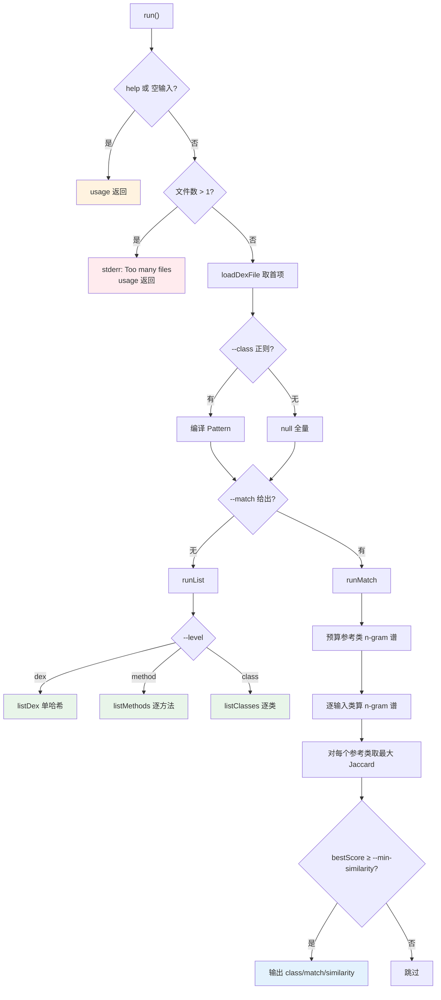

# 🧬 baksmali fingerprint

`baksmali fingerprint` 基于**方法体 opcode 序列**（不含任何类名/方法名/字段名/引用）计算指纹，因此**对重命名不敏感**：混淆器把类、方法、字段改名、换寄存器号，只要字节码逻辑不变，指纹就相同。这正是用它识别「被改名的已知库」「被重打包/抄袭的代码」的原理。命令分两种互补模式——**列举**（精确哈希，去重）与**匹配**（n-gram 模糊相似度，识别轻微修改后的库）。

## 命令定位

- 命令名：`fingerprint`；别名：`fp`（`@ExtendedParameters(commandAliases)`，`FingerprintCommand.java:78-80`）
- 描述（`@Parameters(commandDescription)`）：`Opcode-based rename-invariant fingerprints; match against a reference dex to identify libraries/clones.`
- 继承链：`FingerprintCommand` → `DexInputCommand` → `Command`（无 `ListCommand`/`XrefCommand` 血统）
- 纯模型层：`org.jf.baksmali.fingerprint.Fingerprint`（`methodHash`/`classHash`/`dexHash`/`classNgramProfile`/`jaccard`），命令类只做 I/O 编排

源码：`baksmali/src/main/java/org/jf/baksmali/FingerprintCommand.java:77-133`

## 参数

### 自有参数

| 参数 | 说明 | 默认 | 必填 | arity |
| --- | --- | --- | --- | --- |
| `--level` | 列举模式粒度：`method`/`class`/`dex` | `class` | 否 | 1 |
| `--class` | 正则，按类型描述符限定被指纹/匹配的类 | 无（全部） | 否 | 1 |
| `--match` | 参考 dex/apk 路径；给出即进入匹配模式 | 无（列举模式） | 否 | 1 |
| `--ngram` | 匹配模式 opcode n-gram 窗口大小 | `3` | 否 | 1 |
| `--min-similarity` | 报告匹配的最低 Jaccard 相似度 `[0,1]` | `0.85` | 否 | 1 |
| `-h`,`-?`,`--help` | 显示用法 | false | 否 | 布尔 |

来源：`FingerprintCommand.java:83-108`。

### 继承自 `DexInputCommand` 与 `OutputFormatArguments`

| 参数 | 说明 | 默认 | 必填 | arity |
| --- | --- | --- | --- | --- |
| `file`（位置参数） | dex/apk/oat/odex；多 dex 容器可写 `app.apk/classes2.dex` | — | 是 | 列表（取首项，多文件报错） |
| `-a`,`--api` | 数字 API level，选择 opcode 集 | `-1`（自动） | 否 | 1 |
| `--format` | 输出格式：`json`（默认，机器可读）或 `text` | `json` | 否 | 1 |

来源：`DexInputCommand.java:56-65`、`OutputFormatArguments.java:52-54`。`--format` 仅显式 `text` 切文本，未识别值回退 JSON（`OutputFormatArguments.java:61-71`）。

## 主流程



三道前置校验（help / 空输入 / 多文件）在 `FingerprintCommand.java:115-123`；模式分派在 `:128-132`。匹配模式先一次性预算参考类的 n-gram 谱（`:221-226`），再对每个输入类逐对比对取最高分（`:234-247`），达阈值才输出（`:249-260`）。

## 典型用法与真实输出

### 列举模式（默认）

```bash
# 每个类一个哈希（默认 --level class，默认 JSON）
java -jar baksmali.jar fingerprint app.apk
# 细到方法
java -jar baksmali.jar fingerprint app.apk --level method
# 整个 dex 一个哈希
java -jar baksmali.jar fingerprint app.apk --level dex
# 只看某包
java -jar baksmali.jar fingerprint app.apk --class 'Lokhttp3/.*'
# 人读文本
java -jar baksmali.jar fingerprint app.apk --format text
```

真实输出（`accessorTest.dex` fixture，默认 JSON，`FingerprintCommand.java:167-186`）：

```json
[
  {"class":"Lorg/jf/dexlib2/AccessorTypes$Accessors;","fingerprint":"63594b5c1fa69ee4"},
  {"class":"Lorg/jf/dexlib2/AccessorTypes;","fingerprint":"206203f971d55342"}
]
```

文本对照（`--format text`）：

```
63594b5c1fa69ee4  Lorg/jf/dexlib2/AccessorTypes$Accessors;
206203f971d55342  Lorg/jf/dexlib2/AccessorTypes;
```

哈希层级：**方法哈希** = 方法 opcode 序列哈希；**类哈希** = 其所有方法哈希**排序后**再哈希（与方法声明顺序、类名、成员名都无关）；**dex 哈希** = 所有类哈希排序后再哈希。两个仅改名的类，类哈希完全相同。

### 匹配模式（`--match`）

```bash
# 在 app 里找 okhttp（指向已知版本的 okhttp classes.dex）
java -jar baksmali.jar fingerprint app.apk --match okhttp.dex --min-similarity 0.9
# 4-gram 更严格
java -jar baksmali.jar fingerprint app.apk --match lib.dex --ngram 4
```

匹配模式 JSON schema 为 `[{class, match, similarity}]`（`FingerprintCommand.java:251-256`），文本形如 `0.912  La/b/c;  ~=  Lcom/example/Foo;`（`:258`）。无匹配时 stderr 提示 `No classes matched at similarity >= ...`（`:265-267`）。加权 Jaccard = `Σ min(计数) / Σ max(计数)`，空类/接口跳过（`:235-237`）。

### 实战：查重打包/方法去重

```bash
# 求两 APK 共有类指纹 = 疑似复用代码
java -jar baksmali.jar fingerprint appA.apk | jq -r '.[].fingerprint' | sort > a.txt
java -jar baksmali.jar fingerprint appB.apk | jq -r '.[].fingerprint' | sort > b.txt
comm -12 a.txt b.txt

# 统计字节码完全相同的方法组
java -jar baksmali.jar fingerprint app.apk --level method \
  | jq -r '.[].fingerprint' | sort | uniq -d
```

## 源码要点

- 命令注册：`FingerprintCommand.java:77-80`（`commandName=fingerprint`，别名 `fp`）
- 模式分派：`:128-132`（`matchRef != null` → 匹配，否则列举）
- 列举分派 `runList`：`:137-153`（未知 `--level` 报错并 usage）
- `listDex`/`listClasses`/`listMethods`：`:155-210`（JSON 聚成数组，文本逐行 `<hash>  <target>`）
- 匹配 `runMatch`：`:214-268`；参考谱预算 `:221-226`，逐类比对 `:234-247`，阈值过滤 `:249-260`
- 参考 dex 加载 `loadReference`：`:270-283`（不存在/读失败均 stderr 后返回）
- dex 加载与多 dex 条目解析：`DexInputCommand.java:111-173`
- `--format` 默认 JSON、仅 `text` 切文本：`OutputFormatArguments.java:61-71`

## 延伸阅读

- [CLI: baksmali fingerprint](../../../cli/fingerprint.md) — 命令速查与原理图
- [Skill: dex-fingerprint](../../../skills/index.md#dex-fingerprint) — 实战场景与典型用法
- [baksmali diff](./diff.md) — 对照：指令级语义 diff（指纹层关注「是否相同」，diff 关注「差在哪」）
- [baksmali list classes](./list.md) — 先定位类再限定 `--class` 正则做指纹
