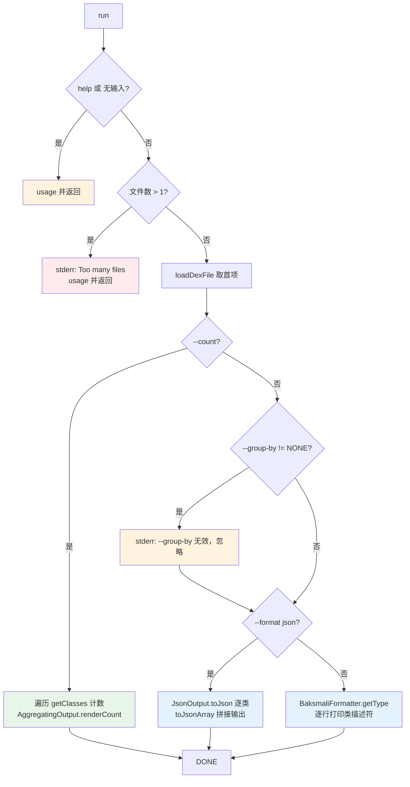

# 🧬 baksmali list classes

列举 dex 文件中的**全部类定义（ClassDef）**。无需反汇编即可拿到每个类的超类、访问标志、接口、字段与方法签名，是 APK 结构侦察与差异比对的入口命令。`classes` 子命令返回的不是引用列表，而是物化后的完整类结构——一条记录即可还原一个类的对外契约。

## 命令定位

- 命令名：`classes`
- 别名：`class`、`c`（`@ExtendedParameters(commandAliases)`，`ListClassesCommand.java:50-52`）
- 描述（`@Parameters(commandDescription)`）：`Lists the classes in a dex file.`
- 继承链：`ListClassesCommand` → `DexInputCommand` → `Command`（与 `list methods/strings` 走 `ListReferencesCommand` 不同，本命令直接继承 `DexInputCommand`）
- 输出格式与聚合参数通过两个 `@ParametersDelegate` 注入：`OutputFormatArguments`、`ListAggregationArguments`（`ListClassesCommand.java:59-63`）

源码：`baksmali/src/main/java/org/jf/baksmali/ListClassesCommand.java:49-116`

## 参数

| 参数 | 说明 | 默认 | 必填 | arity |
| --- | --- | --- | --- | --- |
| `file`（位置参数） | dex/apk/oat/odex 文件；多 dex 容器可用 `app.apk/classes2.dex` 指定条目 | — | 是 | 列表（实际取首项） |
| `-a`, `--api` | 文件的数字 API level，用于选择 opcode 集 | `-1`（自动） | 否 | 1 |
| `--format` | 输出格式：`json`（默认，机器可读）或 `text`（人读，仅类描述符） | `json` | 否 | 1 |
| `--count` | 只输出类总数 `{"count":N}`，不输出类结构 | false | 否 | 布尔 |
| `--group-by` | 按键分桶；对 `classes` 无意义（每类自成桶），会告警并忽略 | 无 | 否 | 1 |
| `-h`, `-?`, `--help` | 显示用法 | false | 否 | 布尔 |

参数来源：`DexInputCommand.java:56-65`（`--api`、`file`）、`OutputFormatArguments.java:52-54`（`--format`）、`ListAggregationArguments.java:56-63`（`--count`、`--group-by`）、`ListClassesCommand.java:55-57`（`--help`）。

## 主流程



`--count` 走短路（`ListClassesCommand.java:85-92`），直接遍历 `dexFile.getClasses()` 自增计数后交给 `AggregatingOutput.renderCount`，不构建 JSON 数组。`--group-by` 对类列表无语义（每个类即一个桶），命中即打印告警并落到默认格式（`:96-98`）。JSON 分支逐个调用 `JsonOutput.toJson(ClassDef)` 序列化后用 `toJsonArray` 拼成数组（`:100-108`）；文本分支仅以 `BaksmaliFormatter.getType` 输出类描述符（`:110-114`）。

## 典型用法与真实输出

```bash
# 列举所有类（默认 JSON：含超类/接口/字段/方法结构）
java -jar baksmali.jar list classes app.apk

# 短别名 + 人读文本（每行一个类描述符）
java -jar baksmali.jar l c app.apk --format text

# 只统计类数量
java -jar baksmali.jar l c --count app.apk

# 多 dex APK 指定条目
java -jar baksmali.jar l c "app.apk/classes2.dex"
```

真实输出（`LocalTest/classes.dex` fixture，默认 JSON，含一个类、两个方法）：

```json
[{"type":"LLocalTest;","superclass":"Ljava/lang/Object;","accessFlags":1,"interfaces":[],"fields":[],"methods":[{"name":"method1","parameters":[],"returnType":"V","accessFlags":9},{"name":"method2","parameters":["I","J","Ljava/lang/String;"],"returnType":"V","accessFlags":9}]}]
```

人读文本对照（`--format text`）：

```
LLocalTest;
```

JSON 字段对应 `JsonOutput.toJson(ClassDef)`（`JsonOutput.java:131-170`）：

| 字段 | 含义 | 来源 |
| --- | --- | --- |
| `type` | 类描述符，如 `LLocalTest;` | `classDef.getType()` |
| `superclass` | 直接超类描述符 | `classDef.getSuperclass()` |
| `accessFlags` | 访问标志位掩码（1=public） | `classDef.getAccessFlags()` |
| `interfaces` | 直接实现的接口列表 | `classDef.getInterfaces()` |
| `fields` | 声明字段数组（name/type/accessFlags） | `classDef.getFields()` |
| `methods` | 声明方法数组（name/parameters/returnType/accessFlags） | `classDef.getMethods()` |

一条记录即完整描述类的对外契约，Agent 无需再二次解析 smali 文本。`--count` 输出形如 `{"count":N}`，与 `list methods` 的 `{"count":432}` 同 schema（`AggregatingOutput.renderCount`）。

### 搜索类

```bash
# 仅应用类，排除 Android/Kotlin 框架
java -jar baksmali.jar l c app.apk --format text | grep -v "^Landroid/\|^Landroidx/\|^Lkotlin/\|^Lkotlinx/"

# 定位 Activity / Service
java -jar baksmali.jar l c app.apk --format text | grep "Activity$\|Service$"

# 列出内部类（匿名/命名）
java -jar baksmali.jar l c app.apk --format text | grep '\$'
```

## 源码要点

- 命令注册：`ListClassesCommand.java:49-52`（`commandName=classes`，别名 `class/c`）
- 由 `ListCommand.setupCommand` 注册为 `list` 的子命令：`ListCommand.java:66`
- 三道前置校验（help / 空输入 / 多文件）：`:69-79`
- `--count` 短路与计数循环：`:85-92`
- `--group-by` 告警忽略分支：`:96-98`
- JSON 输出分支（`JsonOutput.toJsonArray`）：`:100-108`
- 文本输出分支（`BaksmaliFormatter.getType`）：`:110-114`
- dex 加载与多 dex 条目解析（`loadDexFile`）：`DexInputCommand.java:111-173`
- `--format` 默认 JSON、仅 `text` 切文本（未识别值回退 JSON）：`OutputFormatArguments.java:61-71`

## 延伸阅读

- [baksmali list](../../../cli/list.md) — list 家族总览与各子命令对照
- [list strings](./list-strings.md) — 对照：字符串池（含类描述符与方法名）
- [list fields](./list-fields.md) — 类的字段表平铺视图
- [Skill: dex-list-classes](../../../skills/index.md#dex-list-classes) — 类/类型/字段列举的实战技巧与搜索模板
