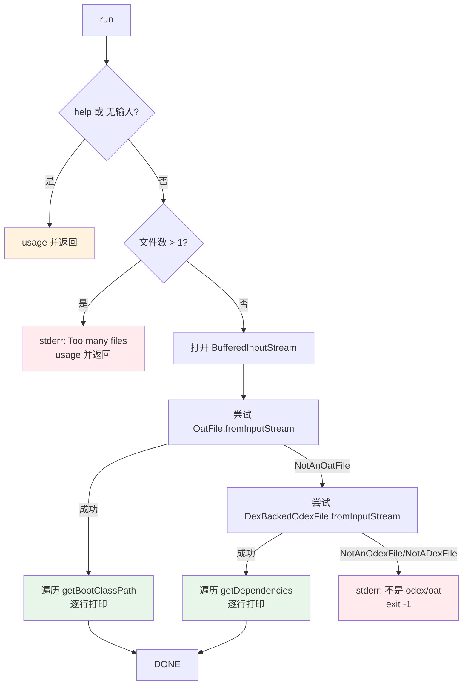

# 📦 baksmali list dependencies

列出 **odex/oat** 文件中存储的依赖项。与 `list` 家族的其他子命令不同，`dependencies` 只接受 oat/odex 文件，**不接受普通 .dex/.apk**，输出为**纯文本**（每行一条依赖），无 `--format` 选项。

## 命令定位

- 命令名：`dependencies`
- 别名：`deps`、`dep`
- 继承：直接继承 `org.jf.util.jcommander.Command`，**不**走 `DexInputCommand`，因此**没有** `--format`、`--boot-class-path` 等通用 dex 参数。
- 描述（`@Parameters(commandDescription)`）：`Lists the stored dependencies in an odex/oat file.`

源码：`baksmali/src/main/java/org/jf/baksmali/ListDependenciesCommand.java:50-54`

## 参数

| 参数 | 说明 | 默认 | 必填 | arity |
| --- | --- | --- | --- | --- |
| `-h`, `-?`, `--help` | 显示用法信息（`help=true`） | false | 否 | 布尔 |
| `file`（位置参数） | 一个 oat/odex 文件路径；多于 1 个时报 `Too many files specified` 并退出 | — | 是 | 列表（实际取首项） |

`inputList` 声明见 `ListDependenciesCommand.java:60-62`；多文件校验见 `:74-78`。

## 主流程



关键判断顺序：先试 OAT（`OatFile.fromInputStream`，`ListDependenciesCommand.java:90`），捕获 `NotAnOatFileException` 后再试 odex（`DexBackedOdexFile.fromInputStream`，`:102`）。两者皆失败则报错退出（`:115-116`）。注意 OAT 与 odex 复用同一个已读取过的 `inputStream`，故必须用 `BufferedInputStream` 支持 `mark/reset`。

## OAT 与 odex 的依赖语义差异

| 容器 | 来源方法 | 内容 |
| --- | --- | --- |
| OAT（`.oat`） | `OatFile.getBootClassPath()` (`:91`) | OAT header 中记录的 boot classpath 条目（dex 文件路径/名） |
| odex（`.odex`） | `DexBackedOdexFile.getDependencies()` (`:103`) | odex 文件尾部存储的依赖 dex 列表（如 `bootframework` 等绝对路径） |

## 典型用法与输出

```bash
# 列出 oat 的 boot classpath
java -jar baksmali.jar list dependencies boot.oat
java -jar baksmali.jar l deps boot.oat

# 列出 odex 的依赖
java -jar baksmali.jar l dep framework.odex
```

OAT 输出示例（纯文本，每行一条 boot classpath 条目）：

```
core-lib.jar
conscrypt.jar
okhttp.jar
bouncycastle.jar
apache-xml.jar
framework.jar
```

odex 输出示例（依赖路径列表，节选）：

```
/system/framework/core-lib.jar
/system/framework/conscrypt.jar
/system/framework/framework.jar
/system/framework/ext.jar
/system/framework/framework.jar:classes2.dex
```

> 提示：依赖列表来自 oat/odex 文件本身的存储内容，而非 dex 内部引用；要分析 dex 引用的外部类，用 [`list classes`](../commands/list-classes) 或 [`list types`](../commands/list-types)。

## 源码要点

- 参数注入与构造：`ListDependenciesCommand.java:56-66`
- `help` / 空输入 / 多文件三道前置校验：`:69-78`
- OAT 优先、odex 兜底的解析链：`:89-113`
- 失败统一 `System.exit(-1)`，不抛出：`:116`
- 不支持多文件批处理：位置参数虽为 `List<String>`，但仅取 `get(0)`

## 延伸阅读

- [baksmali list](../../../cli/list.md) — list 家族总览（含 dependencies 定位）
- [baksmali disassemble](../../../cli/disassemble.md) — 完整反汇编 oat/odex
- [DexInputCommand 通用参数](../commands/disassemble.md) — 对比为何本命令无 `--format`
