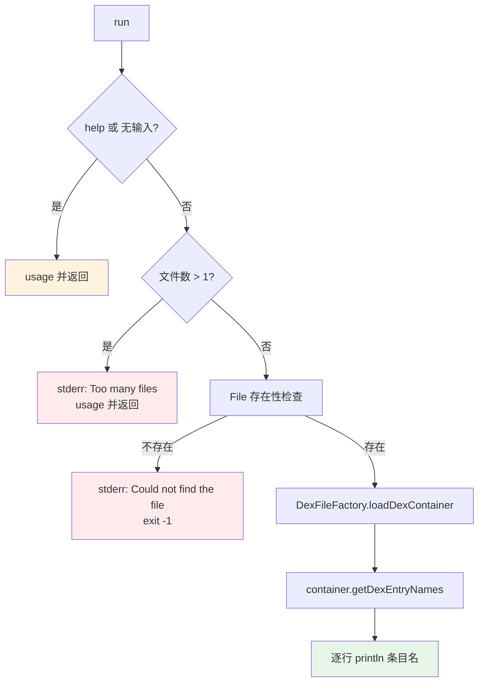

# 📦 baksmali list dex

列举一个 **apk 或 oat 文件** 中包含的全部 dex 条目名，每行一个，纯文本输出。这是多 dex 工作流的入口命令——先确认容器里有哪些 dex，再用 `app.apk/classes2.dex` 路径语法指定特定条目交给其他子命令处理。

## 命令定位

- 命令名：`dex`
- 别名：`d`
- 继承：直接继承 `org.jf.util.jcommander.Command`，**不**走 `DexInputCommand`，因此**没有** `--format`、`--boot-class-path`、`--deodex` 等通用 dex 参数，输出固定为纯文本。
- 描述（`@Parameters(commandDescription)`）：`Lists the dex files in an apk/oat file.`

源码：`baksmali/src/main/java/org/jf/baksmali/ListDexCommand.java:51-55`

## 参数

| 参数 | 说明 | 默认 | 必填 | arity |
| --- | --- | --- | --- | --- |
| `-h`, `-?`, `--help` | 显示用法信息（`help=true`） | false | 否 | 布尔 |
| `file`（位置参数） | 一个 apk 或 oat 文件路径；多于 1 个时报 `Too many files specified` 并退出；找不到文件时 `System.exit(-1)` | — | 是 | 列表（实际取首项） |

`inputList` 声明见 `ListDexCommand.java:61-63`；多文件校验见 `:75-79`；文件存在性校验见 `:84-87`。注意位置参数虽为 `List<String>`，但仅取 `get(0)`，**不支持多文件批处理**。

## 主流程



核心调用：`DexFileFactory.loadDexContainer(file, Opcodes.getDefault())`（`ListDexCommand.java:91-92`）以默认 opcode 集把输入当作多 dex 容器加载，再取 `getDexEntryNames()`（`:93`）拿到条目名列表，逐行打印（`:98-100`）。IO 异常包装为 `RuntimeException` 抛出（`:94-96`）。

## 容器与条目名约定

| 容器类型 | 典型条目名 | 说明 |
| --- | --- | --- |
| 多 dex APK（zip） | `classes.dex`、`classes2.dex`、`classes3.dex` … | Android 打包工具按方法数上限（65535）自动拆分 |
| OAT（`.oat`） | 长路径名，如 `/system/framework/framework.jar:classes.dex` | 含完整源路径，可用双引号精确指定 |
| 单 dex APK | 仅 `classes.dex` | 非多 dex 应用 |

条目名即其他命令的「容器/条目」路径后缀：`list dex` 确认后，用 `app.apk/classes2.dex` 指定特定 dex。

## 典型用法与输出

```bash
# 完整形式
java -jar baksmali.jar list dex app.apk

# 短别名（list → l，dex → d）
java -jar baksmali.jar l d app.apk

# oat 文件
java -jar baksmali.jar l d boot.oat
```

真实示例（把两个 fixture dex 打成多 dex APK 后列举）：

```bash
cp dexlib2/src/test/resources/accessorTest.dex /tmp/classes.dex
cp baksmali/src/test/resources/LocalTest/classes.dex /tmp/classes2.dex
( cd /tmp && jar cf multidex.apk classes.dex classes2.dex )

java -jar baksmali.jar list dex /tmp/multidex.apk
```

实际输出（纯文本，每行一个条目名，无 `--format` 选项）：

```
classes.dex
classes2.dex
```

确认条目后即可定向操作第二个 dex：

```bash
# 默认处理第一个 dex（classes.dex = accessorTest）
java -jar baksmali.jar l c /tmp/multidex.apk --format text
# Lorg/jf/dexlib2/AccessorTypes$Accessors;
# Lorg/jf/dexlib2/AccessorTypes;

# 指定第二个 dex 条目
java -jar baksmali.jar l c "/tmp/multidex.apk/classes2.dex" --format text
# LLocalTest;
```

## 用途

- 判断 APK 是否为多 dex（条目数 > 1 即是）。
- 取得特定 dex 条目名，作为 `disassemble`/`dump`/`list classes` 等命令的「容器/条目」输入路径。
- 排查 OAT 中 dex 的来源路径。

## 源码要点

- 参数注入与构造：`ListDexCommand.java:56-67`
- `help` / 空输入 / 多文件 / 文件不存在四道前置校验：`:69-87`
- 容器加载用 `Opcodes.getDefault()`，不解析具体 dex 内容：`:91-93`
- 输出仅条目名，不含类/方法信息；要类列表用 [`list classes`](../commands/list-classes)
- IO 异常转 `RuntimeException`（非 `System.exit`）：`:94-96`

## 延伸阅读

- [baksmali list](../../../cli/list.md) — list 家族总览（含 dex 子命令定位）
- [Skills: dex-multidex](../../../skills/#多-dex-处理) — 多 dex 路径语法与条目指定
- [Skills: dex-list-structure](../../../skills/#读取-结构) — vtable / 字段偏移 / odex 依赖等结构信息
