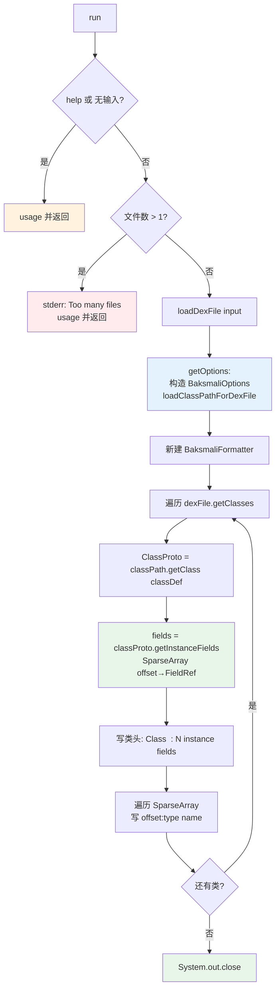

# 🧬 baksmali list fieldoffsets

列出 **dex 文件中每个类的实例字段偏移**。输出形如 `offset:type name`，偏移基于 ART 运行时的对象内存布局推算（父类字段在前、引用类型按 4 字节对齐等），因此本命令需要构建 `ClassPath` 做类型分析，必须提供 `--bootclasspath`（除非分析 oat 自带的 `boot.oat`）。

## 命令定位

- 命令名：`fieldoffsets`，别名 `fieldoffset`、`fo`
- 继承：`DexInputCommand`（带 `-a/--api` 与位置输入），并 `@ParametersDelegate` 注入 `AnalysisArguments`（`-b/-c/-d` 类路径参数）
- 描述（`@Parameters(commandDescription)`）：`Lists the instance field offsets for classes in a dex file.`
- 输出：**纯文本**，无 `--format` 选项，逐类一段写入 `System.out`

源码：`baksmali/src/main/java/org/jf/baksmali/ListFieldOffsetsCommand.java:49-53`

## 参数

### 本命令自身参数

| 参数 | 说明 | 默认 | 必填 | arity |
| --- | --- | --- | --- | --- |
| `-h`, `-?`, `--help` | 显示用法信息（`help=true`） | false | 否 | 布尔 |
| `file`（位置参数） | dex/apk/oat/odex 文件；apk/oat 多 dex 时可用 `app.apk/classes2.dex` 指定条目 | — | 是 | 列表（仅取首项） |

`help` 声明见 `ListFieldOffsetsCommand.java:55-57`；多文件校验（>1 报 `Too many files specified`）见 `:72-76`。

### 继承自 `DexInputCommand` 的通用参数

| 参数 | 说明 | 默认 | 备注 |
| --- | --- | --- | --- |
| `-a`, `--api` | 目标文件的数字 API level | -1（自动） | 非 -1 时 `Opcodes.forApi` 构造指令集 |
| `file` | 位置输入（dex/apk/oat/odex） | — | 多 dex 容器按 `classes.dex`→首条目回退 |

源码：`baksmali/src/main/java/org/jf/baksmali/DexInputCommand.java:56-65`

### `AnalysisArguments`（类路径分析参数）

| 参数 | 说明 | 默认 | arity |
| --- | --- | --- | --- |
| `-b`, `--bootclasspath`, `--bcp` | 冒号分隔的 bootclasspath 文件列表；`--bootclasspath ""` 表示空 bcp | null（自动选择） | 列表 |
| `-c`, `--classpath`, `--cp` | 额外 classpath，追加在 bcp 之后 | `[]` | 列表 |
| `-d`, `--classpath-dir`, `--cpd`, `--dir` | 搜索 classpath 文件的目录，可多次指定 | null（取 dex 父目录） | 列表 |

源码：`baksmali/src/main/java/org/jf/baksmali/AnalysisArguments.java:54-75`

## 命令主流程



核心在于把每个 `ClassDef` 升级为 `ClassProto`（`ListFieldOffsetsCommand.java:86`），再调用 `getInstanceFields()` 得到一个按偏移升序排列的 `SparseArray<FieldReference>`（`:87`）。`SparseArray.keyAt(i)` 即字段在对象实例中的字节偏移，`valueAt(i)` 是该字段引用——这正是 ART `mirror::Object` 内布局的推算结果，由 `dexlib2/analysis/` 的类型格完成。

## 典型用法与输出

```bash
# 基本用法（需 bcp 才能解析父类字段）
java -jar baksmali.jar list fieldoffsets -b /system/framework/framework.jar app.apk

# 短别名
java -jar baksmali.jar l fo -b framework.jar app.apk

# 指定 APK 内的某个 dex 条目
java -jar baksmali.jar l fo -b framework.jar "app.apk/classes2.dex"

# 分析 oat 时可直接传 boot.oat 作为 bcp
java -jar baksmali.jar l fo -b boot.oat framework.oat
```

输出示例（每个类一段，类头含字段计数，随后每行 `offset:type name`）：

```
Class Lcom/example/Foo; : 3 instance fields
0:I mId
4:Ljava/lang/String; mName
8:Lcom/example/Bar; mBar

Class Lcom/example/Bar; : 2 instance fields
0:J mTimestamp
8:Z mFlag
```

- 偏移从父类继承的字段之后开始累加；`Object` 自身无实例字段，故直接子类首字段通常在 `0`。
- 引用类型与 `long`/`double` 按 8 字节对齐时会出现空隙（如上 `Bar.mFlag` 落在 `8` 而非 `9`）。
- 若 `loadClassPathForDexFile` 抛异常，命令打印 `Error occurred while loading class path files.` 并 `System.exit(-1)`（`ListFieldOffsetsCommand.java:115-119`）。

> 提示：偏移是**推算值**而非 dex 中存储的数据——dex 不记录字段偏移，ART 在加载类时根据类型格动态计算。要查看类继承关系本身，见 [`list classes`](../commands/list-classes)。

## 源码要点

- 参数与构造：`ListFieldOffsetsCommand.java:55-64`
- 前置校验（help/空输入/多文件）：`:67-76`
- `getOptions()` 组装 `BaksmaliOptions` 并加载类路径（`checkPackagePrivateAccess=false`）：`:103-122`
- 逐类输出循环与 `SparseArray` 遍历：`:85-95`
- 输出经 `BaksmaliFormatter.getType` 格式化类型描述符为可读形式（`:88`、`:91`）
- 与 `list vtables` 共用 `AnalysisArguments`，但本命令**不**接受 `--format`、不写文件，仅写 stdout

## 延伸阅读

- [baksmali list](../../../cli/list.md) — list 家族总览（含 fieldoffsets 定位）
- [list dependencies](./list-dependencies.md) — 对比：odex/oat 依赖列表，无需类路径分析
- [baksmali disassemble](../../../cli/disassemble.md) — `--boot-class-path` 参数的完整说明
- Skills: dex-list-structure — 字段/方法/结构提取的工作流
