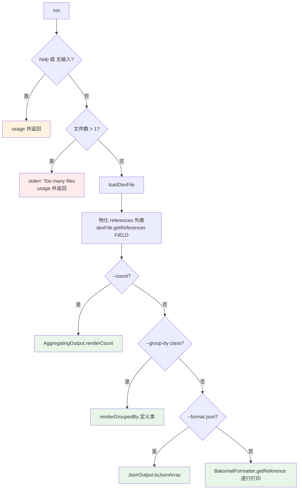

# 🧬 baksmali list fields

列举一个 dex 文件**字段表**（field table）中的全部字段引用，每条含「定义类 + 字段名 + 类型描述符」。默认输出机器可读 JSON，便于 Agent 与脚本消费；`--format text` 切回人读 smali 引用文本。常用于清点 APK 的字段面、识别内部类 `this$0`、统计混淆字段分布。

## 命令定位

- 命令名：`fields`
- 别名：`field`、`f`
- 父类：`ListReferencesCommand`（携带 `ReferenceType.FIELD`），再上溯 `DexInputCommand`
- 描述（`@Parameters(commandDescription)`）：`Lists the fields in a dex file's field table.`

源码：`baksmali/src/main/java/org/jf/baksmali/ListFieldsCommand.java:42-49`。该类本身只是 `ListReferencesCommand` 的一个薄壳——构造时传入 `ReferenceType.FIELD`，所有参数与主流程都在父类。

## 参数

字段类自身无独有参数，全部来自父类三个 `@ParametersDelegate`。

### 通用 dex 输入（`DexInputCommand`）

| 参数 | 说明 | 默认 | 必填 | arity |
| --- | --- | --- | --- | --- |
| `file`（位置参数） | dex/apk/oat/odex 文件；apk/oat 多 dex 时可写 `app.apk/classes2.dex`；多于 1 个报 `Too many files specified` | — | 是 | `List<String>`（取首项） |
| `-a`, `--api` | 目标文件的数字 API 级别，决定 opcode 集 | `-1`（按文件自识别） | 否 | 单值 |

声明见 `DexInputCommand.java:56-65`。

### 输出格式（`OutputFormatArguments`）

| 参数 | 说明 | 默认 | 必填 |
| --- | --- | --- | --- |
| `--format` | `json`（默认，机器可读）或 `text`（人读）；未识别值回落 JSON | `json` | 否 |

源码：`OutputFormatArguments.java:52-54`。判定逻辑：仅显式 `text` 选文本，其余一律 JSON（`:61-71`）。

### 聚合（`ListAggregationArguments`）

| 参数 | 说明 | 默认 | 必填 |
| --- | --- | --- | --- |
| `--count` | 仅输出总数，不输出条目 | `false` | 否 |
| `--group-by` | 按键分桶并输出每桶计数；当前仅支持 `class`（按定义类分组） | 无（`NONE`） | 否 |

源码：`ListAggregationArguments.java:56-63`。`--group-by class` 仅对 methods/fields 有意义，对其他引用类型会打 stderr 警告并忽略（`ListReferencesCommand.java:94-104`）。

### 帮助

| 参数 | 说明 | 默认 |
| --- | --- | --- |
| `-h`, `-?`, `--help` | 显示用法（`help=true`，触发即 `usage()` 返回） | `false` |

## 主流程



关键点：引用先**全量物化**进 `List<Reference>`（`ListReferencesCommand.java:84-87`），以便 `--count`/`--group-by` 无需二次遍历。计数与分组走 `AggregatingOutput`，JSON 走 `JsonOutput.toJson`，文本走 `BaksmaliFormatter.getReference`（`:89-120`）。定义类提取对 `FieldReference` 取 `getDefiningClass()`（`:124-132`）。

## 典型用法与真实输出

```bash
# 默认 JSON：{class,name,type}
java -jar baksmali.jar list fields app.apk

# 短别名（list → l，fields → f）+ 人读文本
java -jar baksmali.jar l f app.apk --format text

# 计数与按类聚合
java -jar baksmali.jar l f --count app.apk
java -jar baksmali.jar l f --group-by class app.apk

# 指定多 dex 中的第二个 dex
java -jar baksmali.jar l f "app.apk/classes2.dex"
```

`accessorTest.dex` 字段真实输出（节选，摘自 `website/cli/list.md`）：

```json
[
  {"class":"Lorg/jf/dexlib2/AccessorTypes$Accessors;","name":"this$0","type":"Lorg/jf/dexlib2/AccessorTypes;"},
  {"class":"Lorg/jf/dexlib2/AccessorTypes;","name":"boolean_val","type":"Z"},
  {"class":"Lorg/jf/dexlib2/AccessorTypes;","name":"byte_val","type":"B"}
]
```

`this$0` 是非静态内部类持有的外部类实例引用——识别 Java 内部类的典型特征字段。

`--count` 与 `--group-by class`（参照 methods 的同结构实跑）：

```json
{"count":234}
[{"group":"Lorg/jf/dexlib2/AccessorTypes$Accessors;","count":1},{"group":"Lorg/jf/dexlib2/AccessorTypes;","count":233}]
```

文本模式输出形如 `Lorg/jf/dexlib2/AccessorTypes;->boolean_val:Z`，每行一条，便于 `grep`/`awk`。

配合 `jq` 做字段面分析：

```bash
# 列出所有类型为 Z（boolean）的字段
java -jar baksmali.jar l f app.apk | jq -r '.[] | select(.type=="Z") | "\(.class)->\(.name)"'
# 按字段类型统计分布
java -jar baksmali.jar l f app.apk | jq -r '.[].type' | sort | uniq -c | sort -rn
```

## 用途

- 字段面清点：快速了解 APK 字段总数与按类分布，无需完整反汇编。
- 识别内部类：`this$0` 字段标志非静态内部类。
- 混淆分析：结合 `--group-by class` 观察哪些类字段密集，定位混淆重灾区。
- 与 `list fieldoffsets` 互补——前者列字段表引用，后者列实例字段在对象内的内存偏移（需 `--boot-class-path`）。

## 源码要点

- 薄壳类，仅声明命令名与 `ReferenceType.FIELD`：`ListFieldsCommand.java:42-49`
- 通用前置校验（help/空输入/多文件）：`ListReferencesCommand.java:69-78`
- 引用物化：`ListReferencesCommand.java:84-87`
- `--count` 分支：`:89-92`；`--group-by class` 分支：`:94-104`
- JSON 序列化：`:106-114`；文本格式化：`:116-120`
- 定义类提取：`:124-132`

## 延伸阅读

- [baksmali list](../../../cli/list.md) — list 家族总览（含 fields 子命令定位与聚合示例）
- [list methods](./list-methods) — 同结构的方法表列举
- [Skills: dex-list-structure](../../../skills/#读取-结构) — 字段/方法/字符串的结构化读取工作流
