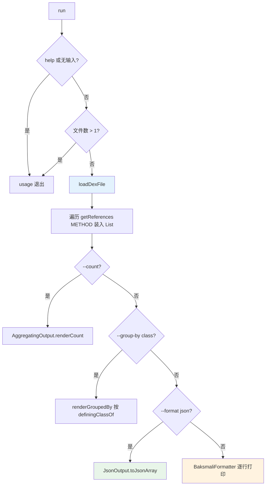

# 🔎 baksmali list methods

列举 dex 文件**方法表（method table）**中的全部方法引用。无需完整反汇编，即可快速拿到 `类 → 方法名(参数)返回类型` 清单，是方法定位、签名搜索、按类统计方法数的最快路径。默认输出 **JSON**（面向 Agent 与脚本），`--format text` 切换为人读文本。

## 命令定位

- 命令名：`methods`；别名：`method`、`m`（如 `baksmali l m app.apk`）
- 描述（`@Parameters(commandDescription)`）：`Lists the methods in a dex file's method table.`
- 类：`ListMethodsCommand`，继承 `ListReferencesCommand`（传 `ReferenceType.METHOD`），再继承 `DexInputCommand`。
- 自身无新增 `@Parameter`，所有参数来自父类与两个 `@ParametersDelegate`。

源码：`baksmali/src/main/java/org/jf/baksmali/ListMethodsCommand.java:42-49`

## 参数

自身仅声明命令元信息，可设参数分三层来源：

| 参数 | 说明 | 默认 | 必填 | arity | 来源 |
| --- | --- | --- | --- | --- | --- |
| `file`（位置） | dex/apk/oat/odex 文件；多 dex 容器可用 `app.apk/classes2.dex` 指定条目 | — | 是 | 列表（实际取首项） | `DexInputCommand.java:61-65` |
| `-a`, `--api` | 数值 API level，用于选择 opcode 集 | -1（自动） | 否 | 单值 | `DexInputCommand.java:56-59` |
| `--format` | `json`（默认，机器可读）/ `text`（人读） | `json` | 否 | 单值 | `OutputFormatArguments.java:52-54` |
| `--count` | 仅输出总数，不列条目 | false | 否 | 布尔 | `ListAggregationArguments.java:56-58` |
| `--group-by` | 按键分桶计数，目前仅支持 `class`（按定义类） | 无 | 否 | 单值 | `ListAggregationArguments.java:60-63` |
| `-h`, `-?`, `--help` | 显示用法 | false | 否 | 布尔 | `ListReferencesCommand.java:53-55` |

多于 1 个文件时报 `Too many files specified` 并退出（`ListReferencesCommand.java:74-78`）。

## 🧬 主流程



引用物化（`ListReferencesCommand.java:83-87`）先一次性装入 `List<Reference>`，使后续计数/分组不必重复遍历。分组键 `definingClassOf` 取 `MethodReference.getDefiningClass()`（`:124-127`）。

## 📤 典型用法与真实输出

```bash
# 默认 JSON：每项含 class/name/parameters/returnType
java -jar baksmali.jar list methods app.apk

# 短别名 + 人读文本
java -jar baksmali.jar l m app.apk --format text

# 聚合：总数 / 按定义类分桶
java -jar baksmali.jar l m --count app.apk
java -jar baksmali.jar l m --group-by class app.apk

# 多 dex APK 指定条目
java -jar baksmali.jar l m "app.apk/classes2.dex"
```

`LocalTest/classes.dex` fixture（单类 `LLocalTest;`，含 `method1`、`method2`）默认 JSON 输出：

```json
[
  {"class":"LLocalTest;","name":"method1","parameters":[],"returnType":"V"},
  {"class":"LLocalTest;","name":"method2","parameters":["I","J","Ljava/lang/String;"],"returnType":"V"}
]
```

人读文本对照（`--format text`）：

```
LLocalTest;->method1()V
LLocalTest;->method2(IJLjava/lang/String;)V
```

聚合实跑（`accessorTest.dex`，共 432 个方法）：

```json
{"count":432}
[{"group":"Ljava/lang/Object;","count":1},{"group":"Lorg/jf/dexlib2/AccessorTypes$Accessors;","count":232},{"group":"Lorg/jf/dexlib2/AccessorTypes;","count":199}]
```

JSON schema：`[{"class":"Lcom/Example;","name":"foo","parameters":["I"],"returnType":"V"}]`。配合 `jq` 可按签名过滤：

```bash
java -jar baksmali.jar l m app.apk | jq '.[] | select(.name=="login")'
java -jar baksmali.jar l m app.apk --format text | grep -E "->onCreate\|->onClick"
```

## ⚡ 源码要点

- 命令注册：`ListMethodsCommand.java:42-49` 通过 `@ExtendedParameters(commandName="methods", commandAliases={"method","m"})` 暴露三个调用名，构造器把 `ReferenceType.METHOD` 透传给父类。
- 引用迭代：`dexFile.getReferences(ReferenceType.METHOD)`（`ListReferencesCommand.java:85`）由 `DexBackedDexFile` 提供，零拷贝遍历方法表。
- 格式分发：`--format` 默认 JSON（`OutputFormatArguments.getFormat` 不识别 `text` 时回落 JSON，`OutputFormatArguments.java:61-71`）；JSON 走 `JsonOutput`，文本走 `BaksmaliFormatter.getReference`（`:116-120`）。
- 分组仅对 METHOD/FIELD 有意义：对其他引用类型打印 `--group-by class only applies to methods and fields; ignoring.`（`:96-103`）。

## 延伸阅读

- [list classes — 列举类结构](./list-classes.md)
- [list strings — 列举字符串池](./list-strings.md)
- [list dependencies — odex 依赖](./list-dependencies.md)
- [CLI: baksmali list 总览](../../../cli/list.md)
- [Skill: dex-list-methods](../../../skills/#列举-方法)
- [xref — 谁调用了某方法](../../../cli/xref.md)
