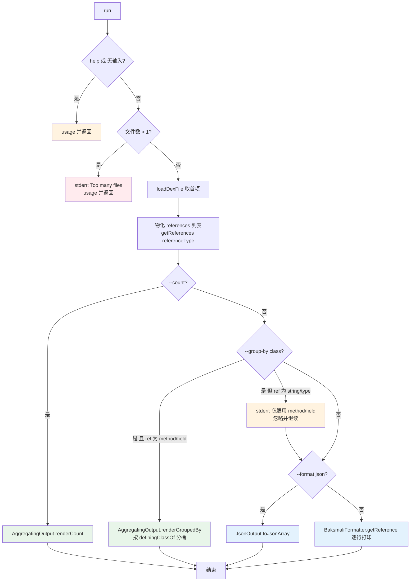

# 🧬 baksmali ListReferencesCommand

`ListReferencesCommand` 是 `list methods` / `list fields` / `list strings` / `list types` 四个枚举子命令的**抽象基类**。它本身不对应任何 CLI 命令名，而是把"加载 dex → 物化引用表 → 按 `--count`/`--group-by` 聚合或按 `--format` 输出"这条主流程集中实现一次，子类只须声明命令名、别名与 `ReferenceType`。本文统一介绍它的参数、主流程与四个具体子命令的对照。

## 命令定位

`ListReferencesCommand` 为抽象类（`baksmali/src/main/java/org/jf/baksmali/ListReferencesCommand.java:49`），构造时接收一个 `referenceType`（`ReferenceType.METHOD/FIELD/STRING/TYPE`，`:63-66`）。它继承 `DexInputCommand`，并通过两个 `@ParametersDelegate` 复用 `OutputFormatArguments` 与 `ListAggregationArguments`。继承链：

```
ListReferencesCommand → DexInputCommand → org.jf.util.jcommander.Command
```

四个具体子命令仅声明注解、构造时传入引用类型：

| 子命令类 | commandName | 别名 | commandDescription | 引用类型 | 源码 |
| --- | --- | --- | --- | --- | --- |
| `ListMethodsCommand` | `methods` | `method`, `m` | Lists the methods in a dex file's method table. | `METHOD` | `ListMethodsCommand.java:42-49` |
| `ListFieldsCommand` | `fields` | `field`, `f` | Lists the fields in a dex file's field table. | `FIELD` | `ListFieldsCommand.java:42-49` |
| `ListStringsCommand` | `strings` | `string`, `str`, `s` | Lists the strings in a dex file's string table. | `STRING` | `ListStringsCommand.java:42-49` |
| `ListTypesCommand` | `types` | `type`, `t` | Lists the type ids in a dex file's type table. | `TYPE` | `ListTypesCommand.java:42-49` |

## 参数

参数来自父类 `DexInputCommand` 与两个委托类，所有子命令共享同一套：

| 参数 | 说明 | 默认 | 必填 | arity |
| --- | --- | --- | --- | --- |
| `file`（位置参数） | dex/apk/oat/odex 文件；多 dex 容器可用 `app.apk/classes2.dex` 指定条目 | — | 是 | 列表（实际取首项） |
| `-a`, `--api` | 文件数字 API level，选择 opcode 集 | `-1`（自动） | 否 | 1 |
| `--format` | 输出格式：`json`（默认，机器可读）或 `text`（人读） | `json` | 否 | 1 |
| `--count` | 只输出总数，不输出条目 | `false` | 否 | 布尔 |
| `--group-by` | 按键分桶输出计数；目前仅 `class`，且仅 method/field 有效 | 无 | 否 | 1 |
| `-h`, `-?`, `--help` | 显示用法 | `false` | 否 | 布尔 |

参数来源：`DexInputCommand.java:56-65`（`--api`、`file`）、`OutputFormatArguments.java:52-54`（`--format`，默认 `json`，仅 `text` 切文本，未识别值回退 JSON 见 `:61-71`）、`ListAggregationArguments.java:56-63`（`--count`、`--group-by`，`GroupBy` 枚举见 `:51-54`）、`ListReferencesCommand.java:53-55`（`--help`）。

## 主流程



物化步骤（`ListReferencesCommand.java:84-87`）先把 `dexFile.getReferences(referenceType)` 的惰性迭代结果收进 `ArrayList`，使后续计数/分组无需重复遍历。`--count` 短路（`:89-92`）调用 `AggregatingOutput.renderCount(size)` 输出 `{"count":N}`。`--group-by class` 仅对携带 `definingClass` 的 `MethodReference`/`FieldReference` 有意义，对 `STRING`/`TYPE` 会打印告警并回落默认格式（`:94-103`，`definingClassOf` 见 `:123-132`）。

## 典型用法与真实输出

```bash
# 方法表，默认 JSON
java -jar baksmali.jar list methods app.apk
# 短别名 + 人读文本
java -jar baksmali.jar l m app.apk --format text
# 仅总数
java -jar baksmali.jar l m --count app.apk
# 按定义类分组计数
java -jar baksmali.jar l m --group-by class app.apk
```

`list methods`（`LocalTest/classes.dex` fixture，见 `website/cli/list.md:52-68`）：

```json
[
  {"class":"LLocalTest;","name":"method1","parameters":[],"returnType":"V"},
  {"class":"LLocalTest;","name":"method2","parameters":["I","J","Ljava/lang/String;"],"returnType":"V"}
]
```

`list methods --count` / `--group-by class`（`accessorTest.dex` 实跑，`website/cli/list.md:77-82`）：

```json
{"count":432}
[
  {"group":"Ljava/lang/Object;","count":1},
  {"group":"Lorg/jf/dexlib2/AccessorTypes$Accessors;","count":232},
  {"group":"Lorg/jf/dexlib2/AccessorTypes;","count":199}
]
```

`list fields`（`accessorTest.dex` 节选，`website/cli/list.md:121-133`）：

```json
[
  {"class":"Lorg/jf/dexlib2/AccessorTypes$Accessors;","name":"this$0","type":"Lorg/jf/dexlib2/AccessorTypes;"},
  {"class":"Lorg/jf/dexlib2/AccessorTypes;","name":"boolean_val","type":"Z"},
  {"class":"Lorg/jf/dexlib2/AccessorTypes;","name":"byte_val","type":"B"}
]
```

`this$0` 是非静态内部类持有的外部类实例引用——识别 Java 内部类的典型特征字段。`list types` 输出 `{"type":"..."}`，`list strings` 输出 `{"string":"..."}`，schema 与上同构（`JsonOutput.toJson`）。

## 源码要点

- 抽象基类与 `referenceType` 字段：`ListReferencesCommand.java:49-66`
- 三道前置校验（help / 空输入 / 多文件）：`:69-78`
- 引用物化循环：`:84-87`
- `--count` 短路：`:89-92`
- `--group-by class` 分支、告警与回落：`:94-103`
- JSON 输出分支（`JsonOutput.toJsonArray`）：`:106-114`
- 文本输出分支（`BaksmaliFormatter.getReference`）：`:116-120`
- `definingClassOf`（method/field 取定义类）：`:123-132`
- dex 加载与多 dex 条目解析：`DexInputCommand.java:111-173`

## 延伸阅读

- [baksmali list](../../../cli/list.md) — list 家族总览与各子命令对照
- [list strings](./list-strings.md) — 字符串表列举的实战与搜索技巧
- [list fields](./list-fields.md) — 字段表列举与内部类特征字段
- [list dependencies](./list-dependencies.md) — 对照：odex/oat 依赖列表（无 `--format`）
