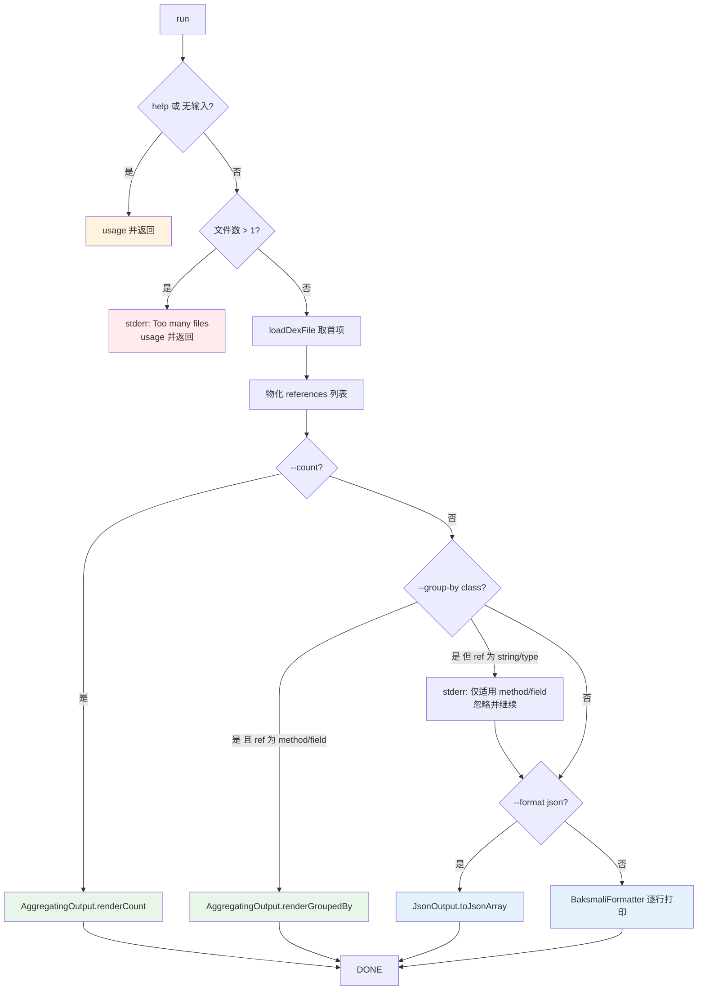

# 🔎 baksmali list strings

列举 dex 文件 **字符串表（string table）** 中的全部字符串常量。无需反汇编即可获取类描述符、方法名、方法签名、硬编码 URL/密钥等所有 MUTF-8 字符串。这是 APK 侦察最常用的入口命令之一。

## 命令定位

- 命令名：`strings`
- 别名：`string`、`str`、`s`（`@ExtendedParameters(commandAliases)`）
- 描述（`@Parameters(commandDescription)`）：`Lists the strings in a dex file's string table.`
- 继承链：`ListStringsCommand` → `ListReferencesCommand` → `DexInputCommand` → `Command`
- 引用类型：构造时传入 `ReferenceType.STRING`（`ListStringsCommand.java:48`）

源码：`baksmali/src/main/java/org/jf/baksmali/ListStringsCommand.java:42-49`

`ListStringsCommand` 本身极薄——仅声明命令名/别名与引用类型，所有参数与主流程都由父类 `ListReferencesCommand` 实现（`ListReferencesCommand.java:49-133`）。

## 参数

| 参数 | 说明 | 默认 | 必填 | arity |
| --- | --- | --- | --- | --- |
| `file`（位置参数） | dex/apk/oat/odex 文件；多 dex 容器可用 `app.apk/classes2.dex` 指定条目 | — | 是 | 列表（实际取首项） |
| `-a`, `--api` | 文件的数字 API level，用于选择 opcode 集 | `-1`（自动） | 否 | 1 |
| `--format` | 输出格式：`json`（默认，机器可读）或 `text`（人读） | `json` | 否 | 1 |
| `--count` | 只输出总数，不输出条目 | false | 否 | 布尔 |
| `--group-by` | 按键分桶输出计数；目前仅 `class` 对 method/field 有效 | 无 | 否 | 1 |
| `-h`, `-?`, `--help` | 显示用法 | false | 否 | 布尔 |

参数来源：`DexInputCommand.java:56-65`（`--api`、`file`）、`OutputFormatArguments.java:52-54`（`--format`）、`ListAggregationArguments.java:56-63`（`--count`、`--group-by`）、`ListReferencesCommand.java:53-55`（`--help`）。

## 主流程



物化步骤（`ListReferencesCommand.java:84-87`）先遍历 `dexFile.getReferences(STRING)` 收集到 `ArrayList`，以便后续计数/分组无需重复遍历。字符串引用走 `--group-by class` 时会落入"仅适用 method/field"分支并打印告警（`:96-98`），随后继续按默认格式输出。

## 典型用法与真实输出

```bash
# 列举所有字符串（默认 JSON，每项 {"string": "..."}）
java -jar baksmali.jar list strings app.apk

# 短别名 + 人读文本（每行一个带引号字符串）
java -jar baksmali.jar l s app.apk --format text

# 只统计数量
java -jar baksmali.jar l s --count app.apk

# 多 dex 容器指定条目
java -jar baksmali.jar l s "app.apk/classes2.dex"
```

真实输出（`LocalTest/classes.dex` fixture，默认 JSON，节选）：

```json
[
  {"string":"I"},
  {"string":"J"},
  {"string":"LLocalTest;"},
  {"string":"Ljava/lang/Object;"},
  {"string":"Ljava/lang/String;"},
  {"string":"V"},
  {"string":"VIJL"},
  {"string":"blah! This local name has some spaces, a colon, even a \nnewline!"},
  {"string":"method1"}
]
```

文本对照（`--format text`）：

```
"I"
"J"
"LLocalTest;"
"Ljava/lang/Object;"
"blah! This local name has some spaces, a colon, even a \nnewline!"
"method1"
```

字符串池同时包含类型描述符（`LLocalTest;`）、方法名（`method1`）、方法签名（`VIJL`）与调试用本地变量名。JSON 中 `\n` 已转义，便于脚本直接消费。

`--count` 输出形如 `{"count":N}`（与 `list methods` 的 `{"count":432}` 同 schema，见 `AggregatingOutput.renderCount`）。

### 搜索字符串

```bash
# JSON + jq：大小写不敏感取含 password 的字符串
java -jar baksmali.jar l s app.apk | jq -r '.[].string | select(test("password";"i"))'

# 文本 + grep：搜索 URL / 硬编码密钥
java -jar baksmali.jar l s app.apk --format text | grep "https\?://"
java -jar baksmali.jar l s app.apk --format text | grep -iE "aes|rsa|cipher|key|secret|token"
```

## 源码要点

- 命令注册：`ListStringsCommand.java:42-48`（`commandName=strings`，别名 `string/str/s`，`ReferenceType.STRING`）
- 三道前置校验（help / 空输入 / 多文件）：`ListReferencesCommand.java:69-78`
- 引用物化循环：`:84-87`
- `--count` 短路：`:89-92`
- `--group-by class` 分支与告警：`:94-103`
- JSON 输出分支：`:106-114`
- 文本输出分支（`BaksmaliFormatter.getReference`）：`:116-120`
- dex 加载与多 dex 条目解析（`loadDexFile`）：`DexInputCommand.java:111-173`
- `--format` 默认 JSON、仅 `text` 切文本（未识别值回退 JSON）：`OutputFormatArguments.java:61-71`

## 延伸阅读

- [baksmali list](../../../cli/list.md) — list 家族总览与各子命令对照
- [list dependencies](./list-dependencies.md) — 对照：odex/oat 依赖列表（无 `--format`）
- [list dex](./list-dex.md) — 多 dex APK 中先定位条目再 list strings
- [Skill: dex-list-strings](../../../skills/index.md#dex-list-strings) — 字符串搜索的实战技巧与典型场景表
