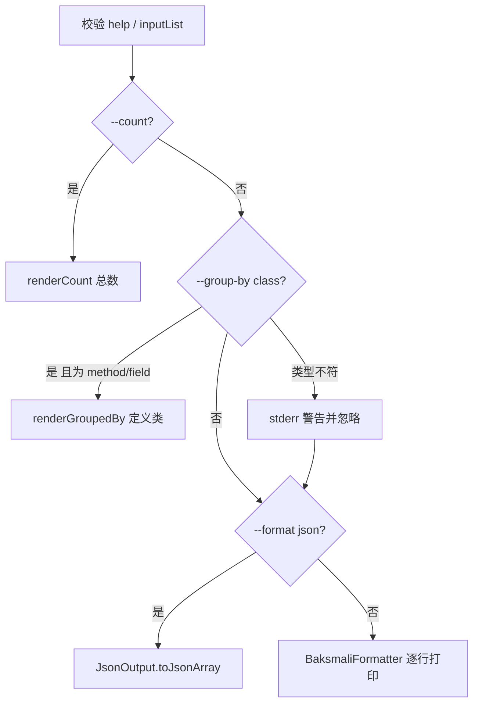

# 📋 ListCommand（`baksmali list`）

`ListCommand` 是一个**容器型父命令**：自身不读 dex，仅通过 `setupCommand` 注册 9 个子命令并把控制权转交给它们 `baksmali/src/main/java/org/jf/baksmali/ListCommand.java:59`。其 `run()` 在未指定子命令或带 `-h` 时打印用法，否则取出已解析的子命令对象并执行其 `run()` `ListCommand.java:75`。别名 `l`。

`@Parameters(commandDescription = "Lists various objects in a dex file.")` `ListCommand.java:45`；`@ExtendedParameters(commandName = "list", commandAliases = "l")` `ListCommand.java:46`。`ListCommand` 自身仅声明一个 `--help` 参数 `ListCommand.java:51`，真正的输入与格式参数来自各子命令及其父类。

## 🧬 子命令总览

| 子命令 | 别名 | 父类 | commandDescription | 输出 |
| --- | --- | --- | --- | --- |
| `strings` | `string`/`str`/`s` | `ListReferencesCommand` | Lists the strings in a dex file's string table. | JSON/文本 |
| `methods` | `method`/`m` | `ListReferencesCommand` | Lists the methods in a dex file's method table. | JSON/文本 |
| `fields` | `field`/`f` | `ListReferencesCommand` | Lists the fields in a dex file's field table. | JSON/文本 |
| `types` | `type`/`t` | `ListReferencesCommand` | Lists the type ids in a dex file's type table. | JSON/文本 |
| `classes` | `class`/`c` | `DexInputCommand` | Lists the classes in a dex file. | JSON/文本 |
| `dex` | `d` | `Command` | Lists the dex files in an apk/oat file. | 纯文本 |
| `vtables` | `vtable`/`v` | `DexInputCommand` | Lists the virtual method tables for classes in a dex file. | 纯文本 |
| `fieldoffsets` | `fieldoffset`/`fo` | `DexInputCommand` | Lists the instance field offsets for classes in a dex file. | 纯文本 |
| `dependencies` | `deps`/`dep` | `Command` | Lists the stored dependencies in an odex/oat file. | 纯文本 |

引用类均位于 `baksmali/src/main/java/org/jf/baksmali/`：`ListStringsCommand.java:42`、`ListMethodsCommand.java:42`、`ListFieldsCommand.java:42`、`ListTypesCommand.java:42`、`ListClassesCommand.java:49`、`ListDexCommand.java:51`、`ListVtablesCommand.java:50`、`ListFieldOffsetsCommand.java:49`、`ListDependenciesCommand.java:50`。

## 🛠️ 通用参数

`strings`/`methods`/`fields`/`types` 共同继承 `ListReferencesCommand`，后者又继承 `DexInputCommand`，因此可用参数为三层叠加。

### DexInputCommand（输入与 API）

来自 `DexInputCommand.java`：

| 参数 | 说明 | 默认 | 必填 |
| --- | --- | --- | --- |
| `file`（位置参数） | dex/apk/oat/odex 文件；多 dex 容器可用 `app.apk/classes2.dex` 指定条目 `DexInputCommand.java:61` | — | 是 |
| `-a`/`--api` | 指定被反汇编文件的数字 API 级别，决定 `Opcodes` 版本映射 `DexInputCommand.java:56` | `-1`（按文件头推断） | 否 |

`loadDexFile` 负责把字符串切分成物理文件与条目名，支持引号包裹的精确匹配与不带引号的部分匹配 `DexInputCommand.java:111`。

### OutputFormatArguments（输出格式）

`ListReferencesCommand.java:57` 与 `ListClassesCommand.java:59` 通过 `@ParametersDelegate` 引入：

| 参数 | 说明 | 默认 |
| --- | --- | --- |
| `--format` | `json`（默认，面向脚本/AI Agent）或 `text`（人读）；未识别值回落 JSON `OutputFormatArguments.java:52` | `json` |

### ListAggregationArguments（聚合）

`ListReferencesCommand.java:60` 与 `ListClassesCommand.java:62` 引入 `ListAggregationArguments.java`：

| 参数 | 说明 | 默认 |
| --- | --- | --- |
| `--count` | 仅输出条目总数，不列条目 `ListAggregationArguments.java:56` | `false` |
| `--group-by` | 按键分桶并输出每桶计数；目前仅 `class`（按定义类分组，仅对 methods/fields 有效）`ListAggregationArguments.java:60` | 无（`NONE`） |

## ⚡ 主流程（ListReferencesCommand）

`ListReferencesCommand.run()` 是 strings/methods/fields/types 四个子命令的统一执行体 `ListReferencesCommand.java:68`：



关键点：引用先被物化进 `List<Reference>` 以便计数/分组而无需重扫 `ListReferencesCommand.java:84`；`definingClassOf` 仅对 `MethodReference`/`FieldReference` 返回真实定义类 `ListReferencesCommand.java:124`。

## 📊 真实命令 → 输出示例

### list classes（默认 JSON，含类结构）

```bash
java -jar baksmali.jar list classes app.apk
java -jar baksmali.jar l c app.apk --format text   # 仅类描述符
```

`LocalTest/classes.dex` 真实输出：

```json
[{"type":"LLocalTest;","superclass":"Ljava/lang/Object;","accessFlags":1,"interfaces":[],"fields":[],"methods":[{"name":"method1","parameters":[],"returnType":"V","accessFlags":9},{"name":"method2","parameters":["I","J","Ljava/lang/String;"],"returnType":"V","accessFlags":9}]}]
```

### list methods（聚合）

```bash
java -jar baksmali.jar l m --count app.apk           # {"count":N}
java -jar baksmali.jar l m --group-by class app.apk  # [{group,count}]
```

`accessorTest.dex` 实跑：

```json
{"count":432}
[{"group":"Ljava/lang/Object;","count":1},{"group":"Lorg/jf/dexlib2/AccessorTypes$Accessors;","count":232},{"group":"Lorg/jf/dexlib2/AccessorTypes;","count":199}]
```

### list strings

```bash
java -jar baksmali.jar list strings app.apk | jq -r '.[].string | select(test("https";"i"))'
```

```json
[
  {"string":"I"},
  {"string":"LLocalTest;"},
  {"string":"blah! This local name has some spaces, a colon, even a \nnewline!"}
]
```

### list fields / list types

`accessorTest.dex` 字段（节选）：

```json
[
  {"class":"Lorg/jf/dexlib2/AccessorTypes$Accessors;","name":"this$0","type":"Lorg/jf/dexlib2/AccessorTypes;"},
  {"class":"Lorg/jf/dexlib2/AccessorTypes;","name":"boolean_val","type":"Z"}
]
```

`this$0` 是非静态内部类持有的外部类实例引用——识别 Java 内部类的典型特征字段。

### list dex / list dependencies（纯文本）

```bash
java -jar baksmali.jar list dex app.apk      # classes.dex\nclasses2.dex
java -jar baksmali.jar l deps app.odex        # odex 依赖条目逐行
```

`ListDexCommand.run()` 用 `DexFileFactory.loadDexContainer` 取条目名列表 `ListDexCommand.java:91`；`ListDependenciesCommand.run()` 先尝试 `OatFile.getBootClassPath()`，失败再退回 `DexBackedOdexFile.getDependencies()` `ListDependenciesCommand.java:90`。

## 🔎 需要类路径的子命令

`vtables` 与 `fieldoffsets` 通过 `@ParametersDelegate` 注入 `AnalysisArguments`（`ListVtablesCommand.java:60`、`ListFieldOffsetsCommand.java:59`），用于构建 `ClassPath` 计算类型层次。主要参数：

| 参数 | 说明 |
| --- | --- |
| `-b`/`--bootclasspath`/`--bcp` | 冒号分隔的 bootclasspath 文件列表；空串表示不用 `AnalysisArguments.java:54` |
| `-c`/`--classpath`/`--cp` | 额外 classpath，追加在 bootclasspath 之后 `AnalysisArguments.java:64` |
| `-d`/`--classpath-dir`/`--cpd` | 搜索 classpath 文件的目录，可多次指定 `AnalysisArguments.java:71` |

`vtables` 另有 `--classes`（逗号分隔，仅打印这些类的虚表）`ListVtablesCommand.java:66` 与 `--override-oat-version` `ListVtablesCommand.java:71`。两者调用 `analysisArguments.loadClassPathForDexFile(...)` 装载类路径 `ListVtablesCommand.java:147`、`ListFieldOffsetsCommand.java:113`。

```bash
java -jar baksmali.jar l v   -b /system/framework/framework.jar app.apk
java -jar baksmali.jar l fo  -b /system/framework/framework.jar app.apk
```

## 🗺️ 源码要点

- `ListCommand.java:59` — `setupCommand` 注册全部子命令。
- `ListReferencesCommand.java:106` — JSON 分支：每个 `Reference` 经 `JsonOutput.toJson` 后整体 `toJsonArray`。
- `ListReferencesCommand.java:116` — 文本分支：`BaksmaliFormatter.getReference` 逐行打印。
- `ListClassesCommand.java:96` — `--group-by` 对 class 列表无意义，stderr 警告后忽略。
- `DexInputCommand.java:135` — 条目名带引号走精确匹配，否则部分匹配。

## 延伸阅读

- [baksmali list（CLI 速查）](../../../cli/list.md)
- [DisassembleCommand](./disassemble.md)
- [XrefCommand](./xref.md)
- [dex-list-structure skill](../../../skills/#读取-结构)
