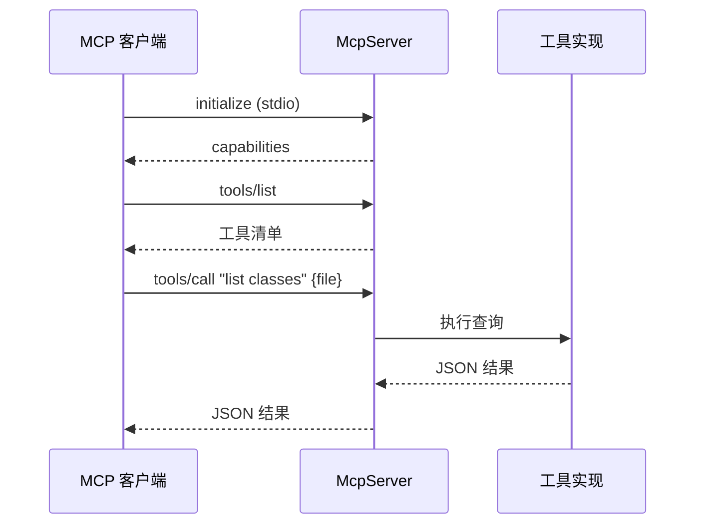

# 🔌 McpCommand — MCP 服务器

`baksmali mcp` 启动一个 MCP（Model Context Protocol）服务器，通过 stdio 把只读 dex 查询能力暴露为 Agent 工具。源码：`baksmali/src/main/java/org/jf/baksmali/McpCommand.java`。

## 定位


服务器实现：`baksmali/src/main/java/org/jf/baksmali/mcp/McpServer.java`。

## 参数

继承 `Command` 基类。本命令：

| 参数 | 简写 | 说明 |
|------|------|------|
| `--api` | `-a` | API 级别 |
| `-h/--help` | — | 帮助 |

stdio 通信模式，无需指定端口。

## 用法

```bash
java -jar baksmali.jar mcp              # 启动 stdio 服务器
java -jar baksmali.jar mcp --api 30
```

## MCP 客户端注册

以 Claude Desktop 为例（概念性）：

```json
{
  "mcpServers": {
    "baksmali": {
      "command": "java",
      "args": ["-jar", "/path/to/baksmali.jar", "mcp"]
    }
  }
}
```

注册后客户端 `tools/list` 可见所有工具，Agent 按 `tools/call` 调用。

## 暴露的工具

仅只读工具（不暴露 transform，防 Agent 误改 dex）：

| 工具 | 对应 CLI |
|------|----------|
| list classes/methods/strings/fields/types | `baksmali list *` |
| xref callers/field-refs/type-refs | `baksmali xref *` |
| search | `baksmali search` |
| fingerprint | `baksmali fingerprint` |
| disassemble | `baksmali disassemble` |

参数与返回均为结构化 JSON。

## 与 Skills 的区别

- **Skills**：Markdown，教 Agent 何时用命令，Agent 自跑 shell。
- **MCP**：直接函数调用，不经 shell，参数结构化。

二者互补：MCP 客户端直接调工具；纯 CLI 场景读 Skill 跑 shell。

## 主流程



服务器按 MCP 协议响应 `initialize`/`tools/list`/`tools/call`，每个工具内部复用对应 Command 的查询逻辑。

## 延伸阅读

- [mcp 子包](../mcp.md) — McpServer 实现
- [MCP 协议集成](../../../internals/mcp.md)
- [smali-mcp skill](../../../skills/smali-mcp.md)
- [CLI mcp 文档](../../../cli/mcp.md)
