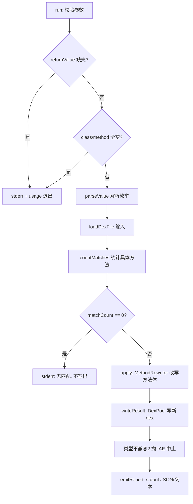

# 🛠️ baksmali patch

`baksmali patch` 是一条**写回变换**命令：读入一个 dex/apk，把所有「定义类匹配 `--class` 且方法名匹配 `--method`」的**具体方法**（有方法体的）整段替换为一条立即返回定值的最小指令，再用 `DexPool` 序列化成新 dex。原文件不被修改。

逆向工程里的高频招式——让 `isPremium`/`verifyRoot`/`checkLicense` 直接 `return true`、把回调 `onAdsBlocked` 改成 `return-void`、让 getter 吐 `null`——都由它一键完成。命令注册于 `PatchCommand.java:63-65`（`commandName = "patch"`），核心变换逻辑在 `ForceReturnTransform.java`。

## 🔎 命令定位

| 维度 | 说明 |
|---|---|
| 类型 | 写回变换（产出新 dex + stdout 报告） |
| 父类 | `DexTransformCommand` → `DexInputCommand` |
| 核心 | `ForceReturnTransform`（`MethodRewriter` 覆写 `getImplementation()`） |
| 报告 | 成功输出一行 JSON（默认）或人读文本（`--format text`） |
| 失败模式 | 缺 `--return`、`--class`/`--method` 全空、无匹配、返回类型不兼容 |

## ⚡ 参数表

### patch 自有参数

| 参数 | 说明 | 默认 | 必填 |
|---|---|---|---|
| `--class <regex>` | 匹配**定义类描述符**的正则（如 `Lcom/drm/.*`），不区分锚点 | 任意类 | 否 |
| `--method <regex>` | 匹配**方法名**的正则（如 `isPremium`、`check.*`） | 任意方法 | 否 |
| `--return <value>` | 强制返回值：`void`/`true`/`false`/`0`/`1`/`null` | — | **是** |
| `-h, -?, --help` | 打印用法 | false | 否 |

> 约束：`--class` 与 `--method` 至少给一个（`PatchCommand.java:106-110`）；`--return` 必填（`:100-104`）。两者均用 `Pattern.matcher().find()` 做子串匹配（`ForceReturnTransform.java:108-116`），不锚定首尾。

### 继承自 DexTransformCommand / DexInputCommand

| 参数 | 说明 | 默认 | 来源 |
|---|---|---|---|
| `<file>` | dex/apk/oat/odex 文件，apk 可带 `/classes2.dex` 选条目 | — | `DexInputCommand.java:61-65` |
| `-o, --output <file>` | 输出 dex 路径 | `out.dex` | `DexTransformCommand.java:58-61` |
| `--format <json\|text>` | 报告格式，默认 JSON（供 Agent/脚本） | json | `OutputFormatArguments.java:52-54` |
| `-a, --api <api>` | 文件的目标 API level | -1（自动） | `DexInputCommand.java:56-59` |

## 🧬 返回值与类型兼容性

`ForceReturnTransform.parseValue`（`:94-106`）按枚举 `ReturnValue{VOID,TRUE,FALSE,ZERO,ONE,NULL}` 解析。`buildReturnBody`（`:125-178`）按返回类型描述符首字符分派，**类型不兼容即抛 `IllegalArgumentException`** 并中止：

| 返回类型描述符 | 允许的 `--return` | 合成指令（寄存器 v0） |
|---|---|---|
| `V` (void) | 仅 `void` | `return-void` |
| `Z B S C I` | `true`/`false`/`0`/`1` | `const/4 v0, lit` + `return v0` |
| `J` (long) | `true`/`false`/`0`/`1` | `const-wide/16 v0, lit` + `return-wide v0` |
| `F` (float) | `true`/`false`/`0`/`1` | `const v0, floatBits` + `return v0` |
| `D` (double) | `true`/`false`/`0`/`1` | `const-wide/16 v0, doubleBits` + `return-wide v0` |
| `L` / `[` (对象/数组) | 仅 `null` | `const/4 v0, 0` + `return-object v0` |

旧方法体连同其 debug 信息与 try/catch 一并丢弃（`ImmutableMethodImplementation(registerCount, instructions, null, null)`，`:177`）。

## 📊 主流程



`run()` 主体在 `PatchCommand.java:88-152`：先校验（`:89-110`），再 `loadDexFile`（`:122`），随后 `countMatches` 提前统计（`:125`，零匹配直接退出、不写文件，`:126-129`），最后 `apply` → `writeResult` → `emitReport`（`:133-151`）。

## 📤 真实命令与输出示例

### 1. 绕过授权校验（布尔方法返回 true）

```bash
baksmali patch app.apk --method 'isPremium' --return true -o patched.dex
```

stdout（默认 JSON）：

```json
{"command":"patch","input":"app.apk","output":"patched.dex","matched":1,"return":"true","methodFilter":"isPremium"}
```

### 2. 静默某子系统全部回调（void）

```bash
baksmali patch app.apk --class 'Lcom/drm/.*' --method 'check' --return void -o patched.dex
```

```json
{"command":"patch","input":"app.apk","output":"patched.dex","matched":3,"return":"void","classFilter":"Lcom/drm/.*","methodFilter":"check"}
```

### 3. 让 getter 吐 null（对象返回类型）

```bash
baksmali patch app.apk --class 'Lcom/app/AdProvider;' --method 'getAdInfo' --return null -o patched.dex
```

### 4. 人读文本模式

```bash
baksmali patch app.apk --method 'isPremium' --return true -o patched.dex --format text
```

```text
Wrote patched.dex (1 method(s) forced to return true).
```

> `classFilter`/`methodFilter` 仅在显式给出对应参数时才出现在 JSON 中（`PatchCommand.java:144-149`）。报告字段与 `TransformReport.base` 公共字段拼接而成。

## 🗺️ 源码要点

- `PatchCommand.java:63-65` — `@Parameters(commandDescription=...)` + `@ExtendedParameters(commandName="patch")`，注解驱动的命令注册。
- `PatchCommand.java:112-119` — `parseValue` 失败时 stderr 提示合法取值并退出。
- `PatchCommand.java:124-129` — 先 `countMatches` 后 `apply`：零匹配不写文件，避免产出空壳 dex。
- `PatchCommand.java:133-139` — `writeResult` 在 `apply` 之后立即求值，让返回类型不兼容在写盘前暴露。
- `ForceReturnTransform.java:215-235` — 通过 `DexRewriter` + `RewriterModule.getMethodRewriter` 覆写 `getImplementation()`，返回一个**惰性重写视图**（零拷贝、未触及的方法保持原样）。
- `ForceReturnTransform.java:238-248` — `countMatches` 只数 `getImplementation() != null` 的方法（abstract/native 不算）。

## 延伸阅读

- [写回变换总览（CLI）](../../../cli/transform.md)
- [dex-transform 技能](../../../skills/dex-transform) — unlock/replace/strip-debug/patch/callgraph 的实战组合
- TransformReport 报告格式
- DexTransformCommand 公共基类
- [写回变换指南](../../../guide/transform)
