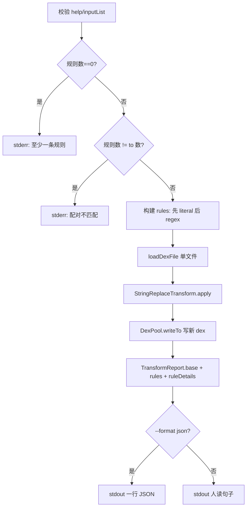

# 🛠️ ReplaceCommand（`baksmali replace`）

`ReplaceCommand` 是写回变换命令族的一员：读入一个 dex → 对其中的字符串常量施加一组有序替换规则 → 用 `DexPool` 序列化成新 dex，原文件不被修改。类声明 `baksmali/src/main/java/org/jf/baksmali/ReplaceCommand.java:68`，继承自 `DexTransformCommand`。

`@Parameters(commandDescription = "Batch-replace string constants (const-string and string encoded values).")` `ReplaceCommand.java:65`；`@ExtendedParameters(commandName = "replace")` `ReplaceCommand.java:67`。别名无（`commandAliases` 未声明）。

替换覆盖两类对象：`const-string`/`const-string/jumbo` 指令引用，以及字符串型 `encoded value`（如 `static final String` 初值）。规则按命令行顺序施加，每条字符串依次穿过所有规则，后一条看到前一条的输出 `baksmali/src/main/java/org/jf/baksmali/transform/StringReplaceTransform.java:121`。

## ⚡ 命令自身参数

来自 `ReplaceCommand.java`：

| 参数 | 说明 | 默认 | 必填 |
| --- | --- | --- | --- |
| `--from` | 字面量源串，按普通子串替换（不走正则）；可重复，与下一个 `--to` 配对 `ReplaceCommand.java:74` | 空 | 至少给一个 `--from` 或 `--regex` |
| `--regex` | 正则源模式，`--to` 可用 `$1` 等捕获组引用；可重复，与下一个 `--to` 配对 `ReplaceCommand.java:79` | 空 | 同上 |
| `--to` | 替换串；第 N 个 `--to` 与第 N 个 `--from`/`--regex`（按命令行顺序）配对 `ReplaceCommand.java:85` | 空 | 是，且数量须与源模式总数相等 |
| `-h`/`--help` | 打印用法 `ReplaceCommand.java:70` | `false` | 否 |

配对约定见 `ReplaceCommand.java:62`：源模式按"先全部 `--from`、再全部 `--regex`"的顺序排列，`--to` 在同一顺序上消费。`run()` 校验 `from.size()+regex.size()==to.size()`，不等则 stderr 报错中止 `ReplaceCommand.java:113`。

## 🔎 继承参数

### DexTransformCommand（输出与格式）

| 参数 | 说明 | 默认 |
| --- | --- | --- |
| `-o`/`--output` | 变换后 dex 的写出路径 `baksmali/src/main/java/org/jf/baksmali/DexTransformCommand.java:58` | `out.dex` |
| `--format` | `json`（默认，面向脚本/AI Agent）或 `text`（人读一句话）；经 `@ParametersDelegate OutputFormatArguments` 注入 `DexTransformCommand.java:63` | `json` |

### DexInputCommand（输入与 API）

| 参数 | 说明 | 默认 | 必填 |
| --- | --- | --- | --- |
| `file`（位置参数） | dex/apk/oat/odex；多 dex 容器可用 `app.apk/classes2.dex` 指定条目 `baksmali/src/main/java/org/jf/baksmali/DexInputCommand.java:61` | — | 是 |
| `-a`/`--api` | 数字 API 级别，决定 `Opcodes` 版本映射 `DexInputCommand.java:56` | `-1`（按文件头推断） | 否 |

`replace` 仅接受单个输入文件，`inputList.size()>1` 即报 "Too many files specified" `ReplaceCommand.java:101`。

## 🧬 主流程



核心三步：规则配对 `ReplaceCommand.java:123`、`loadDexFile` `ReplaceCommand.java:138`、`apply`+`writeResult` `ReplaceCommand.java:140`。`ruleObject` 把每条规则的 `type`/`from`/`to` 落进 `ruleDetails` 数组，与实际施加的规则同序 `ReplaceCommand.java:149`。

## 📤 真实命令 → 输出示例

```bash
# 字面替换：URL 重定向
baksmali replace app.apk --from http://old.example --to http://new.example -o patched.dex
# 多条规则按顺序施加，后规则看前规则输出
baksmali replace app.apk --from DEBUG --to RELEASE --from v1 --to v2 -o patched.dex
# 正则替换，--to 用 $1 引用捕获组
baksmali replace app.apk --regex "key_[0-9]+" --to REDACTED -o patched.dex
```

默认 JSON 报告（`command`/`input`/`output` 由 `TransformReport.base` 播种 `baksmali/src/main/java/org/jf/baksmali/output/TransformReport.java:61`，追加 `rules` 计数与 `ruleDetails` 数组）：

```json
{"command":"replace","input":"app.apk","output":"patched.dex","rules":1,"ruleDetails":[{"type":"literal","from":"http://old.example","to":"http://new.example"}]}
```

多规则示例（一条 literal + 一条 regex，按命令行顺序先 literal 后 regex 配对）：

```json
{"command":"replace","input":"app.apk","output":"patched.dex","rules":2,"ruleDetails":[{"type":"literal","from":"DEBUG","to":"RELEASE"},{"type":"regex","from":"key_[0-9]+","to":"REDACTED"}]}
```

`--format text` 切回人读单行：

```text
Wrote patched.dex (1 replacement rule(s) applied).
```

`TransformReport.render` 在 JSON 模式下禁用 HTML 转义，URL/正则元字符原样保留 `TransformReport.java:77`。

## 🗺️ 源码要点

- `ReplaceCommand.java:107` — `ruleCount = from.size()+regex.size()`，为零即报错。
- `ReplaceCommand.java:126` — 先消费 `--from`（literal），再消费 `--regex`，`toIndex` 递增。
- `ReplaceCommand.java:140` — `new StringReplaceTransform(rules).apply(dexFile)` 产出不可变重写视图。
- `StringReplaceTransform.java:99` — `Rule.apply`：regex 走 `Matcher.replaceAll`，literal 走 `String.replace`（空 `from` 直接返回原串）。
- `StringReplaceTransform.java:135` — `apply` 注入自定义 `InstructionRewriter` 与 `EncodedValueRewriter`，因为 dexlib2 rewriter 框架对字符串引用是透传，需自行重建 `ImmutableInstruction21c`/`31c` 与 `ImmutableStringEncodedValue`。

## 延伸阅读

- [baksmali 变换命令（CLI 速查）](../../../cli/transform.md)
- [写回变换指南](../../../guide/transform.md)
- TransformReport 输出约定
