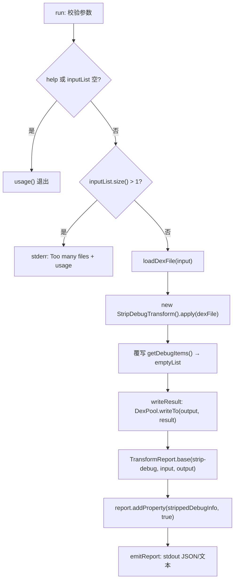

# 🛠️ baksmali strip-debug

`baksmali strip-debug` 是一条**写回变换**命令：读入一个 dex/apk，遍历每个方法实现，把 `getDebugItems()` 替换为空序列，再用 `DexPool` 序列化成新 dex。原文件不被修改，可执行字节码（指令、寄存器、try/catch）原样保留——被剥掉的只是调试元数据。

dex 的 debug item 承载源码行号、局部变量名/类型/作用域、以及出现在堆栈轨迹里的参数名。移除它们既能让 dex 变小，又能挫败「按行号对齐源码」「按 `.local` 还原变量语义」这类顺手逆向，是发布混淆流水线里的常见一环。命令注册于 `StripDebugCommand.java:54-57`（`commandName = "strip-debug"`），核心变换逻辑在 `StripDebugTransform.java`。

## 🔎 命令定位

| 维度 | 说明 |
|---|---|
| 类型 | 写回变换（产出新 dex + stdout 报告） |
| 父类 | `DexTransformCommand` → `DexInputCommand` |
| 核心变换 | `StripDebugTransform`（`MethodImplementationRewriter` 覆写 `getDebugItems()`） |
| 自有参数 | 仅 `-h/-?/--help`，无业务开关——剥离是无条件全量 |
| 报告 | 成功输出一行 JSON（默认）或人读文本（`--format text`） |
| 失败模式 | 未给输入文件、给出多个文件（报 `Too many files specified`） |

## ⚡ 参数表

### strip-debug 自有参数

| 参数 | 说明 | 默认 | 必填 | arity |
|---|---|---|---|---|
| `-h, -?, --help` | 打印用法信息 | false | 否 | 0（布尔） |

`StripDebugCommand` 没有任何业务参数——剥离范围是「整个 dex 的每个方法」，无法选择性保留（`StripDebugCommand.java:59-61`）。

### 继承自 DexTransformCommand / DexInputCommand

| 参数 | 说明 | 默认 | 必填 | 来源 |
|---|---|---|---|---|
| `<file>` | dex/apk/oat/odex 文件；apk 可带 `/classes2.dex` 选条目 | — | 是 | `DexInputCommand.java:61-65` |
| `-o, --output <file>` | 输出 dex 路径 | `out.dex` | 否 | `DexTransformCommand.java:58-61` |
| `--format <json\|text>` | 报告格式，默认 JSON（供 Agent/脚本消费） | json | 否 | `OutputFormatArguments.java:52-54` |
| `-a, --api <api>` | 文件的目标 API level，影响 opcode 解析 | -1（自动） | 否 | `DexInputCommand.java:56-59` |

> 输入是位置参数而非命名参数：`baksmali strip-debug app.apk -o stripped.dex`，`app.apk` 落入 `inputList`（`DexInputCommand.java:61-65`）。多于一个文件会在 `run()` 里被 `inputList.size() > 1` 判掉（`StripDebugCommand.java:73-77`）。

## 🧬 剥的是什么

`StripDebugTransform.apply`（`StripDebugTransform.java:65-84`）通过 `DexRewriter` + `RewriterModule.getMethodImplementationRewriter` 返回一个**惰性重写视图**——零拷贝、未触及的方法保持原样，只在被遍历时把 debug item 流替换为空：

| 丢弃的 debug item | 反汇编里消失的 smali 行 |
|---|---|
| `LineNumber` | `.line 42` |
| `LocalVariable` / `LocalVariableType` | `.local v0, name:Ljava/lang/String;` |
| `StartLocal`/`EndLocal`/`RestartLocal` | 变量作用域标注 |
| `PrologueEnd`/`EpilogueBegin` | 序言/尾声标记 |
| `SetSourceFile` | `.source "Foo.java"` |

可执行指令、寄存器数、try/catch、参数类型描述符**全部保留**——剥离后 dex 仍可正常运行，反编译产物只是不再带源码行号与变量名（`StripDebugTransform.java:50-57` 的 javadoc 说明：这是整体替换 `getDebugItems()`，而非逐条改写——逐条改写无法真正丢弃 item）。

## 📊 主流程



`run()` 主体在 `StripDebugCommand.java:67-88`：先做三道前置校验（`:68-77`：help/空输入 → usage；多文件 → stderr+usage），随后 `loadDexFile`（`:80`）→ `apply`（`:82`）→ `writeResult`（`:83`）→ 构造并发出报告（`:85-87`）。

## 📤 真实命令与输出示例

### 1. 基本用法（默认 JSON 报告）

```bash
baksmali strip-debug app.apk -o stripped.dex
```

stdout（默认 JSON）：

```json
{"command":"strip-debug","input":"app.apk","output":"stripped.dex","strippedDebugInfo":true}
```

`command`/`input`/`output` 三字段由 `TransformReport.base` 注入（`output/TransformReport.java:60-67`），`strippedDebugInfo:true` 是 strip-debug 特有字段（`StripDebugCommand.java:86`）。

### 2. 从 apk 选取指定 dex 条目剥离

```bash
baksmali strip-debug "app.apk/classes2.dex" -o stripped2.dex
```

```json
{"command":"strip-debug","input":"app.apk/classes2.dex","output":"stripped2.dex","strippedDebugInfo":true}
```

### 3. 多 dex 流水线（先 replace 后 strip-debug）

```bash
baksmali replace app.apk --from http://old.example --to http://new.example -o step2.dex
baksmali strip-debug step2.dex -o final.dex
```

```json
{"command":"strip-debug","input":"step2.dex","output":"final.dex","strippedDebugInfo":true}
```

### 4. 人读文本模式

```bash
baksmali strip-debug app.apk -o stripped.dex --format text
```

```text
Wrote stripped.dex (debug info stripped).
```

> 人读句子由 `StripDebugCommand.java:87` 直接拼出：`"Wrote " + output + " (debug info stripped)."`，与 JSON 字段同源生成、不会漂移（`output/TransformReport.java:74-81`）。

## 🗺️ 源码要点

- `StripDebugCommand.java:54-57` — `@Parameters(commandDescription=...)` + `@ExtendedParameters(commandName="strip-debug")`，注解驱动的命令注册。
- `StripDebugCommand.java:73-77` — 多文件保护：transform 命令一律单输入，多了直接 stderr 退出。
- `StripDebugCommand.java:82-83` — `apply` 与 `writeResult` 紧挨调用：`DexPool.writeTo` 求值时才真正触发惰性重写，debug item 在此刻被丢弃。
- `StripDebugCommand.java:85-87` — 报告由公共 `TransformReport.base` 拼接特有字段 `strippedDebugInfo`，再按 `--format` 渲染。
- `StripDebugTransform.java:66-82` — 覆写 `MethodImplementationRewriter.rewrite` 返回匿名 `RewrittenMethodImplementation`，其 `getDebugItems()` 恒返回 `Collections.emptyList()`——整体替换，而非逐条改写。
- `StripDebugTransform.java:83` — `DexRewriter(module).getDexFileRewriter().rewrite(in)`：返回的是**惰性视图**，未触及类/方法零开销，写出时才遍历。

## 延伸阅读

- [写回变换总览（CLI）](../../../cli/transform.md)
- [写回变换指南](../../../guide/transform) — strip-debug 在多步混淆流水线里的位置
- [dex-transform 技能](https://github.com/android-security-engineer/smali-skills/blob/master/skills/dex-transform) — unlock/replace/strip-debug/patch/callgraph 的实战组合
- DexTransformCommand 公共基类
- TransformReport 报告格式
