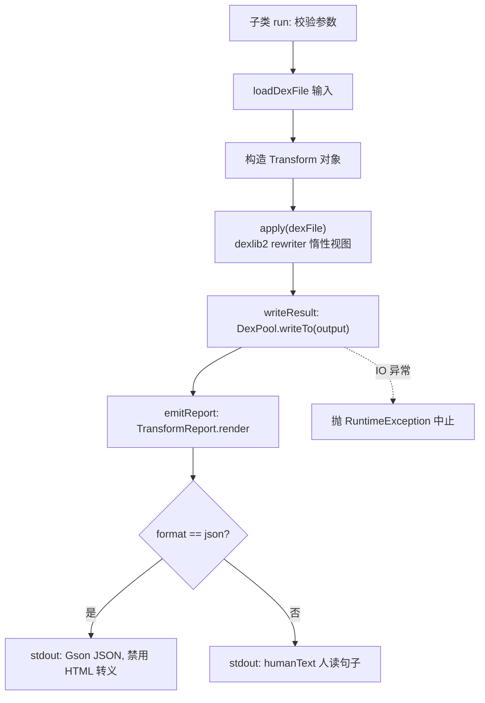

# 🛠️ DexTransformCommand

`DexTransformCommand` 是 baksmali **写回变换**命令族的抽象基类，位于 `DexTransformCommand.java:56`。它不直接对应某个子命令，而是为 `unlock` / `replace` / `strip-debug` / `patch` 四条子命令统一提供：输出路径参数 `-o/--output`、格式开关 `--format`、序列化辅助 `writeResult()`、报告渲染 `emitReport()`。子类只需实现 `run()` 中的「变换」本身。

读入 dex → 应用 dexlib2 rewriter 变换 → 用 `DexPool` 序列化新 dex → stdout 打印一行报告。**原文件不被修改。**

## 🔎 命令定位

| 维度 | 说明 |
|---|---|
| 类型 | 抽象基类（`abstract`，不可直接调用） |
| 继承链 | `DexTransformCommand` → `DexInputCommand` → `Command` |
| 直接子类 | `UnlockCommand` `ReplaceCommand` `StripDebugCommand` `PatchCommand` |
| 共同产物 | 新 dex 文件 + stdout 一行报告（默认 JSON，`--format text` 切人读文本） |
| 报告构建 | `TransformReport.base()` 播种公共字段，子类追加统计字段 |

## ⚡ 基类自有参数

`DexTransformCommand` 自身只声明一个参数，并通过 `@ParametersDelegate` 复用格式参数：

| 参数 | 说明 | 默认 | 来源 |
|---|---|---|---|
| `-o, --output <file>` | 变换后 dex 的写出路径 | `out.dex` | `DexTransformCommand.java:58-61` |
| `--format <json\|text>` | 报告输出格式，默认 JSON（供 Agent/脚本） | `json` | `OutputFormatArguments.java:52-54`（`@ParametersDelegate` 注入，`:63-64`） |

继承自 `DexInputCommand` 的通用参数（所有子命令都可用）：

| 参数 | 说明 | 默认 | 来源 |
|---|---|---|---|
| `<file>` | dex/apk/oat/odex 文件；apk 可带 `/classes2.dex` 选条目 | — | `DexInputCommand.java:61-65` |
| `-a, --api <api>` | 文件目标 API level | `-1`（自动） | `DexInputCommand.java:56-59` |

## 🧬 四条子命令与各自参数

下表汇总四个子命令的注册注解与自有参数（参数均经 `@Parameter` 声明）：

| 子命令 | commandName | commandDescription | 自有参数 | 变换实现 |
|---|---|---|---|---|
| `unlock` | `unlock` (`UnlockCommand.java:64-65`) | 批量修改访问标志：publicize 与/或 definalize 每个类/方法/字段 | `--public` `--no-final` `--help` | `AccessFlagTransform` |
| `replace` | `replace` (`ReplaceCommand.java:66-67`) | 批量替换字符串常量（const-string 与 string 编码值） | `--from` `--regex` `--to` `--help` | `StringReplaceTransform` |
| `strip-debug` | `strip-debug` (`StripDebugCommand.java:55-56`) | 清除每个方法的全部调试信息（行号/局部变量/参数名） | `--help` | `StripDebugTransform` |
| `patch` | `patch` (`PatchCommand.java:64-65`) | 强制匹配的方法立即返回定值 | `--class` `--method` `--return` `--help` | `ForceReturnTransform` |

### 各子命令参数细节

| 参数 | 所属 | 说明 | 默认/必填 |
|---|---|---|---|
| `--public` | unlock | 清除 `private/protected` 并置 `public` | false；与 `--no-final` 同时缺省时两者都开 |
| `--no-final` | unlock | 清除 `final` | false |
| `--from <text>` | replace | 字面源串，可重复；与下一条 `--to` 配对 | — |
| `--regex <pattern>` | replace | 正则源模式，`--to` 可用 `$1` 引用捕获组 | — |
| `--to <text>` | replace | 替换串，第 N 个 `--to` 配第 N 个 `--from`/`--regex` | — |
| `--class <regex>` | patch | 匹配定义类描述符的正则 | 任意类；与 `--method` 至少给一 |
| `--method <regex>` | patch | 匹配方法名的正则 | 任意方法 |
| `--return <value>` | patch | `void`/`true`/`false`/`0`/`1`/`null` | **必填** |

## 📤 主流程



基类 `writeResult()`（`DexTransformCommand.java:73-79`）调用 `DexPool.writeTo(output, dexFile)` 将 rewriter 返回的惰性视图序列化为 dex；IO 异常被包成 `RuntimeException` 抛出。`emitReport()`（`:87-89`）按 `OutputFormatArguments.isJson()` 在 JSON 与人读文本间二选一，**两者由同一次调用产出**，保证不会漂移。

## 📊 真实命令与输出示例

### 1. unlock — 默认同时 publicize + definalize

```bash
baksmali unlock app.apk -o unlocked.dex
```

```json
{"command":"unlock","input":"app.apk","output":"unlocked.dex","publicized":true,"definalized":true}
```

### 2. replace — 多条规则按序施加

```bash
baksmali replace app.apk --from http://old.example --to http://new.example -o patched.dex
```

JSON 报告含 `rules`（数量）与 `ruleDetails`（数组，每条 `type`/`from`/`to`），HTML 转义已禁用：

```json
{"command":"replace","input":"app.apk","output":"patched.dex","rules":1,"ruleDetails":[{"type":"literal","from":"http://old.example","to":"http://new.example"}]}
```

### 3. strip-debug — 清除调试信息

```bash
baksmali strip-debug app.apk -o stripped.dex
```

```json
{"command":"strip-debug","input":"app.apk","output":"stripped.dex","strippedDebugInfo":true}
```

### 4. patch — 强制方法返回定值

```bash
baksmali patch app.apk --method 'isPremium' --return true -o patched.dex
```

```json
{"command":"patch","input":"app.apk","output":"patched.dex","matched":1,"return":"true","methodFilter":"isPremium"}
```

### 5. 人读文本模式（任意子命令加 `--format text`）

```text
Wrote unlocked.dex (publicized, definalized).
```

## 🗺️ 源码要点

- `DexTransformCommand.java:58-61` — `-o/--output` 默认 `out.dex`，`@ExtendedParameter(argumentNames="file")`。
- `DexTransformCommand.java:63-64` — `@ParametersDelegate OutputFormatArguments` 复用 `--format` 开关。
- `DexTransformCommand.java:73-79` — `writeResult` 用 `DexPool` 池化写出，IO 失败抛 `RuntimeException`。
- `DexTransformCommand.java:87-89` — `emitReport` 委托 `TransformReport.render`，JSON/文本同源。
- `TransformReport.java:60-67` — `base()` 播种 `command`/`input`/`output` 三字段。
- `TransformReport.java:74-81` — `render()` 在 JSON 模式下 `disableHtmlEscaping()`，URL/正则元字符原样保留。
- `AccessFlagTransform.java:80-89` — `rewriteFlags` 做位运算：publicize 清 `PRIVATE|PROTECTED` 置 `PUBLIC`，definalize 清 `FINAL`。
- `AccessFlagTransform.java:96-138` — 通过 `DexRewriter`+`RewriterModule` 覆写 class/field/method 的 `getAccessFlags()`，返回惰性重写视图，未触及成员零拷贝。

## 延伸阅读

- [写回变换总览（CLI）](../../../cli/transform.md)
- [baksmali patch 命令详解](./patch.md)
- [dex-transform 技能](../../../skills/dex-transform) — unlock/replace/strip-debug/patch/callgraph 的实战组合
- [写回变换指南](../../../guide/transform)
