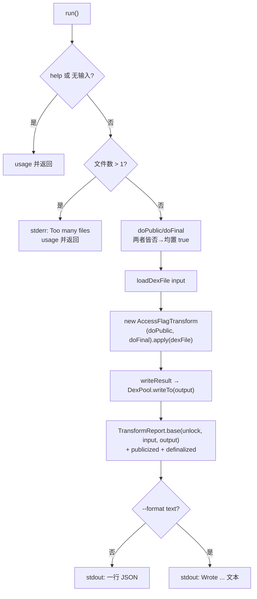

# 🔓 baksmali unlock

`baksmali unlock` 是**写回变换**命令组里最常用的一把「万能钥匙」：读入一个 dex，把每个类、方法、字段的访问标志批量改写——清掉 `private`/`protected` 改成 `public`、清掉 `final`——再序列化出一个**全新的 dex**。原文件不被改动。逆向工程中，这是让原本不可达的成员变得可调用、让被 `final` 封死的类可被继承的标准预处理步骤。

## 🛠️ 命令定位

- 命令名：`unlock`（`@ExtendedParameters(commandName)`，`UnlockCommand.java:64-65`）
- 描述（`@Parameters(commandDescription)`）：`Batch-modify access flags: publicize and/or definalize every class, method and field.`（`UnlockCommand.java:63`）
- 继承链：`UnlockCommand` → `DexTransformCommand` → `DexInputCommand` → `Command`
- 两项独立修改，**默认全开**（不带任何选择标志时同时施加 publicize + definalize，见 `UnlockCommand.java:96-102`）：
  - `--public`：清 `private`/`protected`，置 `public`，令隐藏成员可被外部调用。
  - `--no-final`：清 `final`，令类可被继承、方法可被重写。
- 实际改写逻辑由纯模型类 `AccessFlagTransform` 承担（`transform/AccessFlagTransform.java:63-139`），命令类只做 I/O 编排。

## 📊 参数

### 自有参数

| 参数 | 说明 | 默认 | 必填 | arity |
| --- | --- | --- | --- | --- |
| `--public` | publicize：清 `private`/`protected` 并置 `public`（`UnlockCommand.java:72-74`） | false | 否 | 布尔 |
| `--no-final` | definalize：清 `final` 修饰符（`UnlockCommand.java:76-78`） | false | 否 | 布尔 |
| `-h`,`-?`,`--help` | 显示用法信息（`UnlockCommand.java:68-70`） | false | 否 | 布尔 |

> 两项都缺省时，`run()` 会把两者都强制设为 `true`——即「什么都不指定 = 解锁全部」。

### 继承自 `DexTransformCommand`（`DexTransformCommand.java:58-64`）

| 参数 | 说明 | 默认 | 必填 | arity |
| --- | --- | --- | --- | --- |
| `-o`,`--output` | 写出的 dex 路径 | `out.dex` | 否 | 1 |
| `--format` | 报告格式：`json`（默认）或 `text`（`OutputFormatArguments.java:52-54`） | `json` | 否 | 1 |

### 继承自 `DexInputCommand`（`DexInputCommand.java:56-65`）

| 参数 | 说明 | 默认 | 必填 | arity |
| --- | --- | --- | --- | --- |
| `file`（位置参数） | dex/apk/oat/odex；多 dex 容器可写 `app.apk/classes2.dex` | — | 是 | 列表（实际取首项，多于 1 个报错） |
| `-a`,`--api` | 文件的数字 API level，用于选择 opcode 集 | `-1`（自动） | 否 | 1 |

## ⚡ 典型用法

```bash
baksmali unlock app.apk -o unlocked.dex              # publicize + definalize（默认）
baksmali unlock app.apk --public   -o public.dex     # 仅 publicize
baksmali unlock app.apk --no-final -o open.dex       # 仅 definalize
baksmali unlock "app.apk/classes2.dex" -o c2.dex     # 指定多 dex 中的某条目
```

### 真实输出示例

成功时 stdout 输出**一行 JSON 报告**（字段来源：`TransformReport.base()` 注入 `command`/`input`/`output`，`UnlockCommand.java:110-112` 追加 `publicized`/`definalized`）：

```json
{"command":"unlock","input":"app.apk","output":"unlocked.dex","publicized":true,"definalized":true}
```

仅 publicize（`--public`，`definalized` 为 `false`）：

```json
{"command":"unlock","input":"app.apk","output":"public.dex","publicized":true,"definalized":false}
```

`--format text` 切回人读文本（`UnlockCommand.java:113-117` 拼接）：

```text
Wrote open.dex (definalized).
```

## 🧬 主流程



## 🔎 源码要点

- **标志算术与 dex 管道分离**：`AccessFlagTransform.rewriteFlags(int)`（`AccessFlagTransform.java:80-89`）做纯位运算——`publicize` 时 `flags &= ~(PRIVATE|PROTECTED); flags |= PUBLIC`；`definalize` 时 `flags &= ~FINAL`。可脱离 I/O 单元测试。
- **惰性重写**：`apply()` 通过 `DexRewriter` + `RewriterModule`（`AccessFlagTransform.java:96-138`）返回一个**懒求值视图**，分别覆写 `ClassDef`/`Field`/`Method` 的 `getAccessFlags()`，直到 `DexPool.writeTo` 才真正物化。
- **报告与文本同源**：`emitReport()`（`DexTransformCommand.java:87-89`）按 `--format` 在 JSON 与人读文本间切换，二者由同一次调用产生，永不漂移；JSON 用 `disableHtmlEscaping`（`TransformReport.java:76-78`），URL/正则元字符原样保留。
- **不修改原文件**：`loadDexFile()`（`DexInputCommand.java:111-173`）只读，输出恒走 `DexPool.writeTo(output)`，原 dex 字节不受影响。

## 🗺️ 延伸阅读

- [变换命令总览](../../../cli/transform) —— unlock/replace/strip-debug/patch 的对照速查
- [写回变换工作流](../../../guide/transform) —— 组合多个变换命令的完整流程
- [baksmali list classes](./list-classes) —— 解锁后用此命令核对访问标志是否已变 `public`
- [baksmali patch](./patch) —— 解锁后常配合 patch 强制方法返回定值
