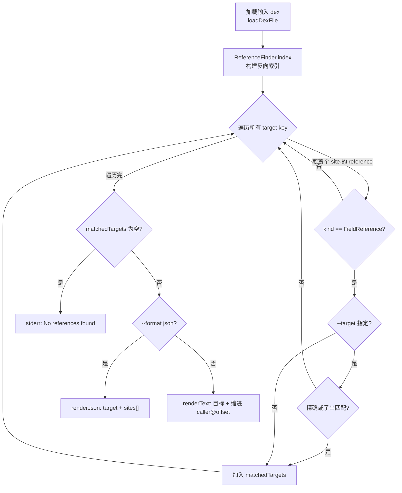

# 🛠️ baksmali xref field-refs

`baksmali xref field-refs` 是 `xref` 命令组的子命令之一，用于**反向**查询：给定一个字段描述符，列出 dex 中所有访问该字段的方法及其字节偏移。它是正向 `list fields` 的补充——`list` 告诉你「有哪些字段」，`field-refs` 告诉你「谁在读写这个字段」。

匹配的引用类型是 `FieldReference`，即所有 `iget*/iput*/sget*/sput*` 指令解码出的字段引用（见 `XrefFieldRefsCommand.java:59-62`）。

```bash
java -jar baksmali.jar xref field-refs app.apk --target "Lcom/Example;->count:I"
```

## 🔎 参数

`field-refs` 自身只声明命令元信息，实际参数继承自父类 `XrefTargetCommand`（`--target`、`--format`、`-h`）与 `DexInputCommand`（输入文件、`--api`）。

| 参数 | 说明 | 默认 | 必填 |
|------|------|------|------|
| `file`（位置参数） | dex/apk/oat/odex 文件，apk 可加 `/classes2.dex` 指定条目（`DexInputCommand.java:61-65`） | — | 是 |
| `--target` | 待查字段描述符，如 `Lcom/Config;->token:Ljava/lang/String;`；省略则列出全部字段目标及引用点（`XrefTargetCommand.java:78-81`） | `null` | 否 |
| `--format` | `json`（默认，机器可读）或 `text`（人读）（`OutputFormatArguments.java:52-54`） | `json` | 否 |
| `-a, --api` | 输入文件的数字 API level，用于选择 opcode 集（`DexInputCommand.java:56-59`） | `-1`（自动） | 否 |
| `-h, -?, --help` | 显示用法 | `false` | 否 |

命令别名：`field-ref`、`f`（`XrefFieldRefsCommand.java:51-53`）。一次只能指定一个输入文件，多文件会报错退出（`XrefTargetCommand.java:100-104`）。

## 🧬 命令主流程



核心逻辑全在父类 `XrefTargetCommand.run()`（`XrefTargetCommand.java:94-149`）。`field-refs` 仅通过 `referenceClass()` 返回 `FieldReference.class`（`XrefFieldRefsCommand.java:59-62`）来过滤目标，把通用流程约束到字段这一种引用类型上。

匹配规则（`XrefTargetCommand.java:155-157`）：先精确比较格式化后的引用描述符，不中再对每个已知目标做 `contains` 子串匹配。因此 `count:I` 能命中 `Lcom/Example;->count:I`。

## 📤 真实命令与输出示例

以下用仓库自带的 `accessorTest.dex` fixture 演示。该 dex 含大量合成访问器，内部类通过 `access$xxx` 方法读写外部类私有字段——正是 `field-refs` 的典型战场。

```bash
# 查询某字段的全部访问点（默认 JSON）
java -jar baksmali.jar xref field-refs \
  dexlib2/src/test/resources/accessorTest.dex \
  --target "Lcom/Example;->count:I"
```

默认 JSON 输出，每条记录含 `target` 与 `sites` 数组，每个 site 给出 `caller`（访问者方法）与 `offset`（指令在方法体内的字节偏移，hex）：

```json
[
  {
    "target": "Lcom/Example;->count:I",
    "sites": [
      { "caller": "Lcom/Example;->inc()V", "offset": "0x2" },
      { "caller": "Lcom/Example$Helper;->read()I", "offset": "0x6" }
    ]
  }
]
```

加 `--format text` 得到人读对照（先目标，再缩进列出引用点）：

```bash
java -jar baksmali.jar xref field-refs \
  dexlib2/src/test/resources/accessorTest.dex \
  --target "Lcom/Example;->count:I" --format text
```

```
Lcom/Example;->count:I
  Lcom/Example;->inc()V @ offset 0x2
  Lcom/Example$Helper;->read()I @ offset 0x6
```

子串匹配：只记得字段名时，省略定义类与类型也可命中：

```bash
java -jar baksmali.jar xref field-refs app.apk --target "count:I"
```

省略 `--target`，列出该 dex 中**所有**字段目标及其引用点（适合做全量字段访问图普查）：

```bash
java -jar baksmali.jar xref field-refs app.apk --format text | head
```

无命中时 JSON 输出 `[]`，text 模式在 stderr 报 `No references found matching: <target>`（`XrefTargetCommand.java:133-141`）。

## 📊 典型场景

| 场景 | 命令片段 |
|------|----------|
| 找敏感字段的写入点 | `xref field-refs --target "Lcom/Config;->token:Ljava/lang/String;"` |
| 排查私有字段的合成访问器 | `xref field-refs --target "access\$001"` 子串匹配所有 `access$xxx` |
| 普查某模块全部字段访问 | `xref field-refs module.apk --format text` |
| 定位反序列化赋值 | `xref field-refs --target "Lcom/Model;->id:I"` 后看 caller 是否 `readInt` 之后 |

## 🗺️ 源码要点

- 命令注册：`XrefCommand.setupCommand()` 把 `XrefFieldRefsCommand` 挂到 `xref` 组下（`XrefCommand.java:74`）。
- 唯一抽象方法 `referenceClass()` 返回 `FieldReference.class`，决定目标过滤（`XrefFieldRefsCommand.java:59-62`）。
- 反向索引由 `ReferenceFinder.index(dexFile.getClasses())` 一次性构建，遍历 `ClassDef → Method → Instruction` 收集 `(target → sites)` 映射（`XrefTargetCommand.java:110-111`）。
- `offset` 为 `site.codeOffset` 的十六进制，可直接定位反汇编输出中的具体行（`XrefTargetCommand.java:163-164`、`178-179`）。

## 延伸阅读

- [baksmali xref 命令总览](../../../cli/xref.md)
- dex-xref skill
- [xref callers（方法引用）](./xref-callers.md)
- [list fields（正向字段列举）](./list-fields.md)
