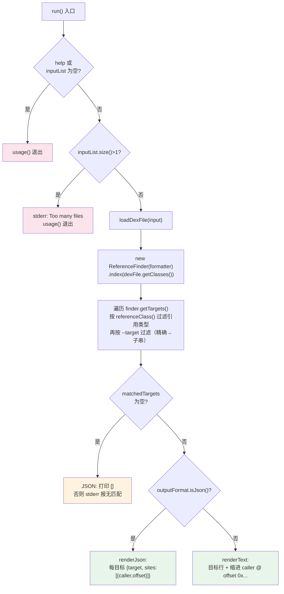

# 🧬 baksmali XrefTargetCommand

`XrefTargetCommand` 是 `baksmali xref` 三个具体子命令——`callers`、`field-refs`、`type-refs`——的**公共抽象基类**。它不直接注册为子命令，而是把"加载 dex → 建反向索引 → 按 `--target` 过滤 → 渲染 JSON/文本"的通用流程抽出来，每个子类只须实现 `referenceClass()` 指定自己关心的引用类型。是逆向分析中"谁引用了这个方法/字段/类型"查询的统一底座。

## 🛠️ 命令定位

- 命令组：`xref`（父类 `XrefCommand` 在 `setupCommand` 里注册三个子命令，见 `XrefCommand.java:70-76`）
- 自身类型：`abstract class`，**不可直接调用**；实例化为下表三者之一
- 继承链：`XrefTargetCommand` → `DexInputCommand` → `Command`
- 模板方法：`referenceClass()` 返回 `Class<? extends Reference>`，决定子命令只报告哪一类引用

| 具体子类 | commandName | 别名 | `referenceClass()` | `@Parameters(commandDescription)` |
| --- | --- | --- | --- | --- |
| `XrefCallersCommand` | `callers` | `caller`, `c` | `MethodReference` | Find methods that call a given target method. |
| `XrefFieldRefsCommand` | `field-refs` | `field-ref`, `f` | `FieldReference` | Find methods that access a given target field. |
| `XrefTypeRefsCommand` | `type-refs` | `type-ref`, `t` | `TypeReference` | Find methods that reference a given target type. |

源码：`baksmali/src/main/java/org/jf/baksmali/XrefTargetCommand.java:64`；三个子类分别见 `XrefCallersCommand.java:50-62`、`XrefFieldRefsCommand.java:50-62`、`XrefTypeRefsCommand.java:50-62`。

## 📊 参数

`XrefTargetCommand` 自身声明 `--target`、`--help`，并通过 `@ParametersDelegate` 委托 `OutputFormatArguments`（`--format`），再从父类 `DexInputCommand` 继承输入文件与 `--api`：

| 参数 | 说明 | 默认 | 必填 | arity | 来源 |
| --- | --- | --- | --- | --- | --- |
| `--target` | 要查找的引用目标描述符，如 `Lcom/Example;->foo()V`、`Lcom/Example;->count:I`、`Lcom/Example;`；先精确匹配，无命中则子串回退。省略则列出该子命令引用类型的**所有**目标及其引用点 | 无（列出全部） | 否 | 单值 | `XrefTargetCommand.java:78-81` |
| `--format` | 输出格式：`json`（默认，机器可读）或 `text`（人读）；未识别值回退 JSON | `json` | 否 | 单值 | `OutputFormatArguments.java:52-54` |
| `-a`, `--api` | dex 文件的数字 API level，用于选择 opcode 集 | `-1`（自动） | 否 | 单值 | `DexInputCommand.java:56-59` |
| `<file>` | dex/apk/oat/odex 文件；多 dex 容器可用 `app.apk/classes2.dex` 形式定位条目 | — | 是 | 可变 | `DexInputCommand.java:61-65` |
| `-h`, `-?`, `--help` | 显示用法 | `false` | 否 | flag | `XrefTargetCommand.java:66-68` |

## ⚡ 主流程

`run()` 在 `XrefTargetCommand.java:94-149` 实现，核心是"建索引 → 按引用类型与 `--target` 双重过滤 → 渲染"。子类只贡献 `referenceClass()`，其余完全复用。



### 🔎 关键源码要点

- **反向索引**：`ReferenceFinder.index()` 遍历 `ClassDef → Method → Instruction`，对每条 `ReferenceInstruction` 用 `BaksmaliFormatter.getReference()` 生成字符串 key，记录 `(caller, codeOffset)` 站点。见 `ReferenceFinder.java:88-99` 与 `indexMethod()` `:101-116`。`codeOffset` 按 `instruction.getCodeUnits()` 累加（`:114`），是**码单元**偏移（非字节）。
- **类型过滤**：`run()` 取每个目标首个站点的 `reference`，用 `kind.isInstance(ref)` 判断是否属于本子命令的引用类型（`XrefTargetCommand.java:123-126`）。`callers` 不会混入字段命中。
- **匹配策略**：`matches()` 先 `key.equals(target)` 精确匹配，失败再 `key.contains(target)` 子串回退（`:155-157`）。故 `--target "foo()V"` 能命中 `Lcom/Example;->foo()V`。
- **caller 描述符**：由 `formatter.getType(definingClass) + "->" + name(params)ret` 拼出（`ReferenceFinder.java:103-105`），与 smali 语法一致。
- **多文件约束**：`inputList.size() > 1` 直接报错退出（`:100-104`），`xref` 一次只查一个 dex。
- **空结果**：JSON 模式打印 `[]`，文本模式按 `target` 是否给定分别给出"无匹配"或"无引用"提示（`:133-141`）。

## 📤 真实命令与输出示例

用仓库自带 `accessorTest.dex` fixture（含合成访问器）。以下为 `callers` 子命令实例，`field-refs`/`type-refs` 仅换子命令名与 `--target` 描述符即可：

```bash
# 默认 JSON：谁调用了这个桥接方法
java -jar baksmali.jar xref callers \
  dexlib2/src/test/resources/accessorTest.dex \
  --target "Lorg/jf/dexlib2/AccessorTypes;->access\$072(Lorg/jf/dexlib2/AccessorTypes;I)Z"
```

实际输出（默认 JSON，单行紧凑）：

```json
[{"target":"Lorg/jf/dexlib2/AccessorTypes;->access$072(Lorg/jf/dexlib2/AccessorTypes;I)Z","sites":[{"caller":"Lorg/jf/dexlib2/AccessorTypes$Accessors;->boolean_and(Z)V","offset":"0x2"}]}]
```

人读文本对照（`--format text`）：

```
Lorg/jf/dexlib2/AccessorTypes;->access$072(Lorg/jf/dexlib2/AccessorTypes;I)Z
  Lorg/jf/dexlib2/AccessorTypes$Accessors;->boolean_and(Z)V @ offset 0x2
```

字段/类型引用的等价调用：

```bash
java -jar baksmali.jar xref field-refs app.apk --target "Lcom/Example;->count:I"
java -jar baksmali.jar xref type-refs  app.apk --target "Lcom/Example;"
# 省略 --target：列出该引用类型的全部目标及其引用点
java -jar baksmali.jar xref type-refs app.apk
```

`offset` 为引用指令在方法体内的 hex 偏移，可定位到反汇编输出的具体行。`renderJson` 见 `:169-190`，`renderText` 见 `:159-167`。

## 🗺️ 设计要点

- **模板方法模式**：基类定流程，子类定引用类型。新增一种引用查询（如 `string-refs`）只需继承并返回对应 `Reference` 子类，零重复代码。
- **JSON 优先**：默认 `--format json`，输出 `JsonOutput.toJsonArray(objects)`（`:189`），面向 AI Agent / 脚本直消费；`--format text` 为人读退路。
- **零拷贝 + 全量索引**：`loadDexFile` 得到 `DexBackedDexFile`（懒解析），但 `index()` 会遍历全部指令一次性建表，适合反复查询、不适合只查一次的大 dex。

## 延伸阅读

- baksmali xref（CLI 总览）
- [xref callers 子命令](./xref-callers.md) · [xref field-refs](./xref-fieldrefs.md) · [xref type-refs](./xref-typerefs.md)
- dex-xref Skill
- [ReferenceFinder 源码](./xref-target.md)（反向索引构建器）
- [DexInputCommand（输入加载）](./list-dex.md)
