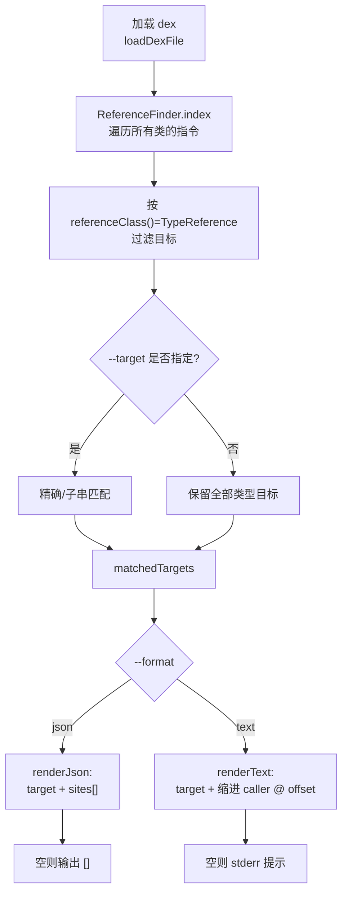

# 🛠️ baksmali xref type-refs

`baksmali xref type-refs` 是 `xref` 命令组的子命令，用于**反向**查询：给定一个目标类型（如 `Lcom/Sensitive;`），找出 dex 中所有引用它的位置——谁 `new-instance` 了它、谁对它 `check-cast`、谁把它用作方法/字段签名里的参数或返回类型。它是 `list`（正向列举）的逆向补充。

子命令本体只是一个轻量绑定（`XrefTypeRefsCommand.java:55`），把 `referenceClass()` 绑定到 `TypeReference.class`（`XrefTypeRefsCommand.java:60-63`）；真正的参数解析、索引构建与输出来自父类 `XrefTargetCommand` 与 `DexInputCommand`。

## 🔎 命令定位

| 属性 | 值 |
|------|-----|
| 全名 | `baksmali xref type-refs` |
| 别名 | `type-ref`、`t` |
| 父命令 | `xref`（`XrefCommand.java:60`） |
| 匹配引用类型 | `TypeReference`（`check-cast` / `new-instance` / `instance-of` / 方法与字段签名中的类型） |
| 输出默认格式 | JSON（机器可读，面向脚本/AI Agent） |

## 📊 参数

`type-refs` 自身不声明任何 `@Parameter`，参数全部继承自 `XrefTargetCommand` 与 `DexInputCommand`。

| 参数 | 来源 | 说明 | 默认 | 必填 |
|------|------|------|------|------|
| `file`（位置参数） | `DexInputCommand.java:61-65` | dex/apk/oat/odex 文件，apk/oat 多 dex 时可用 `app.apk/classes2.dex` 指定条目 | — | 是 |
| `--target` | `XrefTargetCommand.java:78-81` | 目标类型描述符（如 `Lcom/Example;`），精确优先、子串回退；省略则列出所有类型目标 | 全部 | 否 |
| `--format` | `OutputFormatArguments.java:52-54`（`@ParametersDelegate`） | `json`（默认）或 `text`；非 `text` 一律回退 JSON | `json` | 否 |
| `-a, --api` | `DexInputCommand.java:56-59` | 文件的数字 API 级别，用于选择 opcode 集 | `-1`（自动） | 否 |
| `-h, -?, --help` | `XrefTargetCommand.java:66-68` | 显示用法 | `false` | 否 |

`--target` 匹配规则见 `XrefTargetCommand.java:155-157`：先 `equals` 精确匹配，再 `contains` 子串回退，方便只记得片段时定位。

## 🧬 命令主流程



核心在 `XrefTargetCommand.java:94-149` 的 `run()`：先用 `BaksmaliFormatter` 构造 `ReferenceFinder` 并 `index(dexFile.getClasses())`（`:110-111`），随后遍历 `finder.getTargets()`，用 `kind.isInstance(ref)` 过滤出类型引用（`:113-131`）。`ReferenceFinder` 在 `ReferenceFinder.java:88-115` 的 `index()` 中遍历每个方法的每条 `ReferenceInstruction`，用 `formatter.getReference(reference)` 生成字符串 key，把 `(caller, codeOffset, reference)` 收进 `ReferenceSite`（`ReferenceFinder.java:62-71`）。

## ⚡ 典型用法与输出示例

```bash
# 找出所有实例化 Lcom/Sensitive; 的位置（默认 JSON）
java -jar baksmali.jar xref type-refs app.apk --target "Lcom/Sensitive;"

# 人读文本
java -jar baksmali.jar xref type-refs app.apk --target "Lcom/Sensitive;" --format text

# 子串匹配：只记得类名片段
java -jar baksmali.jar xref type-refs app.apk --target "Sensitive"

# 不指定 --target：列出 dex 中所有被引用的类型及其引用点
java -jar baksmali.jar xref type-refs app.apk

# 多 dex apk 指定条目
java -jar baksmali.jar xref type-refs app.apk/classes2.dex --target "Lcom/Example;"
```

JSON 输出（默认），每个条目含 `target` 与 `sites[]`，每个 site 含 `caller`（调用方法描述符）与 `offset`（指令在方法体内的字节偏移，hex）：

```json
[
  {
    "target": "Lcom/Example;",
    "sites": [
      {"caller": "Lcom/App;->onCreate()V", "offset": "0x4"},
      {"caller": "Lcom/App;->start(Landroid/content/Context;)V", "offset": "0x10"}
    ]
  }
]
```

人读文本对照，先输出目标，再缩进列出每个引用点：

```
Lcom/Example;
  Lcom/App;->onCreate()V @ offset 0x4
  Lcom/App;->start(Landroid/content/Context;)V @ offset 0x10
```

`offset` 即引用指令在方法体内的字节偏移（十六进制），可与 `baksmali disassemble` 输出的行号对齐定位。无匹配时 JSON 输出 `[]`，文本模式向 stderr 报 `No references found matching: <target>`（`XrefTargetCommand.java:133-141`）。

## 📤 源码要点

- `XrefTypeRefsCommand.java:51-54` — `@Parameters(commandDescription)` 与 `@ExtendedParameters(commandName="type-refs", commandAliases={"type-ref","t"})`。
- `XrefTypeRefsCommand.java:60-63` — 唯一逻辑：`referenceClass()` 返回 `TypeReference.class`，决定父类只保留类型引用目标。
- `XrefTargetCommand.java:78-81` — `--target` 参数声明，省略时列出全部。
- `XrefTargetCommand.java:109-111` — 用 `BaksmaliFormatter` 格式化目标 key。
- `XrefTargetCommand.java:124` — `kind.isInstance(ref)` 按引用类型过滤。
- `XrefTargetCommand.java:169-190` — `renderJson`：`JsonOutput.toJsonArray(objects)` 输出。
- `ReferenceFinder.java:103-115` — `caller` 拼装与 `codeOffset += instruction.getCodeUnits()` 累加。
- `DexInputCommand.java:111-173` — `loadDexFile` 处理单/多 dex 容器与条目选择。

## 延伸阅读

- [xref 命令总览](../../../cli/xref.md) — `callers` / `field-refs` / `type-refs` 三兄弟对照与真实 fixture 示例。
- [list 命令](../../../cli/list.md) — 正向列举 dex 内容，与 `xref` 反向查询互补。
- [search 命令](../../../cli/search.md) — 按字符串/正则正向检索，与反向 xref 配合定位。
- [disassemble 命令](../../../cli/disassemble.md) — 用 `offset` 反查具体反汇编行。
- [dex-xref 技能](../../../skills/dex-xref) — 以技能形式封装的反向引用工作流。
