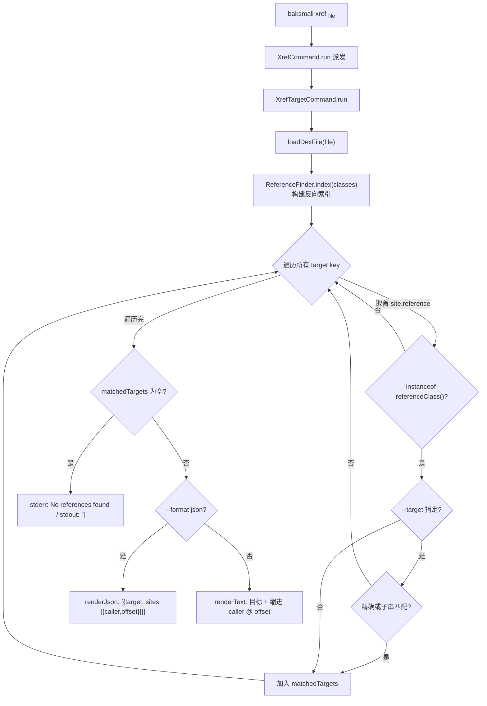

# 🛠️ baksmali xref

`baksmali xref` 是一个**命令组**（command group），不直接执行查询，而是把请求路由到三个子命令之一。它解决「谁引用了这个目标」的反向查询问题，是正向 `list` 命令的镜像：`list` 告诉你「有哪些方法/字段/类型」，`xref` 告诉你「谁在调用/访问/引用它」。

组本身只声明 `-h/--help`，自身无可执行参数（`XrefCommand.java:62-64`）；三个子命令共享父类 `XrefTargetCommand` 的参数与主流程，仅靠 `referenceClass()` 区分引用类型。

## 🔎 子命令

| 子命令 | 别名 | 匹配引用类型 | 典型指令 |
|--------|------|--------------|----------|
| `callers` | `caller`, `c` | `MethodReference`（`XrefCallersCommand.java:59-62`） | `invoke-*` |
| `field-refs` | `field-ref`, `f` | `FieldReference`（`XrefFieldRefsCommand.java:59-62`） | `iget*/iput*/sget*/sput*` |
| `type-refs` | `type-ref`, `t` | `TypeReference`（`XrefTypeRefsCommand.java:59-62`） | `check-cast/new-instance/instance-of` 等 |

注册发生在 `XrefCommand.setupCommand()`（`XrefCommand.java:70-76`），用 `ExtendedCommands.addExtendedCommand` 把三个子命令挂到 `xref` 组下。组本身的 `run()` 只做派发：无子命令或带 `-h` 时打印 usage，否则取出解析出的子命令对象并调其 `run()`（`XrefCommand.java:78-87`）。

## 📊 通用参数

子命令自身只声明命令元信息（`commandName`/`commandAliases`/`commandDescription`），可执行参数全部继承自 `XrefTargetCommand`（`--target`、`--format`、`-h`）与 `DexInputCommand`（输入文件、`--api`）。

| 参数 | 说明 | 默认 | 必填 |
|------|------|------|------|
| `file`（位置参数） | dex/apk/oat/odex 文件，apk/oat 可用 `/classes2.dex` 指定条目（`DexInputCommand.java:61-65`） | — | 是 |
| `--target` | 待查目标描述符，省略则列出该子命令引用类型的全部目标及引用点（`XrefTargetCommand.java:78-81`） | `null` | 否 |
| `--format` | `json`（默认，机器可读，AI/脚本消费）或 `text`（人读）（`OutputFormatArguments.java:52-54`） | `json` | 否 |
| `-a, --api` | 输入文件的数字 API level，选择 opcode 集（`DexInputCommand.java:56-59`） | `-1`（自动） | 否 |
| `-h, -?, --help` | 显示用法（`XrefTargetCommand.java:66-68`） | `false` | 否 |

约束：一次只接受一个输入文件，多文件会 stderr 报 `Too many files specified` 后退出（`XrefTargetCommand.java:100-104`）。

## 🧬 命令主流程



反向索引由 `ReferenceFinder.index(dexFile.getClasses())` 一次性构建：遍历 `ClassDef → Method → Instruction`，对每条 `ReferenceInstruction` 用 `BaksmaliFormatter` 把 reference 格式化成字符串 key，按 `(key → List<ReferenceSite>)` 收集（`ReferenceFinder.java:88-116`）。`ReferenceSite` 记录 `caller`（格式化后的方法描述符）与 `codeOffset`（指令在方法体内的字节偏移，code units）（`ReferenceFinder.java:62-72`）。

匹配规则（`XrefTargetCommand.java:155-157`）：先精确比较格式化后的引用描述符，不中再对每个已知目标做 `contains` 子串匹配。故 `foo()V` 能命中 `Lcom/Example;->foo()V`。

## 📤 真实命令与输出示例

用仓库自带的 `accessorTest.dex` fixture 演示——内部类通过合成方法 `access$xxx` 调用外部类私有成员：

```bash
# 谁调用了这个方法（默认 JSON）
java -jar baksmali.jar xref callers \
  dexlib2/src/test/resources/accessorTest.dex \
  --target "Lorg/jf/dexlib2/AccessorTypes;->access\$072(Lorg/jf/dexlib2/AccessorTypes;I)Z"
```

实际输出（默认 JSON），每条含 `target` 与 `sites` 数组，每个 site 给出 `caller` 与 `offset`（hex）：

```json
[{"target":"Lorg/jf/dexlib2/AccessorTypes;->access$072(Lorg/jf/dexlib2/AccessorTypes;I)Z","sites":[{"caller":"Lorg/jf/dexlib2/AccessorTypes$Accessors;->boolean_and(Z)V","offset":"0x2"}]}]
```

加 `--format text` 得人读对照：

```
Lorg/jf/dexlib2/AccessorTypes;->access$072(Lorg/jf/dexlib2/AccessorTypes;I)Z
  Lorg/jf/dexlib2/AccessorTypes$Accessors;->boolean_and(Z)V @ offset 0x2
```

字段访问（`iget/iput/sget/sput`）与类型引用（`check-cast/new-instance/instance-of`）查询形式相同，只是子命令名与 `--target` 描述符形态不同：

```bash
java -jar baksmali.jar xref field-refs app.apk --target "Lcom/Config;->token:Ljava/lang/String;"
java -jar baksmali.jar xref type-refs  app.apk --target "Lcom/Sensitive;"
```

子串匹配（忘掉完整签名时）与省略 `--target` 列全量目标的用法见各子命令页。无命中时 JSON 输出 `[]`，text 模式 stderr 报 `No references found matching: <target>`（`XrefTargetCommand.java:133-141`）。

## ⚡ 典型场景

| 场景 | 命令片段 |
|------|----------|
| 找某 Activity 的所有启动点 | `xref callers --target "->startActivity("` |
| 找构造函数的所有调用者 | `xref callers --target "-><init>()V"` |
| 找某 SDK 方法的集成点 | `xref callers --target "Lcom/sdk/;->track("` |
| 找敏感字段的写入点 | `xref field-refs --target "Lcom/Config;->token:Ljava/lang/String;"` |
| 找某类的所有实例化 | `xref type-refs --target "Lcom/Sensitive;"` |
| 普查某 dex 全部方法引用 | `xref callers module.apk` |

## 🗺️ 源码要点

- 组注册与派发：`XrefCommand.java:57-60`（`@Parameters`/`@ExtendedParameters`）、`70-76`（注册三子命令）、`78-87`（`run` 派发）。
- 子命令模板方法：抽象方法 `referenceClass()`（`XrefTargetCommand.java:92`）决定目标过滤；`XrefCallersCommand`/`XrefFieldRefsCommand`/`XrefTypeRefsCommand` 各仅 4 行实现。
- 反向索引核心：`ReferenceFinder.index`（`ReferenceFinder.java:88-99`）与 `indexMethod`（`101-116`）。
- 输出渲染：`renderText`（`XrefTargetCommand.java:159-167`）、`renderJson`（`169-190`），JSON 经 `JsonOutput` 输出为 JSON 数组。

## 延伸阅读

- [baksmali xref 命令总览（CLI 视角）](../../../cli/xref.md)
- dex-xref skill
- [xref callers（方法引用）](./xref-callers.md)
- [xref field-refs（字段引用）](./xref-fieldrefs.md)
- [xref type-refs（类型引用）](./xref-typerefs.md)
- [list references（正向引用列举）](./list-references.md)
- [search（按指令序列正向搜索，与 xref 互补）](../../../cli/search.md)
