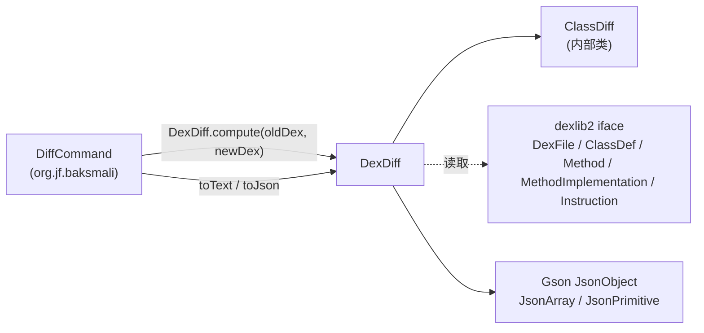
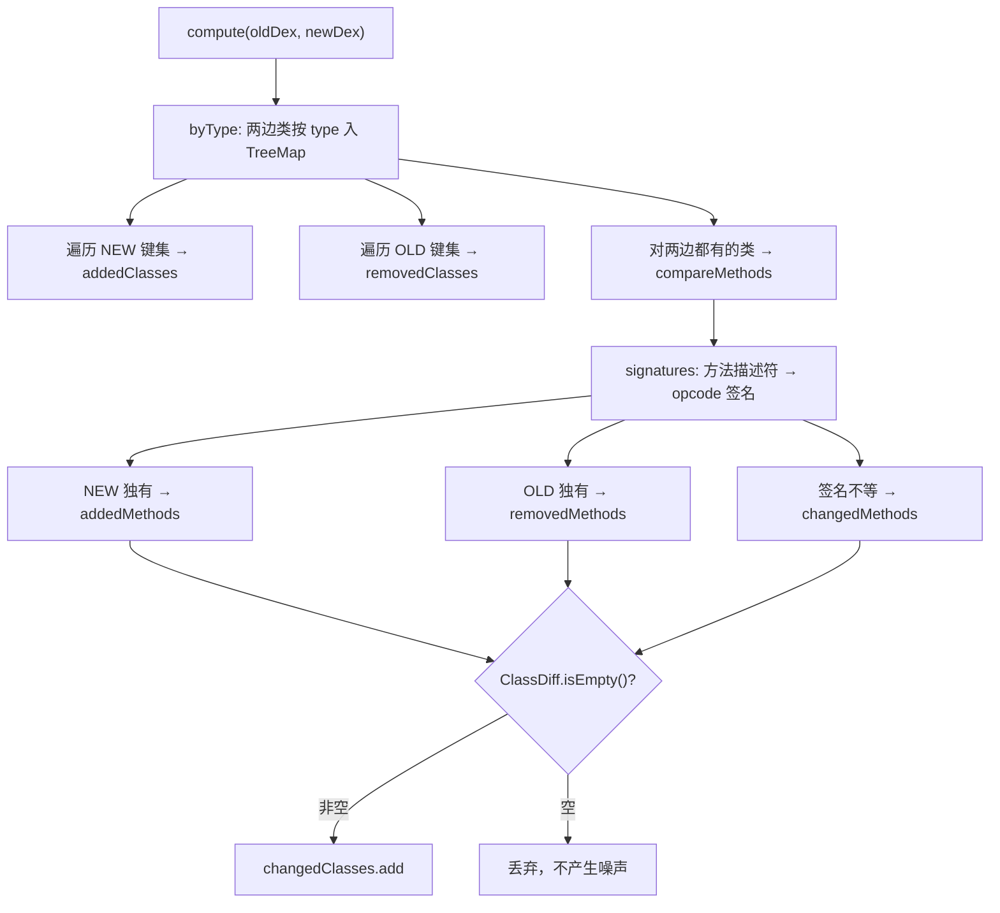

# 🧬 baksmali diff — 语义差异

`org.jf.baksmali.diff` 是 baksmali 的**语义差异模型层**：给定两个 `DexFile`，按类型描述符与方法规范描述符比对，报告新增/删除/改动的类与方法。它不读文件、不写 dex、不反汇编——纯内存模型；文件加载、参数校验、退出码门控与打印由 `DiffCommand` 承担。

判定「改动」的依据是 **opcode 序列**——寄存器分配、调试信息（`.line`/`.local`/参数名）、指令偏移均被**刻意忽略**，所以「同源重编译产生的噪声」不会被误报为语义变化（`DexDiff.java:51-64`）。这正是它区别于 `diff <(baksmali d a) <(baksmali d b)` 纯文本对比的地方。

## 📊 类清单

| 类 | 职责 |
| --- | --- |
| `DexDiff` | 差异本体：`compute` 计算、`addedClasses`/`removedClasses`/`changedClasses` 查询、`toText`/`toJson` 导出 |
| `DexDiff.ClassDiff` | 单类的方法级差异：`addedMethods`/`removedMethods`/`changedMethods` 三个列表 |

包内仅一个顶层类 + 一个静态内部类，是 baksmali 体积最小的子包之一。无接口、无继承层级、无静态状态，可直接作为库复用。

## 🧬 类间关系



`DexDiff` 只依赖 `dexlib2` 的只读 `iface`（`DexFile`/`ClassDef`/`Method`/`MethodImplementation`/`Instruction`）与 `com.google.gson`，不反向依赖 baksmali 的任何命令或适配器类（`DexDiff.java:34-49`）。`ClassDiff` 是 `public static` 内部类，外部可经 `getChangedClasses()` 拿到并自行遍历。

## ⚡ 典型协作流程

`DiffCommand.run()` 的编排路径（`DiffCommand.java:77-106`）：

1. 校验 `inputList` 恰为 2 项，否则 `usage()` 退出（`DiffCommand.java:78-86`）
2. `loadDexFile(inputList.get(0))` 载入 OLD，复用基类 `dexFile` 字段（`DiffCommand.java:89-90`）
3. `loadDexFile(inputList.get(1))` 第二次独立加载 NEW（`DiffCommand.java:92-93`）
4. `DexDiff.compute(oldDex, newDex)` 计算差异（`DiffCommand.java:95`）
5. 按 `OutputFormatArguments` 选 `toJson`/`toText` 打印（`DiffCommand.java:97-101`）
6. `diff.isEmpty()` 为假则 `System.exit(1)`，用于脚本门控（`DiffCommand.java:103-105`）

`compute` 内部三步（`DexDiff.java:93-123`）：



## 🔎 源码要点

- **类比对**：`byType` 把 `dexFile.getClasses()` 装入 `TreeMap<String, ClassDef>`，键为类型描述符，天然字典序，输出确定性（`DexDiff.java:152-158`）
- **方法描述符**：`descriptor` 拼接 `definingClass + "->" + name + "(" + params + ")" + returnType`，即 `Lcls;->name(params)ret`，与调用图/交叉引用描述符规范一致（`DexDiff.java:190-198`）
- **opcode 签名**：`opcodeSignature` 逗号拼接 `instruction.getOpcode().name` 序列；无方法体的 abstract/native 记为空串 `""`，与有方法体的非空串不等，故「abstract↔concrete」也算改动（`DexDiff.java:174-187`）
- **判定逻辑**：NEW 独有→`addedMethods`，OLD 独有→`removedMethods`，签名不等→`changedMethods`（`DexDiff.java:135-147`）
- **噪声过滤**：寄存器重排、`.line`/`.local` 变更、指令偏移都不进签名，故仅重编译不改语义的方法不会被标记为 changed（`DexDiff.java:51-64`）
- **JSON**：`JsonObject` 手工组装 `{"addedClasses":[...],"removedClasses":[...],"changedClasses":[{"type":..,"addedMethods":[..],"removedMethods":[..],"changedMethods":[..]}]}`，经 `GsonBuilder().disableHtmlEscaping()` 序列化（`DexDiff.java:257-273`）
- **文本**：`+ class`/`- class`/`~ class` 三段，`~ class` 下挂缩进的 `+`/`-`/`~` 方法行；空差异输出 `No semantic differences.`（`DexDiff.java:225-249`）
- **I/O 隔离**：模型类无 `main`/无文件读取，所有打印与 `System.exit` 落在 `DiffCommand`，便于在 `dex-diff`/`dex-roundtrip` 技能中作为库直接复用（`DexDiff.java:62-64`）

## 🛠️ 模型 API 速查

| 方法 | 签名 | 说明 |
| --- | --- | --- |
| `compute` | `static DexDiff compute(DexFile oldDex, DexFile newDex)` | 计算语义差异（`DexDiff.java:93-123`） |
| `getAddedClasses` | `List<String> getAddedClasses()` | NEW 独有的类（拷贝）（`DexDiff.java:202-204`） |
| `getRemovedClasses` | `List<String> getRemovedClasses()` | OLD 独有的类（拷贝）（`DexDiff.java:206-208`） |
| `getChangedClasses` | `List<ClassDiff> getChangedClasses()` | 两边都有但方法有变的类（拷贝）（`DexDiff.java:210-212`） |
| `isEmpty` | `boolean isEmpty()` | 三类全空即语义一致（`DexDiff.java:215-217`） |
| `toText` | `String toText()` | 人读文本报告（`DexDiff.java:225-249`） |
| `toJson` | `String toJson()` | 机器可读 JSON（`DexDiff.java:257-273`） |
| `ClassDiff.isEmpty` | `boolean isEmpty()` | 三方法列表全空，用于过滤无变化类（`DexDiff.java:84-86`） |

## 📤 真实命令 → 输出示例

```bash
# 默认 JSON；两个位置参数 OLD NEW
baksmali diff old.apk new.apk
# 人读文本
baksmali diff old.apk new.apk --format text
# 退出码门控：仅当语义一致才继续
baksmali diff orig.dex patched.dex && echo "未改动" || echo "有差异"
```

用仓库自带 fixture 对比——`accessorTest.dex`（含 `AccessorTypes` 两个类）与 `LocalTest/classes.dex`（含 `LLocalTest;`），类集合完全不重叠：

```bash
baksmali diff \
  dexlib2/src/test/resources/accessorTest.dex \
  baksmali/src/test/resources/LocalTest/classes.dex
```

JSON 输出（`DexDiff.toJson()`，`DexDiff.java:257-273`）：

```json
{
  "addedClasses": ["LLocalTest;"],
  "removedClasses": [
    "Lorg/jf/dexlib2/AccessorTypes$Accessors;",
    "Lorg/jf/dexlib2/AccessorTypes;"
  ],
  "changedClasses": []
}
```

`addedClasses` 是 NEW 独有，`removedClasses` 是 OLD 独有，`changedClasses` 为空（两边无同名类，自然无「同名但方法体变化」）。退出码 `1`。文本对照（`--format text`）：

```
+ class LLocalTest;
- class Lorg/jf/dexlib2/AccessorTypes$Accessors;
- class Lorg/jf/dexlib2/AccessorTypes;
```

无差异时文本输出 `No semantic differences.`（`DexDiff.java:226-228`），JSON 输出三个空数组，退出码 `0`。

## 延伸阅读

- [baksmali diff 命令](./commands/diff.md) — 命令级参数与场景速查
- CLI 总览：diff — 用户向导
- [baksmali graph — 调用图](./graph.md) — 同为纯模型层的姊妹子包
- dex-diff 技能 — Agent 调用 diff 的工作流
- dex-roundtrip 技能 — 往返一致性验证（与 diff 互补）
