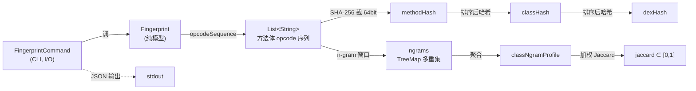

# 🧬 fingerprint — opcode 指纹

`org.jf.baksmali.fingerprint` 是 baksmali 的「**重命名不变指纹**」内核。它从方法体的 opcode 序列（与名字、引用无关）派生指纹，使混淆器改名/换寄存器号后指纹保持不变，从而支撑**库识别**与**克隆/抄袭检测**。

模型层纯函数、无 I/O：上层的 [`baksmali fingerprint`](../../cli/fingerprint.md) 命令（`FingerprintCommand`）负责读 dex、调本包、产出 JSON。

## 📊 两种指纹风味

| 风味 | 用途 | 入口方法 | 匹配语义 |
|------|------|----------|----------|
| 精确哈希 | 精确去重/比对 | `methodHash` / `classHash` / `dexHash` | 完全相同才算匹配 |
| n-gram 轮廓 | 模糊识别 | `classNgramProfile` + `jaccard` | 相似度 ∈ [0,1]，容忍局部改动 |

精确哈希 = SHA-256 截断为 **16 位 hex（64 bit）**（`Fingerprint.java:220`）；类/ dex 哈希把下层哈希**排序后**再哈希，使其与成员声明顺序、类名、成员名都无关（`Fingerprint.java:103`、`Fingerprint.java:116`）。

## 🗺️ 类清单

包内仅一个核心类，外加命令层适配：

| 类 | 职责 |
|----|------|
| `Fingerprint` | 纯模型：opcode 序列、精确哈希、n-gram、Jaccard，无状态、全静态 |
| `FingerprintCommand`（`org.jf.baksmali`） | CLI 子命令 `fingerprint`/`fp`：读 dex→调 `Fingerprint`→JSON/text（`FingerprintCommand.java:81`） |

## 🧬 类间关系



## ⚡ 核心方法

| 方法 | 签名 | 行号 | 说明 |
|------|------|------|------|
| `opcodeSequence` | `Method → List<String>` | `Fingerprint.java:79` | 方法体 opcode 名按程序序；abstract/native 为空 |
| `methodHash` | `Method → String` | `Fingerprint.java:94` | opcode 序列拼接后短哈希 |
| `classHash` | `ClassDef → String` | `Fingerprint.java:103` | 方法哈希**排序**后再哈希（顺序无关） |
| `dexHash` | `DexFile → String` | `Fingerprint.java:116` | 类哈希排序后再哈希 |
| `ngrams` | `(List<String>, int n) → Map<String,Integer>` | `Fingerprint.java:133` | 滑窗 n-gram 多重集；体短于 n 时整体作单 gram |
| `classNgramProfile` | `(ClassDef, int n) → Map<String,Integer>` | `Fingerprint.java:162` | 类内所有方法 n-gram 袋相加 |
| `jaccard` | `(Map,Map) → double` | `Fingerprint.java:176` | 加权 Jaccard `Σmin/Σmax`，双侧空袋 = 1.0 |
| `shortHash` | `String → String` | `Fingerprint.java:220` | SHA-256 前 8 字节 → 16 hex |

## 📤 命令参数（`@Parameter`）

来自 `FingerprintCommand.java`，命令别名 `fp`：

| 参数 | 类型 | 默认 | 说明 |
|------|------|------|------|
| `--level` | String | `class` | 列举粒度：`method`/`class`/`dex`（`:90`） |
| `--class` | String | null | 限定类描述符正则（`:94`） |
| `--match` | String | null | 参考 dex/apk，进入匹配模式（`:102`） |
| `--ngram` | int | `3` | n-gram 窗口大小（`:98`） |
| `--min-similarity` | double | `0.85` | 报告阈值 [0,1]（`:106`） |
| `--format` | String | `json` | `json`（默认）或 `text`（`OutputFormatArguments.java:52`） |
| `-h/--help` | boolean | false | 显示用法（`:83`） |

## 🔎 典型协作流程

**列举模式（默认）**——`runList` 按 `--level` 分派（`FingerprintCommand.java:137`）：

```bash
java -jar baksmali.jar fingerprint app.apk --level method --format json
```

真实输出（`accessorTest.dex` fixture，类级）：

```json
[
  {"class":"Lorg/jf/dexlib2/AccessorTypes$Accessors;","fingerprint":"63594b5c1fa69ee4"},
  {"class":"Lorg/jf/dexlib2/AccessorTypes;","fingerprint":"206203f971d55342"}
]
```

**匹配模式（`--match`）**——`runMatch` 先对参考 dex 每个类算 `classNgramProfile` 一次，再对输入每个类算轮廓、与所有参考类算 `jaccard`、取最高分，≥ `--min-similarity` 才报告（`FingerprintCommand.java:214`）：

```bash
java -jar baksmali.jar fingerprint app.apk --match okhttp.dex --min-similarity 0.9 --ngram 4
```

输出形如（默认 JSON）：

```json
[{"class":"La/b/c;","match":"Lokhttp3/Interceptor;","similarity":0.927}]
```

## 🛠️ 设计要点

- **重命名不变**：指纹只取 `instruction.getOpcode().name`（`Fingerprint.java:84`），不碰类型/字段/方法名。
- **顺序无关**：类/ dex 哈希对子哈希 `Collections.sort` 后再哈希（`:108`、`:121`），类内方法重排不影响。
- **空袋约定**：`jaccard` 双侧空袋 = `1.0`；匹配模式跳过空轮廓类（接口/空类，`:235`）。
- **短路安全**：体短于 n 时整体作单 n-gram，确保小方法仍可指纹（`:141`）。
- **纯模型**：`Fingerprint` 无状态、无静态可变字段、无 I/O，便于在 MCP/diff 等其他上层复用。

## 延伸阅读

- [baksmali 命令总览](../../cli/)
- dex-fingerprint skill
- [baksmali 包总览](../util.md)
