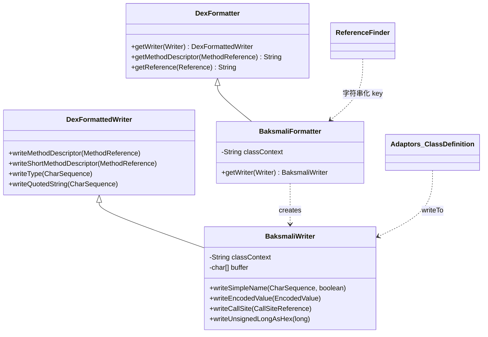
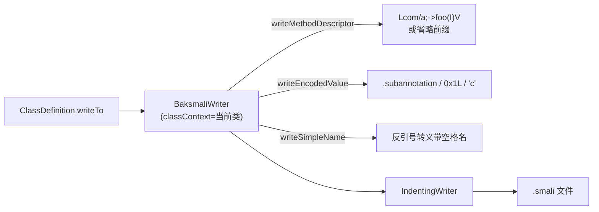

# 🛠️ baksmali formatter — 文本格式化

`org.jf.baksmali.formatter` 是 baksmali 把 dex 对象渲染成 smali 文本的**最后一层**：所有 `Adaptors/` 中的 `MethodItem`、`ClassDefinition`、`FieldDefinition` 最终都通过这里的 `BaksmaliWriter` 落盘。它继承自 dexlib2 的 `DexFormattedWriter`，只做两件 dexlib2 不负责的事——**带空格的简单名反引号转义**，以及**当前类上下文中的引用省略**。

## 📊 包定位

- **输入**：来自 `dexbacked`/`immutable` 的 `Reference`、`EncodedValue`、类型字符串。
- **输出**：写入 `IndentingWriter` 的 smali 文本片段（描述符、注解、数组、数值字面量）。
- **复用**：`DexFormatter`（dexlib2）提供无上下文的字符串化方法；本包只在写入流场景下覆盖其行为。

它**不**做指令反汇编、不做寄存器分析——那些在 `Adaptors/` 与 `analysis/` 里。formatter 只管「把这个 `MethodReference` 写成 `Lcom/a;->foo(I)V`」。

## 🧬 类清单

| 类 | 职责 |
|----|------|
| `BaksmaliFormatter` | `DexFormatter` 子类；工厂角色，按 `classContext` 产出带上下文的 `BaksmaliWriter`，供 `xref`/`list` 等查询命令字符串化引用。 |
| `BaksmaliWriter` | `DexFormattedWriter` 子类；实际写入流，覆盖类型/简单名/方法/字段描述符的写法，并补齐 `EncodedValue` 全类型渲染与数字格式化。 |

## 🔎 类间关系



## ⚡ 两个核心覆盖点

### 1. 当前类引用省略

`Baksmali.java` 反汇编时传入 `options.implicitReferences ? classDef.getType() : null`（`Baksmali.java:158`）。当 `classContext` 等于引用的 `definingClass` 时，方法/字段描述符走 `writeShortMethodDescriptor` / `writeShortFieldDescriptor`——即省略 `Lcom/a;->` 前缀，只写 `foo(I)V`（`BaksmaliWriter.java:80-94`）。这让同一类内部的 `invoke-direct` 等指令更短、更易读。

### 2. 带空格的简单名转义

Dalvik 的 [simple name](https://source.android.com/devices/tech/dalvik/dex-format#simplename) 允许含空格（JVM 不允许）。`writeClass` 沿 `/` 切分类名段，逐段调 `writeSimpleName`；若该段含 `SPACE_SEPARATOR` 字符，则用反引号包裹（`BaksmaliWriter.java:96-167`）：

```
L`My Class`;->`hello world`()V
```

这是 baksmali 能正确往返含空格类/成员名的关键，smali 词法器同样识别反引号定界。

## 📤 写入流方法一览

| 方法 | 作用 | 源码 |
|------|------|------|
| `writeEncodedValue(EncodedValue)` | 按 `ValueType` 分派渲染所有 17 种编码值 | `BaksmaliWriter.java:169` |
| `writeIntegralValue(long, Character)` | 整数写成 `0x..`，带类型后缀 `t/s/L` | `BaksmaliWriter.java:234` |
| `writeCharEncodedValue` | 可见 ASCII 单引号、转义、否则 `\uXXXX` | `BaksmaliWriter.java:247` |
| `writeAnnotation` | `.subannotation ... .end subannotation` 块 | `BaksmaliWriter.java:299` |
| `writeArray` | `{` 换行缩进、逗号分隔、`}` 闭合 | `BaksmaliWriter.java:324` |
| `writeEnum` | `.enum ` 前缀 + 字段描述符 | `BaksmaliWriter.java:291` |
| `writeCallSite` | `name("methodName", proto, extra...)@linker` | `BaksmaliWriter.java:347` |
| `writeUnsignedLongAsHex` / `writeSignedLongAsDec` | 复用 24 字符 `buffer` 反向填充，避免 `String.format` | `BaksmaliWriter.java:371` |
| `writeSignedIntOrLongTo` | 负数 `-0x..`，超 int 范围加 `L` 后缀 | `BaksmaliWriter.java:435` |
| `indent` / `deindent` | 委托底层 `IndentingWriter` 调整 4 空格缩进 | `BaksmaliWriter.java:451` |

> 数字格式化刻意走 `char[] buffer` 手写循环而非 `Long.toHexString`，是为了在百万级指令反汇编下减少临时字符串分配——formatter 是热路径。

## 🗺️ 典型协作流程



主反汇编链路（`Baksmali.java:133-160`）：每个类新建一个 `BaksmaliWriter` 包裹 `BufferedWriter`（UTF-8），再交给 `ClassDefinition.writeTo` 递归调用各 `MethodItem.writeTo(BaksmaliWriter)`。

查询命令链路（`ReferenceFinder.java:74-110`）：持有无上下文的 `BaksmaliFormatter`，用 `formatter.getReference(reference)` / `formatter.getType(...)` 把引用字符串化为 map key，**不**落盘，只产出 `ReferenceSite.caller` 与 `target` 字符串。

## ⚡ 命令到输出的真实示例

`xref callers` 的 `caller`/`target` 字段即由 `BaksmaliFormatter` 字符串化：

```bash
java -jar baksmali.jar xref callers app.apk --target "Lcom/Example;->foo()V"
```

```json
[{"target":"Lcom/Example;->foo()V","sites":[{"caller":"Lcom/App;->onCreate()V","offset":"0x4"}]}]
```

反汇编落盘时，`implicitReferences` 默认开启，类内自引用被省略为短描述符（`disassemble` 真实输出片段）：

```text
.method public static method2(IJLjava/lang/String;)V
    .registers 10
    .param p0, "blah!..."    # I
```

## 源码要点

- `BaksmaliFormatter.java:43-49`：双构造器，`classContext=null` 即退化为基类行为。
- `BaksmaliWriter.java:75-78`：若传入非 `IndentingWriter`，自动包一层——保证 `indent()` 转型安全。
- `BaksmaliWriter.java:108`：用 `Character.SPACE_SEPARATOR`（Unicode 类别）判定空格，覆盖全角空格等。
- `BaksmaliWriter.java:361-364`：`writeCallSite` 强制 linker 必须是 `invoke-static`，否则抛 `IllegalArgumentException`。
- `BaksmaliWriter.java:62`：`char[24]` 恰好容纳 64-bit long 的 16 位 hex + 符号，被多个数字方法共享。

## 延伸阅读

- [baksmali disassemble 命令](../../cli/disassemble.md)
- [baksmali xref 命令](../../cli/xref.md)
- [baksmali list 命令](../../cli/list.md)
- [dexlib2 formatter 包](../dexlib2/formatter.md)
- [baksmali Adaptors 包](./adaptors.md)
