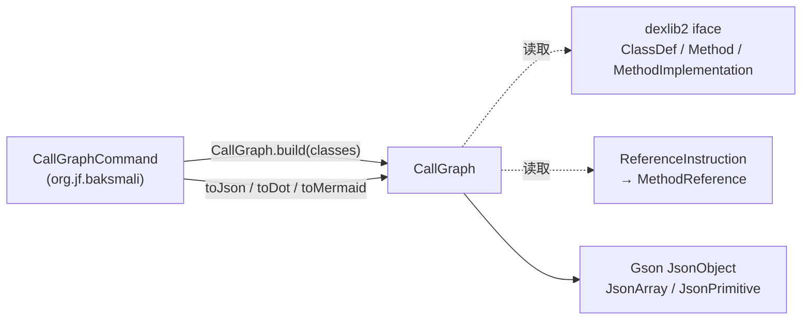
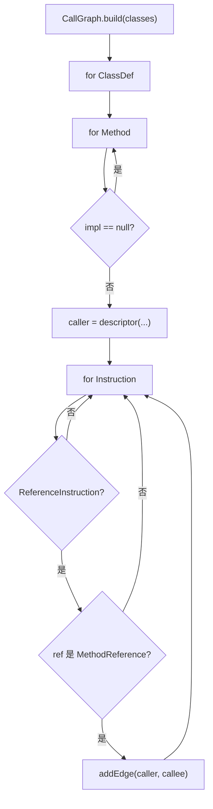
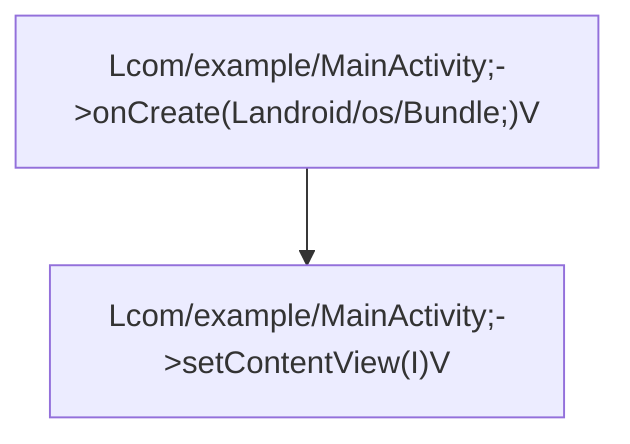

# 🗺️ baksmali graph — 调用图

`org.jf.baksmali.graph` 是 baksmali 的**调用图模型层**：给定一组 `ClassDef`，遍历每个方法体，把每条 invoke 指令记录为有向边 `caller -> callee`，再以 JSON / Graphviz DOT / Mermaid 三种格式导出。它不读文件、不写 dex、不反汇编——纯内存模型；I/O 与命令编排由 `CallGraphCommand` 承担。

节点是规范 smali 方法描述符 `Lpkg/Cls;->name(参数)返回类型`，只有真正作为 caller 或 callee 出现的方法才成为节点，故图规模与可达调用结构成正比，而非与方法表总量成正比（`CallGraph.java:54-68`）。

## 📊 类清单

| 类 | 职责 |
| --- | --- |
| `CallGraph` | 调用图本体：`build` 构建、`getNodes`/`getCallees`/`edgeCount` 查询、`toJson`/`toDot`/`toMermaid` 导出 |

包内仅一个类，是 baksmali 体积最小的子包之一。无接口、无继承层级、无静态状态。

## 🧬 类间关系



`CallGraph` 只依赖 `dexlib2` 的只读 `iface`（`ClassDef`/`Method`/`MethodImplementation`/`ReferenceInstruction`/`MethodReference`）与 `com.google.gson`，不反向依赖 baksmali 的任何命令或适配器类（`CallGraph.java:34-52`）。

## ⚡ 典型协作流程

`CallGraphCommand.run()` 的编排路径（`CallGraphCommand.java:86-126`）：

1. `loadDexFile` 载入 dex/apk/oat，取 `dexFile.getClasses()`
2. 若给 `--class <regex>`，用 `Pattern.matcher(...).find()` 过滤 caller 类（`CallGraphCommand.java:101-110`）
3. `CallGraph.build(classes)` 构图
4. 按 `--graph-format`（大小写不敏感）选 `toJson`/`toDot`/`toMermaid` 打印

`build` 内部三重循环 `ClassDef → Method → Instruction`：跳过无方法体的 `Method`（`impl == null`），对每条 `ReferenceInstruction` 取其 `Reference`，仅当是 `MethodReference` 时加边（`CallGraph.java:79-103`）。



## 🔎 源码要点

- **数据结构**：`Map<String, Set<String>> edges`（`LinkedHashMap` + `LinkedHashSet`）+ `Set<String> nodes`（`LinkedHashSet`），节点与边均保持**首次出现顺序**，输出可复现（`CallGraph.java:71-73`）
- **加边**：`addEdge` 同时把 caller/callee 加入 `nodes`，故被 `--class` 排除的类作为 callee 仍会以节点身份出现，保留子系统对外调用关系（`CallGraph.java:105-109`）
- **描述符**：`descriptor(...)` 拼接 `definingClass + "->" + name + "(" + params + ")" + returnType`，与方法描述符规范一致（`CallGraph.java:114-125`）
- **JSON**：`JsonObject` 手工组装 `{"nodes":[...],"edges":[{"from","to"}]}`，经 `GsonBuilder().disableHtmlEscaping()` 序列化，避免 `<`/`>` 被转义（`CallGraph.java:154-174`）
- **DOT**：`digraph callgraph { ... }`，节点标签用 `quoteDot` 转义 `\` 与 `"`（`CallGraph.java:180-191`，`210-212`）
- **Mermaid**：`graph TD`，节点用 `n<hex>`（`label.hashCode() & 0x7fffffff`）作稳定 id、完整描述符作显示标签，`"` 替换为 `'`（`CallGraph.java:197-221`）
- **I/O 隔离**：模型类无 `main`/无文件读取，所有打印落在 `CallGraphCommand`，便于在 `dex-transform` 等技能中作为库直接复用（`CallGraph.java:66-68`）

## 📤 真实命令与输出示例

```bash
# 默认 JSON，适合管道给 jq 或 AI Agent
baksmali callgraph app.apk
# Graphviz DOT，重定向后用 dot 渲染
baksmali callgraph app.apk --graph-format dot > cg.dot
# Mermaid 流程图，可直接粘进 Markdown
baksmali callgraph app.apk --graph-format mermaid
# 只导出某子系统的调用图
baksmali callgraph app.apk --class 'Lcom/example/.*'
```

JSON 结构 `{"nodes":[...],"edges":[{"from":"...","to":"..."}]}`，节点用规范 smali 描述符：

```json
{
  "nodes": [
    "Lcom/example/MainActivity;->onCreate(Landroid/os/Bundle;)V",
    "Lcom/example/MainActivity;->setContentView(I)V",
    "Lcom/example/Net;->fetch(Ljava/lang/String;)Ljava/lang/String;"
  ],
  "edges": [
    {"from":"Lcom/example/MainActivity;->onCreate(Landroid/os/Bundle;)V","to":"Lcom/example/MainActivity;->setContentView(I)V"},
    {"from":"Lcom/example/Net;->fetch(Ljava/lang/String;)Ljava/lang/String;","to":"Lcom/example/Net;->parse(Ljava/lang/String;)V"}
  ]
}
```

Mermaid 输出用 `n<hex>` 作稳定节点 id、完整描述符作标签：



## 🛠️ 模型 API 速查

| 方法 | 签名 | 说明 |
| --- | --- | --- |
| `build` | `static CallGraph build(Iterable<? extends ClassDef>)` | 从类集构图（`CallGraph.java:78-103`） |
| `descriptor` | `static String descriptor(String, String, List<? extends CharSequence>, String)` | 拼 `Lcls;->name(params)ret`（`CallGraph.java:114-125`） |
| `getNodes` | `List<String> getNodes()` | 全部节点，首次出现顺序（`CallGraph.java:128-131`） |
| `getCallees` | `List<String> getCallees(String caller)` | caller 的直接被调用方（`CallGraph.java:134-138`） |
| `edgeCount` | `int edgeCount()` | 有向边总数（`CallGraph.java:141-147`） |
| `toJson` | `String toJson()` | `{"nodes":[...],"edges":[{"from","to"}]}`（`CallGraph.java:154-174`） |
| `toDot` | `String toDot()` | Graphviz DOT（`CallGraph.java:180-191`） |
| `toMermaid` | `String toMermaid()` | Mermaid flowchart（`CallGraph.java:197-207`） |

## 延伸阅读

- [baksmali callgraph 命令](./commands/callgraph.md)
- CLI 总览：transform 与 callgraph
- dex-transform 技能（含 callgraph 用法）
