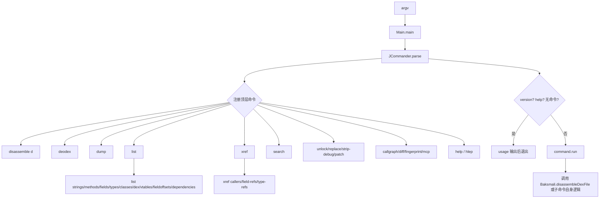

# 🛠️ baksmali Main — 入口与调度

`org.jf.baksmali` 顶层包是整个反汇编器的“指挥中枢”。`Main` 负责解析命令行、注册全部子命令并分派执行；`Baksmali` 提供多线程反汇编引擎；`BaksmaliOptions` 是贯穿各命令的配置载体；`HelpCommand` 处理帮助与隐含主题文档。所有具体业务命令（disassemble / list / xref / search / fingerprint 等）都作为 `Command` 子类挂在这棵命令树下。

## 类清单

| 类 | 职责 |
|----|------|
| `Main` | jcommander 程序入口，注册 17 个顶层命令，处理 `--version`/`--help` 后分派 |
| `Baksmali` | 反汇编执行器：排序类、线程池、文件名去重、逐类写 `.smali` |
| `BaksmaliOptions` | 全局可变配置（api、寄存器注释位掩码、资源 ID、classpath 等） |
| `HelpCommand` | `baksmali help [主题]`，含 `register-info`/`input`/`classpath` 三段长文档，附 `hlep` 彩蛋 |
| `DexInputCommand` | 抽象基类：解析 `dex/apk/oat/odex` 输入与 `-a/--api`，子类复用 |
| `DexTransformCommand` | 抽象基类：加载→改写→回写 dex 的命令骨架 |
| `DisassembleCommand` | 反汇编命令（`d`），所有反汇编风格选项集中于此 |
| `ListCommand` / `XrefCommand` | 聚合命令，各自挂载一组 list/xref 子命令 |

## 命令注册与分派



`Main` 在 `main()` 中先构造 `JCommander`，再以 `ExtendedCommands.addExtendedCommand` 逐个挂载命令（`Main.java:83-98`）。`ListCommand` 与 `XrefCommand` 是“命令分组”，自身 `run()` 内部再注册并分派子命令（`ListCommand.java:62-72`、`XrefCommand.java:73-75`）。无命令或 `--help` 时调用 `usage()` 退出；命中 `--version` 走 `version()` 打印 `baksmali.properties` 中的版本号（`Main.java:115-135`）。

## Main 顶层参数

源自 `Main.java:54-60` 的 `@Parameter` 注解：

| 选项 | 说明 | 备注 |
|------|------|------|
| `--help`/`-h`/`-?` | 显示用法 | `help=true` |
| `--version`/`-v` | 打印版本后退出 | `help=true` |

顶层 `@ExtendedParameters` 声明 `commandName="baksmali"` 并启用 `includeParametersInUsage`（`Main.java:47-50`）。每个具体命令的参数请见各自命令文档（如 [disassemble](./commands/disassemble.md)），公共输入解析逻辑位于 `DexInputCommand.java:56-65`（`-a/--api` 与多 dex 入口语法）。

## BaksmaliOptions 关键字段

| 字段 | 默认值 | 作用 |
|------|--------|------|
| `apiLevel` | 15 | 目标 API 级别，影响 opcode 集合 |
| `parameterRegisters` | true | 输出 `.param` |
| `localsDirective` | false | 用 `.locals` 替代 `.registers` |
| `sequentialLabels` | false | 标签顺序编号 |
| `debugInfo` | true | 保留调试信息 |
| `codeOffsets` | false | 注释指令偏移 |
| `accessorComments` | true | 合成访问器注释 |
| `implicitReferences` | false | 同类内引用省略类名 |
| `registerInfo` | 0 | 寄存器类型注释位掩码（`ALL`/`ARGS`/`DEST`/… 见 `BaksmaliOptions.java:65-71`） |
| `resourceIds` | `{}` | `public.xml` 解析出的资源 ID→名称映射 |
| `classPath` / `inlineResolver` / `syntheticAccessorResolver` | null | deodex 与类型推断依赖 |

`loadResourceIds` 用安全 SAX 解析 `public.xml` 填充 `resourceIds`（`BaksmaliOptions.java:85-111`）。

## 反汇编协作流程

`Baksmali.disassembleDexFile` 是反汇编路径的核心（`Baksmali.java:51-101`）：

1. `Ordering.natural().sortedCopy(dexFile.getClasses())` 排序，保证大小写不敏感文件系统下文件名稳定（`Baksmali.java:58`）。
2. `ClassFileNameHandler` 负责类描述符→文件路径映射与冲突去重（`Baksmali.java:60`）。
3. `Executors.newFixedThreadPool(jobs)` 并行处理每个类（`Baksmali.java:62`）。
4. 每个任务调用 `disassembleClass`：校验描述符、建目录、`BaksmaliWriter` 包裹 UTF-8 输出、`ClassDefinition.writeTo` 产出文本（`Baksmali.java:103-181`）。
5. 任一类失败不中断其它类，最终返回聚合成功标志。

## 真实命令 → 输出示例

```bash
# 顶层无参 → 打印命令列表
java -jar baksmali.jar
# 版本
java -jar baksmali.jar -v
# baksmali 2.5.2-<hash> (http://smali.org)
```

`baksmali help` 的三段主题文档对应 `HelpCommand.java:69-176`：`register-info`（寄存器注释取值）、`input`（多 dex 入口语法 `app.apk/classes2.dex`）、`classpath`（deodex 与 `-b`/`-d` 的 ART/dalvik 差异）。

## 延伸阅读

- [disassemble 命令](./commands/disassemble.md)
- [list 命令组](./commands/list.md)
- [xref 命令组](./commands/xref.md)
- [fingerprint 命令](./commands/fingerprint.md)
- [mcp 命令](./commands/mcp.md)
- [graph（调用图）](./graph.md)
