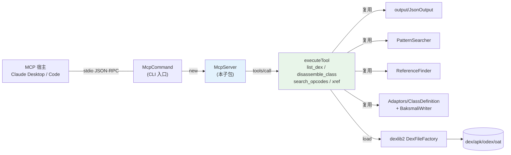

# 🛰️ mcp — MCP 服务器

`org.jf.baksmali.mcp` 是 baksmali 的 **Model Context Protocol** 子包。它把 baksmali 的只读 dex 查询能力（`list` / `disassemble` / `search` / `xref`）封装成 MCP **tools**，让 MCP 宿主（Claude Desktop、IDE agent 等）直接调用，而不必 shell 出去再正则解析文本。

整个子包只有一个类：`McpServer`。子命令 `baksmali mcp` 由 `org.jf.baksmali.McpCommand` 注册，`run()` 时构造 `new McpServer(apiLevel).run(System.in, System.out)`（`McpCommand.java:79`）。

## 设计要点

- **传输**：逐行 JSON-RPC 2.0 over stdio（一行一个 JSON 对象），MCP 在 stdio 上最常用的帧格式。`run()` 在 `McpServer.java:143` 逐行 `readLine` → `handle` → `writeMessage`。
- **零三方依赖**：协议手写在项目已有的 Gson 上（`McpServer.java:100`），思路与 `smali lsp` 的 `SmaliLanguageServer` 一致。
- **纯协议层**：`handle(JsonObject)`（`McpServer.java:182`）无 I/O 副作用，dex 加载走可注入的 `Function<String,DexFile>`（默认 `DexFileFactory`，`McpServer.java:126`），测试可喂内存 fixture。
- **只读**：不暴露任何写回变换（unlock/replace/patch），避免 Agent 误改 dex。
- **协议版本**：`PROTOCOL_VERSION = "2024-11-05"`，`SERVER_NAME = "baksmali-mcp"`（`McpServer.java:97-98`）。

## 类清单

| 类 | 职责 |
|----|------|
| `McpServer` | 唯一类。stdio 读写循环 + JSON-RPC 分发 + 四个工具实现 + JSON-Schema 构造。内嵌私有 `ToolException` 表示用户可读错误。 |

`McpCommand`（在父包 `org.jf.baksmali`，不在本子包）是 CLI 入口，解析 `-a/--api` 后转交 `McpServer`。

## 类间关系



## 协议分发

`handle()`（`McpServer.java:182`）按 `method` 字段分发：

| method | 处理 | 响应 |
|--------|------|------|
| `initialize` | `initializeResult()` | `protocolVersion` + `capabilities.tools` + `serverInfo` |
| `tools/list` | `toolsListResult()` | 四个工具的 `name/description/inputSchema` |
| `tools/call` | `handleToolCall()` | `content:[{type:text,text}]` + `isError` |
| `ping` | 返回空对象 | `{}` |
| `notifications/*` 及无 `id` 通知 | 不回 | `null` |
| 其他 | — | `-32601 Method not found` |

解析失败回 `-32700 Parse error`（`McpServer.java:154`）。**工具执行错误**（找不到类、参数缺失）以 `isError: true` 的正常结果返回，而非协议级错误——Agent 能读到人类可读文本并自我纠正（`McpServer.java:273`）。

## 工具集

四个工具全部只读，`input` 在每次 `tools/call` 时传路径，一个常驻进程可服务任意多个文件。

| 工具 | 必填参数 | 可选参数（默认） | 返回 |
|------|----------|------------------|------|
| `list_dex` | `input` | `type`=classes\|methods\|strings\|fields\|types（classes） | JSON 数组 |
| `disassemble_class` | `input`, `class` | — | 该类 smali 文本 |
| `search_opcodes` | `input`, `opcode` | — | 命中方法列表 |
| `xref` | `input`, `target` | `kind`=callers\|field-refs\|type-refs（callers） | 反向引用点列表 |

每个工具的 `inputSchema` 由 `tool()`/`stringProp()`/`enumProp()`/`required()` 构造（`McpServer.java:520-580`），宿主据此校验/提示参数。

### 命令→输出示例

**`tools/list`** → 四个工具声明（节选）：

```json
{"jsonrpc":"2.0","id":1,"result":{"tools":[
  {"name":"list_dex","description":"List entries in a dex/apk...","inputSchema":{"type":"object","properties":{"input":{...},"type":{"type":"string","enum":["classes","methods","strings","fields","types"]}},"required":["input"]}},
  {"name":"disassemble_class", ...}, {"name":"search_opcodes", ...}, {"name":"xref", ...}
]}}
```

**`list_dex` type=methods** → 方法引用数组（注意：是裸 `MethodReference` JSON，与 CLI `list methods` 的 `{class,name,parameters,returnType}` 对象形式不同）：

```json
{"jsonrpc":"2.0","id":2,"result":{"content":[{"type":"text","text":"[{\"class\":\"LLocalTest;\",\"name\":\"method1\",\"parameters\":[],\"returnType\":\"V\"},{\"class\":\"LLocalTest;\",\"name\":\"method2\",\"parameters\":[\"I\",\"J\",\"Ljava/lang/String;\"],\"returnType\":\"V\"}]"}],"isError":false}}
```

**`list_dex` type=classes/types** → 字符串数组（`McpServer.java:312-317`）；**type=strings** → 排序去重的字符串字面量数组（`collectStrings`，`McpServer.java:449`）。

**`search_opcodes`** `opcode=const-string,invoke-virtual`：

```json
{"jsonrpc":"2.0","id":3,"result":{"content":[{"type":"text","text":"[{\"caller\":\"Lcom/Example;->greet()V\",\"codeOffset\":\"0x2\",\"instructions\":[\"const-string \\\"hello\\\"\",\"invoke-virtual ...\"]}]"}],"isError":false}}
```

`codeOffset` 字段名与 CLI `search` 的 `offset` 略有差异（MCP 用 `match.caller`/`match.codeOffset`，`McpServer.java:384-385`）。

**`xref`** `kind=callers target=Lcom/Example;->foo()V`：

```json
{"jsonrpc":"2.0","id":4,"result":{"content":[{"type":"text","text":"[{\"target\":\"Lcom/Example;->foo()V\",\"sites\":[{\"caller\":\"Lcom/App;->onCreate()V\",\"codeOffset\":\"0x4\"}]}]"}],"isError":false}}
```

`target` 支持精确匹配或子串匹配（`McpServer.java:429`），`kind` 决定按 `MethodReference`/`FieldReference`/`TypeReference` 过滤（`McpServer.java:402-415`）。

## 典型协作流程

Agent 侦察一个陌生 APK 的标准链路：先 `list_dex(type=classes)` 看结构 → `search_opcodes` 定位可疑指令序列 → `xref` 追调用链 → `disassemble_class` 精读。全程结构化 JSON，无需解析人类文本。

```mermaid
sequenceDiagram
    participant A as Agent
    participant S as McpServer
    participant D as dexlib2
    A->>S: initialize
    S-->>A: protocolVersion + capabilities
    A->>S: tools/list
    S-->>A: 4 个工具 schema
    A->>S: tools/call list_dex {input,type:classes}
    S->>D: DexFileFactory.loadDexFile
    D-->>S: DexBackedDexFile
    S-->>A: ["Lcom/example/Foo;", ...]
    A->>S: tools/call xref {input,target,kind:callers}
    S->>D: ReferenceFinder.index
    S-->>A: [{target,sites:[{caller,codeOffset}]}]
```

## 源码要点

- `defaultLoader`（`McpServer.java:126`）：`apiLevel >= 0` 时用 `Opcodes.forApi`，否则传 `null` 让 dexlib2 自嗅探。
- `toolDisassemble`（`McpServer.java:348`）：线性扫 `dex.getClasses()` 找 `class.equals`，找不到抛 `ToolException`；用 `ClassDefinition` + `BaksmaliWriter` 输出 smali 文本，`apiLevel` 默认 15。
- `toolList` 的 `methods`/`fields` 分支把 `Method`/`Field` **上转型为 `MethodReference`/`FieldReference`** 再交给 `JsonOutput`，复用 CLI 的引用 schema（`McpServer.java:328,337`）。
- `collectStrings`（`McpServer.java:449`）：遍历所有 `MethodImplementation` 的指令，挑出 `StringReference` 去重排序——与 CLI `list strings` 同源但实现独立。
- `sortedClasses`（`McpServer.java:471`）：按 `getType()` 字典序排序，保证输出稳定。
- `toolResult`（`McpServer.java:505`）：MCP 约定的 `{content:[{type:text,text}],isError}` 信封。
- 工具实现复用现有能力，与对应 CLI 子命令输出对齐：`list_dex`↔`list`、`search_opcodes`↔`PatternSearcher`、`xref`↔`ReferenceFinder`、`disassemble_class`↔`Adaptors/ClassDefinition`。

## 延伸阅读

- [baksmali mcp 命令](../../cli/mcp.md)
- [MCP 协议集成（内幕）](../../internals/mcp.md)
- [smali-mcp skill](../../skills/smali-mcp.md)
- [output/JsonOutput 子包](output.md)
- baksmali PatternSearcher / ReferenceFinder
