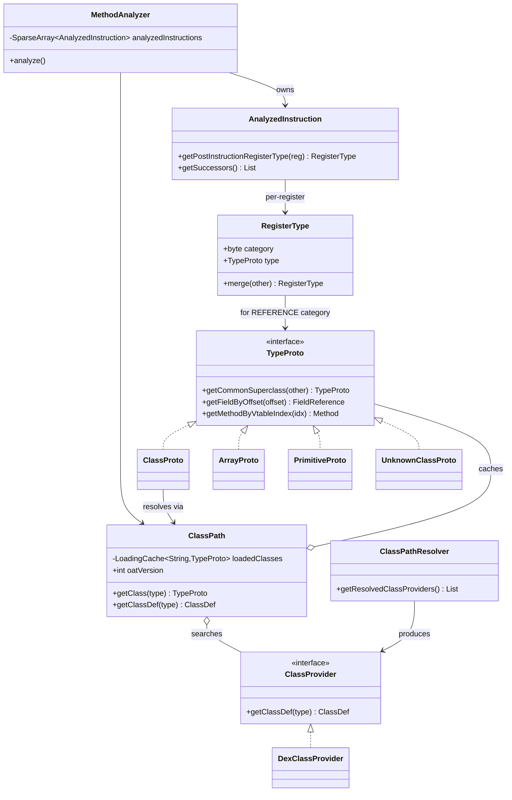

# 📐 analysis — 分析与类型推断层

`org.jf.dexlib2.analysis` 是 dexlib2 中最“有状态”的一层。它围绕一个核心问题展开：**给定一个 dex（尤其是被 odex/oat 优化过的 dex），如何把那些只有运行时才能解析的指令还原回标准 dalvik 字节码，并推断出每条指令执行前后每个寄存器的类型？**

为此，本包重新实现了 Dalvik/ART 的若干关键算法：vtable 构造、实例字段布局（field offset）、接口收集、`execute-inline` 内联方法表解析，以及基于前驱/后继传播的寄存器类型格（lattice）合并。baksmali 的去 odex 与 deodex 流程完全依赖本包。

## 🗂️ 包定位

- **上游输入**：`iface/` 提供只读的 `ClassDef`/`Method`/`Instruction`，`dexbacked/` 提供原始字节缓冲；本包在其上构造可分析的“类型原型”。
- **下游消费者**：`baksmali` 的 `MethodDefinition` / `Adaptors` 通过 `MethodAnalyzer` 拿到去 odex 后的指令序列与每寄存器类型，进而打印 smali。
- **关键依赖**：`util.MethodUtil`、`base.reference.*`、`immutable.*`（构造还原后的指令/方法对象）、`writer.util.TryListBuilder`。

## 📦 类清单

| 类名 | 职责 | 关键方法/字段 |
|------|------|--------------|
| `TypeProto` | 类型“原型”接口，统一描述类/数组/原始/未知类型 | `getCommonSuperclass`、`getFieldByOffset`、`getMethodByVtableIndex`、`findMethodIndexInVtable` |
| `ClassProto` | 引用类型的完整实现：vtable、接口表、字段布局 | `getVtable`、`getInstanceFields`、`getInterfaces`、`implementsInterface` |
| `ArrayProto` | 数组类型 `TypeProto`，处理元素类型与 `clone()` 语义 | `getElementType`、`getImmediateElementType`、`getCommonSuperclass` |
| `PrimitiveProto` | 8 种原始类型的最小 `TypeProto` | `getCommonSuperclass` |
| `UnknownClassProto` | 无法解析类型时的占位 `Ujava/lang/Object;` | `getCommonSuperclass`（永远返回自身或对方） |
| `ClassPath` | 类加载入口，缓存 `TypeProto`，管理 `ClassProvider` 列表 | `getClass`、`getClassDef`、`getUnknownClass`、`isArt`、`oatVersion` |
| `ClassProvider` | 抽象“从某来源取 `ClassDef`”的接口 | `getClassDef` |
| `DexClassProvider` | 基于 `DexFile` 的 `ClassProvider` | `getClassDef` |
| `ClassPathResolver` | 解析 bootclasspath/extra classpath 条目（设备路径或本地路径）为 `ClassProvider` 列表 | `getResolvedClassProviders`、`ResolveException` |
| `PathEntryLoader` | 加载单个 classpath 条目（jar/odex/oat/dex） | `loadEntry`、`getClassProviders` |
| `MethodAnalyzer` | 核心：分析指令、推断寄存器类型、去 odex、验证 | 构造器 `MethodAnalyzer(classPath, method, inlineResolver, normalizeVirtualMethods)`、`analyze`、`getAnalyzedInstructions` |
| `AnalyzedInstruction` | 单条指令的分析态：前驱/后继、执行前/后寄存器类型 | `getPreInstructionRegisterType`、`getPostInstructionRegisterType`、`getSuccessors`、`isInvokeInit` |
| `RegisterType` | 寄存器类型格（20 个 category）+ 合并表 | `merge`、`getRegisterType`、`getRegisterTypeForLiteral`、`mergeTable` |
| `OdexedFieldInstructionMapper` | 把 odex 字段访问指令（`iget-quick` 等）映射到具体字段 | 构造器 `OdexedFieldInstructionMapper(isArt)` |
| `InlineMethodResolver` | 解析 `execute-inline` 的内联方法表（odex 35/36） | `createInlineMethodResolver`、`resolveExecuteInline` |
| `CustomInlineMethodResolver` | 自定义内联表扩展点 | `resolveExecuteInline` |
| `AnalyzedMethodUtil` | 方法可访问性判定（含 package-private） | `canAccess` |
| `reflection.ReflectionClassDef` 等 | 把 JVM `Class`/`Method`/`Field` 包装成 dexlib2 `iface` 对象，作为兜底类 | `ReflectionClassDef(Class)` |
| `util.TypeProtoUtils` | 父类链迭代等工具 | `getSuperclassChain` |
| `AnalysisException` / `UnresolvedClassException` / `UnresolvedOdexInstruction` | 分析期异常/占位指令 | — |

## 🧩 核心类关系



## 🔄 分析数据流

`MethodAnalyzer` 在构造时即完成完整分析（见 `dexlib2/src/main/java/org/jf/dexlib2/analysis/MethodAnalyzer.java:130` 的 `analyze()` 调用）。流程为：

1. 为方法体每条指令建 `AnalyzedInstruction`，构造 CFG（前驱/后继，含异常处理边界）。
2. 在 `startOfMethod` 这个虚拟指令上播种寄存器初值：`this` 寄存器（构造器为 `UNINIT_THIS`，否则为当前类 `REFERENCE`）、参数类型、非参数寄存器置 `UNINIT`。
3. 工作列表迭代：对每条指令，依据其 `opcode` 与输入寄存器类型推断输出类型并传播给后继；当某寄存器在多个前驱上类型不一致时，调用 `RegisterType.merge()` 合并（参照 `mergeTable`）。
4. odex 指令（`*-quick`、`execute-inline`、`invoke-virtual-quick` 等）在分析期间被“去 odex”：借助 `ClassProto.getVtable()` / `getFieldByOffset()` / `InlineMethodResolver` 还原为标准 `invoke-virtual`、`iget` 等。
5. 收敛后可选地做验证遍。

寄存器类型合并的核心，是 `RegisterType.merge()` 在两个 `REFERENCE` 之间调用 `TypeProto.getCommonSuperclass()`——这正是 `ClassProto` 实现里那段沿父类链找最近公共祖先的逻辑（`ClassProto.java:376`）。

## ⚙️ 典型用法

以下是 baksmali 实际的接入方式（摘自 `baksmali/src/main/java/org/jf/baksmali/Adaptors/MethodDefinition.java:452` 与 `AnalysisArguments.java:146`）：

```java
// 1. 解析 bootclasspath，得到 ClassProvider 列表
ClassPathResolver resolver = new ClassPathResolver(
        bootClassPathDirs, bootClassPath, extraClassPath, dexEntry);
List<ClassProvider> providers = resolver.getResolvedClassProviders();

// 2. 构造 ClassPath（oatVersion 决定 vtable/字段布局算法分支）
ClassPath classPath = new ClassPath(
        providers, checkPackagePrivateAccess, oatVersion);

// 3. 对每个方法做分析（normalizeVirtualMethods 用于把 invoke-virtual-quick
//    归一化到稳定的方法引用）
MethodAnalyzer analyzer = new MethodAnalyzer(
        classPath, method, inlineResolver, normalizeVirtualMethods);

// 4. 遍历分析后的指令，读取每寄存器执行前类型
for (AnalyzedInstruction ai : analyzer.getAnalyzedInstructions()) {
    RegisterType rt = ai.getPreInstructionRegisterType(0);
    // rt.category / rt.type 即推断结果
}
```

`ClassPath` 内部用 `LoadingCache` 缓存 `TypeProto`（`ClassPath.java:146`），并对 `ClassProto` 内的 vtable / 接口表 / 实例字段表用 `Suppliers.memoize` 惰性求值——同一类型只计算一次，是本包在大型 dex 上仍可承受的关键。

## 🧩 ART 版本分支

`ClassProto` 中最易出错的逻辑是 vtable 与字段布局，二者都按 ART 版本分叉：

- **vtable**（`ClassProto.java:867`）：`oatVersion < 72` 走 pre-default-method（无 default 方法）；`72 ≤ v < 87` 走 buggy 版本（复刻 ART 一段会产出重复 vtable 槽的 bug）；`≥ 87` 走修正版。default 方法、miranda 方法、conflict 方法的处理顺序必须与 ART 一致，否则去 odex 后的 `invoke-virtual` 索引会错位。
- **字段布局**（`ClassProto.java:485`）：Dalvik 用 `computeFieldOffsets` 那套引用优先 + wide 对齐算法；ART 用 `LinkFields` 的 gap-filling 算法（`FieldGap` 优先队列，`oatVersion >= 67` 改变 gap 排序）。
- **接口顺序**（`ClassProto.java:126`）：`oatVersion < 72` 与 `≥ 72` 的接口收集顺序不同，影响 vtable 生成。

## 🔍 与其他包的协作

- **`iface/`**：`TypeProto` 的方法返回 `Method`、`FieldReference` 等 iface 类型；`ReflectionClassDef` 把 JVM 反射对象适配成 `ClassDef`，使 `Class`/`String`/`Object` 等兜底类无需 dex 即可参与分析。
- **`immutable/`**：去 odex 产生的替换指令、`ReparentedMethod`（把接口方法重新挂到当前类上以避免 `invoke-virtual` 调用接口）等，都基于 immutable 构建。
- **`writer/util/TryListBuilder`**：`MethodAnalyzer` 引用它重建异常处理表，配合去 odex 后变化的指令流。
- **`util/MethodUtil`**：方法签名匹配、参数寄存器计数、构造器判定。
- **`baksmali`**：`AnalysisArguments` 负责解析 `--bootclasspath` 等参数并构造 `ClassPathResolver`；`MethodDefinition` 直接消费 `MethodAnalyzer`。

## 延伸阅读

- [iface — 只读接口层](./iface-reference.md)
- [util — 通用工具](./util.md)
- [formatter — smali 格式化](./formatter.md)
- baksmali 去 odex / deodex CLI 文档（见仓库 `baksmali` 模块）
