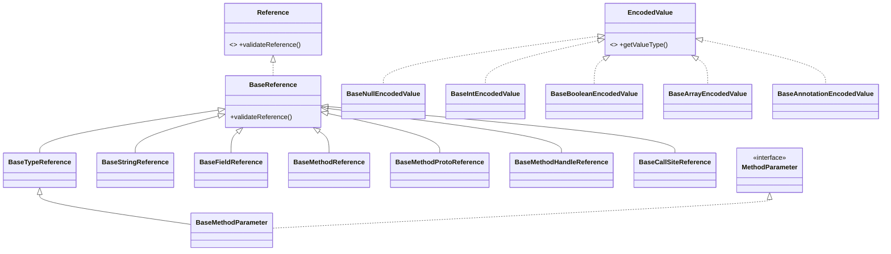

# 📦 base — 共享基类层

`org.jf.dexlib2.base` 是 dexlib2 三层表示（`iface` / `dexbacked` / `immutable` / `builder`）之间的「粘合层」。它本身不持有任何 dex 数据，而是为 `iface/` 下定义的只读接口提供一份**统一的、与具体实现无关**的 `Object` 协议实现：`hashCode`、`equals`、`compareTo`、`toString`，以及若干静态 `Comparator`。

> 设计意图：让 `DexBacked*`、`Immutable*`、`builder.*` 三类实现都继承同一个基类，从而去重、保证语义一致，并使任何实现都能直接放进 `HashSet` / `TreeSet` / 作为 map key 使用。

## 🗂️ 包结构

包分三个目录：

| 子包 | 文件数 | 抽象对象 |
| --- | --- | --- |
| `base/` | 5 | 注解、注解元素、异常处理表、方法参数、try 块 |
| `base/reference/` | 8 | dex 引用（type/string/field/method/proto/method-handle/callsite + 抽象根） |
| `base/value/` | 18 | 编码值（byte/short/char/int/long/float/double/string/type/field/method/enum/method-type/method-handle/array/annotation/null/boolean） |

## 📐 类关系图



注意 `BaseMethodParameter` 继承 `BaseTypeReference` —— 因为一个方法参数的核心身份就是它的类型描述符，所以参数天然可被当作类型引用来比较与排序。

## 🧩 顶层类（`base/`）

| 类 | 实现 iface | 职责 | 关键方法 / 静态字段 |
| --- | --- | --- | --- |
| `BaseAnnotation` | `Annotation` | 注解相等/排序：可见性→类型→元素集（按 set 比较） | `compareTo`、`BY_TYPE` 比较器 |
| `BaseAnnotationElement` | `AnnotationElement` | 注解元素：按 name→value 排序 | `BY_NAME` 比较器 |
| `BaseExceptionHandler` | `ExceptionHandler` | catch 处理：null 异常类型（catch-all）排序时靠后；按 type→handlerCodeAddress | `getExceptionTypeReference()`、`BY_EXCEPTION` |
| `BaseTryBlock<EH>` | `TryBlock<EH>` | try 区间相等性：startCodeAddress + codeUnitCount + handlers | `equals` |
| `BaseMethodParameter` | `MethodParameter` | 参数类型+注解；从 `Ldalvik/annotation/Signature;` 还原泛型签名 | `getSignature()` |

`BaseMethodParameter.getSignature()` 是本包少数带「业务逻辑」的方法：它不存签名，而是运行时遍历参数注解，把 `Signature` 注解 `value` 数组里的多段字符串拼接还原成 Java 泛型签名（见 `BaseMethodParameter.java:48`）。

`BaseExceptionHandler.getExceptionTypeReference()` 在调用方需要 `TypeReference` 视图时，临时构造一个匿名 `BaseTypeReference` 子类，避免让实现类同时实现两个接口（见 `BaseExceptionHandler.java:45`）。

## 🔍 引用基类（`base/reference/`）

| 类 | 实现 iface | 排序键（按优先级） | toString |
| --- | --- | --- | --- |
| `BaseReference` | `Reference` | — | — （仅提供空 `validateReference()`） |
| `BaseTypeReference` | `TypeReference` | type 字符串 | `DexFormatter.getType` |
| `BaseStringReference` | `StringReference` | string | 原始字符串 |
| `BaseFieldReference` | `FieldReference` | definingClass→name→type | `DexFormatter.getFieldDescriptor` |
| `BaseMethodReference` | `MethodReference` | definingClass→name→returnType→parameterTypes | `DexFormatter.getMethodDescriptor` |
| `BaseMethodProtoReference` | `MethodProtoReference` | returnType→parameterTypes | `DexFormatter.getMethodProtoDescriptor` |
| `BaseMethodHandleReference` | `MethodHandleReference` | methodHandleType→memberReference | `DexFormatter.getMethodHandle` |
| `BaseCallSiteReference` | `CallSiteReference` | name→methodHandle→methodName→methodProto→extraArgs | `DexFormatter.getCallSite` |

`BaseTypeReference` / `BaseStringReference` 还实现了 `CharSequence`，因此可直接喂给需要 `CharSequence` 的 API，且 `equals` 同时接受同类引用与普通 `CharSequence`（见 `BaseTypeReference.java:46`）。

`BaseReference.validateReference()` 默认空实现——「引用默认合法」，由具体子类（如 `ImmutableMethodReference` 解析自字符串时）按需覆盖抛出 `Reference.InvalidReferenceException`。

## ⚙️ 编码值基类（`base/value/`）

18 个抽象类一一对应 `ValueType` 的 19 个常量（除 `BaseNullEncodedValue` 外，每个都在 `compareTo` 中先比 `getValueType()` 再比值，确保不同类型编码值混排时顺序确定）。模式高度一致：

```java
public abstract class BaseIntEncodedValue implements IntEncodedValue {
    @Override public int hashCode() { return getValue(); }
    @Override public boolean equals(@Nullable Object o) {
        return o instanceof IntEncodedValue && getValue() == ((IntEncodedValue)o).getValue();
    }
    @Override public int compareTo(@Nonnull EncodedValue o) {
        int res = Ints.compare(getValueType(), o.getValueType());
        if (res != 0) return res;
        return Ints.compare(getValue(), ((IntEncodedValue)o).getValue());
    }
    public int getValueType() { return ValueType.INT; }
    @Override public String toString() { return DexFormatter.INSTANCE.getEncodedValue(this); }
}
```

| 分组 | 类 |
| --- | --- |
| 标量原语 | `BaseByteEncodedValue`、`BaseShortEncodedValue`、`BaseCharEncodedValue`、`BaseIntEncodedValue`、`BaseLongEncodedValue`、`BaseFloatEncodedValue`、`BaseDoubleEncodedValue`、`BaseBooleanEncodedValue` |
| 引用型 | `BaseStringEncodedValue`、`BaseTypeEncodedValue`、`BaseFieldEncodedValue`、`BaseMethodEncodedValue`、`BaseEnumEncodedValue`、`BaseMethodTypeEncodedValue`、`BaseMethodHandleEncodedValue` |
| 复合 | `BaseArrayEncodedValue`（按 list 比）、`BaseAnnotationEncodedValue`（按 type→elements set 比） |
| 特殊 | `BaseNullEncodedValue`（hashCode 恒为 0，equals 仅判同类型） |

`BaseArrayEncodedValue.compareTo` 用 `CollectionUtils.compareAsList`（保序逐项比），而 `BaseAnnotationEncodedValue.compareTo` 用 `compareAsSet`（注解元素是无序集合）——这反映了 dex 规范里数组有序、注解元素无序的事实。

## 🔄 与其他包的协作

`base/*` 的所有类都是 `abstract`，真实实例由下游实现提供。下面是 `immutable/` 的实际继承关系（截取）：

```java
// immutable/ImmutableMethodReference.java:43
public class ImmutableMethodReference extends BaseMethodReference implements ImmutableReference { ... }
// immutable/ImmutableMethodParameter.java:46
public class ImmutableMethodParameter extends BaseMethodParameter { ... }
// immutable/ImmutableTryBlock.java:45
public class ImmutableTryBlock extends BaseTryBlock<ImmutableExceptionHandler> { ... }
// immutable/value/ImmutableIntEncodedValue.java:37
public class ImmutableIntEncodedValue extends BaseIntEncodedValue implements ImmutableEncodedValue { ... }
```

`builder/` 与 `dexbacked/` 同样继承这些基类，但通常只覆盖 `hashCode`/`equals` 中需要懒计算的部分。也就是说：

- **`iface/`** 定义契约（getter）；
- **`base/`** 提供基于这些 getter 的「通用对象语义」；
- **`immutable` / `builder` / `dexbacked`** 只负责如何取数据，相等/排序/格式化全部免费继承。

`toString` 全部委托 `org.jf.dexlib2.formatter.DexFormatter` 单例，确保 base 层不耦合到 smali 文本格式细节。

## ✅ 典型用法

直接复用基类提供的 `Comparator` 对集合排序，是上层代码最常见的调用方式：

```java
// 对方法上的注解按 type 字母序排列（BaseAnnotation.BY_TYPE）
List<Annotation> annos = new ArrayList<>(method.getAnnotations());
annots.sort(BaseAnnotation.BY_TYPE);

// 对异常处理表排序：catch-all(null) 永远排末尾
handlers.sort(BaseExceptionHandler.BY_EXCEPTION);

// 把方法参数当成 TypeReference 直接比较
int c = param.compareTo("Lcom/example/Foo;");
```

由于 `BaseTypeReference` 实现了 `CharSequence`，参数/类型引用可直接用于 `CharSequence` 比较器或 Guava `Ordering.usingToString()`，这也是 `BaseMethodReference.compareTo` 内部对 `parameterTypes` 的处理方式（见 `BaseMethodReference.java:72`）。

## 延伸阅读

- [iface — 只读接口层](./iface.md)
- [immutable — 不可变实现层](./immutable.md)
- [dexbacked — 懒解析实现层](./dexbacked.md)
- [builder — 可变方法体构建](./builder.md)
- [formatter — dex 文本格式化](./formatter.md)
