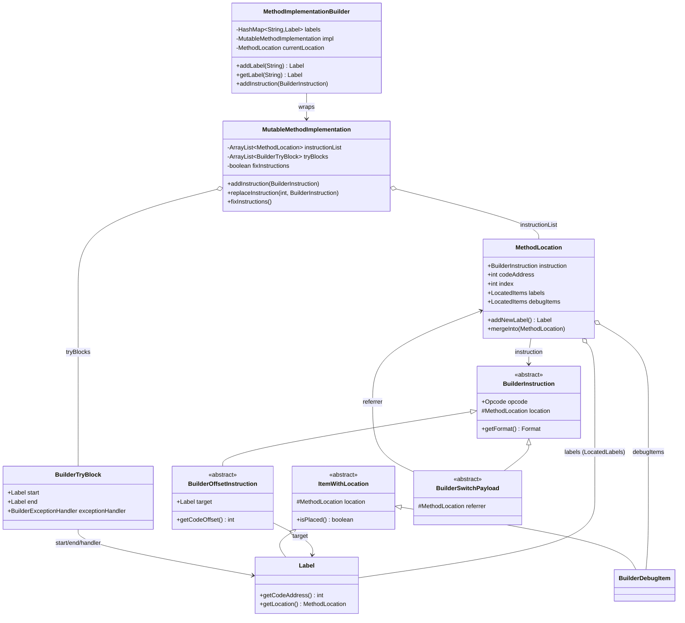
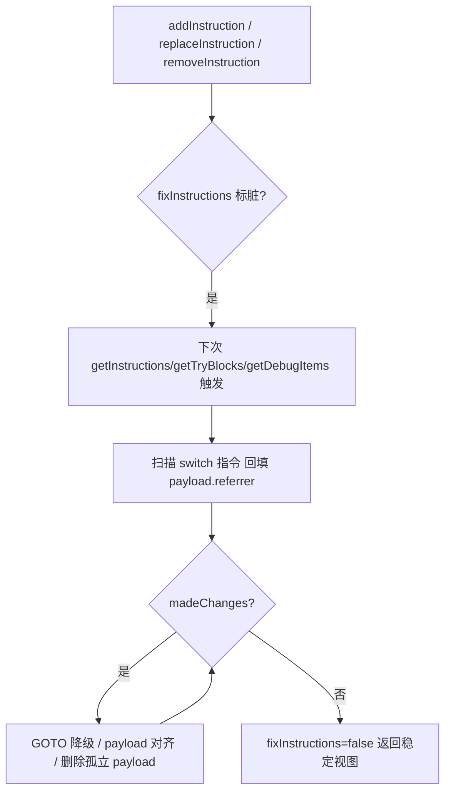

# 📦 builder — 方法体构造层

`org.jf.dexlib2.builder` 是 dexlib2 中**构造与修改方法体（method body）**的可变表示层。它实现 `iface/instruction` 各格式接口，但额外引入 **`Label` + `MethodLocation`** 两个间接层，让调用方在不知道最终字节偏移的前提下用「标签」串接跳转、switch payload、try/catch 与 debug 信息，最终由 `MutableMethodImplementation.fixInstructions()` 统一算地址、对齐、降级 GOTO、回收无用 payload。

它是 smali 汇编链路的中段：smali 树 walker（`smali/src/main/antlr/smaliTreeWalker.g`）把 AST 翻译成 builder 指令对象，喂给 `MutableMethodImplementation`；再由 `writer/` 层序列化成 dex 字节。反向上，从既有 dex 读出的 `MethodImplementation` 也能包进 `MutableMethodImplementation` 做原地增删改。

## 🧩 设计要点

- **标签优先于地址**：所有带偏移的指令（`GOTO`、`if-*`、`packed/sparse-switch`、`fill-array-data`）持有一个 `Label` 而非数值 offset；偏移在 `getCodeOffset()` 时按 `target.getCodeAddress() - this.getCodeAddress()` 现算（`BuilderOffsetInstruction.java:67-69`）。
- **`MethodLocation` 作为枢纽**：每条指令占一个 `MethodLocation`，链尾额外挂一个 null 指令的"空位"表示方法末尾；标签与 debug item 都挂载在 `MethodLocation` 上而非指令上，因此插入/删除指令时它们能跟着位置漂移。
- **惰性 fix-up**：任何结构性改动只把 `fixInstructions = true` 置脏；真正重算地址、GOTO 降级、payload 对齐发生在下次 `getInstructions()`/`getTryBlocks()`/`getDebugItems()` 被读取时（`MutableMethodImplementation.java:60, 140-143`）。
- **GOTO 自动降级**：`GOTO` 偏移超出 `[-128,127]` 自动换成 `GOTO_16`，再超换成 `GOTO_32`；反之 `GOTO_16` 超限升 `GOTO_32`（`MutableMethodImplementation.java:412-436`）。
- **payload 生命周期**：switch payload 通过 `SwitchPayloadReferenceLabel` 反查它的 switch 指令；未被引用的 payload 在 fix-up 时被删除，并对齐到 4 字节边界（奇地址前插/移除 NOP，`MutableMethodImplementation.java:438-464`）。
- **LocatedItems 懒分配**：每个 `MethodLocation` 的 labels / debugItems 列表按需创建，避免大量空方法浪费内存（`LocatedItems.java:9-22`）。

## 🗂️ 类清单

### 顶层骨架（`org.jf.dexlib2.builder`）

| 类 | 职责 | 关键方法 |
|---|---|---|
| `MutableMethodImplementation` | 可变方法体容器，实现 `MethodImplementation` | `addInstruction`、`replaceInstruction`、`removeInstruction`、`swapInstructions`、`newLabelForAddress`、`newLabelForIndex`、`addCatch` |
| `MethodImplementationBuilder` | 顺序追加式构建器，封装"当前 location"游标与命名标签表 | `addLabel`、`getLabel`、`addInstruction`、`addCatch`、`addLineNumber`、`addStartLocal` |
| `MethodLocation` | 一条指令的位置：codeAddress + index + 挂载的 labels/debugItems | `getInstruction`、`getCodeAddress`、`getIndex`、`getLabels`、`getDebugItems`、`addNewLabel`、`mergeInto` |
| `BuilderInstruction` | 所有 builder 指令的抽象基类，持 `opcode` + `location` | `getOpcode`、`getFormat`、`getCodeUnits`、`getLocation` |
| `BuilderOffsetInstruction` | 带跳转目标的指令抽象基类，offset 由 Label 现算 | `getTarget`、`getCodeOffset`、`internalGetCodeOffset` |
| `BuilderSwitchPayload` | switch payload 抽象基类，持 `referrer` 反向引用 | `getReferrer`、`getSwitchElements` |
| `Label` | 跳转目标占位符，未放置时 `location=null` | `getCodeAddress`、`getLocation`、`isPlaced`（继承自 `ItemWithLocation`） |
| `ItemWithLocation` | label/debug item 的基类，管理"是否已落到某 location" | `isPlaced`、`setLocation` |
| `BuilderTryBlock` | try 块，start/end/handler 全用 Label | `getStartCodeAddress`、`getCodeUnitCount`、`getExceptionHandlers` |
| `BuilderExceptionHandler` | 异常处理器，handler 用 Label；通过静态工厂按异常类型构造 | `getHandler`、`getHandlerCodeAddress`、`newExceptionHandler` |
| `BuilderDebugItem` | debug item 抽象基类，codeAddress 取自所在 location | `getCodeAddress` |
| `LocatedItems<T>` | labels/debugItems 的懒分配容器，提供可变 Set 视图 | `getModifiableItems`、`mergeItemsIntoNext` |
| `LocatedLabels` / `LocatedDebugItems` | `LocatedItems` 的两个具体子类 | （仅错误文案不同） |
| `SwitchLabelElement` | sparse switch 的 (key, Label) 对 | `key`、`target` 字段 |

### 指令子包（`org.jf.dexlib2.builder.instruction`）

按 dex 指令格式一一对应，约 35 个 `BuilderInstructionXXx` 具体类。代表性类：

| 类 | 对应 Format | 关键字段/签名 |
|---|---|---|
| `BuilderInstruction10t` | Format10t (goto) | `(Opcode, Label target)` |
| `BuilderInstruction10x` | Format10x (nop/return-void) | `(Opcode)` |
| `BuilderInstruction11x` | Format11x (单寄存器) | `(Opcode, int registerA)` |
| `BuilderInstruction21t` | Format21t (if-test) | `(Opcode, int registerA, Label target)` |
| `BuilderInstruction21c` | Format21c (带引用) | `(Opcode, int registerA, Reference)` |
| `BuilderInstruction35c` | Format35c (5 寄存器 invoke) | `(Opcode, int count, C..G, Reference)` |
| `BuilderInstruction31t` | Format31t (fill-array-data/switch) | `(Opcode, int registerA, Label target)` |
| `BuilderInstruction45cc` | Format45cc (invoke-polymorphic) | `(…, Reference, Reference2)` |
| `BuilderPackedSwitchPayload` | PackedSwitchPayload | `(int startKey, List<Label> targets)` |
| `BuilderSparseSwitchPayload` | SparseSwitchPayload | `(List<SwitchLabelElement>)` |
| `BuilderArrayPayload` | ArrayPayload | `(int elementWidth, List<Number>)` |
| `BuilderSwitchElement` | SwitchElement | `(parent, key, Label target)`，offset 现算 |

### debug 子包（`org.jf.dexlib2.builder.debug`）

7 个 `BuilderDebugItem` 子类，一一对应 `iface/debug`：`BuilderStartLocal`、`BuilderEndLocal`、`BuilderRestartLocal`、`BuilderLineNumber`、`BuilderPrologueEnd`、`BuilderEpilogueBegin`、`BuilderSetSourceFile`。

## 📐 类关系图



## 🔄 fix-up 流程



## 🛠️ 典型用法

`MethodImplementationBuilder` 是顺序汇编（如 smali 树 walker）的入口：先 `getLabel(name)` 取目标（即使尚未定义），再 `addInstruction` 追加指令，期间 `addLabel(name)` 把标签落到当前游标位置。

```java
// 顺序构建：goto 跳到尚未定义的标签
MethodImplementationBuilder b = new MethodImplementationBuilder(2);
b.addInstruction(new BuilderInstruction12x(Opcode.MOVE, 0, 0));
b.addInstruction(new BuilderInstruction10t(Opcode.GOTO, b.getLabel("loop")));
b.addLabel("loop");
b.addInstruction(new BuilderInstruction11x(Opcode.RETURN, 0));
MethodImplementation impl = b.getMethodImplementation();
```

从既有 dex 改写则直接构造 `MutableMethodImplementation`，地址/标签由其构造器根据 `codeAddressToIndex` 自动反推（`MutableMethodImplementation.java:62-124`）：

```java
// 从已读出的 MethodImplementation 复刻一份可变副本
MutableMethodImplementation impl = new MutableMethodImplementation(origImpl);
// 在第 0 条前插入一条 nop
impl.addInstruction(0, new BuilderInstruction10x(Opcode.NOP));
// 替换第 3 条为 return-void
impl.replaceInstruction(3, new BuilderInstruction10x(Opcode.RETURN_VOID));
// 触发 fix-up 并取最终指令列表
List<BuilderInstruction> out = impl.getInstructions();
```

基于 `codeAddress`/`index` 取标签做 try 块：

```java
Label start = impl.newLabelForAddress(0x10);
Label end   = impl.newLabelForAddress(0x20);
Label hand  = impl.newLabelForAddress(0x30);
impl.addCatch("Ljava/lang/Exception;", start, end, hand);
```

## 🔗 与其他包的协作

- **`iface/`**：builder 类全部实现 `iface/instruction`、`iface/debug`、`iface/MethodImplementation` 接口，因此可被 `writer/` 当作普通只读对象消费。
- **`writer/builder/`**：`DexBuilder` 消费 builder 方法体，把其中的 `Reference` intern 成 `BuilderReference` 回填索引；这是 smali 汇编的写盘路径。
- **`base/`**：`BuilderTryBlock` 继承 `BaseTryBlock`，`BuilderExceptionHandler` 继承 `BaseExceptionHandler`，复用默认实现。
- **smali 树 walker**（`smali/src/main/antlr/smaliTreeWalker.g`）：是 builder 包的最大消费者，把 `:instruction` 规则翻译成具体 `BuilderInstructionXXx`，标签名通过 `MethodImplementationBuilder.getLabel/addLabel` 串接。
- **`util/Preconditions`**：所有 `BuilderInstructionXXx` 构造器都调用它做寄存器宽度/格式校验（如 `BuilderInstruction35c.java:63-68`）。

## 延伸阅读

- [iface — 只读接口层](./iface-reference.md)
- [writer — 序列化写入层](./writer.md)
- [util — 通用工具](./util.md)
- [formatter — smali 文本格式化](./formatter.md)
