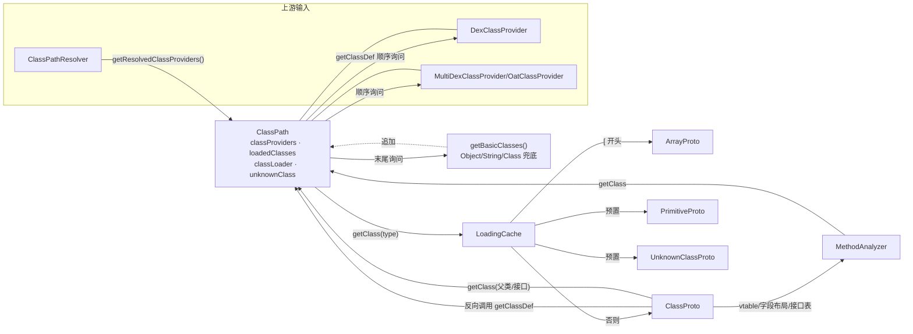

# 🗂️ ClassPath — 类型层次与类路径

`org.jf.dexlib2.analysis.ClassPath` 是 `analysis` 包的**解析中枢**。它把若干个 `ClassProvider`（dex 文件、oat、反射类等）按序串成一条“类路径”，对外提供两类能力：

1. **按类型描述符解析 `ClassDef`**（`getClassDef`）——给一个 `Lcom/foo/Bar;`，依次询问每个 provider，命中即返回，全部未命中则抛 `UnresolvedClassException`。
2. **按类型描述符获取 `TypeProto`**（`getClass`）——返回该类型的“原型”对象（`ClassProto` / `ArrayProto` / `PrimitiveProto` / `UnknownClassProto`），后者承载 vtable、字段布局、接口表等分析所需的运行时语义。

baksmali 的去 odex 与 deodex 流程、`MethodAnalyzer` 的寄存器类型推断，都通过 `ClassPath` 间接拿到被分析类的父类、接口、字段与方法。

## 📐 角色定位

- **上游**：`ClassPathResolver`（`baksmali/AnalysisArguments.java:146`）解析完 bootclasspath/extra classpath 后，把得到的一组 `ClassProvider` 喂给 `ClassPath` 构造器。
- **自身**：维护 `loadedClasses`（Guava `LoadingCache`）与 `classProviders` 列表，并预置原始类型与若干“必定存在”的反射兜底类（`Object`、`String`、`Class` 等）。
- **下游**：`TypeProto` 实现们（尤其 `ClassProto`）持有创建它的 `ClassPath` 引用，反向调用 `getClassDef` / `getClass` 解析父类与接口，从而递归构造类型层次。

## 📦 关键字段

| 字段 | 类型 | 作用 |
|------|------|------|
| `classProviders` | `List<ClassProvider>` | 按“先入先查”顺序排列的类来源；构造末尾会追加 `getBasicClasses()` 兜底（`ClassPath.java:108-109`） |
| `loadedClasses` | `LoadingCache<String, TypeProto>` | 类型描述符 → `TypeProto` 的惰性缓存，miss 时由 `classLoader` 装载（`ClassPath.java:146`） |
| `classLoader` | `CacheLoader<String, TypeProto>` | `[` 开头造 `ArrayProto`，否则造 `ClassProto`（`ClassPath.java:136-144`） |
| `unknownClass` | `UnknownClassProto` | 解析失败时的占位类型，预先放入缓存（`ClassPath.java:93-94`） |
| `checkPackagePrivateAccess` | `boolean` | 是否启用包私有可见性检查（仅早期 API 17 默认开启，`ClassPath.java:95`） |
| `oatVersion` | `int` | ART oat 版本号；`NOT_ART`(-1) 表示非 ART，`NOT_SPECIFIED`(-2) 表示未指定 |
| `fieldInstructionMapperSupplier` | `Supplier<OdexedFieldInstructionMapper>` | 惰性单例，按 `isArt()` 构造字段指令映射器（`ClassPath.java:168-173`） |

## 🔍 关键方法

| 方法 | 作用 | 备注 |
|------|------|------|
| `ClassPath(Iterable<ClassProvider>, boolean, int)` | 主构造器，预置原始类型与兜底类 | 见 `ClassPath.java:90-110`；其余构造器均委托它 |
| `getClass(CharSequence)` | 返回类型的 `TypeProto`，命中缓存直接返回 | `loadedClasses.getUnchecked`，不抛异常 |
| `getClassDef(String)` | 顺序遍历 providers 查找 `ClassDef` | 全 miss 抛 `UnresolvedClassException`（`:156`） |
| `isArt()` | 是否运行在 ART 上 | `oatVersion != NOT_ART` |
| `getUnknownClass()` | 返回 `UnknownClassProto` 兜底 | 用于无法解析时的类型推断 |
| `shouldCheckPackagePrivateAccess()` | 暴露包私有检查开关 | 供 `ClassProto` 判断可见性 |
| `getFieldInstructionMapper()` | 获取 odex 字段指令映射器 | `Suppliers.memoize` 保证单例 |
| `loadPrimitiveType(String)` | 预置 `Z B S C I J F D L` 八种原始类型 + `L`（返回地址） | `:112-114`，构造期调用 |
| `getBasicClasses()` | 构造包含 `Object/String/Class/...` 的 `DexClassProvider` | 作为 providers 末尾兜底（`:116-125`） |

## 🔄 协作关系



要点：`ClassPath` 与 `TypeProto` 形成**双向引用**——`ClassPath` 创建并缓存 `TypeProto`，而 `ClassProto` 在构造 vtable / 解析字段时又回调 `ClassPath.getClassDef` 与 `getClass` 来获取父类/接口的 `TypeProto`。`LoadingCache` 保证每个类型描述符只构造一次，避免递归解析时重复计算。

## ⚙️ 典型用法

来自 baksmali 分析参数装配的真实路径（`baksmali/AnalysisArguments.java:140-146`）：

```java
// 1. 解析 bootclasspath / classpath 目录与条目
ClassPathResolver resolver = new ClassPathResolver(
        filteredClassPathDirectories, bootClassPath, classPath, dexEntry);
// 2. 用解析出的 providers 构造 ClassPath
return new ClassPath(
        resolver.getResolvedClassProviders(),
        checkPackagePrivateAccess,
        oatVersion);
```

构造器内部对每个类型描述符的装载逻辑（`ClassPath.java:136-144`）：

```java
private final CacheLoader<String, TypeProto> classLoader = new CacheLoader<String, TypeProto>() {
    @Override public TypeProto load(String type) throws Exception {
        if (type.charAt(0) == '[') {
            return new ArrayProto(ClassPath.this, type);
        } else {
            return new ClassProto(ClassPath.this, type);
        }
    }
};
```

顺序查找 `ClassDef`（`ClassPath.java:148-157`）：

```java
@Nonnull
public ClassDef getClassDef(String type) {
    for (ClassProvider provider: classProviders) {
        ClassDef classDef = provider.getClassDef(type);
        if (classDef != null) {
            return classDef;
        }
    }
    throw new UnresolvedClassException("Could not resolve class %s", type);
}
```

## 🧩 源码要点

- **兜底类不可省**：构造期强制追加 `Object`、`String`、`Class`、`Cloneable`、`Serializable`、`Throwable` 的反射定义（`getBasicClasses()`，`:116-125`）。即便用户没提供任何 framework dex，类型推断也能命中 `Object` 这一根类，否则 `getCommonSuperclass` 会无解。
- **原始类型预置**：`Z B S C I J F D L` 在构造时即写入缓存（`:98-106`），其中 `L` 对应 `return-address`（`jsr/ret` 残留语义），由 `PrimitiveProto` 承载。
- **`UnknownClass` 预入缓存**：`unknownClass` 在构造期就 `put` 进 `loadedClasses`（`:94`），保证后续 `getClass(unknown)` 路径稳定，不会触发 `CacheLoader`。
- **ART 判定驱动字段映射**：`fieldInstructionMapperSupplier` 用 `Suppliers.memoize` 包裹，按 `isArt()` 决定 `OdexedFieldInstructionMapper` 的字段表语义（ART 与 Dalvik 的 quick 字段表布局不同，`OdexedFieldInstructionMapper.java:212`）。
- **构造器抛 `IOException`**：因部分 `ClassProvider` 在构造期即可能读盘，故除全参构造器外其余 public 构造器都声明 `throws IOException`（`:67`、`:77`）。

## 延伸阅读

- [analysis 包总览](./analysis.md) —— `ClassPath` 在整个分析层中的位置
- [method-analyzer](./method-analyzer.md) —— `MethodAnalyzer` 如何消费 `TypeProto` 做寄存器类型推断
- [immutable-dexfile](./immutable-dexfile.md) —— `getBasicClasses()` 使用的 `ImmutableDexFile` + `ReflectionClassDef`
- [dexfile-factory](./dexfile-factory.md) —— 上游 `DexFileFactory` 如何产出 `ClassProvider` 所需的 dex
