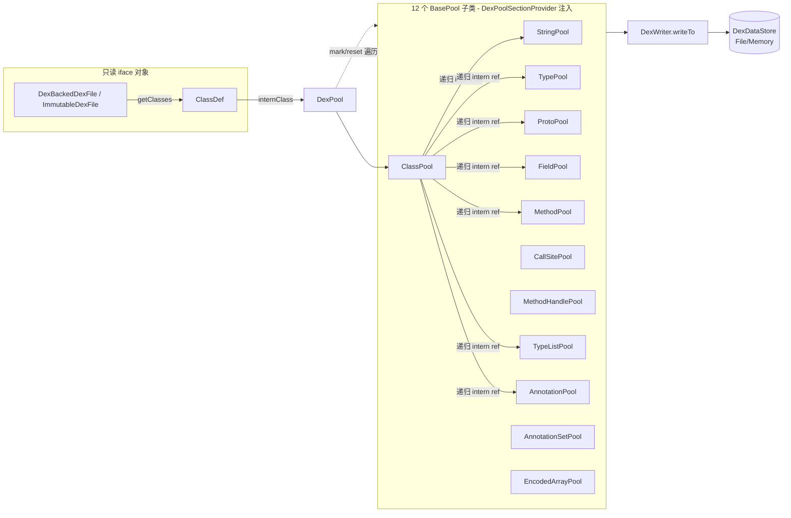

# 🔄 DexPool — iface 对象的池化写入器

`org.jf.dexlib2.writer.pool.DexPool` 是 `DexWriter` 的两个具体子类之一（另一为 `writer/builder/` 下的 `DexBuilder`）。它面向**只读的 `iface` 对象**——典型来源是 `DexBackedDexFile` 反序列化结果或 `ImmutableDexFile`——把其中的 `ClassDef` 逐个 intern 进 12 个常量池去重，再由父类 `DexWriter.writeTo` 按 dex 二进制布局写回磁盘。

与 `DexBuilder` 的关键差异在于：`DexBuilder` 接收 `builder/` 可变对象并产回带 index/offset 的 `Builder*Reference` 供 smali 树 walker 二次回填；而 `DexPool` **只做读侧消费**，不回填引用，适用于"装配/转换一个已存在的 dex"场景（如 baksmali→smali→重装配的中间转换、`DexPool.writeTo(dataStore, input)` 一行式落盘）。源码见 `dexlib2/src/main/java/org/jf/dexlib2/writer/pool/DexPool.java`。

## 🧩 角色定位

- **去重容器**：12 个 `BasePool` 子类（`StringPool`/`TypePool`/`ProtoPool`/`FieldPool`/`MethodPool`/`ClassPool`/`CallSitePool`/`MethodHandlePool`/`TypeListPool`/`AnnotationPool`/`AnnotationSetPool`/`EncodedArrayPool`）以 `LinkedHashMap` 去重并保留插入序。
- **`SectionProvider` 实现者**：通过内部类 `DexPoolSectionProvider` 向父类 `DexWriter` 注入这 12 个池实例（`DexPool.java:234-282`）。
- **EncodedValue 派发器**：实现 `writeEncodedValue` / `internEncodedValue` 两个 `switch`，按 `ValueType` 把编码值分发到对应 section（`DexPool.java:131-232`）。
- **回滚支持**：`mark()`/`reset()` 走遍所有 section 打快照，用于"加一个类导致 method/field 池溢出 65536 时回退最后一个类"的分 dex 策略。

## 🗂️ 关键字段

| 字段 | 类型 | 作用 | 源码 |
|---|---|---|---|
| `sections` | `BasePool<?,?>[]` | 12 个池的数组，专供 `mark()`/`reset()` 遍历（与 `DexWriter.overflowableSections` 分开维护，注释提醒二者须同步） | `DexPool.java:60-74` |
| `stringSection` … `encodedArraySection` | 各 `*Pool` | 继承自父类的 12 个 section 字段，构造期由 `getSectionProvider()` 填充 | `DexWriter.java:149-161` |

## 🔧 关键方法

| 方法 | 作用 | 备注 |
|---|---|---|
| `DexPool(Opcodes)` | 构造，仅传 opcode 集合给父类 | 父类构造器随即调用 `getSectionProvider()` 实例化 12 池（`DexWriter.java:165-192`） |
| `getSectionProvider()` | 返回 `DexPoolSectionProvider` | 每个 `getXxxSection()` `new` 出对应池并回传 `DexPool.this`，使池反向持有外层 |
| `internClass(ClassDef)` | 把一个类及其全部可达引用（父类/接口/字段/方法/注解/静态初始值/调试信息/指令中的 ref）intern 进各池 | 实际逻辑在 `ClassPool.intern`（`ClassPool.java:73`），递归 intern code、reference、debug |
| `static writeTo(DexDataStore, DexFile)` | 一行式：建池 → 遍历类 intern → `writeTo` | 落盘到任意 `DexDataStore`（`MemoryDataStore`/`FileDataStore`） |
| `static writeTo(String path, DexFile)` | 同上，落到文件路径 | 内部包 `FileDataStore`（`DexPool.java:93-99`） |
| `mark()` | 在每个 `Markable` section 记录当前 `internedItems.size()` 作快照 | 见 `BasePool.mark`（`BasePool.java:49`） |
| `reset()` | 删除 mark 之后追加的所有条目 | `BasePool.reset` 用迭代器越过前 N 项后逐个 remove（`BasePool.java:53-70`） |
| `writeEncodedValue(writer, ev)` | 按 `ValueType` 派发到 `InternalEncodedValueWriter.writeXxx` | 18 个分支，覆盖全部编码值类型（`DexPool.java:131-193`） |
| `internEncodedValue(ev)` | intern 编码值内部引用的 string/type/field/method/proto/methodHandle | 递归处理 `ANNOTATION`/`ARRAY`（`DexPool.java:195-232`） |
| `writeTo(DexDataStore)` | 继承自父类，编排 21 个 section 落盘 | 详见 [dex-writer](./dex-writer.md) |

## 📐 类关系与数据流



## ⚙️ 典型用法

### 一行式落盘

```java
// 把任意 DexFile（读侧或不可变）写回磁盘
DexPool.writeTo("/tmp/out.dex", inputDexFile);
```

### 增量 intern + 溢出回滚（多 dex 拆分）

```java
DexPool pool = new DexPool(dexFile.getOpcodes());
for (ClassDef classDef : dexFile.getClasses()) {
    pool.mark();                 // 打快照
    pool.internClass(classDef);  // 递归 intern 该类全部引用
    if (pool.hasOverflowed()) {  // 某池 > 65536
        pool.reset();            // 回退这个类
        pool.writeTo(store);     // 落当前 dex
        pool = new DexPool(dexFile.getOpcodes());
        pool.internClass(classDef);
    }
}
```

`hasOverflowed()` 由父类提供，检查 `typeSection/protoSection/fieldSection/methodSection/callSiteSection/methodHandleSection` 是否越过 `MAX_POOL_SIZE`（65536），`stringSection` 因支持 jumbo 索引、`classSection` 因不会大于 type 池而被排除（`DexWriter.java:182-191`）。

### 编码值 intern 派发

`internEncodedValue` 是 `ClassPool.internStaticInitializers` 等路径的共用工具——例如一个 `EnumEncodedValue` 会被 intern 到 `fieldSection`，`MethodTypeEncodedValue` 到 `protoSection`，从而保证写出时这些池里已有对应条目、index 可解析。

## 🧱 源码要点

- **section 数组与父类 `overflowableSections` 解耦**：`DexPool.sections` 含全部 12 池（供 mark/reset），而父类 `overflowableSections` 只含 6 个 index 池（供溢出判定）。注释 `DexWriter.java:145-147` 明确要求二者保持同步。
- **`SectionProvider` 即工厂**：`DexPoolSectionProvider` 是 `DexWriter.SectionProvider` 的具体实现，每个 getter `new XxxPool(DexPool.this)`——池之间通过共享外层 `DexPool` 互相引用（如 `ClassPool` intern 时调用 `dexPool.stringSection.intern(...)`）。
- **`mark`/`reset` 的语义**：基于 `LinkedHashMap` 的插入序，`mark` 只记一个 `int` 计数，`reset` 用迭代器越过前 N 项后删除其余——O(溢出量) 而非 O(全量)，回滚成本很低（`BasePool.java:53-70`）。
- **`writeEncodedValue` 双向镜像**：写（`writeEncodedValue`，`DexPool.java:131`）调 `writer.writeXxx`，intern（`internEncodedValue`，`DexPool.java:195`）调 `xxxSection.intern`，二者 `switch` 分支一一对应，是编码值在"写"与"去重"两侧的对称实现。

## 延伸阅读

- [dex-writer — 序列化编排骨架](./dex-writer.md)（`DexPool` 的父类，定义 21 section 落盘顺序与签名/校验和）
- [writer — 写入框架总览](./writer.md)（pool 与 builder 两种策略的对比）
- [writer-builder — 可变构造策略](./writer-builder.md)（`DexBuilder`，另一具体子类，回填 index 供 smali 树 walker）
- [immutable — 不可变实现](./immutable.md)（`DexPool` 常见的输入来源 `ImmutableDexFile`）
- [dexbacked — 零拷贝读侧](./dexbacked.md)（`DexBackedDexFile`，另一常见输入来源）
- [iface — 只读接口](./iface.md)（`ClassDef`/`Field`/`Method` 等 `DexPool` 消费的契约）
