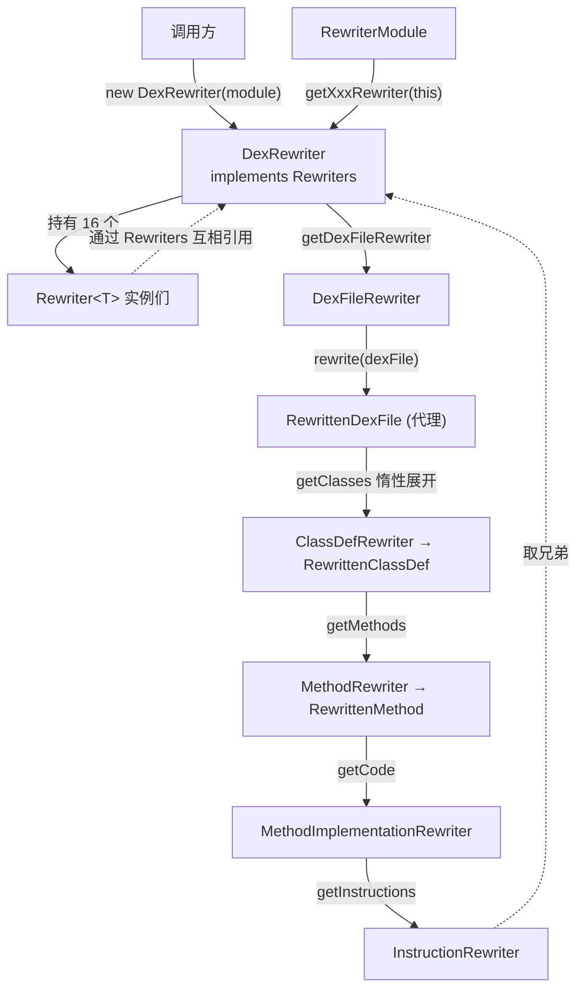
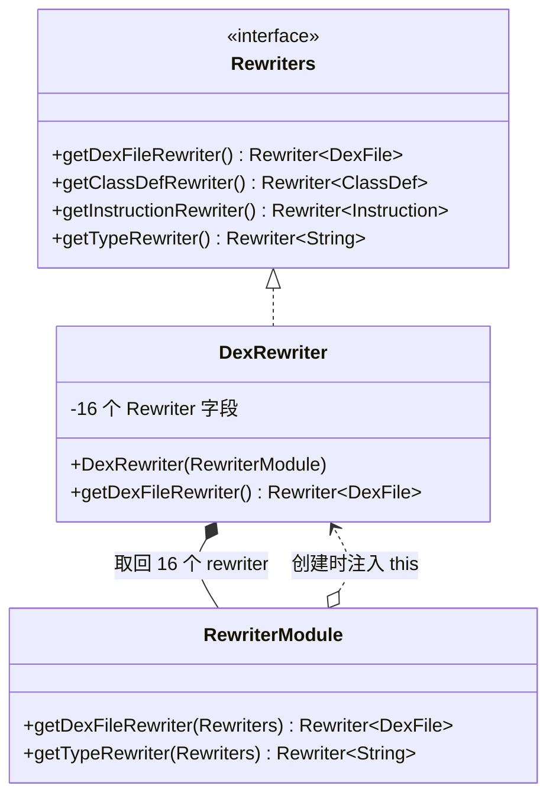

# 🔄 DexRewriter — dex 变换入口

`org.jf.dexlib2.rewriter.DexRewriter` 是 rewriter 变换框架的**顶层聚合器与统一入口**。它本身实现了 `Rewriters` 接口，构造时从一份 `RewriterModule` 取回全部 16 个 rewriter 实例并持有；调用方拿到它之后，通过 `getDexFileRewriter().rewrite(dexFile)` 即可得到一份"被代理包裹、按需改写"的新 `DexFile`。

> 开箱即用时 `DexRewriter(new RewriterModule())` 做的是"逐字节的完美副本"——什么都不改 (`DexRewriter.java:43-67`)。所有改写行为都来自对 `RewriterModule` 某个 `getXxxRewriter` 钩子的覆盖。

## 🧩 角色定位

`DexRewriter` 在 `rewriter` 包中扮演三重身份：

1. **聚合器**——把分散的 16 个 `Rewriter<T>` 实例一次性装进一个对象，调用方不必逐个 new。
2. **`Rewriters` 实现**——构造时把 `this` 作为 `Rewriters` 注入给每个 rewriter (`DexRewriter.java:87-102`)，于是任何子 rewriter 都能通过它取到兄弟 rewriter，形成自洽的改写图（例如 `FieldRewriter` 改字段时调用 `FieldReferenceRewriter`，后者又调用 `TypeRewriter`）。
3. **入口门面**——对外的 API 就是它：拿 `DexFileRewriter` 去包原始 `DexFile`，整张代理对象图就由 `DexFileRewriter.RewrittenDexFile.getClasses()` → `ClassDefRewriter` → `MethodRewriter` → `InstructionRewriter` 一路惰性展开。

## 📦 关键字段

`DexRewriter` 用 16 个 `private final` 字段缓存构造期取回的 rewriter，再由 getter 直接返回。字段即 `Rewriters` 接口的 16 个方法一一对应。

| 字段 | 改写对象 | 备注 |
|------|----------|------|
| `dexFileRewriter` | `DexFile` | 顶层入口，产出 `RewrittenDexFile` 代理 |
| `classDefRewriter` | `ClassDef` | 改写类定义：类型/超类/接口/注解/字段/方法 |
| `fieldRewriter` | `Field` | 委托 `FieldReferenceRewriter` 与 `TypeRewriter` |
| `methodRewriter` | `Method` | 委托 `MethodReferenceRewriter` 与 `MethodParameterRewriter` |
| `methodParameterRewriter` | `MethodParameter` | 保留参数名与签名，仅改类型 |
| `methodImplementationRewriter` | `MethodImplementation` | 改写方法体：指令/try 块/debug |
| `instructionRewriter` | `Instruction` | 按 `Opcode.format` 分发，仅改带 reference 的指令 |
| `tryBlockRewriter` | `TryBlock<? extends ExceptionHandler>` | 改写 try 块及异常类型 |
| `exceptionHandlerRewriter` | `ExceptionHandler` | 改写 handler 的异常类型 |
| `debugItemRewriter` | `DebugItem` | 改写 StartLocal/EndLocal/RestartLocal 的类型 |
| `typeRewriter` | `String`（类型描述符） | 唯一不持有 `Rewriters` 的，含数组维度剥离 |
| `fieldReferenceRewriter` | `FieldReference` | 委托 `TypeRewriter` 改 definingClass/type |
| `methodReferenceRewriter` | `MethodReference` | 委托 `TypeRewriter` 改 definingClass/return/参数类型 |
| `annotationRewriter` | `Annotation` | 改注解类型与可见性 |
| `annotationElementRewriter` | `AnnotationElement` | 改注解元素名与值 |
| `encodedValueRewriter` | `EncodedValue` | 按 `ValueType` 分发：type/field/method/enum/array/annotation |

## ⚙️ 关键方法

| 方法 | 作用 | 备注 |
|------|------|------|
| `DexRewriter(RewriterModule module)` | 唯一构造器，向 module 传入 `this` 取回 16 个 rewriter | `DexRewriter.java:86-103` |
| `getDexFileRewriter()` | 返回顶层 `Rewriter<DexFile>` | 调用方通常由此起步：`.rewrite(dexFile)` |
| `getClassDefRewriter()` | 返回类定义改写器 | 被 `DexFileRewriter.RewrittenDexFile.getClasses()` 调用 |
| `getInstructionRewriter()` | 返回指令改写器 | 仅对带 reference 的 format 生成代理 |
| `getTypeRewriter()` | 返回类型字符串改写器 | 数组维度在此剥离 |
| `getFieldReferenceRewriter()` / `getMethodReferenceRewriter()` | 引用改写器 | 委托 `TypeRewriter` |
| `getAnnotationRewriter()` / `getEncodedValueRewriter()` | 注解/编码值改写器 | 默认实现见 `RewriterModule.java:96-106` |
| 其余 7 个 `getXxxRewriter()` | 透传字段 | 纯 getter，返回构造期缓存 (`DexRewriter.java:105-120`) |

> 注意：`DexRewriter` 本身不实现 `rewrite()` 逻辑——真正"改"的工作在各 `XxxRewriter` 类里；它只负责把它们装配起来并对外暴露。

## 📐 类关系与改写数据流





## 🔍 源码要点

- **构造即注入**：构造器把自身作为 `Rewriters` 传给 module 的每个 `getXxxRewriter(this)` (`DexRewriter.java:86-103`)。这是 rewriter 之间能互相取兄弟 rewriter 的根因——例如 `FieldReferenceRewriter` 改 `definingClass` 时调 `rewriters.getTypeRewriter()`。
- **字段与 getter 一一对应**：16 个 `private final` 字段 (`DexRewriter.java:69-84`) 与 16 个 `@Override` getter (`DexRewriter.java:105-120`) 完全对称，纯透传，无任何额外逻辑——这保证了"module 决定行为、DexRewriter 只装配"的清晰边界。
- **默认行为是空操作**：`RewriterModule` 各工厂方法默认 `new` 出对应的 `XxxRewriter(rewriters)`，而这些 rewriter 的 `rewrite()` 只是把原对象包成 `RewrittenXxx` 代理；代理在被读取时再递归委托，最终不改任何值即得"完美副本"。源码注释明确说明这一点 (`DexRewriter.java:43-67`)。
- **惰性、零拷贝**：改写不产生新对象图，`RewrittenDexFile.getClasses()` 返回 `RewriterUtils.rewriteSet(...)` 的懒视图 (`RewriterUtils.java:47-71`)，遍历时才逐元素调 rewriter。

## ⚙️ 典型用法

### 全局重命名类型（来自源码 javadoc 示例）

`DexRewriter.java:50-66` 给出的经典示例——把某个类名整体改名，定义与所有引用一并替换，只需覆盖 `getTypeRewriter` 一个钩子：

```java
DexRewriter rewriter = new DexRewriter(new RewriterModule() {
    @Override
    public Rewriter<String> getTypeRewriter(Rewriters rewriters) {
        return new Rewriter<String>() {
            @Override
            public String rewrite(String value) {
                if (value.equals("Lorg/blah/MyBlah;")) {
                    return "Lorg/blah/YourBlah;";
                }
                return value;
            }
        };
    }
});
DexFile rewrittenDexFile = rewriter.getDexFileRewriter().rewrite(dexFile);
```

只覆盖 `getTypeRewriter` 一个钩子，依赖它的兄弟（`ClassDefRewriter` 的 type/superclass/interfaces、`MethodReferenceRewriter` 的 definingClass/return/参数、`FieldReferenceRewriter`、`InstructionRewriter` 的 TYPE 引用、注解/异常/debug/`EncodedValue` 中的 TYPE……）会一并改写。

### 物化与落盘

`DexRewriter` 产出的是惰性代理 `DexFile`，可直接喂给 writer 序列化，或先经 `ImmutableDexFile` 固化：

```java
DexFile rewritten = rewriter.getDexFileRewriter().rewrite(dexFile);
// 直接落盘
DexPool pool = new DexPool(Opcodes.getDefault());
// ... 将 rewritten 的 classes 加入 pool 后写入 dex
// 或物化为不可变对象图
ImmutableDexFile frozen = new ImmutableDexFile(rewritten.getOpcodes(), rewritten.getClasses());
```

## 🗂️ 与相关类的协作

- **`RewriterModule`**：`DexRewriter` 的唯一构造参数，决定 16 个 rewriter 的具体实现。覆盖其钩子即定制行为。
- **`Rewriters`**：`DexRewriter` 实现的接口，是子 rewriter 互相取兄弟的契约。
- **`Rewriter<T>`**：每个字段的元素类型，单点改写函数 `T rewrite(T)` (`Rewriter.java:36-39`)。
- **`DexFileRewriter` / 各 `XxxRewriter`**：实际承担改写逻辑的兄弟类，`DexRewriter` 只是它们的容器。
- **`iface/`**：代理对象全部实现 `iface` 接口，故改写后的 `DexFile` 对 `writer/`、`baksmali`、`analysis/` 完全透明。
- **`immutable/` + `writer/`**：改写后通常经 `ImmutableDexFile` 固化或直接交 `DexPool` 序列化，完成"读 → 改 → 写"流水线。

## 延伸阅读

- [rewriter — 变换层（包总览）](./rewriter.md)
- [iface — 只读接口层](./iface.md)
- [iface — 引用接口](./iface-reference.md)
- [base — 公共基类](./base.md)
- [immutable — 不可变实现](./immutable.md)
- [writer — 序列化写入层](./writer.md)
