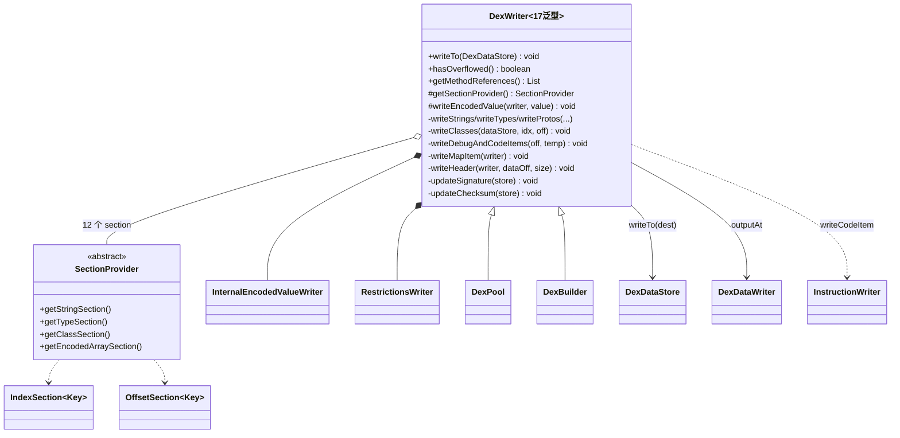
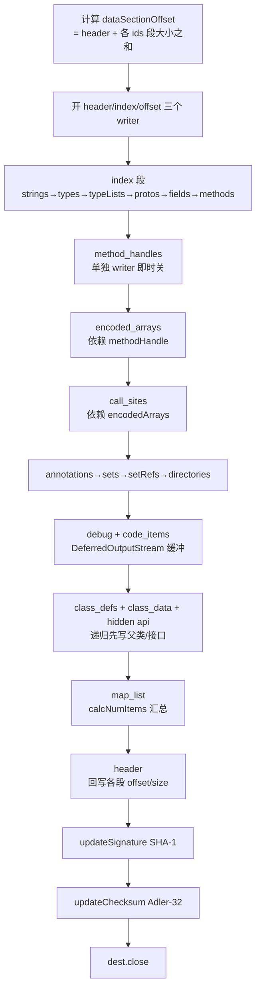

# 📦 DexWriter — dex 序列化编排骨架

`org.jf.dexlib2.writer.DexWriter` 是整个 writer 包的**抽象泛型骨架**：它定义了"把内存中的 dex 对象编排成符合规范的字节流"的全套流程，但不规定对象如何去重（intern）、如何取索引——这两件事交给具体子类 `DexPool`（消费 `iface` 对象）与 `DexBuilder`（消费 `builder/` 可变对象，产回带索引的引用供树 walker 回填）。

它的设计是**模板方法 + 策略**：`writeTo(DexDataStore)` 这一固化流程驱动 12 个 section 按依赖顺序落盘，最后回写 header、计算 SHA-1 签名与 Adler-32 校验和。详见 `dexlib2/src/main/java/org/jf/dexlib2/writer/DexWriter.java`。

## 🧩 角色定位

- **编排者**：按 dex 段顺序（index 段 → 无依赖 data 段 → 有依赖 data 段 → map → header）串起 20+ 个 `write*` 私有方法。
- **去重入口的对端**：intern 由各 `Section` 完成，`DexWriter` 只负责在写入前排序、写入时回填 index/offset 到 `Map.Entry` 的 value。
- **签名/校验和的终结算子**：所有字节落盘后，`updateSignature` / `updateChecksum` 对全文件做 SHA-1 与 Adler-32。
- **泛型中立**：17 个泛型参数把"键类型"全部参数化，使同一套逻辑跑通 pool 与 builder 两种策略。

## 🗂️ 关键字段

### 常量

| 字段 | 值 | 作用 |
|---|---|---|
| `NO_INDEX` | `-1` | 表示"尚无索引"（写入前 sentinel，递归写类时也用作防重入标记） |
| `NO_OFFSET` | `0` | 表示"无偏移"（如无 class_data 的类、空 annotation set） |
| `MAX_POOL_SIZE` | `1 << 16` | 65536，索引型常量池的 16-bit 上限，`hasOverflowed()` 据此判定 |

### Section 持有（来自 `SectionProvider`，`DexWriter.java:149-161`）

| 字段 | 类型 | 对应 dex 段 |
|---|---|---|
| `stringSection` | `StringSectionType` | `string_ids` + `string_data` |
| `typeSection` | `TypeSectionType` | `type_ids` |
| `protoSection` | `ProtoSectionType` | `proto_ids` |
| `fieldSection` | `FieldSectionType` | `field_ids` |
| `methodSection` | `MethodSectionType` | `method_ids` |
| `classSection` | `ClassSectionType` | `class_defs` + `class_data` + annotations |
| `callSiteSection` | `CallSiteSectionType` | `call_site_ids` |
| `methodHandleSection` | `MethodHandleSectionType` | `method_handles` |
| `typeListSection` | `TypeListSectionType` | `type_lists` |
| `annotationSection` | `AnnotationSectionType` | `annotations` |
| `annotationSetSection` | `AnnotationSetSectionType` | `annotation_sets` |
| `encodedArraySection` | `EncodedArraySectionType` | `encoded_arrays`（静态初始值、call site） |

### 段偏移缓存（`DexWriter.java:115-136`）

约 18 个 `*Offset`/`*SectionOffset` int 字段，在 `write*` 中赋值、在 `writeHeader`/`writeMapItem` 中读取。如 `stringIndexSectionOffset`、`classDataSectionOffset`、`codeSectionOffset`、`mapSectionOffset` 等。

### 计数器（`DexWriter.java:139-143`）

`numAnnotationSetRefItems`、`numAnnotationDirectoryItems`、`numDebugInfoItems`、`numCodeItemItems`、`numClassDataItems`——这些段无法直接 ` getItemCount()`（写入时才确定数量），故边写边数，供 `writeMapItem` 使用。

## ⚙️ 关键方法

### 公开入口

| 方法 | 作用 | 备注 |
|---|---|---|
| `writeTo(DexDataStore dest)` | 写入到 `dest`，用内存延迟流 | `DexWriter.java:308`，便捷重载 |
| `writeTo(DexDataStore dest, DeferredOutputStreamFactory tempFactory)` | 完整入口，code 段用 `tempFactory` 延迟落盘 | `DexWriter.java:312` |
| `hasOverflowed()` | 任一索引池 > 65536 即 true | `DexWriter.java:291`，多 dex 切分依据 |
| `hasOverflowed(int maxPoolSize)` | 自定义上限判定 | `DexWriter.java:301` |
| `getMethodReferences()` / `getFieldReferences()` / `getTypeReferences()` | 返回各池的字符串描述列表 | 供 baksmali `find`/诊断用 |

### 抽象/可重写

| 方法 | 作用 | 备注 |
|---|---|---|
| `getSectionProvider()` | 返回 12 个 section 的工厂 | 子类实现，`DexWriter.java:194` |
| `writeEncodedValue(InternalEncodedValueWriter, EncodedValue)` | 委托写 encoded value | 子类决定如何递归编码 |

### 编排私有方法（按 `writeTo` 调用顺序）

| 方法 | 写出的段 | 依赖 |
|---|---|---|
| `writeStrings` | `string_ids` + `string_data` | 无，按 `toString` 排序 |
| `writeTypes` | `type_ids` | string index |
| `writeTypeLists` | `type_lists` | type index |
| `writeProtos` | `proto_ids` | string/type/typeList offset |
| `writeFields` | `field_ids` | type/string index |
| `writeMethods` | `method_ids` | type/proto/string index |
| `writeMethodHandles` | `method_handles` | field/method index，**单独开 writer 即时关闭** |
| `writeEncodedArrays` | `encoded_arrays` | methodHandle（间接） |
| `writeCallSites` | `call_site_ids` | encodedArray offset，**单独开 writer** |
| `writeAnnotations` / `writeAnnotationSets` / `writeAnnotationSetRefs` / `writeAnnotationDirectories` | 注解四件套 | annotation offset；directory 用临时 `ByteBuffer` 先计数再落盘 |
| `writeDebugAndCodeItems` | `debug_info` + `code_items` | 用 `DeferredOutputStream` 先缓冲 code，算完偏移再回写到 method |
| `writeClasses` | `class_defs` + `class_data` + hidden api | 递归先写父类/接口；可选写 hidden api restrictions |
| `writeMapItem` | `map_list` | 全部 offset 已就绪 |
| `writeHeader` | `header_item` | 各段 size/offset |
| `updateSignature` / `updateChecksum` | 签名/校验和 | SHA-1 / Adler-32，最后一步 |

### 辅助内部类

| 类 | 作用 |
|---|---|
| `SectionProvider`（抽象内部类，`DexWriter.java:1579`） | 12 个 section 的工厂契约 |
| `InternalEncodedValueWriter`（`DexWriter.java:232`） | 绑定本 writer 各 section 的 `EncodedValueWriter` 子类，把 `writeEncodedValue` 回调到外层子类 |
| `RestrictionsWriter`（`DexWriter.java:551`） | 写 `hiddenapi_class_data`，用"先留 offset 位、延迟写 entries"策略处理空白项 |
| `CodeItemOffset<MethodKey>`（`DexWriter.java:994`） | 缓存 method→code 偏移，code 落盘后统一回填 |

## 📐 类关系图



## 🔄 写入数据流

`writeTo` 的固化流程（`DexWriter.java:312-369`）：



> 顺序不可乱：`encoded_arrays` 依赖 `method_handles` 偏移，`call_sites` 依赖 `encoded_arrays` 偏移，`class_defs` 依赖 `call_sites`+`method_handles`。故这两段被单独开 writer 并即时关闭（`DexWriter.java:329-348`）。`writeClass` 递归先写父类与接口，符合 dex 规范对 class_defs 排序的约束（`DexWriter.java:640-718`）。

## 🔍 源码要点

- **三 writer 并行**：`writeTo` 同时开 `headerWriter`(offset 0)、`indexWriter`(offset `HEADER_ITEM_SIZE`)、`offsetWriter`(offset `dataSectionOffset`)，三段并行写入同一 `DexDataStore`（`DexWriter.java:316-318`）。`dataSectionOffset` 由 `getDataSectionOffset()` 按 section 数量 × `ITEM_SIZE` 累加得到（`DexWriter.java:244-254`）。
- **排序即规范**：strings/types 按 `toString`，protos/fields/methods 按 key `Comparable`，classes 按类型排序；写入时 `entry.setValue(index++)` 回填索引（`DexWriter.java:419-495`）。
- **递归写类防重入**：`writeClass` 先把 `entry.setValue(0)` 作 sentinel 防止递归重复写，再递归父类/接口，最后才写自己并赋真索引（`DexWriter.java:654-669`）。
- **jumbo 修复**：`writeDebugAndCodeItems` 中若某 `CONST_STRING` 引用的 string index ≥ 65536，则把方法体改成 `MutableMethodImplementation` 并 `fixInstructions` 替换为 `CONST_STRING_JUMBO`（`DexWriter.java:1027-1048`、`fixInstructions` `1079-1094`）。
- **annotation directory 内存缓冲**：`writeAnnotationDirectories` 先把 field/method/param 注解写进 `ByteBuffer` 计数，再决定是否落盘，并对"只有类注解"的 directory 做 intern 去重（`DexWriter.java:909-992`）。
- **hidden API**：仅当 `hasHiddenApiRestrictions && opcodes.api >= 29` 时写 `hiddenapi_class_data`；`RestrictionsWriter` 用"留 offset 位 + 延迟 entries"策略跳过全空白类（`DexWriter.java:547-630`）。
- **签名/校验和**：`updateSignature` 从 `SIGNATURE_DATA_START_OFFSET` 起算 SHA-1 写回 `SIGNATURE_OFFSET`；`updateChecksum` 从 `CHECKSUM_DATA_START_OFFSET` 起 Adler-32 写回（`DexWriter.java:371-413`）。
- **溢出集合**：`overflowableSections` = {type, proto, field, method, callSite, methodHandle}；string 注释为"支持 jumbo 故不溢出"，class 因"不会大于 type 段"被省略（`DexWriter.java:182-191`）。

## ⚙️ 典型用法

子类提供具体策略，调用方一般不直接 `new DexWriter`，而是用 `DexPool` 或 `DexBuilder`：

```java
// pool 策略：直接消费任意 iface.DexFile（DexPool.java:84/93）
DexPool.writeTo(new FileDataStore(new File("out.dex")), inputDexFile);
DexPool.writeTo("out.dex", inputDexFile);

// 多 dex 落盘 + 溢出回滚（DexPool.java:114/125）
DexPool dexPool = new DexPool(opcodes);
for (ClassDef c : allClasses) {
    dexPool.mark();
    dexPool.internClass(c);
    if (dexPool.hasOverflowed()) {            // DexWriter.java:291
        dexPool.reset();
        dexPool.writeTo(curStore);
        dexPool = new DexPool(opcodes);
        dexPool.internClass(c);
    }
}

// builder 策略：smali 汇编终点，intern 返回带索引的 BuilderReference（DexBuilder.java:162/173/184/107）
DexBuilder dexBuilder = new DexBuilder(opcodes);
BuilderStringReference str = dexBuilder.internStringReference("hello");
BuilderTypeReference type = dexBuilder.internTypeReference("Lcom/ex/Foo;");
BuilderFieldReference field = dexBuilder.internFieldReference(fieldRef);
BuilderClassDef cls = dexBuilder.internClassDef(
        "Lcom/ex/Foo;", accessFlags, superclass, interfaces,
        sourceFile, annotations, fields, methods);
dexBuilder.writeTo(new FileDataStore(new File("out.dex")));
```

`DexPool` / `DexBuilder` 的 `getSectionProvider()` 各自提供 12 个 section 的 pool/builder 实现，`writeEncodedValue` 各自委托给 `EncodedValueWriter` 的具体子类。

## 延伸阅读

- [writer — 序列化写入层](./writer.md)（DexWriter 所在包总览）
- [writer/builder — DexBuilder 策略](./writer-builder.md)（builder 子类与 BuilderReference）
- [iface — 接口层](./iface.md)（writer 消费的只读契约）
- [iface/reference — 引用接口](./iface-reference.md)（被 intern 的对象）
- [immutable — 不可变实现](./immutable.md)（DexPool 的典型输入）
- [util — 工具类](./util.md)（`MethodUtil.getParameterRegisterCount` 被 writeCodeItem 调用）
