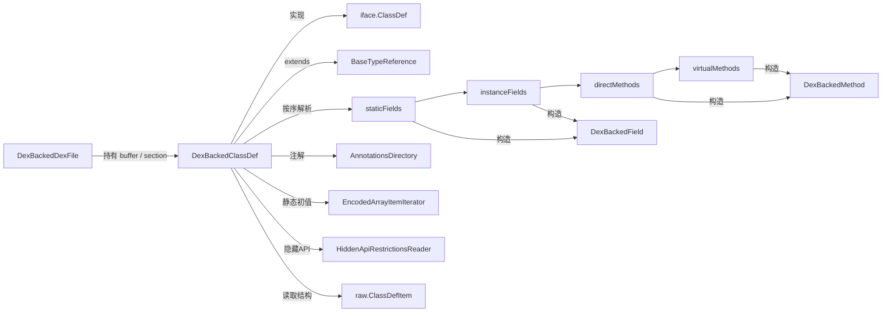

# 📦 DexBackedClassDef 零拷贝类定义

`DexBackedClassDef` 是 dexlib2 中 `dexbacked/` 包的核心类之一，它实现了 `org.jf.dexlib2.iface.ClassDef` 接口，以**零拷贝、懒解析**的方式表示一个 dex 文件中的类定义。它不复制任何字节，只在被访问时按需从底层 `DexBuffer` 中读取对应偏移的数据，是 baksmali 反汇编和只读 dex 分析的默认入口。

源码位置：`dexlib2/src/main/java/org/jf/dexlib2/dexbacked/DexBackedClassDef.java`

## 🎯 角色定位

dexlib2 采用分层设计：`iface/` 定义只读契约，`dexbacked/` 直接映射字节，`immutable/` 完全物化。`DexBackedClassDef` 属于 `dexbacked/` 层，与 `DexBackedDexFile`、`DexBackedField`、`DexBackedMethod` 协同工作。

它的关键特征：

- **零拷贝**：只持有 `DexBackedDexFile` 引用和 `classDefOffset`，不缓存字段/方法列表。
- **懒解析**：字段、方法集合返回的是 `Iterable` + `Iterator`，元素在迭代时才构造。
- **顺序推进**：四类成员（staticFields → instanceFields → directMethods → virtualMethods）在 `class_data_item` 中连续存储，前一段的末尾偏移作为下一段的起点。
- **去重支持**：`getStaticFields(boolean)` 等 overload 可跳过 proguard/重复定义产生的重复项。
- **隐藏 API**：通过内部类 `HiddenApiRestrictionsReader` 按需读取 hidden API 标记。

## 🔄 类协作关系



## 🗂️ 关键字段

| 字段 | 类型 | 作用 |
|------|------|------|
| `dexFile` | `DexBackedDexFile` | 宿主 dex，提供 buffer 与 section 查询（`file:62`） |
| `classDefOffset` | `int` | `class_def_item` 在 dex 中的起始偏移 |
| `hiddenApiRestrictionsReader` | `HiddenApiRestrictionsReader` | 可空；隐藏 API 限制读取器（`file:64`） |
| `staticFieldsOffset` | `int` | 静态字段段起始偏移，构造时即解析（`file:66`） |
| `instanceFieldsOffset` | `int` | 实例字段段偏移，懒推导 |
| `directMethodsOffset` | `int` | 直接方法段偏移，懒推导 |
| `virtualMethodsOffset` | `int` | 虚方法段偏移，懒推导 |
| `*Count` | `int` | 四类成员数量，构造时从 ULEB128 读取（`file:71-74`） |
| `annotationsDirectory` | `AnnotationsDirectory` | 注解目录，懒加载并缓存 |

## 🔍 关键方法

| 方法 | 作用 | 备注 |
|------|------|------|
| `getType()` | 返回类类型字符串（如 `Lcom/x;`） | 通过 `typeSection` 反查（`file:108`） |
| `getSuperclass()` | 返回父类类型，无则 `null` | 用 `getOptional` 处理 0 值（`file:116`） |
| `getAccessFlags()` | 访问标志位 | 直接读 `access_flags` uint |
| `getSourceFile()` | 源文件名 | 可空 |
| `getInterfaces()` | 实现的接口列表 | 返回随机访问 `AbstractList`（`file:135`） |
| `getAnnotations()` | 类级注解集合 | 委托给 `AnnotationsDirectory` |
| `getStaticFields(boolean)` | 静态字段迭代 | `skipDuplicates=true` 跳过重复 |
| `getInstanceFields(boolean)` | 实例字段迭代 | 副作用：消费完会写入 `directMethodsOffset` |
| `getDirectMethods(boolean)` | 直接方法迭代 | 副作用：写入 `virtualMethodsOffset` |
| `getVirtualMethods(boolean)` | 虚方法迭代 | 段尾，无后续偏移可写 |
| `getFields()` / `getMethods()` | 字段/方法合集 | `Iterables.concat` 拼接两段 |
| `getSize()` | 估算该类占用字节数 | 累加 class_def + type_id + 接口 + 注解 + class_data + 成员 |
| `getInstanceFieldsOffset()` 等 | 推导下一段偏移 | 需先用 `skipFields` 跳过前段（`file:466`） |

## 📐 解析数据流

构造函数中（`file:78-105`）读取 `class_data_item` 偏移，若为 0 则四类计数全置 0；否则用 `DexReader` 连续读四个 ULEB128 计数，记录静态字段起点。后续三段的偏移是**链式推导**的：迭代静态字段时把游标末尾写入 `instanceFieldsOffset`，实例字段末尾写入 `directMethodsOffset`，以此类推。

每个成员在 `VariableSizeLookaheadIterator` 中构造，lookahead 机制使其能跳过重复项而不破坏后续偏移记录。

## ⚙️ 典型用法

从 dex 文件遍历所有类的标准模式：

```java
DexBackedDexFile dex = DexFileFactory.loadDexFile(file, Opcodes.getDefault());
for (DexBackedClassDef cls : dex.getClasses()) {
    String type = cls.getType();                  // Lcom/example/Foo;
    String sup  = cls.getSuperclass();            // Ljava/lang/Object;
    int access = cls.getAccessFlags();
    for (DexBackedField f : cls.getStaticFields()) {
        // f.getName(), f.getType(), f.getAccessFlags() ...
    }
    for (DexBackedMethod m : cls.getMethods()) {  // = direct ++ virtual
        // m.getName(), m.getSignature() ...
    }
}
```

需要保留/修改时，改用 `org.jf.dexlib2.immutable.ImmutableClassDef` 物化副本；或用 `rewriter/` 做就地变换。

## 🧩 源码要点

- 构造时**只解析计数**，不预读成员，保证小代价实例化（`file:92-98`）。
- `getInstanceFieldsOffset()` 在 `instanceFieldsOffset` 未填充时，调用 `DexBackedField.skipFields` 快速跳过静态字段段以推导位置（`file:466-474`），避免必须完整迭代。
- `HiddenApiRestrictionsReader` 是内部类，按相同的四段顺序读取 `hidden_api_item` 的 ULEB128 数组，并在段尾记录下一段起点（`file:558-662`），与成员迭代逻辑严格对齐。
- `getInterfaces()` 返回的是基于偏移的随机访问 `AbstractList`，`get(index)` 每次直接读 ushort，O(1) 但每次访问都触底 buffer（`file:140-149`）。
- `getSize()` 注释明确说明其估算不含共享 annotation_item 的潜在重复，是"私有大小"概念（`file:496-504`）。

## 延伸阅读

- [DexBackedDexFile](./dexbacked-dexfile.md) — 宿主文件与 section 查询
- ClassDef 接口 — 只读契约
- baksmali disassemble 命令 — 在 CLI 中消费 `DexBackedClassDef`
