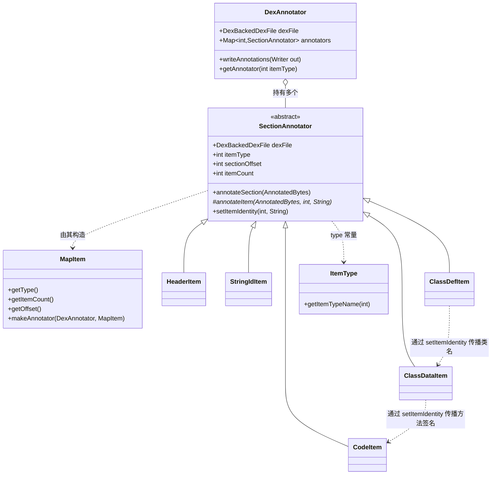

# 🗂️ dexbacked/raw — 原始结构解析

`org.jf.dexlib2.dexbacked.raw` 包是 dexlib2 中**最贴近 dex 二进制格式**的一层。与 `dexbacked/` 下的 `DexBackedClassDef` 等「面向对象」视图不同，本包的每个类几乎与 dex spec 中的某个 item type 一一对应，封装该 item 的字段偏移常量、`makeAnnotator` 工厂方法，以及把索引/偏移翻译成人类可读字符串的 `getReferenceAnnotation` / `asString` 辅助方法。

它服务于一个核心场景：**`baksmali dump`** —— 把整个 dex 文件按字节带注解地输出（hex dump + 字段含义），用于逆向分析与格式调试。

## 📐 包定位

- **输入**：一个已解析的 `DexBackedDexFile`（含 `MapItem` 列表与原始 `DexBuffer`）。
- **输出**：写入 `AnnotatedBytes`（带偏移注释的字节缓冲），最终由 `AnnotatedBytes.writeAnnotations` 渲染成 hex 文本。
- **零修改**：本包只读不写，不构造任何 `iface/` 或 `immutable/` 对象。
- **粒度**：item 级别 —— 解码每个 4 字节字段、每个 ULEB128、每条指令，但**不做类型推断**（那是 `analysis/` 的职责）。

## 🧩 核心抽象

整个包围绕两个抽象构建：

### `SectionAnnotator` — 段注解器基类

`dexlib2/src/main/java/org/jf/dexlib2/dexbacked/raw/SectionAnnotator.java:44`

```java
public abstract class SectionAnnotator {
    public final DexAnnotator annotator;
    public final DexBackedDexFile dexFile;
    public final int itemType;
    public final int sectionOffset;
    public final int itemCount;

    @Nonnull public abstract String getItemName();
    protected abstract void annotateItem(@Nonnull AnnotatedBytes out, int itemIndex,
                                         @Nullable String itemIdentity);

    public void annotateSection(@Nonnull AnnotatedBytes out);      // 遍历 itemCount 个 item
    protected int getItemOffset(int itemIndex, int currentOffset);  // 默认按 1 对齐
    public int getItemAlignment() { return 1; }                      // TypeList 等覆盖为 4
    public void setItemIdentity(int itemOffset, String identity);    // 跨段身份传播
}
```

每个具体 item 类通过 `static makeAnnotator(DexAnnotator, MapItem)` 返回一个匿名子类，实现 `getItemName()` 与 `annotateItem()`。`annotateItem` 内部用 `out.annotate(n, "fmt", args)` 标注连续 `n` 个字节。

### `DexAnnotator` — 注解编排器

`dexlib2/src/main/java/org/jf/dexlib2/dexbacked/raw/util/DexAnnotator.java:50`，继承自 `AnnotatedBytes`。构造时遍历 `dexFile.getMapItems()`，按 `ItemType` 给每个段注册对应的 `SectionAnnotator`；`writeAnnotations(Writer)` 按**依赖顺序**（见下文）逐段调用 `annotateSection`，最后落盘。

## 📦 类清单

| 类名 | 对应 item type | 职责 | 关键方法 |
|---|---|---|---|
| `ItemType` | — | item type 常量（0x0000…0xF000）与名称表 | `getItemTypeName(int)` |
| `HeaderItem` | `HEADER_ITEM` (0x0000) | dex 头部 0x70 字节字段偏移、magic/版本校验 | `verifyMagic`, `getVersion`, `getMagicForApi`, `makeAnnotator` |
| `MapItem` | `MAP_LIST` (0x1000) | map_list 中的单条目（type/size/offset） | `getType`, `getItemCount`, `getOffset`, `makeAnnotator` |
| `StringIdItem` | `STRING_ID_ITEM` | string_ids：偏移指针到 string_data | `getReferenceAnnotation`, `makeAnnotator` |
| `TypeIdItem` | `TYPE_ID_ITEM` | type_ids：指向 descriptor 字符串 | `getReferenceAnnotation`, `getOptionalReferenceAnnotation` |
| `ProtoIdItem` | `PROTO_ID_ITEM` | proto_ids：shorty/返回/参数 | `asString`, `getProtos` |
| `FieldIdItem` | `FIELD_ID_ITEM` | field_ids：class/type/name | `asString`, `getFields` |
| `MethodIdItem` | `METHOD_ID_ITEM` | method_ids：class/proto/name | `asString`, `getMethods` |
| `ClassDefItem` | `CLASS_DEF_ITEM` | class_def 32 字节定长项 | `asString`, `getClasses` |
| `CallSiteIdItem` | `CALL_SITE_ID_ITEM` | callsite_ids（dex 38+） | `makeAnnotator` |
| `MethodHandleItem` | `METHOD_HANDLE_ITEM` | method_handle_items（dex 38+） | `makeAnnotator` |
| `TypeListItem` | `TYPE_LIST` | 类型列表（4 字节对齐） | `asString`, `getReferenceAnnotation` |
| `AnnotationSetRefList` | `ANNOTATION_SET_REF_LIST` | 方法参数注解引用列表 | `getReferenceAnnotation` |
| `AnnotationSetItem` | `ANNOTATION_SET_ITEM` | 注解集合 | `getReferenceAnnotation` |
| `ClassDataItem` | `CLASS_DATA_ITEM` | 类体：字段+方法（ULEB128 编码） | `makeAnnotator`（内部 `annotateEncodedField/Method`） |
| `CodeItem` | `CODE_ITEM` | 方法字节码、寄存器、try/catch | `makeAnnotator`，含 `CDEX_*` 偏移常量与 `TryItem` 内部类 |
| `StringDataItem` | `STRING_DATA_ITEM` | MUTF-8 字符串数据 | `makeAnnotator` |
| `DebugInfoItem` | `DEBUG_INFO_ITEM` | 行号/局部变量调试信息 | `makeAnnotator` |
| `AnnotationItem` | `ANNOTATION_ITEM` | 单条注解（visibility+encoded_annotation） | `getReferenceAnnotation` |
| `EncodedArrayItem` | `ENCODED_ARRAY_ITEM` | 静态初始值数组 | `makeAnnotator` |
| `AnnotationDirectoryItem` | `ANNOTATION_DIRECTORY_ITEM` | 类注解目录 | `makeAnnotator` |
| `EncodedValue` | — | encoded_value/encoded_array/encoded_annotation 解码 | `annotateEncodedValue`, `annotateEncodedArray`, `asString` |
| `HiddenApiClassDataItem` | `HIDDENAPI_CLASS_DATA_ITEM` (0xF000) | hidden API 访问限制表 | `makeAnnotator` |
| `OdexHeaderItem` | — | .odex 头部（40 字节） | `getVersion`, `getDexOffset` |
| `CdexHeaderItem` | — | compact dex 扩展头部字段 | `annotateCdexHeaderFields`, `getVersion` |
| `CdexDebugOffsetTable` | — | cdex debug info 偏移表 | `annotate` |
| `util/DexAnnotator` | — | 编排器，组装所有 SectionAnnotator | `writeAnnotations`, `getAnnotator` |

## 🔄 类关系与数据流



数据流：`DexBackedDexFile` → `getMapItems()` → `DexAnnotator` 构造时按 `MapItem.type` 调用各 `XxxItem.makeAnnotator` → `writeAnnotations` 按 `sectionAnnotationOrder` 排序后逐段 `annotateSection` → 每个 `annotateItem` 调 `out.annotate(n, ...)` 写注释 → `AnnotatedBytes` 渲染 hex 文本。

## ⚙️ 段顺序与身份传播

`DexAnnotator.sectionAnnotationOrder`（`util/DexAnnotator.java:57`）定义了一个**非文件物理顺序**的注解顺序，目的是让「被引用者」先于「引用者」解析，从而把人类可读身份（类名、方法签名）**前向传播**给后续段：

```java
// 摘自 DexAnnotator.java:56
int[] sectionOrder = new int[] {
    ItemType.MAP_LIST,
    ItemType.HEADER_ITEM, ItemType.STRING_ID_ITEM, ItemType.TYPE_ID_ITEM,
    ItemType.PROTO_ID_ITEM, ItemType.FIELD_ID_ITEM, ItemType.METHOD_ID_ITEM,
    ItemType.CALL_SITE_ID_ITEM, ItemType.METHOD_HANDLE_ITEM,
    // 这些必须按此顺序，身份才能传播
    ItemType.CLASS_DEF_ITEM,   // 把类名传给 class_data
    ItemType.CLASS_DATA_ITEM,  // 把方法签名传给 code_item
    ItemType.CODE_ITEM,
    ItemType.DEBUG_INFO_ITEM,
    ItemType.TYPE_LIST, ItemType.ANNOTATION_SET_REF_LIST, /* ... */
    ItemType.HIDDENAPI_CLASS_DATA_ITEM
};
```

传播机制：`ClassDefItem.annotateItem` 读到 `class_data_off` 时调 `classDataAnnotator.setItemIdentity(offset, 类名)`（`ClassDefItem.java:101`）；`ClassDataItem` 读到 `code_off` 时调 `codeItemAnnotator.setItemIdentity(offset, 方法签名)`（`ClassDataItem.java:162`）。这样 `CodeItem` 段输出时就能在每个 code_item 头部打印它属于哪个方法，而无需反向查找。

## 🔍 典型用法

### 调用 DexAnnotator 生成 dump

`baksmali` 的 `dump` 子命令核心路径（简化）：

```java
// dexFile 已由 DexFileFactory.loadDexFile 解析
DexAnnotator annotator = new DexAnnotator(dexFile, /*width=*/ 8);
try (Writer writer = new OutputStreamWriter(out, Charsets.UTF_8)) {
    annotator.writeAnnotations(writer);   // 输出 hex + 注解
}
```

`writeAnnotations` 内部对 `CDexBackedDexFile` 还会先注解 cdex 的 debug info 偏移表（`util/DexAnnotator.java:180`）。

### 索引到可读字符串

各 id item 提供 `getReferenceAnnotation`，被其它 annotator 大量调用以解析交叉引用：

```java
// MethodIdItem.java:69 — 把方法索引翻译成 Lcom/foo/Bar;->doIt(II)V
public static String asString(@Nonnull DexBackedDexFile dexFile, int methodIndex) {
    int methodOffset = dexFile.getMethodSection().getOffset(methodIndex);
    int classIndex  = dexFile.getBuffer().readUshort(methodOffset + CLASS_OFFSET);
    String classType = dexFile.getTypeSection().get(classIndex);
    int protoIndex  = dexFile.getBuffer().readUshort(methodOffset + PROTO_OFFSET);
    String protoString = ProtoIdItem.asString(dexFile, protoIndex);
    int nameIndex  = dexFile.getBuffer().readSmallUint(methodOffset + NAME_OFFSET);
    String methodName = dexFile.getStringSection().get(nameIndex);
    return String.format("%s->%s%s", classType, methodName, protoString);
}
```

`asString` / `getFields` / `getMethods` / `getClasses` / `getProtos` 这类静态方法也独立可用 —— 不经过注解流程，直接按索引读原始字段，常用于工具脚本快速枚举 dex 内容。

### cdex 特例

`CodeItem` 同时承载标准 dex 与 compact dex 布局，后者把 `registers_size`/`ins_size`/`outs_size`/`tries_size` 压缩进一个 16 位字并支持 preheader flags（`CodeItem.java:65-77` 的 `CDEX_*` 常量）。`HeaderItem.makeAnnotator` 检测到 `CDexBackedDexFile` 时会委托 `CdexHeaderItem.annotateCdexHeaderFields` 追加 cdex 扩展字段（`HeaderItem.java:215`）。

## 🧩 与其他包的协作

- **`dexbacked/`** — 提供 `DexBackedDexFile`、`DexBuffer`、`DexReader`、各 `Section`（`getStringSection()` 等）以及 `getMapItems()` / `getMapItemForSection()`。本包完全建立在其零拷读之上。
- **`util/AnnotatedBytes`** — 注解字节缓冲的渲染引擎，`SectionAnnotator` 与 `DexAnnotator` 都往里写。
- **`util/AlignmentUtils`** — `SectionAnnotator.getItemOffset` 用其对齐到 `getItemAlignment()`。
- **`AccessFlags`** — `ClassDefItem` / `ClassDataItem` 用其把 access_flags 位掩码拆成可读标志串。
- **`VersionMap`** — `HeaderItem` 用其在 API level ↔ dex version 间转换。
- **baksmali `Adaptors.raw` / dump 命令** — 本包的直接消费者。

## 📌 设计要点小结

1. **数据驱动**：注解逻辑由 `MapItem` 列表驱动，无段则无 annotator，缺失段不会报错。
2. **前向传播身份**：通过 `setItemIdentity` / `itemIdentities` Map，避免 dump 时反向查表。
3. **容错**：`annotateItem` 内部常 `try/catch` 并降级输出索引（如 `StringIdItem.java:60`），单条损坏不阻断整体 dump；`writeAnnotations` 还在段级 `try/catch`（`util/DexAnnotator.java:189`）。
4. **格式无关扩展**：cdex / odex / hiddenapi 各有独立类，通过 `instanceof` 与 `ItemType` 检测接入，互不侵入主流程。

## 延伸阅读

- [dexbacked — 惰性零拷贝解析](./dexbacked.md)
- [iface — 只读接口模型](./iface.md)
- [base — 基础类型与枚举](./base.md)
- [formatter — smali 文本格式化](./formatter.md)
- baksmali dump 命令文档（`/baksmali/` 目录）
