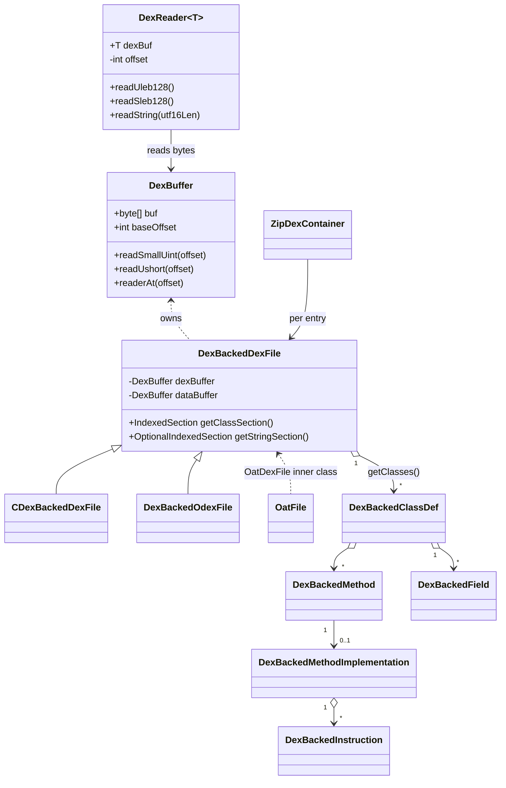

# 📦 dexbacked — 零拷贝解析层

`org.jf.dexlib2.dexbacked` 是 dexlib2 的「读侧」实现。它不把 dex 反序列化成对象树，而是持有原始 `byte[]`，每次访问元素时按需从字节偏移计算结果。这种**惰性 + 零拷贝**设计让 baksmali 能在常驻内存极低的情况下扫描数十 MB 的 dex，代价是每次访问都要重新解码。

`DexFileFactory`（位于 `dexlib2/src/main/java/org/jf/dexlib2/DexFileFactory.java`）是用户入口，它会根据文件头判断 dex / odex / oat / zip 容器，返回 `DexBackedDexFile` 或其子类。

## 🧩 包定位

| 维度 | 说明 |
| --- | --- |
| 实现接口 | `org.jf.dexlib2.iface.*`（`DexFile`、`ClassDef`、`Method`、`Field`、`Instruction`、`Reference`、`EncodedValue` 等） |
| 依赖方向 | 只依赖 `iface/` 与 `util/`，被 `baksmali`、`analysis`、`rewriter`、`immutable` 消费 |
| 数据来源 | 原始 `byte[]`（`DexBuffer`），或 `InputStream`（`fromInputStream` 工厂） |
| 是否可变 | 否。修改请转 `immutable/` 或 `builder/` |
| 格式覆盖 | dex、cdex（紧凑 dex）、odex、oat、zip 容器 |

## 🗂️ 核心类清单

| 类 | 职责 | 关键方法 / 字段 |
| --- | --- | --- |
| `DexBuffer` | 字节缓冲封装，定点读取定长标量 | `readSmallUint`、`readUshort`、`readLong`、`readerAt` |
| `DexReader<T>` | 带游标的流式读取器，解码 LEB128 / UTF-8 | `readUleb128`、`readSleb128`、`readString`、`skipUleb128` |
| `DexBackedDexFile` | dex 文件根对象，持有各 section 起始偏移与计数 | `getClasses`、`getStringSection`、`getClassSection`、`getMapItemForSection` |
| `DexBackedClassDef` | 类定义，按需解析 class_data | `getFields`、`getMethods`、`getAnnotations`、`getSuperclass` |
| `DexBackedMethod` | 方法元数据（继承 `BaseMethodReference`） | `getName`、`getParameters`、`getImplementation`、`getMethodIndex` |
| `DexBackedField` | 字段元数据（继承 `BaseFieldReference`） | `getName`、`getType`、`getInitialValue`、`getAnnotations` |
| `DexBackedMethodImplementation` | 方法体（寄存器、指令、try 块、调试信息） | `getRegisterCount`、`getInstructions`、`getTryBlocks`、`getDebugItems` |
| `DexBackedAnnotation` / `DexBackedAnnotationElement` | 注解及其元素 | `getVisibility`、`getType`、`getElements` |
| `DexBackedTryBlock` / `DexBackedExceptionHandler` / `DexBackedCatchAllExceptionHandler` | 异常表 | `getCodeUnitIndex`、`getExceptionHandlers` |
| `instruction/DexBackedInstruction*` | 按 dex 指令格式（10x、35c、3rc、45cc…）逐类实现 `Instruction` | `getOpcode`、`getCodeUnits`、寄存器/引用读取 |
| `reference/DexBackedReference*` | 字符串/类型/字段/方法/proto/callsite/methodhandle 引用 | `DexBackedReference.readReference(dexFile, type, reader)` |
| `value/DexBackedEncodedValue*` | 注解/默认值中的编码值 | `DexBackedEncodedValue.readFrom(dexFile, reader)` |
| `raw/*` | 原始 section item（`HeaderItem`、`MapItem`、`CodeItem`、`StringDataItem`、`ItemType`…），供 baksmali 反汇编原始结构 | `HeaderItem.*_OFFSET`、`MapItem.getOffset`、`ItemType.*` |
| `util/VariableSizeList` 等 | 基于游标前进的惰性集合/迭代器 | `VariableSizeList`、`FixedSizeList`、`AnnotationsDirectory`、`DebugInfo` |
| `CDexBackedDexFile` | 紧凑 dex（cdex）子类，重写 `getBaseDataOffset` 与调试表偏移 | `isCdex`、`getDebugInfoBase` |
| `DexBackedOdexFile` | odex 子类，携带依赖列表与优化指令支持 | `getDependencies`、`supportsOptimizedOpcodes` |
| `OatFile` | ART oat 文件，本身是 `DexBuffer` 也是 `MultiDexContainer` | `fromInputStream`、内部 `OatDexFile` / `OatCDexFile` |
| `ZipDexContainer` | APK/JAR 中的多 dex zip 容器 | `getDexEntryNames`、`getEntry` |

## 📐 类关系与数据流



## ⚙️ 解析机制要点

### 双缓冲：`dexBuffer` 与 `dataBuffer`

`DexBackedDexFile` 构造时建两份 `DexBuffer`（见 `DexBackedDexFile.java:77-79`）：

```java
dexBuffer = new DexBuffer(buf, offset);
dataBuffer = new DexBuffer(buf, offset + getBaseDataOffset());
```

- `dexBuffer` 用于读取 header 与各 id 表（string/type/proto/field/method/class id）。
- `dataBuffer` 用于读取 class_data、code_item、注解等「数据区」。对标准 dex，`getBaseDataOffset()` 返回 `0`；对 cdex 它返回非零偏移，使数据指针指向 cdex 内部数据区（`CDexBackedDexFile.java:93`）。

### IndexedSection：把表暴露为 `List`

各 section 通过内部抽象类 `IndexedSection<T>`（继承 `AbstractList<T>`）暴露，按 index 取元素时回算 `startOffset + index * stride`：

```java
public abstract static class IndexedSection<T> extends AbstractList<T> {
    @Nonnull public final DexBackedDexFile dexFile;
    public abstract int getOffset(int index);
}
```

典型用法（`DexBackedDexFile.java:484`）：

```java
public IndexedSection<DexBackedClassDef> getClassSection() {
    return new IndexedSection<DexBackedClassDef>(this) {
        public DexBackedClassDef get(int index) { /* readItem */ }
        public int size() { return classCount; }
        public int getOffset(int index) { return classStartOffset + index * ClassDefItem.ITEM_SIZE; }
    };
}
```

`getClasses()` 返回的 `Set` 也是基于该 section 的惰性视图——遍历时才构造 `DexBackedClassDef`。

### 变长元素：`DexReader` + ULEB128

class_data / code_item 内部字段是 ULEB128/SLEB128 编码且定长表项无法表达，故用 `DexReader` 顺序前进。`DexBackedClassDef` 构造时即解码出 4 个 count 并记录各段起始 offset（`DexBackedClassDef.java:92-98`）：

```java
DexReader reader = dexFile.getDataBuffer().readerAt(classDataOffset);
staticFieldCount = reader.readSmallUleb128();
instanceFieldCount = reader.readSmallUleb128();
directMethodCount = reader.readSmallUleb128();
virtualMethodCount = reader.readSmallUleb128();
staticFieldsOffset = reader.getOffset();
```

`util/VariableSizeList` / `VariableSizeLookaheadIterator` 封装「边读边前进」的集合语义，使 `getFields()`、`getMethods()` 既能当 `Iterable` 又能保持零拷贝。

## 🔍 典型用法

入口通常是 `DexFileFactory.loadDexFile`（`DexFileFactory.java:81`），它返回 `DexBackedDexFile`：

```java
// 从磁盘加载并惰性遍历所有类的方法
DexBackedDexFile dex = DexFileFactory.loadDexFile(new File("classes.dex"), null);
for (DexBackedClassDef cls : dex.getClasses()) {
    System.out.println(cls.getType());
    for (DexBackedMethod m : cls.getMethods()) {
        DexBackedMethodImplementation impl = m.getImplementation();
        if (impl != null) {
            for (Instruction insn : impl.getInstructions()) {
                // 逐条读取指令，未访问到的 code_item 区域不会解码
            }
        }
    }
}
```

从 `InputStream` 构造（先读全部字节，见 `DexBackedDexFile.java:188`）：

```java
public static DexBackedDexFile fromInputStream(@Nullable Opcodes opcodes,
                                               @Nonnull InputStream is) throws IOException
```

直接读原始 section（baksmali `raw` 视图会用）：

```java
// 取 map 列表与某个 section 的起始偏移
List<MapItem> map = dex.getMapItems();
MapItem codeItem = dex.getMapItemForSection(ItemType.CODE_ITEM);
```

## 🔄 与其他包的协作

- `iface/` — dexbacked 的所有元素类实现这里的只读接口，外部代码面向接口编程即可。
- `raw/` + `raw/util/DexAnnotator` — baksmali 的 `dump` 子命令用 `raw/*Item` 与 `SectionAnnotator` 输出带偏移注解的 dex hex 视图。
- `analysis/` — `MethodAnalyzer` 接收 `DexBackedMethodImplementation` 的指令流做类型推断与去 odex 化；`supportsOptimizedOpcodes()` 决定是否需要走 deodex 路径。
- `rewriter/` — 在不物化整个 dex 的前提下，用 `Rewriter` 包装 dexbacked 元素做引用重映射。
- `immutable/` — 需要修改或脱离原字节缓冲时，用 `ImmutableDexFile.of(dexBackedDexFile)` 物化。
- `writer/` — 重新序列化时同样消费 `iface` 对象，dexbacked 可直接喂给 `DexWriter`。

## 📝 设计取舍

- **优点**：内存占用小、启动快、可只扫描感兴趣部分。
- **代价**：同一字段重复访问会重复解码；元素对象生命周期短（每次 `get()` 新建）；不支持原地修改。
- **线程安全**：`byte[]` 只读、各 section 起始偏移不可变，因此 dexbacked 对象在多线程读取下安全；但 `DexReader` 是有状态的、不可跨线程共享。

## 延伸阅读

- [iface — 只读接口层](./iface.md)
- [immutable — 物化实现](./immutable.md)
- [builder — 可变方法体构造](./builder.md)
- [writer — dex 序列化](./writer.md)
- [analysis — 类型推断与 deodex](./analysis.md)
- baksmali CLI：`baksmali disassemble`、`baksmali dump`
