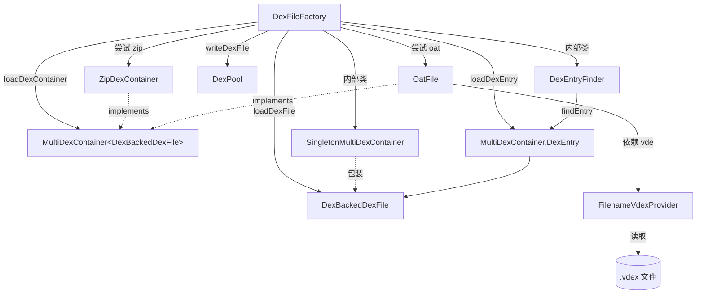

# 📦 DexFileFactory — dex 解析总入口

`DexFileFactory` 是 dexlib2 对外暴露的 **解析总入口**。给定磁盘上的任意 Android 可执行文件（`.dex`、`.apk`/zip、`.odex`、`.oat`），它负责嗅探魔数、选用合适的 `dexbacked` 实现并返回 `DexBackedDexFile` 或 `MultiDexContainer`。该类位于 `dexlib2/src/main/java/org/jf/dexlib2/DexFileFactory.java:57`，是一个 **不可实例化的工具类**（构造器私有，全静态方法），自身不持有任何状态。

## 🧩 角色定位

- **格式嗅探器**：按 zip → dex → odex → oat 顺序逐一尝试，失败则 reset 流并回退下一格式，最终都不匹配则抛 `UnsupportedFileTypeException`。
- **多容器适配器**：将裸 dex/odex 也包装为 `SingletonMultiDexContainer`，使调用方对"单 dex"与"容器内 dex"使用统一接口。
- **入口选择器**：通过内部类 `DexEntryFinder` 支持按 **精确名** 或 **路径后缀** 在容器内定位 dex 条目（oat 的 `framework.jar:classes2.dex` 这类复合路径）。
- **vdex 伴侣加载器**：经 `FilenameVdexProvider` 在 oat 同目录寻找同名 `.vdex`，供新版 ART 的内嵌 dex 解码。
- **写出代理**：`writeDexFile` 直接委托 `DexPool.writeTo`，与解析侧对称。

## 🔄 类关系图



## 🗂️ 关键方法

| 方法 | 作用 | 备注 |
| --- | --- | --- |
| `loadDexFile(File, Opcodes)` | 加载单 dex，zip 取 `classes.dex`，oat 取第一个 | 适用于"我只要一个 dex"场景；`DexFileFactory.java:81` |
| `loadDexFile(String, Opcodes)` | 路径重载 | 转发到 `File` 版本；`DexFileFactory.java:60` |
| `loadDexEntry(File, String, boolean, Opcodes)` | 从 zip/oat 容器按名取某个 dex 条目 | `exactMatch=false` 走路径后缀匹配；`DexFileFactory.java:177` |
| `loadDexContainer(File, Opcodes)` | 把任意文件作为多 dex 容器返回 | 裸 dex/odex 被包成 `SingletonMultiDexContainer`；`DexFileFactory.java:234` |
| `writeDexFile(String, DexFile)` | 将 `DexFile` 序列化到磁盘 | 委托 `DexPool.writeTo`；`DexFileFactory.java:291` |

## 🧱 内部类与异常

| 类 | 角色 | 位置 |
| --- | --- | --- |
| `DexEntryFinder` | 在容器内执行精确/后缀匹配，优先 full match | `DexFileFactory.java:376` |
| `SingletonMultiDexContainer` | 把单个裸 dex 包装成单条目容器 | `DexFileFactory.java:453` |
| `FilenameVdexProvider` | 懒加载同名 `.vdex`，实现 `OatFile.VdexProvider` | `DexFileFactory.java:492` |
| `DexFileNotFoundException` | 文件不存在 / 容器内无 dex / 找不到匹配条目 | 继承 `ExceptionWithContext` |
| `UnsupportedOatVersionException` | oat 版本不被支持，携带 `oatFile` 字段供上层降级 | `DexFileFactory.java:307` |
| `UnsupportedFileTypeException` | 不是任何已知 dex/zip/odex/oat 格式 | `DexFileFactory.java:322` |
| `MultipleMatchingDexEntriesException` | 后缀匹配命中多条目 | `DexFileFactory.java:316` |

## 🔍 嗅探顺序要点

`loadDexFile` 的尝试链（`DexFileFactory.java:86`–`134`）值得记住：

1. 先建 `ZipDexContainer`，若非 zip 抛 `NotAZipFileException` 并继续；
2. 打开 `BufferedInputStream`，依次试 `DexBackedDexFile.fromInputStream` → `DexBackedOdexFile.fromInputStream`；
3. 两者失败时流会被 reset 回起点，再试 `OatFile.fromInputStream`；
4. oat 命中后校验 `isSupportedVersion()`，取 `getDexFiles().get(0)`；
5. 全部失败抛 `UnsupportedFileTypeException`。

`loadDexContainer` 链路相似，但裸 dex/odex 命中时返回 `SingletonMultiDexContainer` 而非直接返回 dex（`DexFileFactory.java:248`、`255`）。

## ⚙️ 典型用法

```java
// 1. 从 apk 取主 dex
DexBackedDexFile dex = DexFileFactory.loadDexFile(new File("app.apk"), null);

// 2. 遍历多 dex 容器中的所有条目（apk / oat 通用）
MultiDexContainer<? extends DexBackedDexFile> container =
        DexFileFactory.loadDexContainer(new File("framework.oat"), null);
for (String name : container.getDexEntryNames()) {
    DexBackedDexFile d = container.getEntry(name).getDexFile();
    // ...
}

// 3. 在 oat 中按路径后缀定位某个 dex（exactMatch=false）
MultiDexContainer.DexEntry<? extends DexBackedDexFile> entry =
        DexFileFactory.loadDexEntry(new File("framework.oat"),
                "classes2.dex", false, null);
DexBackedDexFile d2 = entry.getDexFile();

// 4. 写回磁盘
DexFileFactory.writeDexFile("/tmp/out.dex", immutableDexFile);
```

`opcodes` 传 `null` 时，各 `fromInputStream` 会从文件头/容器版本自行推断合适的指令集（经 `Opcodes` / `VersionMap`）。仅在需要强制覆盖版本时显式传入。

## 📐 后缀匹配语义

`partialEntryMatch`（`DexFileFactory.java:357`）将 `targetEntry` 视为 entry 名的 **路径后缀**，且要求后缀起点落在分隔符 `/`、`:`、`!` 之一上。例如容器条目 `/system/framework/framework.jar:classes2.dex`，用 `framework.jar:classes2.dex` 或 `classes2.dex` 都能命中，但 `work/framework.jar:classes2.dex` 因切断在词中间而不匹配。`fullEntryMatch`（`DexFileFactory.java:331`）则只忽略首部斜杠后做全等比较，full match 永远优先于 partial match。

## 延伸阅读

- [OatFile — OAT 文件解析](./oat-file.md)
- [DexBacked — 零拷贝 dex 实现](./dexbacked.md)
- [iface — DexFile / MultiDexContainer 接口](./iface.md)
- [writer — DexPool 序列化](./writer.md)
