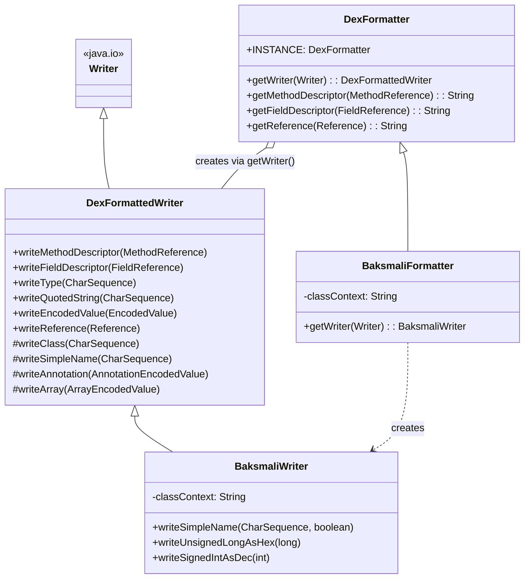

# 📐 formatter — 格式化层

`org.jf.dexlib2.formatter` 是 dexlib2 的**纯文本格式化层**。它把 `iface.reference` / `iface.value` 中的对象序列化为符合 [dex 格式](https://source.android.com/devices/tech/dalvik/dex-format) 约定的描述符字符串（如 `Lfoo/bar;->baz(I)V`），同时负责字符串转义、类型校验和编码值的递归输出。它是 `ReferenceUtil`、`Base*Reference.toString()` 以及 baksmali 文本输出的公共底座。

## 🗂️ 包定位

- **输入**：`iface.reference.*`（`MethodReference`、`FieldReference`、`MethodProtoReference`、`MethodHandleReference`、`CallSiteReference`、`StringReference`、`TypeReference`）与 `iface.value.EncodedValue` 体系。
- **输出**：写入任意 `java.io.Writer` 的描述符文本，或直接返回 `String`。
- **设计目标**：与 smali 语法解耦——本包只产出 *dex 风格* 的描述符（`Lpkg/Name;`、`->`、`(II)V`），不负责 smali 关键字、缩进或寄存器命名。后者由 `baksmali.formatter.BaksmaliWriter` 子类化扩展。

## 📦 类清单

| 类名 | 职责 | 关键方法 |
| --- | --- | --- |
| `DexFormattedWriter` | 继承 `java.io.Writer`，逐个把引用/类型/编码值**写入**底层 `Writer` | `writeMethodDescriptor`, `writeFieldDescriptor`, `writeMethodProtoDescriptor`, `writeMethodHandle`, `writeCallSite`, `writeType`, `writeQuotedString`, `writeEncodedValue`, `writeReference` |
| `DexFormatter` | 不可变单例（`INSTANCE`），把上述写入包装为返回 `String` 的便捷方法 | `getMethodDescriptor`, `getFieldDescriptor`, `getType`, `getQuotedString`, `getEncodedValue`, `getReference`, `getWriter(Writer)` |

两个类形成"模板/便捷"双联：`DexFormatter` 内部总是 `new StringWriter()` + 委托给 `getWriter(...)` 的 `DexFormattedWriter`，见 `dexlib2/src/main/java/org/jf/dexlib2/formatter/DexFormatter.java:57-65`。这种结构允许子类只重写 `getWriter` 即可注入自定义写入行为。

## 🧩 类关系



`DexFormatter.getWriter` 是工厂方法，`DexFormattedWriter` 持有真正逻辑；`baksmali.formatter.*` 通过继承两个类并重写 `getWriter`/`writeSimpleName` 等，注入"含空格的 simple name 需引号包裹"与"classContext 省略"等 smali 语义（见 `baksmali/src/main/java/org/jf/baksmali/formatter/BaksmaliWriter.java:75-159`）。

## 🔍 描述符格式约定

`DexFormattedWriter` 产出的文本遵循 dex 规范：

| 对象 | 输出形式 | 示例 |
| --- | --- | --- |
| 方法引用 | `<类>-><名>(<参数>)<返回>` | `Lfoo/Bar;->baz(II)V` |
| short 方法 | `<名>(<参数>)<返回>`（省略类） | `baz(II)V` |
| 方法 proto | `(<参数>)<返回>` | `(II)V` |
| 字段引用 | `<类>-><名>:<类型>` | `Lfoo/Bar;->x:I` |
| short 字段 | `<名>:<类型>` | `x:I` |
| method handle | `<类型>@<成员描述符>` | `invoke-static@Lfoo/Bar;->run()V` |
| call site | `<名>("<方法名>", <proto>, <args...>)@<link句柄>` | `call("name", ()V)@L...;->link(...)V` |
| 类型 | 原样输出，但逐字符校验合法性 | `[[Ljava/lang/Object;` |
| 引号字符串 | `"..."`，转义 `"` `'` `\` `\n` `\r` `\t` 及非 ASCII `\uXXXX` | `"a\"b\tc"` |

`writeType` 严格校验：遇到非法字符立即抛 `IllegalArgumentException`，例如 `H`、`L;`、`L/blah;` 均被拒绝（测试见 `dexlib2/src/test/java/org/jf/dexlib2/formatter/DexFormattedWriterTypeTest.java:48-58`）。

## ⚙️ 关键源码

`writeMethodDescriptor` 拼接类、`->`、方法名、参数列表与返回类型：

```java
// dexlib2/src/main/java/org/jf/dexlib2/formatter/DexFormattedWriter.java:58
public void writeMethodDescriptor(MethodReference methodReference) throws IOException {
    writeType(methodReference.getDefiningClass());
    writer.write("->");
    writeSimpleName(methodReference.getName());
    writer.write('(');
    for (CharSequence paramType: methodReference.getParameterTypes()) {
        writeType(paramType);
    }
    writer.write(')');
    writeType(methodReference.getReturnType());
}
```

`writeEncodedValue` 是一个按 `ValueType` 分派的 switch，递归调用 `writeAnnotation` / `writeArray` 处理嵌套结构，整型一律以 `0x% hexadecimal` 输出（`DexFormattedWriter.java:280-344`）。`writeReference` 则按 `instanceof` 链路由七种引用类型路由到对应方法（`DexFormattedWriter.java:386-404`）。

`DexFormatter` 单例让任何对象都能零成本获得标准 `toString()`：

```java
// dexlib2/src/main/java/org/jf/dexlib2/base/reference/BaseMethodReference.java:76
@Override public String toString() {
    return DexFormatter.INSTANCE.getMethodDescriptor(this);
}
```

## 🔄 典型用法

直接取字符串（推荐用于 `toString`、日志、报告）：

```java
String desc = DexFormatter.INSTANCE.getMethodDescriptor(methodRef);
// => "Lcom/example/Foo;->bar(Ljava/lang/String;)V"
String quoted = DexFormatter.INSTANCE.getQuotedString("he said \"hi\"\n");
// => "\"he said \\\"hi\\\"\\n\""
```

流式写入（避免中间字符串分配，适合大批量输出）：

```java
DexFormattedWriter w = new DexFormattedWriter(myWriter);
for (MethodReference m : methods) {
    w.writeMethodDescriptor(m);
    w.write('\n');
}
```

子类化以定制行为（baksmali 的做法）：

```java
public class MyFormatter extends DexFormatter {
    @Override public DexFormattedWriter getWriter(Writer writer) {
        return new DexFormattedWriter(writer) {
            @Override protected void writeSimpleName(CharSequence n) throws IOException {
                writer.write("["); writer.append(n); writer.write("]"); // 包裹
            }
        };
    }
}
```

## 🤝 与其他包的协作

- **`iface.reference` / `iface.value`**：本包的全部输入类型来源；formatter 不依赖具体实现，只面向接口。
- **`base.reference` / `base.value`**：`Base*Reference.toString()` 与 `Base*EncodedValue` 统一委托 `DexFormatter.INSTANCE`，保证全实现一致的字符串表示。
- **`util.ReferenceUtil`**：已 `@Deprecated`，注释明确建议改用 `DexFormatter`（`dexlib2/src/main/java/org/jf/dexlib2/util/ReferenceUtil.java:49`）。
- **`util.StringUtils`**：`writeQuotedString` 等旧工具已 `@Deprecated`，指向 `DexFormattedWriter`（`dexlib2/src/main/java/org/jf/util/StringUtils.java:66`）。
- **`writer.DexWriter` / `dexbacked.raw.CodeItem`**：诊断与调试输出时使用 formatter 产出可读描述符。
- **`baksmali.formatter`**：`BaksmaliFormatter` / `BaksmaliWriter` 继承本包，叠加 smali 语义（simple name 含空格需引号、classContext 省略类名、十六进制/十进制整数格式化辅助方法）。

## 📋 扩展点速查

| 想定制的行为 | 重写方法（在 `DexFormattedWriter` 子类中） |
| --- | --- |
| simple name 的转义/包裹 | `writeSimpleName(CharSequence)` |
| 类描述符解析 | `writeClass(CharSequence)` |
| 编码值渲染 | `writeEncodedValue(EncodedValue)` |
| 注解/数组渲染 | `writeAnnotation` / `writeArray` |
| 整体引用路由 | `writeReference(Reference)` |
| 注入新 Writer 工厂 | 在 `DexFormatter` 子类中重写 `getWriter(Writer)` |

## 延伸阅读

- [iface — 引用与指令接口](./iface.md)
- [iface-value — 编码值体系](./iface-value.md)
- [base — 基础实现与 toString 委托](./base.md)
- baksmali formatter — smali 文本输出
- [util — 旧工具与弃用提示](./util.md)
