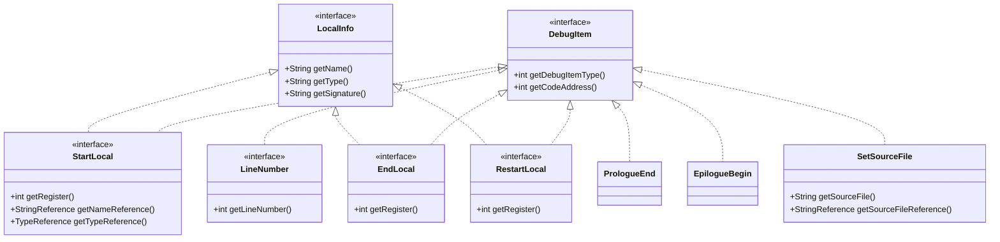
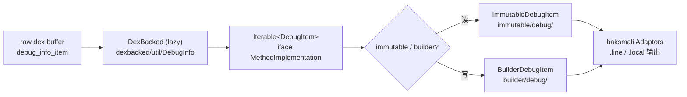

# 🗂️ dexlib2 · iface/debug — 调试项接口

`org.jf.dexlib2.iface.debug` 包对 dex 文件中 `debug_info_item` 段的调试 opcode 做只读建模。
这些调试项以「指令流上的偏移地址」为锚点，记录源码行号、局部变量生命周期与源文件名等信息，
是 baksmali 在反汇编输出中渲染 `.line`、`.local`/`.end local` 等伪指令的数据来源。

> 💡 该包是 `iface/` 三大子领域之一（与 `iface/instruction`、`iface/reference` 并列），
> 仅定义抽象接口，具体实现由 `dexbacked/`（懒解析）与 `immutable/`、`builder/`（物化/可变）提供。

## 📦 包定位

- **抽象层级**：纯接口，零状态、零副作用，全部方法返回基本类型或 `@Nullable` 字符串/引用。
- **设计意图**：把 dex 规范里 7 个面向用户的调试 opcode 各自映射到一个接口，公共属性（类型码、代码地址）抽到基接口 `DebugItem`，局部变量公共元数据抽到 `LocalInfo`。
- **不建模的 opcode**：`END_SEQUENCE`、`ADVANCE_PC`、`ADVANCE_LINE`、`START_LOCAL_EXTENDED` 由解析器内部消化，不在此包暴露（见下文「类型码映射」）。

## 🧩 类清单

| 类 / 接口 | 职责 | 关键方法 | 对应 opcode |
|---|---|---|---|
| `DebugItem` | 所有调试项的根接口 | `getDebugItemType()`, `getCodeAddress()` | — |
| `LineNumber` | 源码行号映射 | `getLineNumber()` | `DBG_LINE_NUMBER = 0x0a` |
| `StartLocal` | 局部变量起始（含名/类型/签名） | `getRegister()`, `getNameReference()`, `getTypeReference()`, `getSignatureReference()` | `DBG_START_LOCAL = 0x03` |
| `EndLocal` | 局部变量结束 | `getRegister()` | `DBG_END_LOCAL = 0x05` |
| `RestartLocal` | 局部变量重新生效（重绑定元数据） | `getRegister()` | `DBG_RESTART_LOCAL = 0x06` |
| `PrologueEnd` | 参数序言结束标记 | （无额外方法） | `DBG_PROLOGUE_END = 0x07` |
| `EpilogueBegin` | 尾声开始标记 | （无额外方法） | `DBG_EPILOGUE_BEGIN = 0x08` |
| `SetSourceFile` | 覆盖当前方法所属源文件 | `getSourceFile()`, `getSourceFileReference()` | `DBG_SET_SOURCE_FILE = 0x09` |
| `LocalInfo` | 局部变量公共元数据 mixin | `getName()`, `getType()`, `getSignature()` | （被 `StartLocal`/`EndLocal`/`RestartLocal` 继承） |

## 📐 类关系图



## 🔍 类型码映射

类型码常量定义在 `dexlib2/src/main/java/org/jf/dexlib2/DebugItemType.java:34`。下表对照接口与常量，并标注内部消化的 opcode：

| 接口 / 用途 | 常量 | 值 | 说明 |
|---|---|---|---|
| — (内部) | `END_SEQUENCE` | `0x00` | 调试流终止 |
| — (内部) | `ADVANCE_PC` | `0x01` | 仅前移地址 |
| — (内部) | `ADVANCE_LINE` | `0x02` | 仅前移行号 |
| `StartLocal` | `START_LOCAL` | `0x03` | 名/类型可能缺省 |
| — (内部) | `START_LOCAL_EXTENDED` | `0x04` | 解析后并入 `StartLocal`（引用非空即承载签名） |
| `EndLocal` | `END_LOCAL` | `0x05` | — |
| `RestartLocal` | `RESTART_LOCAL` | `0x06` | — |
| `PrologueEnd` | `PROLOGUE_END` | `0x07` | — |
| `EpilogueBegin` | `EPILOGUE_BEGIN` | `0x08` | — |
| `SetSourceFile` | `SET_SOURCE_FILE` | `0x09` | — |
| `LineNumber` | `LINE_NUMBER` | `0x0a` | — |

> ⚠️ `START_LOCAL_EXTENDED (0x04)` 在 iface 层未单独建模——解析器将其归一化为 `StartLocal`，
> 当其 `name`/`type`/`signature` 引用非空时即等价于 extended 形态。

## ⚙️ 关键方法签名

根接口来自 `dexlib2/src/main/java/org/jf/dexlib2/iface/debug/DebugItem.java:40`：

```java
public interface DebugItem {
    /** 返回 DebugItemType.* 常量之一 */
    int getDebugItemType();
    /** 返回该调试项在方法指令流中的相对代码地址（字节偏移，单位为 code unit） */
    int getCodeAddress();
}
```

局部变量 mixin 来自 `LocalInfo.java:36`：

```java
public interface LocalInfo {
    @Nullable String getName();
    @Nullable String getType();       // 类型描述符，如 "Ljava/lang/String;"
    @Nullable String getSignature();  // 泛型签名，无则为 null
}
```

`StartLocal` 在 `LocalInfo` 基础上额外暴露引用形态（`StartLocal.java:39`），便于写入端做池化去重：

```java
public interface StartLocal extends DebugItem, LocalInfo {
    int getRegister();
    @Nullable StringReference getNameReference();
    @Nullable TypeReference  getTypeReference();
    @Nullable StringReference getSignatureReference();
}
```

## 🔄 数据流：从 dex 字节到 baksmali 输出

调试项通过 `MethodImplementation.getDebugItems()` 暴露，地址保证**非降序**排列（见 `iface/MethodImplementation.java:85`）。



## 🧪 典型用法

读取方法体的调试项并按类型分发（参考 baksmali `Adaptors/` 的遍历模式）：

```java
for (DebugItem item : methodImpl.getDebugItems()) {
    switch (item.getDebugItemType()) {
        case DebugItemType.LINE_NUMBER:
            int line = ((LineNumber) item).getLineNumber();   // 负值视为无符号 > 2^31
            break;
        case DebugItemType.START_LOCAL:
            StartLocal sl = (StartLocal) item;
            int reg = sl.getRegister();
            String name = sl.getName();          // 可能为 null
            String type = sl.getType();          // 类型描述符
            break;
        case DebugItemType.SET_SOURCE_FILE:
            String src = ((SetSourceFile) item).getSourceFile();
            break;
        case DebugItemType.PROLOGUE_END:
        case DebugItemType.EPILOGUE_BEGIN:
            // 标记类，无额外数据
            break;
    }
}
```

> 📌 `LineNumber.getLineNumber()` 的 int 应按无符号处理，负值表示行号超过 2^31（见 `LineNumber.java:38` 注释）。

## 🔗 与其他包的协作

- **`iface/`**：`MethodImplementation.getDebugItems()` 是调试项的唯一入口；`iface/reference/` 提供 `StartLocal`/`SetSourceFile` 引用的 `StringReference`、`TypeReference` 类型。
- **`dexbacked/util/DebugInfo.java`**：把原始字节流解码为 `DebugItem` 序列，内部消化 `ADVANCE_PC`/`ADVANCE_LINE`/`END_SEQUENCE` 等流控 opcode。
- **`immutable/debug/`**：`ImmutableDebugItem` 及其子类提供全物化实现，便于跨 dex 复用与写回。
- **`builder/debug/`**：`BuilderDebugItem` 系列配合 `MutableMethodImplementation`，供 smali 树walker 在组装方法体时挂载调试项。
- **`writer/`**：序列化时把 `DebugItem` 序列重新编码为状态机式 `debug_info_item`（地址差分、行号差分压缩）。

## 延伸阅读

- [iface — 顶层只读接口](./iface.md)
- [iface/instruction — 指令接口](./iface-instruction.md)
- [iface/reference — 引用接口](./iface-reference.md)
- [immutable — 物化实现](./immutable.md)
- [builder — 可变方法体构造](./builder.md)
- [baksmali 调试项适配器（Adaptors）](../baksmali/adaptors.md)
