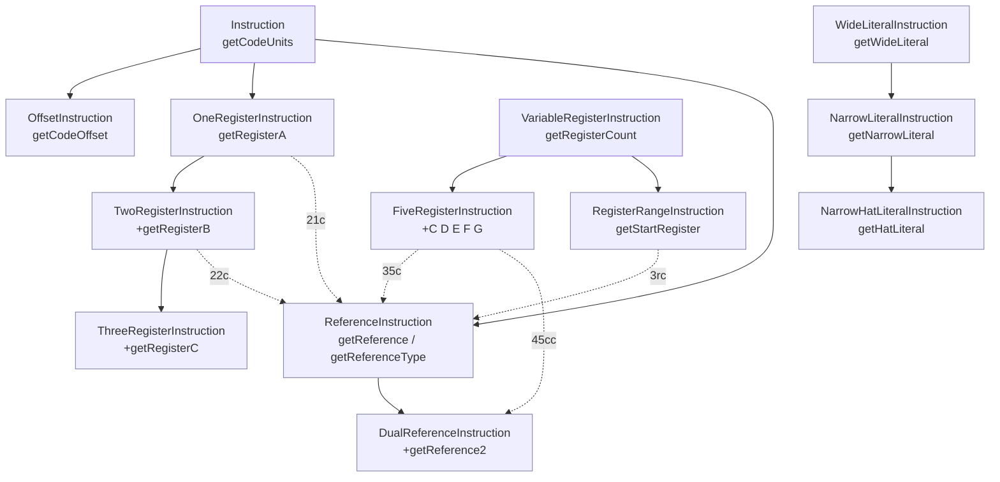

# 📐 指令格式 — `iface/instruction/formats`

## 📦 包定位

Dalvik 字节码每条指令都遵循一个固定的 **格式编号**（format ID），形如 `21c`、`35c`、`3rc`：第一位为指令占用的 16 位码元数，后续位编码寄存器宽度、字面量宽度与引用类型。`dexlib2/iface/instruction/formats` 包为每一种格式定义一个空接口，通过 **多重继承** 把该格式能携带的能力（寄存器、引用、字面量、跳转偏移……）以 mixin 方式组合出来。

源码目录：`dexlib2/src/main/java/org/jf/dexlib2/iface/instruction/formats/`

这些接口自身不持有任何方法实现，全部方法都来自父接口（位于上级 `iface/instruction/` 包）。本包的价值在于 **声明哪些能力组合是合法的**，是 `Opcode`/`Opcodes` 与具体实现之间的契约层。

## 🗂️ 类清单

| 类名 | 格式 | 父接口（关键 mixin） | 典型指令 |
|---|---|---|---|
| `Instruction10t` | 10t | `OffsetInstruction` | `goto` |
| `Instruction10x` | 10x | `Instruction` | `nop` / `return-void` |
| `Instruction11n` | 11n | `OneRegisterInstruction`, `NarrowLiteralInstruction` | `const/4` |
| `Instruction11x` | 11x | `OneRegisterInstruction` | `move-result` |
| `Instruction12x` | 12x | `TwoRegisterInstruction` | `move` |
| `Instruction20bc` | 20bc | `VerificationErrorInstruction`, `ReferenceInstruction` | `throw-verification-error` |
| `Instruction20t` | 20t | `OffsetInstruction` | `goto/16` |
| `Instruction21c` | 21c | `OneRegisterInstruction`, `ReferenceInstruction` | `const-string` / `check-cast` |
| `Instruction21ih` | 21ih | `OneRegisterInstruction`, `NarrowHatLiteralInstruction` | `const/high16` |
| `Instruction21lh` | 21lh | `OneRegisterInstruction`, `LongHatLiteralInstruction` | `const-wide/high16` |
| `Instruction21s` | 21s | `OneRegisterInstruction`, `NarrowLiteralInstruction` | `const/16` |
| `Instruction21t` | 21t | `OneRegisterInstruction`, `OffsetInstruction` | `if-eqz` |
| `Instruction22b` | 22b | `TwoRegisterInstruction`, `NarrowLiteralInstruction` | `add-int/lit8` |
| `Instruction22c` | 22c | `TwoRegisterInstruction`, `ReferenceInstruction` | `iget` / `iput` |
| `Instruction22cs` | 22cs | `TwoRegisterInstruction`, `FieldOffsetInstruction` | odex `iget-quick` |
| `Instruction22s` | 22s | `TwoRegisterInstruction`, `NarrowLiteralInstruction` | `add-int/lit16` |
| `Instruction22t` | 22t | `TwoRegisterInstruction`, `OffsetInstruction` | `if-eq` |
| `Instruction22x` | 22x | `TwoRegisterInstruction` | `move/from16` |
| `Instruction23x` | 23x | `ThreeRegisterInstruction` | `add-int` |
| `Instruction30t` | 30t | `OffsetInstruction` | `goto/32` |
| `Instruction31c` | 31c | `OneRegisterInstruction`, `ReferenceInstruction` | `const-string/jumbo` |
| `Instruction31i` | 31i | `OneRegisterInstruction`, `NarrowLiteralInstruction` | `const` |
| `Instruction31t` | 31t | `OneRegisterInstruction`, `OffsetInstruction` | `fill-array-data` / `packed-switch` |
| `Instruction32x` | 32x | `TwoRegisterInstruction` | `move/16` |
| `Instruction35c` | 35c | `FiveRegisterInstruction`, `ReferenceInstruction` | `invoke-virtual` |
| `Instruction35mi` | 35mi | `FiveRegisterInstruction`, `InlineIndexInstruction` | odex `execute-inline` |
| `Instruction35ms` | 35ms | `FiveRegisterInstruction`, `VtableIndexInstruction` | odex `invoke-virtual-quick` |
| `Instruction3rc` | 3rc | `RegisterRangeInstruction`, `ReferenceInstruction` | `invoke-virtual/range` |
| `Instruction3rmi` | 3rmi | `RegisterRangeInstruction`, `InlineIndexInstruction` | odex `execute-inline/range` |
| `Instruction3rms` | 3rms | `RegisterRangeInstruction`, `VtableIndexInstruction` | odex `invoke-virtual-quick/range` |
| `Instruction45cc` | 45cc | `FiveRegisterInstruction`, `DualReferenceInstruction` | `invoke-polymorphic` |
| `Instruction4rcc` | 4rcc | `RegisterRangeInstruction`, `DualReferenceInstruction` | `invoke-polymorphic/range` |
| `Instruction51l` | 51l | `OneRegisterInstruction`, `WideLiteralInstruction` | `const-wide` |
| `ArrayPayload` | payload | `PayloadInstruction` | `fill-array-data` 净荷 |
| `PackedSwitchPayload` | payload | `SwitchPayload` | `packed-switch` 净荷 |
| `SparseSwitchPayload` | payload | `SwitchPayload` | `sparse-switch` 净荷 |
| `UnknownInstruction` | 10x | `Instruction10x` | 无法识别的操作码 |

## 🔄 格式接口继承关系



虚线表示某格式接口"多重继承"自两个 mixin，例如 `Instruction21c extends OneRegisterInstruction, ReferenceInstruction`。

## 🧩 关键 mixin 方法对照

| mixin 接口 | 来源文件 | 方法 | 含义 |
|---|---|---|---|
| `OffsetInstruction` | `iface/instruction/OffsetInstruction.java:31` | `int getCodeOffset()` | 跳转目标相对偏移 |
| `OneRegisterInstruction` | `iface/instruction/OneRegisterInstruction.java:33` | `int getRegisterA()` | 寄存器 A |
| `TwoRegisterInstruction` | `iface/instruction/TwoRegisterInstruction.java:33` | `int getRegisterB()` | 寄存器 B |
| `ReferenceInstruction` | `iface/instruction/ReferenceInstruction.java:34` | `Reference getReference()` / `int getReferenceType()` | 引用的类型/方法/字段/字符串 |
| `DualReferenceInstruction` | `iface/instruction/DualReferenceInstruction.java:33` | `Reference getReference2()` / `int getReferenceType2()` | 多态调用第二引用（方法原型） |
| `NarrowLiteralInstruction` | `iface/instruction/NarrowLiteralInstruction.java:31` | `int getNarrowLiteral()` | 32 位立即数 |
| `WideLiteralInstruction` | `iface/instruction/WideLiteralInstruction.java:31` | `long getWideLiteral()` | 64 位立即数 |
| `HatLiteralInstruction` | `iface/instruction/HatLiteralInstruction.java:31` | `short getHatLiteral()` | 高 16 位字面量（high16） |
| `FieldOffsetInstruction` | `iface/instruction/FieldOffsetInstruction.java:31` | `int getFieldOffset()` | odex 快速访问的字段偏移 |
| `InlineIndexInstruction` | `iface/instruction/InlineIndexInstruction.java:31` | `int getInlineIndex()` | `execute-inline` 内联索引 |
| `VtableIndexInstruction` | `iface/instruction/VtableIndexInstruction.java:31` | `int getVtableIndex()` | 快速调用的 vtable 索引 |
| `VerificationErrorInstruction` | `iface/instruction/VerificationErrorInstruction.java:31` | `int getVerificationError()` | `throw-verification-error` 错误码 |
| `SwitchPayload` | `iface/instruction/SwitchPayload.java:33` | `List<? extends SwitchElement> getSwitchElements()` | switch 表项 |

净荷接口在本包额外声明净荷专属方法：

```java
// ArrayPayload.java:33
public interface ArrayPayload extends PayloadInstruction {
    public int getElementWidth();
    @Nonnull public List<Number> getArrayElements();
}

// PackedSwitchPayload.java:34
public interface PackedSwitchPayload extends SwitchPayload {
    @Nonnull @Override List<? extends SwitchElement> getSwitchElements();
}
```

## 📐 格式编号命名规则

格式名形如 `XYz`：

- **X** — 码元数（10/20/30/40/50 表示 1~5 个 16 位字）
- **Y** — 寄存器位段宽度上限（`1`=4 位、`2`=8 位、`3`=16 位）
- **z** — 附加类型标记：
  - `t` 跳转偏移、`x` 无操作数、`n` 窄字面量、`l` 宽字面量
  - `ih` 窄 high16、`lh` 宽 high16、`s` 短字面量
  - `c` 引用、`cs` 字段偏移（odex）、`mi` 内联索引、`ms` vtable 索引
  - `cc` 双引用（多态）

净荷类（`ArrayPayload` / `*SwitchPayload`）不遵循该编号，而是对应变长净荷数据结构。

## 🔍 典型用法

格式接口用于按操作码分派处理指令。下面的模式在 `dexlib2/rewriter/`、`baksmali` 反汇编与 `analysis` 中反复出现：

```java
Instruction ins = methodImpl.getInstructions().get(i);
switch (ins.getOpcode().format) {
    case Format21c:
        // 21c 同时携带一个寄存器 + 一个引用
        Reference ref = ((Instruction21c) ins).getReference();
        int regA = ((Instruction21c) ins).getRegisterA();
        handleTypeRef((TypeReference) ref, regA);
        break;
    case Format35c:
        // 35c: 五寄存器 + 方法引用
        MethodReference mref = (MethodReference)
                ((Instruction35c) ins).getReference();
        int count = ((Instruction35c) ins).getRegisterCount();
        break;
    case Format3rc:
        // 3rc: 寄存器区间 + 方法引用
        int start = ((Instruction3rc) ins).getStartRegister();
        break;
    case Format31t:
        // 31t 指向净荷：packed-switch / sparse-switch / fill-array-data
        int payloadOff = ((Instruction31t) ins).getCodeOffset();
        break;
}
```

净荷自身则通过对应接口读取：

```java
if (ins instanceof ArrayPayload) {
    ArrayPayload ap = (ArrayPayload) ins;
    int width = ap.getElementWidth();        // 1/2/4/8
    List<Number> elems = ap.getArrayElements();
} else if (ins instanceof PackedSwitchPayload) {
    List<? extends SwitchElement> targets =
            ((PackedSwitchPayload) ins).getSwitchElements();
}
```

## ⚙️ 与其他包的协作

- **`iface/instruction/`** — 提供所有 mixin 父接口（`OneRegisterInstruction` 等）与 `Opcode.format` 枚举 `InstructionFormat`。本包只是把 mixin 组合成具体格式契约。
- **`dexbacked/`** — `DexBackedInstruction` 工厂依据 `opcode.format` 实例化 `DexBackedInstruction21c` 等类，逐一实现对应格式接口。
- **`immutable/`** — `ImmutableInstruction21c` 等同样按格式分型，跨读写场景通用。
- **`builder/`** — `BuilderInstruction21c` 等用于方法体构造，由 smali 树walker 驱动创建。
- **`rewriter/`** — `InstructionRewriter` 通过 `instanceof` 这些格式接口定向改写引用/寄存器。
- **`baksmali Adaptors/`** — 反汇编时按格式接口提取寄存器与引用，渲染 smali 文本。
- **`analysis/`** — `MethodAnalyzer` 依据格式决定如何解析寄存器流与引用类型。

odex 专属格式（`22cs`/`35mi`/`35ms`/`3rmi`/`3rms`）配合 `FieldOffsetInstruction`、`InlineIndexInstruction`、`VtableIndexInstruction`，由 `analysis` 在 deodex 时还原为 `22c`/`35c`/`3rc` 等标准格式。

## 📚 延伸阅读

- [iface/instruction — 指令基础接口](./iface-instruction.md)
- [dexbacked — 懒解析实现](./dexbacked.md)
- [immutable — 不可变实现](./immutable.md)
- [builder — 方法体构造](./builder.md)
- [writer — dex 序列化](./writer.md)
- [analysis — deodex 与类型推断](./analysis.md)
- baksmali CLI
