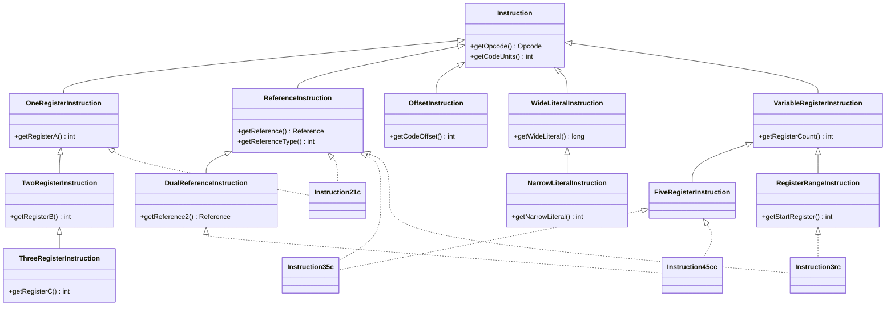

# 📐 iface/instruction — 指令接口

dexlib2 用一组**接口**而非具体类来描述一条 Dalvik 指令。`iface/instruction` 包定义了这些接口的「能力契约」：每条指令按需组合若干能力（持有寄存器、引用、立即数、跳转偏移等），消费方通过 `instanceof` 探测能力并按维度取值。

该包是 `dexbacked/`、`immutable/`、`builder/` 三种实现共同遵循的契约层，也是 `writer/`、`analysis/`、`rewriter/` 操作指令的统一入口。

## 🗂️ 包定位

- **层级**：`org.jf.dexlib2.iface.instruction`，位于 `dexlib2/src/main/java/org/jf/dexlib2/iface/instruction/`。
- **只读**：所有方法都是 getter，无 setter；修改指令走 `builder/` 与 `immutable/`。
- **两类子接口**（见 `Instruction.java` 注释，`Instruction.java:234`）：
  1. **通用类别接口**（本包根目录）：`OneRegisterInstruction`、`ReferenceInstruction` 等抽象「指令能提供什么」。
  2. **格式接口**（`formats/` 子包）：`Instruction21c`、`Instruction35c` 等对应具体 dex 指令格式，由若干通用接口**组合**而成。
- **根接口** `Instruction` 仅暴露两个字段：操作码与码元长度。

```java
// dexlib2/src/main/java/org/jf/dexlib2/iface/instruction/Instruction.java:241
public interface Instruction {
    Opcode getOpcode();
    int getCodeUnits();   // 占用的 16-bit code unit 数
}
```

## 📦 类清单

### 通用类别接口

| 接口 | 职责 | 关键方法 | 直接继承 |
|------|------|----------|----------|
| `Instruction` | 所有指令的根接口 | `getOpcode()` `getCodeUnits()` | — |
| `OneRegisterInstruction` | 单寄存器指令 | `getRegisterA()` | `Instruction` |
| `TwoRegisterInstruction` | 双寄存器指令 | `getRegisterB()` | `OneRegisterInstruction` |
| `ThreeRegisterInstruction` | 三寄存器指令 | `getRegisterC()` | `TwoRegisterInstruction` |
| `VariableRegisterInstruction` | 可变寄存器数量 | `getRegisterCount()` | `Instruction` |
| `FiveRegisterInstruction` | 5 寄存器（35c） | `getRegisterC/D/E/F/G()` | `VariableRegisterInstruction` |
| `RegisterRangeInstruction` | 寄存器区间（3rc） | `getStartRegister()` `getRegisterCount()` | `VariableRegisterInstruction` |
| `ReferenceInstruction` | 持有常量池引用 | `getReference()` `getReferenceType()` | `Instruction` |
| `DualReferenceInstruction` | 双引用（45cc/4rcc） | `getReference2()` `getReferenceType2()` | `ReferenceInstruction` |
| `OffsetInstruction` | 跳转/分支 | `getCodeOffset()` | `Instruction` |
| `NarrowLiteralInstruction` | 32 位立即数 | `getNarrowLiteral()` | `WideLiteralInstruction` |
| `WideLiteralInstruction` | 64 位立即数 | `getWideLiteral()` | `Instruction` |
| `HatLiteralInstruction` | 高 16 位立即数 | `getHatLiteral()` | `Instruction` |
| `NarrowHatLiteralInstruction` | 窄+hat（21ih） | — | `HatLiteralInstruction`,`NarrowLiteralInstruction` |
| `LongHatLiteralInstruction` | 宽+hat（21lh） | — | `WideLiteralInstruction`,`HatLiteralInstruction` |
| `VerificationErrorInstruction` | 校验错误（20bc） | `getVerificationError()` | `Instruction` |
| `VtableIndexInstruction` | vtable 索引（35ms/3rms） | `getVtableIndex()` | `Instruction` |
| `InlineIndexInstruction` | inline 索引（35mi/3rmi） | `getInlineIndex()` | `Instruction` |
| `FieldOffsetInstruction` | 字段偏移（22cs） | `getFieldOffset()` | `Instruction` |
| `PayloadInstruction` | switch/array 载荷标记 | —（空标记） | `Instruction` |
| `SwitchPayload` | switch 载荷 | `getSwitchElements()` | `PayloadInstruction` |
| `SwitchElement` | switch 表项 | `getKey()` `getOffset()` | — |

### formats 子包（格式接口，节选）

| 格式接口 | 组合的能力 | 对应典型 opcode |
|----------|-----------|-----------------|
| `Instruction10x` | 仅 `Instruction` | `nop` `return-void` |
| `Instruction10t` | `OffsetInstruction` | `goto` |
| `Instruction11x` | `OneRegisterInstruction` | `move-result` `return` |
| `Instruction11n` | `OneRegister` + `NarrowLiteral` | `const/4` |
| `Instruction12x` | `TwoRegisterInstruction` | `move` `array-length` |
| `Instruction21c` | `OneRegister` + `Reference` | `const-string` `new-instance` |
| `Instruction21s`/`21ih`/`21lh` | `OneRegister` + 各类 Literal | `const/16` `const/high16` |
| `Instruction22c` | `TwoRegister` + `Reference` | `iput` `sget` |
| `Instruction22b`/`22s` | `TwoRegister` + Literal | `add-int/lit8` |
| `Instruction22t` | `TwoRegister` + `Offset` | `if-eq` |
| `Instruction23x` | `ThreeRegisterInstruction` | `add-int` |
| `Instruction31i` | `OneRegister` + `NarrowLiteral` | `const` |
| `Instruction31c` | `OneRegister` + `Reference` | `const-string/jumbo` |
| `Instruction31t` | `OneRegister` + `Offset` | `fill-array-data` `packed-switch` |
| `Instruction35c` | `FiveRegister` + `Reference` | `invoke-virtual` |
| `Instruction3rc` | `RegisterRange` + `Reference` | `invoke-virtual/range` |
| `Instruction45cc`/`4rcc` | `Five`/`Range` + `DualReference` | `invoke-polymorphic` |
| `Instruction35mi`/`3rmi` | `Five`/`Range` + `InlineIndex` | odex `execute-inline` |
| `Instruction35ms`/`3rms` | `Five`/`Range` + `VtableIndex` | odex `invoke-virtual-quick` |
| `Instruction22cs` | `TwoRegister` + `FieldOffset` | odex `iput-quick` |
| `Instruction20bc` | `VerificationError` + `Reference` | `throw-verification-error` |
| `ArrayPayload` | `PayloadInstruction` | `fill-array-data` 载荷 |
| `PackedSwitchPayload`/`SparseSwitchPayload` | `SwitchPayload` | `packed-switch`/`sparse-switch` 载荷 |
| `UnknownInstruction` | `Instruction10x` | 无法识别的 opcode，附 `getOriginalOpcode()` |

## 🧩 接口组合关系

格式接口是「能力接口」的复合，下图展示通用接口的继承与若干格式的组合方式：



> 虚线 `|..` 表示「格式接口 extends 通用接口」的实现关系；实线为通用接口间的继承。`Instruction35c` 同时是 `FiveRegisterInstruction` 与 `ReferenceInstruction`，因此可被两套消费逻辑分别取用。

## 🔍 典型用法：按能力探测遍历

消费方通常不关心具体格式，而是用 `instanceof` 探测能力。下面是 `dexbacked/raw/CodeItem.java` 中标注原始字节码的真实片段（`CodeItem.java:479`）：

```java
private void annotateDefaultInstruction(@Nonnull AnnotatedBytes out, @Nonnull Instruction instruction) {
    List<String> args = Lists.newArrayList();

    if (instruction instanceof OneRegisterInstruction) {
        args.add(formatRegister(((OneRegisterInstruction) instruction).getRegisterA()));
        if (instruction instanceof TwoRegisterInstruction) {
            args.add(formatRegister(((TwoRegisterInstruction) instruction).getRegisterB()));
            if (instruction instanceof ThreeRegisterInstruction) {
                args.add(formatRegister(((ThreeRegisterInstruction) instruction).getRegisterC()));
            }
        }
    }

    if (instruction instanceof ReferenceInstruction) {
        Reference reference = ((ReferenceInstruction) instruction).getReference();
        if (((ReferenceInstruction) instruction).getReferenceType() == ReferenceType.STRING) {
            referenceString = DexFormatter.INSTANCE.getQuotedString((StringReference) reference);
        }
        args.add(referenceString);
    } else if (instruction instanceof OffsetInstruction) {
        int offset = ((OffsetInstruction) instruction).getCodeOffset();
        args.add(String.format("%s0x%x", offset >= 0 ? "+" : "-", Math.abs(offset)));
    } else if (instruction instanceof NarrowLiteralInstruction) {
        int value = ((NarrowLiteralInstruction) instruction).getNarrowLiteral();
        // ...
    } else if (instruction instanceof WideLiteralInstruction) {
        long value = ((WideLiteralInstruction) instruction).getWideLiteral();
        // ...
    }
}
```

寄存器接口的链式探测利用了继承：先取 `OneRegisterInstruction`，命中后再尝试 `TwoRegisterInstruction`、`ThreeRegisterInstruction`，逐级向下取值。

## ⚙️ 引用类型与 odex 扩展

`ReferenceInstruction.getReferenceType()` 返回 `ReferenceType` 中定义的常量（`STRING`、`TYPE`、`FIELD`、`METHOD` 等，见 `ReferenceType.java`）。`DualReferenceInstruction` 用于 `invoke-polymorphic`（45cc/4rcc），其第二引用固定为方法原型 `MethodProtoReference`。

odex/oat 特有指令通过专门接口暴露额外字段：`VtableIndexInstruction`（quick invoke 的 vtable 槽）、`InlineIndexInstruction`（`execute-inline` 的内联表索引）、`FieldOffsetInstruction`（quick 字段访问的实例字段偏移）。这些在 `analysis/` 做反 odex（deodex）时被读取并改写为标准 invoke/field 指令。

## 🔄 与其他包的协作

- **`iface/reference/`**：`ReferenceInstruction` 返回的 `Reference` 实例即由该包定义（`StringReference`、`MethodReference` 等）。
- **`dexbacked/instruction/`**：零拷贝实现，按字节偏移惰性求值这些 getter。
- **`immutable/instruction/`**：全物化实现，如 `ImmutableInstruction35c`（`ImmutableInstruction35c.java:44`），构造时校验并缓存字段。
- **`builder/instruction/`**：汇编侧构造指令，方法体内 `BuilderInstruction` 同样实现这些格式接口。
- **`writer/`**：`ClassPool`（`ClassPool.java:136`）遍历指令时 `instanceof ReferenceInstruction` 收集常量池条目。
- **`analysis/`**：`MethodAnalyzer`（`MethodAnalyzer.java:516`）对 `OffsetInstruction` 解析跳转目标、对 odex 接口做反 odex。
- **`rewriter/InstructionRewriter`**（`InstructionRewriter.java:54`）：改写指令引用的统一钩子。

## 延伸阅读

- [iface/reference — 引用接口](./iface-reference.md)
- [iface — 顶层接口总览](./iface.md)
- [analysis — 类型推断与反 odex](./analysis.md)
- [baksmali disassemble 指令](../baksmali/commands/disassemble.md)
