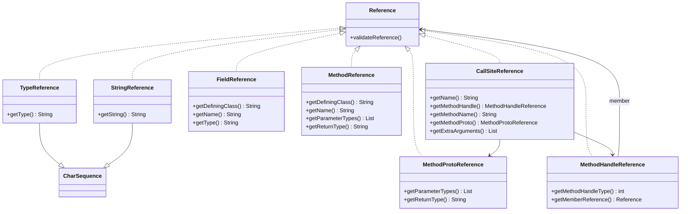

# 📦 iface/reference — 引用接口

`org.jf.dexlib2.iface.reference` 包定义了 dex 文件中**常量池条目**的只读引用契约：类型、字符串、字段、方法、方法原型、方法句柄与调用点。这些接口是 `iface/`（只读模型）、`dexbacked/`（零拷贝解析）、`immutable/`（内存实现）、`builder/`（可变构造）、`writer/`（序列化）几个表示层之间共享的"通用货币"——任何一层产出的引用对象都能被另一层直接消费。

## 🧩 设计要点

- **泛化引用**：当某处需要一个"通用 Reference"时才用本包接口；否则直接以 `String` 传递类型描述符/字符串值（见 `TypeReference`、`StringReference` 的 javadoc，`TypeReference.java:38-49`）。
- **`CharSequence` 包装**：`TypeReference` 与 `StringReference` 同时继承 `CharSequence`，`toString()` 等价于 `getType()`/`getString()`，可无缝塞进期望 `CharSequence` 的 API。
- **值语义**：所有引用接口都显式约束 `hashCode()`/`equals()`/`compareTo()` 的语义（基于字段逐项比较），保证跨实现层（`DexBacked` vs `Immutable`）的引用可互换、可去重、可排序。
- **校验入口**：根接口 `Reference.validateReference()` 在写入前由 `writer/` 调用，非法引用抛 `Reference.InvalidReferenceException`（`Reference.java:44-79`）。

## 🗂️ 类清单

| 接口 | 职责 | 关键方法 |
|---|---|---|
| `Reference` | 所有引用的根接口，定义校验契约与异常 | `validateReference()` |
| `TypeReference` | 对类型（TypeDescriptor）的引用，`CharSequence` 包装 | `getType()` |
| `StringReference` | 对任意字符串的引用，`CharSequence` 包装 | `getString()` |
| `FieldReference` | 对字段的引用 | `getDefiningClass()`、`getName()`、`getType()` |
| `MethodReference` | 对方法的引用（含定义类、名、参数、返回类型） | `getDefiningClass()`、`getName()`、`getParameterTypes()`、`getReturnType()` |
| `MethodProtoReference` | 对方法原型（参数+返回类型，无定义类/名）的引用 | `getParameterTypes()`、`getReturnType()` |
| `MethodHandleReference` | 对方法句柄的引用（类型+成员引用） | `getMethodHandleType()`、`getMemberReference()` |
| `CallSiteReference` | 对调用点的引用（bootstrap 链接器 + 方法名/原型 + 额外参数） | `getName()`、`getMethodHandle()`、`getMethodName()`、`getMethodProto()`、`getExtraArguments()` |

## 📐 类关系图



## 🔍 关键方法签名

从源码摘录的契约签名（均标注 `@Nonnull`/`@Nullable`）：

```java
// Reference.java:37-44
public interface Reference {
    void validateReference() throws InvalidReferenceException;
}

// TypeReference.java:50-58
public interface TypeReference extends Reference, CharSequence, Comparable<CharSequence> {
    @Nonnull String getType();
}

// MethodReference.java:41-68
public interface MethodReference extends Reference, Comparable<MethodReference> {
    @Nonnull String getDefiningClass();
    @Nonnull String getName();
    @Nonnull List<? extends CharSequence> getParameterTypes();
    @Nonnull String getReturnType();
}

// MethodHandleReference.java:40-53
public interface MethodHandleReference extends Reference, Comparable<MethodHandleReference> {
    int getMethodHandleType();
    @Nonnull Reference getMemberReference(); // MethodReference 或 FieldReference
}

// CallSiteReference.java:43-79
public interface CallSiteReference extends Reference {
    @Nonnull String getName();
    @Nonnull MethodHandleReference getMethodHandle();
    @Nonnull String getMethodName();
    @Nonnull MethodProtoReference getMethodProto();
    @Nonnull List<? extends EncodedValue> getExtraArguments();
}
```

## ⚙️ 值语义约定

每个引用接口的 `hashCode()`/`equals()`/`compareTo()` 都被严格约束，确保 `DexBackedXxxReference`（零拷贝）与 `ImmutableXxxReference`（内存版）互换时仍相等。以 `FieldReference` 为例（`FieldReference.java:62-98`）：

- `hashCode = definingClass.hashCode()*31² + name.hashCode()*31 + type.hashCode()`
- `equals` 当且仅当 `getDefiningClass()/getName()/getType()` 全等
- `compareTo` 按 `definingClass → name → type` 字典序

`MethodReference` 类似，参数列表按 `org.jf.util.CollectionUtils.compareAsList()` 语义逐项比较（`MethodReference.java:101-111`）。

## 🔄 典型用法

引用接口常出现在 `Instruction`（如 `35c`/`3rc` 调用指令）的 `getReference()` 返回值中，调用方按 `instanceof` 分派：

```java
// 遍历方法体所有引用（典型 deodex/重写场景）
for (Instruction insn : methodImpl.getInstructions()) {
    if (insn.getOpcode().referenceType != ReferenceType.NONE) {
        Reference ref = ((ReferenceInstruction) insn).getReference();
        if (ref instanceof MethodReference) {
            MethodReference m = (MethodReference) ref;
            System.out.println(m.getDefiningClass() + "->" + m.getName());
        } else if (ref instanceof FieldReference) {
            FieldReference f = (FieldReference) ref;
            System.out.println(f.getDefiningClass() + "." + f.getName());
        }
    }
}
```

> 注：`ReferenceInstruction`、`ReferenceType` 位于 `iface/instruction/`，不在本包。

## 🧩 与其他包的协作

- **`iface/instruction/`** — `ReferenceInstruction.getReference()` 返回本包接口，是引用的主要消费点。
- **`dexbacked/reference/`** — 零拷贝实现，直接从 dex 字节缓冲按偏移读取。
- **`immutable/reference/`** — 全量内存实现，用于持有/修改。
- **`builder/`** — `MutableMethodImplementation` 装配的指令持有本包引用。
- **`writer/`** — 序列化前调用 `validateReference()` 校验，并将引用 intern 入池。
- **`rewriter/`** — `ReferenceRewriter` 接收本包接口，做类型重命名/引用重映射。

## 延伸阅读

- [iface — 只读接口](./iface.md)
- [dexbacked — 零拷贝解析](./dexbacked.md)
- [immutable — 不可变实现](./immutable.md)
- [writer — dex 序列化](./writer.md)
- [baksmali disassemble 命令](../../cli/disassemble.md)
