# 📦 iface/value — 编码值接口

`org.jf.dexlib2.iface.value` 包定义了 dex 文件里 **encoded_value** 子节点的只读类型契约。dex 用一种带类型标签的紧凑变长格式存储"常量值"——字段初始值、注解元素值、`array` 值、嵌套注解等都走这一套。本包为 18 种 `ValueType` 各提供一个细粒度接口，由根接口 `EncodedValue` 统领，是 `dexbacked/`（零拷贝解析）、`immutable/`（内存实现）、`builder/`（可变构造）、`writer/`（序列化）四层共用的值模型。

## 🧩 设计要点

- **类型分发**：根接口 `EncodedValue.getValueType()` 返回 `ValueType.*` 常量（`EncodedValue.java:47`），消费方据此分支处理。每个子接口只承担一种类型，避免"万能值对象"。
- **值语义契约**：所有子接口都显式约束 `hashCode()`/`equals()`/`compareTo()` 的语义，并实现 `Comparable<EncodedValue>`，保证跨实现层（`DexBacked` vs `Immutable`）的值可互换、可去重、可排序。比较规则：先比 `getValueType()`，同类型再比内容。
- **引用复用**：`FieldEncodedValue`/`MethodEncodedValue`/`MethodTypeEncodedValue`/`MethodHandleEncodedValue` 的内容是 `iface/reference` 包里的引用对象，而非裸字符串——复用引用语义即可随引用一起校验/去重。
- **浮点保真**：`FloatEncodedValue`/`DoubleEncodedValue` 的 `hashCode` 用 `floatToRawIntBits`/`doubleToRawLongBits`（`FloatEncodedValue.java:55`、`DoubleEncodedValue.java:55`），保留 NaN/有符号零的位级差异，比 `JDK` 默认 `hashCode` 更严格。
- **集合语义**：`ArrayEncodedValue` 按 list 比较，`AnnotationEncodedValue` 按 set 比较（后者借助 `util.CollectionUtils.compareAsSet`，见 `AnnotationEncodedValue.java:94`）。

## 🗂️ 类清单

| 接口 | ValueType | 职责 | 关键方法 |
|---|---|---|---|
| `EncodedValue` | — | 根接口，定义类型分发与 `Comparable` | `getValueType()` |
| `ByteEncodedValue` | `0x00` | 字节常量 | `byte getValue()` |
| `ShortEncodedValue` | `0x02` | 短整常量 | `short getValue()` |
| `CharEncodedValue` | `0x03` | 字符常量 | `char getValue()` |
| `IntEncodedValue` | `0x04` | 整型常量 | `int getValue()` |
| `LongEncodedValue` | `0x06` | 长整常量 | `long getValue()` |
| `FloatEncodedValue` | `0x10` | 单精度常量 | `float getValue()` |
| `DoubleEncodedValue` | `0x11` | 双精度常量 | `double getValue()` |
| `MethodTypeEncodedValue` | `0x15` | 方法原型常量 | `MethodProtoReference getValue()` |
| `MethodHandleEncodedValue` | `0x16` | 方法句柄常量 | `MethodHandleReference getValue()` |
| `StringEncodedValue` | `0x17` | 字符串常量 | `String getValue()` |
| `TypeEncodedValue` | `0x18` | 类型描述符常量 | `String getValue()` |
| `FieldEncodedValue` | `0x19` | 字段引用常量 | `FieldReference getValue()` |
| `MethodEncodedValue` | `0x1a` | 方法引用常量 | `MethodReference getValue()` |
| `EnumEncodedValue` | `0x1b` | 枚举值（以字段引用表示） | `FieldReference getValue()` |
| `ArrayEncodedValue` | `0x1c` | 值数组（有序 list） | `List<? extends EncodedValue> getValue()` |
| `AnnotationEncodedValue` | `0x1d` | 嵌套注解 | `getType()`、`getElements()` |
| `NullEncodedValue` | `0x1e` | null 占位（无字段） | — |
| `BooleanEncodedValue` | `0x1f` | 布尔常量 | `boolean getValue()` |

> 类型常量定义于 `dexlib2/src/main/java/org/jf/dexlib2/ValueType.java:35-52`，可经 `ValueType.getValueTypeName(int)` 取回可读名。

## 📐 类关系图

```mermaid
classDiagram
    class EncodedValue {
        <<interface>>
        +getValueType() int
    }
    class ByteEncodedValue { +getValue() byte }
    class IntEncodedValue { +getValue() int }
    class LongEncodedValue { +getValue() long }
    class FloatEncodedValue { +getValue() float }
    class DoubleEncodedValue { +getValue() double }
    class BooleanEncodedValue { +getValue() boolean }
    class StringEncodedValue { +getValue() String }
    class TypeEncodedValue { +getValue() String }
    class FieldEncodedValue { +getValue() FieldReference }
    class EnumEncodedValue { +getValue() FieldReference }
    class MethodEncodedValue { +getValue() MethodReference }
    class MethodTypeEncodedValue { +getValue() MethodProtoReference }
    class MethodHandleEncodedValue { +getValue() MethodHandleReference }
    class NullEncodedValue
    class ArrayEncodedValue { +getValue() List~EncodedValue~ }
    class AnnotationEncodedValue {
        +getType() String
        +getElements() Set~AnnotationElement~
    }

    EncodedValue <|-- ByteEncodedValue
    EncodedValue <|-- IntEncodedValue
    EncodedValue <|-- LongEncodedValue
    EncodedValue <|-- FloatEncodedValue
    EncodedValue <|-- DoubleEncodedValue
    EncodedValue <|-- BooleanEncodedValue
    EncodedValue <|-- StringEncodedValue
    EncodedValue <|-- TypeEncodedValue
    EncodedValue <|-- FieldEncodedValue
    EncodedValue <|-- EnumEncodedValue
    EncodedValue <|-- MethodEncodedValue
    EncodedValue <|-- MethodTypeEncodedValue
    EncodedValue <|-- MethodHandleEncodedValue
    EncodedValue <|-- NullEncodedValue
    EncodedValue <|-- ArrayEncodedValue
    EncodedValue <|-- AnnotationEncodedValue
    AnnotationEncodedValue --|> BasicAnnotation
    ArrayEncodedValue o-- EncodedValue : 持有
    AnnotationEncodedValue o-- AnnotationElement : 持有
```



## 🔄 典型用法

消费方按 `getValueType()` 分发；构造方用 `immutable/value/Immutable*EncodedValue.of()` 工厂把任意实现的值规范化为不可变对象，便于缓存与去重。

```java
// 读取字段初始值（iface/Field.java:87）
Field field = ...;
EncodedValue init = field.getInitialValue();
if (init != null) {
    switch (init.getValueType()) {
        case ValueType.INT:
            int v = ((IntEncodedValue) init).getValue();
            break;
        case ValueType.STRING:
            String s = ((StringEncodedValue) init).getValue();
            break;
        case ValueType.ARRAY:
            List<? extends EncodedValue> items = ((ArrayEncodedValue) init).getValue();
            break;
        case ValueType.ANNOTATION:
            Set<? extends AnnotationElement> elems = ((AnnotationEncodedValue) init).getElements();
            break;
    }
}

// 构造一个不可变的 int 初始值
ImmutableEncodedValue v = ImmutableIntEncodedValue.of(init);
```

`immutable/value` 下每个类型都有对应的 `Immutable*EncodedValue`（如 `ImmutableAnnotationEncodedValue.java:61`、`ImmutableMethodHandleEncodedValue.java:48`），均提供 `of(XxxEncodedValue)` 静态工厂并 `implements ImmutableEncodedValue`，从而把 `DexBacked` 临时对象复制成可长期持有的快照。

## ⚙️ 与其他包的协作

- **`iface/`**：`Field.getInitialValue()` 返回 `EncodedValue`（`iface/Field.java:87`），`AnnotationElement.getValue()` 同样返回 `EncodedValue`；`AnnotationEncodedValue` 还继承 `iface.BasicAnnotation` 复用 `getType()`/`getElements()` 契约。
- **`iface/reference/`**：四个引用型值的 `getValue()` 返回 `FieldReference`/`MethodReference`/`MethodProtoReference`/`MethodHandleReference`，引用校验随引用对象走（见 [iface-reference.md](./iface-reference.md)）。
- **`dexbacked/value/`**：零拷贝实现直接从 dex 字节缓冲读出 `DexBacked*EncodedValue`，懒求值、不持有额外内存，是解析侧的入口。
- **`immutable/value/`**：`Base*EncodedValue` 提供共享的 `hashCode`/`equals`/`compareTo`，`Immutable*EncodedValue` 叠加不可变字段；`ImmutableEncodedValue.of()` 是跨层归一化的统一入口。
- **`builder/`**：可变构造侧在装配注解/字段初值时产出这些接口的 builder 实现。
- **`writer/`**：序列化时按 `getValueType()` 选定 wire format，把值写回 `encoded_value`/`encoded_array` 子节点。
- **`ValueType`**：根常量表 `dexlib2/src/main/java/org/jf/dexlib2/ValueType.java:34`，`getValueTypeName(int)` 供反汇编/smali 输出与调试使用。

## 📌 延伸阅读

- [iface-reference](./iface-reference.md) — 引用型值所复用的常量池引用契约
- [formatter](./formatter.md) — smali 文本如何渲染各类 encoded value
- ../cli/baksmali — 反汇编输出注解与字段初值时消费这些接口
- ../skills/dexlib2-immutables — 用 `Immutable*.of()` 在读写层间搬运值
