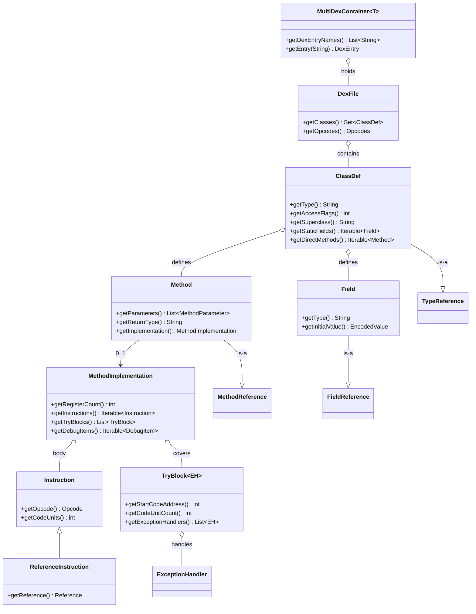

# 📦 iface — 只读接口层

`org.jf.dexlib2.iface` 包定义了 dex 文件的**只读对象模型契约**：从 `DexFile` → `ClassDef` → `Method`/`Field` → `MethodImplementation` → `Instruction`/`TryBlock`/`DebugItem` 这一整条访问链。这些纯接口不带任何状态字段，仅约束 getter 形状与值语义（`hashCode`/`equals`/`compareTo`），因此是 `dexbacked/`（零拷贝解析）、`immutable/`（内存实现）、`builder/`（可变构造）、`writer/`（序列化）几个表示层之间共享的"通用货币"——任一层产出的对象都能被另一层直接消费，无需类型转换。

## 🧩 设计要点

- **纯接口、零字段**：本包只声明契约，不含实现。`dexbacked.*DexBacked*` 从原始 `ByteBuffer` 惰性读取；`immutable.Immutable*` 全量物化；`builder` 可变；`writer` 序列化——四套实现共享同一组接口。
- **定义即引用**：`ClassDef extends TypeReference`、`Field extends FieldReference`、`Method extends MethodReference`。一个"定义"对象同时也是对自己类型的"引用"，因此方法体里 `invoke-virtual` 指向同类另一方法时可直接复用 `Method` 对象，无需再包一层（`ClassDef.java:47`、`Field.java:48`、`Method.java:48`）。
- **可空契约**：抽象方法/接口方法的 `getImplementation()` 返回 `null`；`java.lang.Object` 的 `getSuperclass()` 返回 `null`；字段 `getInitialValue()` 仅静态字段可有可无（`Method.java:120`、`Field.java:87`）。
- **try 块可重叠**：`MethodImplementation.getTryBlocks()` 允许 try 块自由重叠（比 dex 物理格式更宽松），重叠区间的 handler 取并集；写入时由 `writer` 收敛回 dex 要求的升序不重叠形式（`MethodImplementation.java:60-73`）。
- **值语义显式化**：所有可比较接口都把 `hashCode`/`equals`/`compareTo` 的算法写进 javadoc，保证跨实现层对象可互换、可去重、可排序。
- **多 dex 容器**：`MultiDexContainer<T extends DexFile>` 抽象 `.apk`/`.dex`/oat 等多 dex 载体，`DexEntry` 三元组（名 + dex + 容器）支持嵌套遍历（`MultiDexContainer.java:42-74`）。

## 🗂️ 包结构与类清单

`iface/` 下含 5 个子包，共 109 个接口文件：

| 子包 | 文件数 | 职责 |
|---|---|---|
| `iface/`（根） | 14 | dex 文件、类、方法、字段、注解、try 块、异常处理、多 dex 容器等顶层模型 |
| `iface/instruction/` | 22 | 指令的**通用分类**接口（按寄存器数/引用/字面量/偏移划分） |
| `iface/instruction/formats/` | 37 | 指令的**具体格式**接口（每个对应一种 dex 指令编码，如 `Instruction35c`） |
| `iface/reference/` | 8 | 常量池条目的引用契约（见 [iface/reference](./iface-reference.md)） |
| `iface/value/` | 19 | 编码值（字段初始值、注解元素值）的类型族 |
| `iface/debug/` | 9 | 调试信息项（行号、局部变量起止等） |

### 根包核心接口

| 接口 | 职责 | 关键方法 |
|---|---|---|
| `DexFile` | dex 文件 = 一组类定义 + opcode 集 | `getClasses()`、`getOpcodes()` |
| `ClassDef` | 类定义，同时是自身的 `TypeReference` | `getType()`、`getAccessFlags()`、`getSuperclass()`、`getInterfaces()`、`getStaticFields()`、`getInstanceFields()`、`getDirectMethods()`、`getVirtualMethods()` |
| `Method` | 方法定义，同时是自身的 `MethodReference` | `getDefiningClass()`、`getName()`、`getParameters()`、`getReturnType()`、`getAccessFlags()`、`getHiddenApiRestrictions()`、`getImplementation()` |
| `Field` | 字段定义，同时是自身的 `FieldReference` | `getType()`、`getInitialValue()`、`getHiddenApiRestrictions()` |
| `MethodImplementation` | 方法体（寄存器+指令+try+调试） | `getRegisterCount()`、`getInstructions()`、`getTryBlocks()`、`getDebugItems()` |
| `MethodParameter` | 方法参数，同时是 `TypeReference` 与 `LocalInfo` | `getType()`、`getName()`、`getSignature()`、`getAnnotations()` |
| `Member` | 字段/方法的共性基类 | `getDefiningClass()`、`getName()`、`getAccessFlags()`、`getHiddenApiRestrictions()` |
| `Annotatable` | 可被注解的对象 | `getAnnotations()` |
| `Annotation` | 注解实例（可见性+类型+元素） | `getVisibility()`、`getType()`、`getElements()` |
| `BasicAnnotation` | 注解的类型+元素契约（无可见性） | `getType()`、`getElements()` |
| `AnnotationElement` | 注解的 name/value 对 | `getName()`、`getValue()` |
| `TryBlock<EH>` | try 块（起始+长度+handler 列表） | `getStartCodeAddress()`、`getCodeUnitCount()`、`getExceptionHandlers()` |
| `ExceptionHandler` | 单个异常处理项 | `getExceptionType()`、`getHandlerCodeAddress()` |
| `MultiDexContainer<T>` | 多 dex 容器 | `getDexEntryNames()`、`getEntry(String)` |

### instruction 子包（通用分类）

每条具体指令对象会按其语义**同时实现多个**分类接口。例如 `invoke-virtual` 的实现类通常实现 `Instruction35c`（格式）+ `FiveRegisterInstruction`（5 寄存器）+ `ReferenceInstruction`（带方法引用）。

| 接口 | 划分维度 | 关键方法 |
|---|---|---|
| `Instruction` | 根接口 | `getOpcode()`、`getCodeUnits()` |
| `OneRegisterInstruction` | 1 寄存器 | `getRegisterA()` |
| `TwoRegisterInstruction` | 2 寄存器 | `getRegisterA()`、`getRegisterB()` |
| `ThreeRegisterInstruction` | 3 寄存器 | `getRegisterA/B/C()` |
| `FiveRegisterInstruction` | 5 寄存器（35c/3rc 等） | `getRegisterC/D/E/F/G()` |
| `RegisterRangeInstruction` | 寄存器区间（3rc） | `getStartRegister()`、`getRegisterCount()` |
| `VariableRegisterInstruction` | 变长寄存器（35c） | `getRegisterCount()`、`getRegisters()` |
| `ReferenceInstruction` | 带常量池引用 | `getReference()`、`getReferenceType()` |
| `OffsetInstruction` | 带分支偏移 | `getCodeOffset()` |
| `WideLiteralInstruction` | 64 位字面量 | `getWideLiteral()` |
| `NarrowLiteralInstruction` | 32 位字面量 | `getNarrowLiteral()` |
| `VerificationErrorInstruction` | 验证错误（20bc） | `getVerificationError()` |
| `PayloadInstruction` | switch/payload 载荷 | — |

`iface/instruction/formats/` 下的 37 个接口每个对应一种 dex 编码格式（如 `Instruction10x`、`Instruction21c`、`Instruction35c`、`Instruction3rc`、`Instruction45cc`、`ArrayPayload`、`PackedSwitchPayload` 等），均为上述分类接口的**空标记组合**，例如 `Instruction35c.java:37` 仅 `extends FiveRegisterInstruction, ReferenceInstruction {}`。

## 📐 类关系图



## 🔍 典型用法

遍历 dex、读取每个类的方法体并打印所有方法调用——这是只读分析最常见的形态，全程只依赖 `iface` 接口，不耦合任何实现层：

```java
// DexFileFactory.loadDexFile 返回 DexFile（实为 DexBackedDexFile，但按 iface 消费）
import org.jf.dexlib2.iface.DexFile;
import org.jf.dexlib2.iface.ClassDef;
import org.jf.dexlib2.iface.Method;
import org.jf.dexlib2.iface.instruction.Instruction;
import org.jf.dexlib2.iface.instruction.ReferenceInstruction;
import org.jf.dexlib2.iface.reference.MethodReference;

for (ClassDef cls : dexFile.getClasses()) {
    for (Method m : cls.getMethods()) {
        if (m.getImplementation() == null) continue;          // 抽象/native
        for (Instruction ins : m.getImplementation().getInstructions()) {
            if (ins instanceof ReferenceInstruction) {
                ReferenceInstruction ri = (ReferenceInstruction) ins;
                if (ri.getReference() instanceof MethodReference) {
                    MethodReference mr = (MethodReference) ri.getReference();
                    // mr.getDefiningClass() / getName() / getParameterTypes() / getReturnType()
                }
            }
        }
    }
}
```

`Method` 同时是 `MethodReference`，所以"定义"可直接当"引用"塞进 `invoke-*` 的 `ReferenceInstruction.getReference()`，无需包装（`Method.java:48`）：

```java
// Method 继承 MethodReference，故可作为引用直接传递
public interface Method extends MethodReference, Member { /* ... */ }
```

## ⚙️ 与其他包的协作

- **`dexbacked/`** —— 本包的**零拷贝实现**：`DexBackedDexFile`/`DexBackedClassDef` 等直接从 `ByteBuffer` 惰性读取，是 `DexFileFactory` 的默认产物。迭代 `getInstructions()` 时按需解码，内存占用极低。
- **`immutable/`** —— **全量物化实现**：`ImmutableDexFile`/`ImmutableClassDef` 等，适合脱离原始字节独立持有或修改后的产物。
- **`builder/`** —— **可变构造**：`MutableMethodImplementation` + builder 指令，是 smali 树组装器的目标；构造完成后可转为 `immutable` 或直接交给 `writer`。
- **`writer/`** —— **序列化**：`DexWriter` 把 `iface` 对象写回 dex 字节流，写入前对引用调用 `Reference.validateReference()`。
- **`rewriter/`** —— **批量变换**：基于 `Rewriter<T>` 改写类/方法/字段引用，输入输出仍是 `iface` 类型。
- **`analysis/`** —— **deodex/类型推断**：`MethodAnalyzer` 消费 `MethodImplementation` 的指令流，产出经解析的等价 `iface` 指令。
- **baksmali `Adaptors/`** —— 反汇编输出：每个 `iface` 元素对应一个 Adapter，把对象模型渲染成 smali 文本。

> 引用契约细节见 [iface/reference](./iface-reference.md)；指令格式与分类的完整对照见 `dexlib2/src/main/java/org/jf/dexlib2/iface/instruction/` 与 `iface/instruction/formats/` 目录。

## 延伸阅读

- [iface/reference — 引用接口](./iface-reference.md)
- [dexlib2/util](./util.md)
- [dexlib2/formatter](./formatter.md)
- baksmali 命令
- smali assembler 概览
- [Skills 总览](../../skills/)
