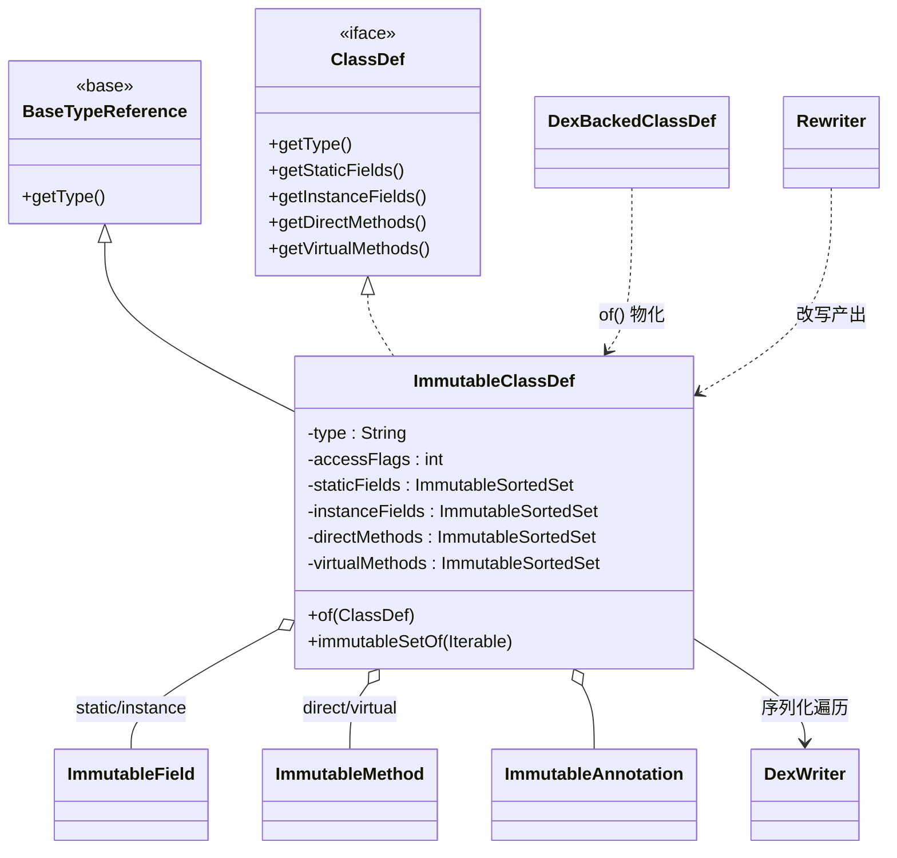

# 📦 ImmutableClassDef — 内存化类定义

`ImmutableClassDef` 是 `org.jf.dexlib2.immutable` 包中对 `iface.ClassDef` 的不可变实现。一个 dex 中的"类"在内存里长什么样，就由它定义：类型签名、访问标志、父类、接口列表、源文件、注解，以及被分桶后的 static/instance 字段与 direct/virtual 方法。它继承 `BaseTypeReference`（提供 `getType()` 等基础引用行为），实现 `ClassDef`，所有集合字段在构造时一次性物化为 Guava `Immutable*`，对象一旦创建即不可更改。

它是脱离原 dex 字节缓冲（`dexbacked/`）后传递类信息的最通用载体：`writer/` 序列化时遍历其成员、`rewriter/` 改写后产出新实例、`smali` 树落器最终把它交给 `dexlib2` 写入器。源码位于 `dexlib2/src/main/java/org/jf/dexlib2/immutable/ImmutableClassDef.java`。

## 🧩 角色定位

- **不可变契约**：9 个字段全部 `final`，集合类型用 `ImmutableList`/`ImmutableSet`/`ImmutableSortedSet`，`null` 入参归一为空集合（见 `ImmutableClassDef.java:79-89`）。
- **分桶持有者**：构造期即把混合的 `fields`/`methods` 按 static/instance、direct/virtual 拆分到独立有序集合，写出时布局稳定可复现。
- **`of()` 短路**：入参已是 `ImmutableClassDef` 时直接原样返回，避免深拷贝（`ImmutableClassDef.java:135-138`）。
- **批量转换**：内置 `CONVERTER`，`immutableSetOf(Iterable)` 逐项检查是否已是不可变实例再决定是否物化（`ImmutableClassDef.java:200-212`）。

## 📐 关键字段

| 字段 | 类型 | 备注 |
|---|---|---|
| `type` | `String` | 类类型签名，如 `Lcom/foo/Bar;`，`@Nonnull` |
| `accessFlags` | `int` | 访问标志位掩码（public/final/abstract 等） |
| `superclass` | `String` | 父类类型签名，`@Nullable`（`java/lang/Object` 也可能为 null） |
| `interfaces` | `ImmutableList<String>` | 实现的接口列表，构造时 `copyOf` |
| `sourceFile` | `String` | 源文件名，`@Nullable` |
| `annotations` | `ImmutableSet<? extends ImmutableAnnotation>` | 类级注解，经 `ImmutableAnnotation.immutableSetOf` 物化 |
| `staticFields` | `ImmutableSortedSet<? extends ImmutableField>` | 静态字段，自然序 |
| `instanceFields` | `ImmutableSortedSet<? extends ImmutableField>` | 实例字段，自然序 |
| `directMethods` | `ImmutableSortedSet<? extends ImmutableMethod>` | direct 方法（private/static/构造），自然序 |
| `virtualMethods` | `ImmutableSortedSet<? extends ImmutableMethod>` | virtual 方法，自然序 |

字段定义见 `ImmutableClassDef.java:53-62`。

## ⚙️ 关键方法

| 方法 | 作用 | 备注 |
|---|---|---|
| `ImmutableClassDef(type, accessFlags, superclass, interfaces, sourceFile, annotations, fields, methods)` | 混合字段/方法的分桶构造器 | 用 `FieldUtil.FIELD_IS_STATIC`/`MethodUtil.METHOD_IS_DIRECT` 过滤分桶，`ImmutableClassDef.java:64-89` |
| `ImmutableClassDef(... staticFields, instanceFields, directMethods, virtualMethods)` | 已分桶构造器 | 调用方自行分桶，直接物化，`:91-111` |
| 第三构造器（全 `Immutable*`） | 直接持有已物化集合 | `null` 用 `ImmutableUtils.nullToEmptyXxx` 归一，`:113-133` |
| `static of(ClassDef)` | 由任意 `ClassDef` 转换 | 已是本类型则短路返回，`:135-150` |
| `getType()` / `getAccessFlags()` / `getSuperclass()` / `getInterfaces()` / `getSourceFile()` | 元数据访问 | 直接返回字段 |
| `getStaticFields()` / `getInstanceFields()` / `getDirectMethods()` / `getVirtualMethods()` | 分桶成员访问 | 返回对应 `ImmutableSortedSet`/`ImmutableSet` |
| `getFields()` | 合并 static+instance 字段的只读视图 | 返回 `AbstractCollection`，迭代器 `concat` 两桶，`:163-177` |
| `getMethods()` | 合并 direct+virtual 方法的只读视图 | 同上策略，`:179-193` |
| `static immutableSetOf(Iterable<? extends ClassDef>)` | 批量转换 | 委托 `CONVERTER`，`:195-198` |

## 🔄 与相关类的协作



数据流向上：从 `DexBackedDexFile` 懒读取出的 `DexBackedClassDef` 经 `ImmutableClassDef.of()` 全量物化为不可变实例；`rewriter/` 在改写类名/引用后会重建 `ImmutableClassDef`；最终 `writer/` 遍历其分桶成员写出 dex。

## 📝 典型用法

```java
// 从 DexBacked 类物化为不可变实例（短路优化）
ImmutableClassDef imm = ImmutableClassDef.of(dexBackedClassDef);

// 重新构造一个类：混合 fields/methods，构造器自动分桶
ImmutableClassDef rebuilt = new ImmutableClassDef(
        "Lcom/foo/Bar;",
        AccessFlags.PUBLIC.getValue(),
        "Lcom/foo/Base;",
        Collections.singletonList("Lcom/foo/I;"),
        "Bar.java",
        Collections.<Annotation>emptyList(),
        fields,        // 混合 static+instance
        methods);      // 混合 direct+virtual

// 批量转换一整组类，已不可变的项不会重复物化
ImmutableSet<ImmutableClassDef> classes =
        ImmutableClassDef.immutableSetOf(dexFile.getClasses());

// 合并视图：getFields() 跨 static+instance 迭代
for (ImmutableField f : imm.getFields()) { /* ... */ }
```

## 🔍 源码要点

- **null 归一**：构造器对 `null` 入参统一替换为空集合，确保后续无 NPE（`ImmutableClassDef.java:72-77, 104, 126-132`）。混合构造器用 `ImmutableXxx.immutableSetOf` + `ImmutableUtils.nullToEmptyXxx`，分桶构造器用 `ImmutableList.copyOf`。
- **自动分桶谓词**：`Iterables.filter(fields, FieldUtil.FIELD_IS_STATIC)` 把 static 字段滤出，instance 同理；方法用 `MethodUtil.METHOD_IS_DIRECT` / `METHOD_IS_VIRTUAL`（`:85-88`）。这意味着混合构造器会遍历两次 fields 与两次 methods；若调用方已分桶，应优先用第二构造器避免重复过滤。
- **`getFields()`/`getMethods()` 视图**：返回的 `AbstractCollection` 是惰性合并视图，`iterator()` 用 `Iterators.concat`，`size()` 是两桶之和；它**不**新建底层集合，遍历成本低但不可重复 add（`:163-193`）。
- **有序性与可复现写出**：`staticFields`/`instanceFields`/`directMethods`/`virtualMethods` 全用 `ImmutableSortedSet`（自然序），这是 dex 输出布局稳定、可做 round-trip 比对的基础。
- **`CONVERTER` 语义**：`isImmutable` 仅做 `instanceof` 判定，`makeImmutable` 委托 `of()`，因此批量转换对已是 `ImmutableClassDef` 的元素零开销（`:200-212`）。

## 延伸阅读

- [immutable — 内存化实现层](./immutable.md)
- [iface — 只读接口层](./iface.md)
- [iface-reference — 引用接口](./iface-reference.md)
- [dexbacked — 懒解析实现](./dexbacked.md)
- [rewriter — dex 改写](./rewriter.md)
- [writer — dex 序列化](./writer.md)
