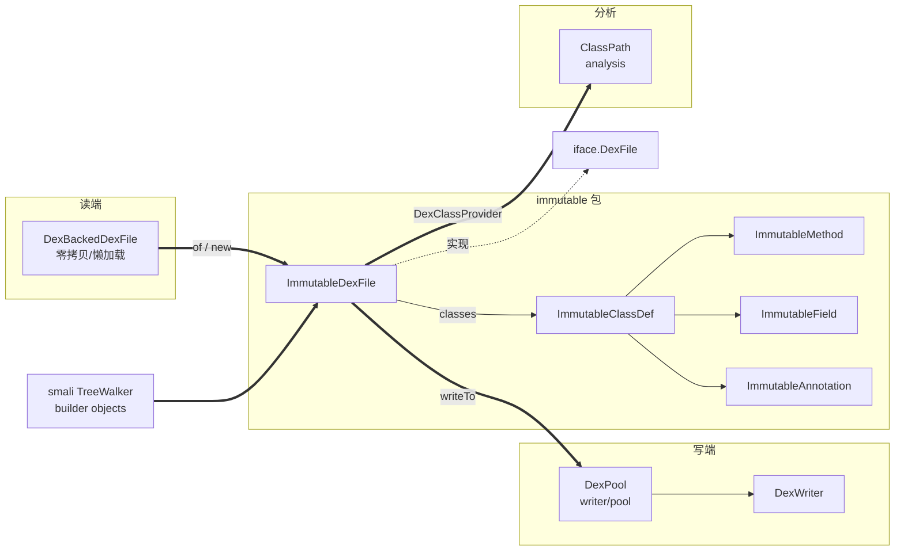

# 📦 ImmutableDexFile

`ImmutableDexFile` 是 dexlib2 `immutable` 包下对 `org.jf.dexlib2.iface.DexFile` 接口的唯一实现，代表一个**完全物化在内存中、不可变**的 dex 文件。与 `dexbacked` 包里懒加载、零拷贝的 `DexBackedDexFile` 形成对照：后者直接读取原始字节缓冲区，访问开销低但与底层字节绑定；而 `ImmutableDexFile` 把所有类、方法、字段一次性构造为 Guava 不可变集合，脱离原始字节独立存在，因此**可以安全地跨线程共享、可被任意修改后重新写出**。

源码非常精简，见 `dexlib2/src/main/java/org/jf/dexlib2/immutable/ImmutableDexFile.java`。

## 🎯 角色定位

| 维度 | 说明 |
|------|------|
| 实现接口 | `org.jf.dexlib2.iface.DexFile` |
| 可变性 | 完全不可变（字段 `final`，集合为 `ImmutableSet`） |
| 物化方式 | 构造时一次性深拷贝所有 `ClassDef` 为 `ImmutableClassDef` |
| 典型来源 | `DexBackedDexFile` 转换、smali 树 walker 构造、测试夹具 |
| 典型去向 | `DexPool` / `DexWriter` 序列化、`Rewriter` 变换、`ClassPath` 分析 |

它是「读—改—写」管线的**中间表示 (IR)**：读端把任意 `DexFile` 物化进来，写端把它重新落盘。

## 🧩 关键字段

| 字段 | 类型 | 说明 | 源码 |
|------|------|------|------|
| `classes` | `ImmutableSet<? extends ImmutableClassDef>` | dex 内全部类定义，去重且不可变 | `ImmutableDexFile.java:45` |
| `opcodes` | `Opcodes` | 该 dex 对应的字节码版本/可用指令集 | `ImmutableDexFile.java:46` |

注意字段类型用通配符 `? extends ImmutableClassDef`：集合本身不可变，元素也锁定为 `ImmutableClassDef`，保证整树一致不可变。

## ⚙️ 关键方法

| 方法 | 作用 | 备注 |
|------|------|------|
| `ImmutableDexFile(Opcodes, Collection<? extends ClassDef>)` | 从任意 `ClassDef` 集合物化 | 通过 `ImmutableClassDef.immutableSetOf` 深拷贝 |
| `ImmutableDexFile(Opcodes, ImmutableSet<? extends ImmutableClassDef>)` | 直接接收已物化集合 | 走 `ImmutableUtils.nullToEmptySet`，null 视为空集 |
| `static of(DexFile)` | 适配器：把任意 `DexFile` 转 `ImmutableDexFile` | 若入参已是本类则原样返回，避免重复物化 |
| `getClasses()` | 返回全部类 | 返回 `ImmutableSet`，实现 `DexFile` 接口 |
| `getOpcodes()` | 返回指令集 | 实现 `DexFile` 接口 |

`of(DexFile)` 是最常用的入口，模式：

```java
public static ImmutableDexFile of(DexFile dexFile) {
    if (dexFile instanceof ImmutableDexFile) {
        return (ImmutableDexFile)dexFile;
    }
    return new ImmutableDexFile(dexFile.getOpcodes(), dexFile.getClasses());
}
```

## 🔄 类关系图



`of()` 是从读端 `DexBackedDexFile` 进入 immutable 世界的桥梁；smali 汇编侧的树 walker 直接产出 `ImmutableClassDef` 集合喂给构造器；写端 `DexPool.writeTo` 接收 `ImmutableDexFile` 做池化序列化。

## 📐 典型用法

### 1. 从已解析的 dex 物化（读端桥接）

```java
// DexFileFactory.loadDexFile 返回 DexBackedDexFile
DexBackedDexFile backed = DexFileFactory.loadDexFile(file, null);
ImmutableDexFile immutable = ImmutableDexFile.of(backed);
// 之后即可脱离原始字节安全持有、遍历、变换
```

### 2. 程序化构造并写出（写端管线）

摘自 `dexlib2/src/test/java/org/jf/dexlib2/writer/DexWriterTest.java:75`：

```java
ImmutableClassDef classDef = new ImmutableClassDef(...);
ImmutableDexFile dexFile = new ImmutableDexFile(
    Opcodes.getDefault(), ImmutableSet.of(classDef));
DexPool.writeTo(dataStore, dexFile);  // 序列化为 dex 字节
```

### 3. 作为 ClassPath 的内置类提供者

`analysis/ClassPath.java:118` 用 `ImmutableDexFile` 承载几个假设存在的反射基类（`Object`/`String`/`Class` …），供类型推断兜底：

```java
return new DexClassProvider(new ImmutableDexFile(Opcodes.getDefault(), ImmutableSet.of(
        new ReflectionClassDef(Class.class),
        new ReflectionClassDef(Object.class),
        ...)));
```

### 4. 多 dex 容器

`ImmutableMultiDexContainer` 以 `Map<String, ImmutableDexFile>` 表达 .apk/.zip 内多个 dex，每个 entry 持有一个 `ImmutableDexFile`，是物化版的多 dex 容器。

## 🔍 源码要点

- **不可变性由两层保证**：字段 `final` + Guava `ImmutableSet`，且元素类型递归为 `Immutable*`（`ImmutableClassDef` 的字段同样是 `ImmutableSortedSet<ImmutableMethod>` 等，见 `ImmutableClassDef.java:59-62`）。
- **null 安全**：构造器对 `null` 集合统一转空集（`ImmutableClassDef.immutableSetOf` / `ImmutableUtils.nullToEmptySet`），调用方无需判空。
- **`of()` 的零拷贝快路径**：当入参已是 `ImmutableDexFile` 时直接强转返回，避免对已物化对象做无谓的深拷贝——这是把 immutable 当"规范类型"使用的性能要点。
- **无头部/校验逻辑**：本类不持有 dex header、checksum、map list，这些由写端 `DexWriter` 在序列化时生成；`ImmutableDexFile` 只关心逻辑层面的「类集合 + opcodes」。
- **与 `DexBackedDexFile` 的取舍**：只读扫描优先用 `DexBackedDexFile`（零拷贝、省内存）；需要修改、重排、跨上下文共享或写出时，物化为 `ImmutableDexFile`。

## 延伸阅读

- [ImmutableClassDef](./immutable-classdef.md)
- [DexBackedDexFile（零拷贝读端）](./dexbacked-dexfile.md)
- [Opcodes 与版本映射](./opcodes.md)
- baksmali skill: 读取与反汇编 dex
