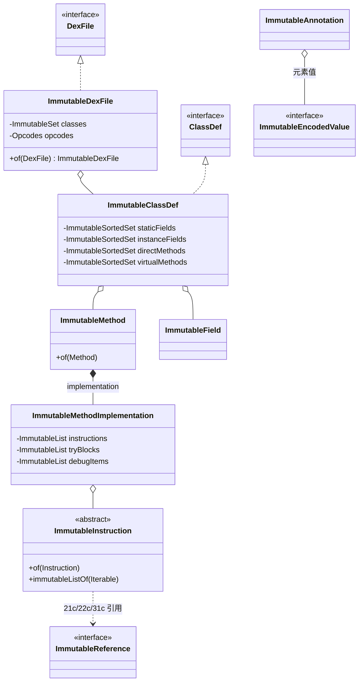

# 📦 immutable — 内存化实现层

`org.jf.dexlib2.immutable` 包为 `iface/` 中定义的只读接口提供**不可变、全量物化**的实现：从 `DexFile`、`ClassDef`、`Method`、`Field` 一直到指令、引用、调试项、注解值，全部用 Guava `Immutable*` 集合装载，对象一旦构造即不可更改。它是脱离原 dex 字节缓冲（`dexbacked/`）后持有、复制、传递数据的通用载体——`writer/` 序列化、`rewriter/` 改写、`smali` 树落器产出都直接消费 `Immutable*` 对象。

## 🧩 设计要点

- **不可变契约**：所有字段在构造时一次性物化，集合用 `ImmutableList`/`ImmutableSet`/`ImmutableSortedSet`，`null` 输入归一为空集合（见 `ImmutableClassDef.java:79-89`）。
- **三段式构造器**：每个类通常有 3 个构造器——(1) 接受 `iface` 可变集合类型（自动转换）；(2) 接受已 `Immutable*` 的集合（直接持有）；(3) 全字段构造。配合 `of()` 静态工厂使用。
- **`of()` 短路优化**：`ImmutableXxx.of(xxx)` 在入参已是 `ImmutableXxx` 时直接原样返回，避免深拷贝（`ImmutableClassDef.java:135-150`、`ImmutableDexFile.java:58-63`）。
- **`ImmutableConverter` 批量转换**：每个集合容器类持有一个 `CONVERTER`，`immutableSetOf()`/`immutableListOf()` 逐项 `isImmutable` 检查并按需 `makeImmutable`，避免对已不可变项重复物化（`ImmutableClassDef.java:200-212`）。
- **自动分桶**：`ImmutableClassDef` 接受混合的 `fields`/`methods` 可迭代对象时，用 `FieldUtil.FIELD_IS_STATIC` / `MethodUtil.METHOD_IS_DIRECT` 谓词过滤后分别落入 static/instance、direct/virtual 桶（`ImmutableClassDef.java:85-88`）。
- **有序保证**：字段用 `ImmutableSortedSet`（自然序）、方法同样排序，使写出的 dex 布局稳定可复现。

## 🗂️ 子包与类清单

| 子包 / 类 | 职责 | 关键方法 |
|---|---|---|
| `ImmutableDexFile` | dex 文件根，持有 `ImmutableSet<ImmutableClassDef>` + `Opcodes` | `of(DexFile)`、`getClasses()`、`getOpcodes()` |
| `ImmutableMultiDexContainer` | 多 dex 容器（如 multidex zip） | `getDexEntryNames()`、`getEntry(String)` |
| `ImmutableClassDef` | 类定义，static/instance 字段与 direct/virtual 方法分桶 | `of(ClassDef)`、`immutableSetOf(Iterable)` |
| `ImmutableField` | 字段定义，继承 `BaseFieldReference` | `of(Field)`、`immutableSetOf(Iterable)` |
| `ImmutableMethod` | 方法定义，继承 `BaseMethodReference` | `of(Method)`、`immutableSetOf(Iterable)` |
| `ImmutableMethodParameter` | 方法形参（类型 + 注解） | `of(MethodParameter)`、`immutableListOf(Iterable)` |
| `ImmutableMethodImplementation` | 方法体：寄存器数、指令、try 块、调试项 | `of(MethodImplementation)` |
| `ImmutableTryBlock` / `ImmutableExceptionHandler` | try 块与异常处理器 | `of(...)`、`immutableListOf(...)` |
| `ImmutableAnnotation` / `ImmutableAnnotationElement` | 注解及其键值对 | `of(...)`、`immutableSetOf(...)` |
| `instruction/` | 35+ 个按 `Format` 细分的不可变指令 + 工厂 | `ImmutableInstruction.of(Instruction)` |
| `instruction/ImmutableInstructionFactory` | 单例工厂，实现 `writer.InstructionFactory` | `INSTANCE`、`makeInstruction21c(...)` 等 |
| `reference/` | 7 种不可变引用（`ImmutableReference` 为标记接口） | `ImmutableReferenceFactory.of(Reference)` |
| `value/` | 19 种不可变编码值 + 工厂 | `ImmutableEncodedValueFactory.of(EncodedValue)` |
| `debug/` | 7 种不可变调试项（StartLocal/LineNumber 等） | `ImmutableDebugItem.of(DebugItem)` |
| `util/ParamUtil` | 从形参描述符串解析出 `ImmutableMethodParameter` | `parseParamString(String)` |
| `util/CharSequenceConverter` | `CharSequence` → `ImmutableList<String>` | `immutableStringList(Iterable)` |

## 📐 类关系图



## 🔄 转换范式

整包的转换逻辑高度一致。以指令为例，`ImmutableInstruction.of(Instruction)` 按 `opcode.format` 分派到对应格式子类的 `of()`（`immutable/instruction/ImmutableInstruction.java:53-137`）：

```java
public static ImmutableInstruction of(Instruction instruction) {
    if (instruction instanceof ImmutableInstruction) {
        return (ImmutableInstruction)instruction;
    }
    switch (instruction.getOpcode().format) {
        case Format21c:
            return ImmutableInstruction21c.of((Instruction21c)instruction);
        case Format35c:
            return ImmutableInstruction35c.of((Instruction35c)instruction);
        // ... 其余 format 分支
        case ArrayPayload:
            return ImmutableArrayPayload.of((ArrayPayload) instruction);
        default:
            throw new RuntimeException("Unexpected instruction type");
    }
}
```

引用与编码值走同样的分派模式：`ImmutableReferenceFactory.of(Reference)` 按 `instanceof` 路由到 7 个具体引用（`reference/ImmutableReferenceFactory.java:42-65`）；`ImmutableEncodedValueFactory.of(EncodedValue)` 按 `getValueType()` 路由到 19 个编码值（`value/ImmutableEncodedValueFactory.java:46-86`）。

## ⚙️ 典型用法

从 `DexBackedDexFile`（零拷贝、依赖原缓冲）转出一份独立的、可任意传递的不可变 dex：

```java
import org.jf.dexlib2.DexFileFactory;
import org.jf.dexlib2.iface.DexFile;
import org.jf.dexlib2.immutable.ImmutableDexFile;
import org.jf.dexlib2.immutable.ImmutableClassDef;

DexFile parsed = DexFileFactory.loadDexFile(apkFile, null);
// 整文件物化（of 短路：若已是 Immutable 则零成本）
ImmutableDexFile immutable = ImmutableDexFile.of(parsed);

// 单类物化并脱离原缓冲
ImmutableClassDef cls = ImmutableClassDef.of(parsed.getClasses().iterator().next);
// 此后 cls 持有的方法体指令已全部是不可变副本，原 DexBacked 缓冲可释放
```

`ImmutableInstructionFactory.INSTANCE` 是供 `writer/` 在反序列化/构造时按格式批量建指令的入口，单例模式（`instruction/ImmutableInstructionFactory.java:43-47`）。

## 🔍 与其他包的协作

- **`iface/`**：本包实现 `iface` 全部接口，是读写两侧共享契约的"物化侧"。
- **`dexbacked/`**：零拷贝解析的产物，通过各 `of()` 静态方法物化为本包对象后即可脱离字节缓冲。
- **`builder/`**：可变方法体构造目标，由 `smali` 树落器产出；`builder` 与 `immutable` 是两种物化策略，前者可变、后者不可变。
- **`writer/`**：序列化器接受任意 `iface` 实现，本包是其最常见的稳定数据源；`ImmutableInstructionFactory` 直接实现 `writer.InstructionFactory`。
- **`rewriter/`**：改写流程常以本包作为"改完的成品"落点，便于去重与稳定排序。

## 📚 延伸阅读

- [iface-reference — 引用接口](./iface-reference.md)
- [dexbacked — 零拷贝解析层](./dexbacked.md)
- [builder — 可变构造层](./builder.md)
- [writer — 序列化层](./writer.md)
- [rewriter — 改写层](./rewriter.md)
