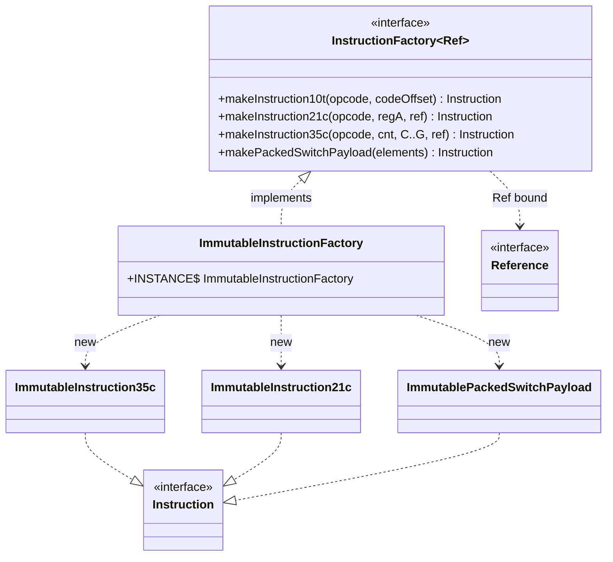

# 🏗️ InstructionFactory — 指令工厂

`InstructionFactory` 是 `dexlib2/src/main/java/org/jf/dexlib2/writer/` 包下的一个泛型接口，它把「构造一条 Dalvik 指令」这一动作从「指令的具体实现类」中剥离出来。接口按 **dex 指令格式**（10t、21c、35c、3rc、51l …）逐一提供 `makeInstructionXxx` 工厂方法，调用方只需传入操作码与语义参数（寄存器编号、立即数、引用、跳转偏移），即可拿到一个 `Instruction` 对象，无需关心它最终是 `ImmutableInstruction35c` 还是别的实现。

## 🗂️ 角色定位

- **层级**：`org.jf.dexlib2.writer.InstructionFactory`，源码 `dexlib2/src/main/java/org/jf/dexlib2/writer/InstructionFactory.java:44`。
- **泛型参数** `<Ref extends Reference>`：工厂方法接收的引用类型上界。接口本身只依赖 `iface.reference.Reference`，因此可被「按引用子类型分桶」的实现复用。
- **解耦点**：它位于 `writer/` 包却**不依赖** `immutable/` 或 `builder/`，使得「写回 dex 时如何物化指令」与「指令的数据模型」相互独立。
- **唯一实现**：`org.jf.dexlib2.immutable.instruction.ImmutableInstructionFactory`（`dexlib2/src/main/java/org/jf/dexlib2/immutable/instruction/ImmutableInstructionFactory.java:43`），以单例 `INSTANCE` 形式提供，全部方法直接 `new ImmutableInstructionXxx(...)`。

> 注意：`InstructionFactory` 与 `builder/` 包的 `BuilderInstruction` 系列无直接联系。汇编侧（smali tree walker）直接用 builder 类构造指令，不经过本工厂；本工厂面向「需要把语义化参数物化为只读 `Instruction` 的场景」（如反 odex 后重建指令、测试夹具构造）。

## 📦 泛型与类型边界

| 元素 | 声明 | 说明 |
|------|------|------|
| 类型参数 | `<Ref extends Reference>` | 限制工厂接收的引用类型，实现可收窄为 `Reference` 或更具体子类型 |
| 返回类型 | `Instruction` | 所有方法统一返回 `iface.instruction.Instruction`，抹平实现差异 |
| 引用注解 | `@Nonnull Ref` / `@Nullable List<...>` | 引用参数必非空；switch/array 载荷的元素列表允许为 null（表示空载荷） |

## 🔧 关键方法（按格式分组）

接口共 25 个方法，覆盖 dex 全部标准指令格式与三种载荷。下表节选代表性方法，完整定义见 `InstructionFactory.java:45`。

| 方法 | 语义参数 | 对应格式/用途 |
|------|----------|---------------|
| `makeInstruction10t(opcode, codeOffset)` | 跳转偏移 | 10t（`goto`） |
| `makeInstruction10x(opcode)` | 无 | 10x（`nop`、`return-void`） |
| `makeInstruction11n(opcode, regA, literal)` | 1 寄存器 + 窄立即数 | 11n（`const/4`） |
| `makeInstruction11x(opcode, regA)` | 1 寄存器 | 11x（`move-result`、`return`） |
| `makeInstruction12x(opcode, regA, regB)` | 2 寄存器 | 12x（`move`、`array-length`） |
| `makeInstruction20bc(opcode, verifErr, ref)` | 校验错误 + 引用 | 20bc（`throw-verification-error`） |
| `makeInstruction21c(opcode, regA, ref)` | 1 寄存器 + 引用 | 21c（`const-string`、`new-instance`） |
| `makeInstruction21ih(opcode, regA, literal)` | 1 寄存器 + hat 立即数 | 21ih（`const/high16`） |
| `makeInstruction21lh(opcode, regA, literal)` | 1 寄存器 + 宽 hat 立即数 | 21lh（`const-wide/high16`） |
| `makeInstruction21s(opcode, regA, literal)` | 1 寄存器 + 短立即数 | 21s（`const/16`） |
| `makeInstruction21t(opcode, regA, codeOffset)` | 1 寄存器 + 跳转 | 21t（`if-eqz`） |
| `makeInstruction22b/22s(opcode, regA, regB, literal)` | 2 寄存器 + 立即数 | 22b/22s（`add-int/lit8`） |
| `makeInstruction22c(opcode, regA, regB, ref)` | 2 寄存器 + 引用 | 22c（`iput`、`sget`） |
| `makeInstruction22t(opcode, regA, regB, codeOffset)` | 2 寄存器 + 跳转 | 22t（`if-eq`） |
| `makeInstruction22x/23x/32x(...)` | 2/3 寄存器 | 22x/23x/32x（`move/from16`、`add-int`） |
| `makeInstruction30t(opcode, codeOffset)` | 跳转偏移 | 30t（`packed-switch`、`sparse-switch` 的指向指令） |
| `makeInstruction31c(opcode, regA, ref)` | 1 寄存器 + 引用 | 31c（`const-string/jumbo`） |
| `makeInstruction31i(opcode, regA, literal)` | 1 寄存器 + 立即数 | 31i（`const`） |
| `makeInstruction31t(opcode, regA, codeOffset)` | 1 寄存器 + 跳转 | 31t（`fill-array-data`、`packed-switch`） |
| `makeInstruction35c(opcode, cnt, C,D,E,F,G, ref)` | 5 寄存器 + 引用 | 35c（`invoke-virtual`） |
| `makeInstruction3rc(opcode, startReg, cnt, ref)` | 寄存器区间 + 引用 | 3rc（`invoke-virtual/range`） |
| `makeInstruction51l(opcode, regA, literal)` | 1 寄存器 + 宽立即数 | 51l（`const-wide`） |
| `makeSparseSwitchPayload(elements)` | `SwitchElement` 列表 | sparse-switch 载荷 |
| `makePackedSwitchPayload(elements)` | `SwitchElement` 列表 | packed-switch 载荷 |
| `makeArrayPayload(elementWidth, elements)` | 元素宽度 + 数值列表 | fill-array-data 载荷 |

> 方法命名直接对齐 dex 格式编号，与 `iface/instruction/formats/` 的格式接口一一对应（参见 [iface/instruction — 指令接口](./iface-instruction.md)）。`makeInstruction35c` 的 5 个寄存器按 `C..G` 顺序传入，与 `FiveRegisterInstruction` 的 getter 命名一致。

## 🧩 协作关系



`ImmutableInstructionFactory` 是「胖工厂」：每个方法体仅一行 `return new ImmutableInstructionXxx(...)`，把构造细节完全下放到各不可变指令的构造函数（后者在构造时做寄存器宽度、立即数范围等校验）。

## ⚙️ 实现要点

`ImmutableInstructionFactory` 的设计有三处值得注意：

1. **单例**：`public static final ImmutableInstructionFactory INSTANCE`（`ImmutableInstructionFactory.java:44`），无状态，全局共享。私有构造函数禁止外部 `new`。
2. **泛型擦除到 `Reference`**：实现声明 `implements InstructionFactory<Reference>`，因此工厂方法接收任意 `Reference` 子类型（`StringReference`、`MethodReference` …），返回的 `ImmutableInstructionXxx` 内部以 `Reference` 字段持有。
3. **返回协变类型**：接口声明返回 `Instruction`，实现把返回类型收窄为具体的 `ImmutableInstructionXxx`（如 `makeInstruction35c` 返回 `ImmutableInstruction35c`），调用方在需要具体类型时无需强转。

```java
// dexlib2/src/main/java/org/jf/dexlib2/writer/InstructionFactory.java:68
Instruction makeInstruction35c(@Nonnull Opcode opcode, int registerCount, int registerC, int registerD,
        int registerE, int registerF, int registerG, @Nonnull Ref reference);

// dexlib2/src/main/java/org/jf/dexlib2/immutable/instruction/ImmutableInstructionFactory.java:186
public ImmutableInstruction35c makeInstruction35c(@Nonnull Opcode opcode, int registerCount,
        int registerC, int registerD, int registerE, int registerF, int registerG,
        @Nonnull Reference reference) {
    return new ImmutableInstruction35c(opcode, registerCount, registerC, registerD, registerE,
            registerF, registerG, reference);
}
```

## 🔄 写回路径中的位置

`InstructionFactory` 位于 `writer/` 包，但**不直接参与** `DexWriter` 的序列化热路径——`DexWriter` 通过 `InstructionWriter`（`DexWriter.java:1210`）按操作码格式逐条写出已存在的 `Instruction`，而那些 `Instruction` 来自 `iface` 层（`DexBacked*` 或 `Immutable*`），其创建由各实现的读取逻辑或本工厂完成。换言之：

- **读取侧**：`DexBackedDexFile` 解析时由 `dexbacked/instruction/DexBackedInstruction.readFrom(...)` 等方法直接构造零拷贝指令，不经工厂。
- **重建侧**：当需要用语义参数「重新拼装」一条指令（例如反 odex 把 `execute-inline` 改写为标准 `invoke-`，或测试夹具构造指令序列）时，走 `ImmutableInstructionFactory.INSTANCE.makeInstructionXxx(...)`，得到可被 `DexWriter` 直接消费的不可变指令。
- **载荷**：switch/array 载荷不归属任何格式接口，只能通过 `makeSparseSwitchPayload` / `makePackedSwitchPayload` / `makeArrayPayload` 三个方法构造。

## 延伸阅读

- [iface/instruction — 指令接口](./iface-instruction.md)
- [dex-writer — dex 序列化主流程](./dex-writer.md)
- [analysis — 反 odex 与类型推断](./analysis.md)
